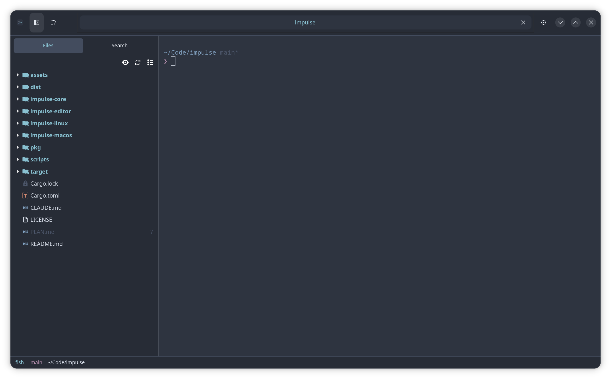
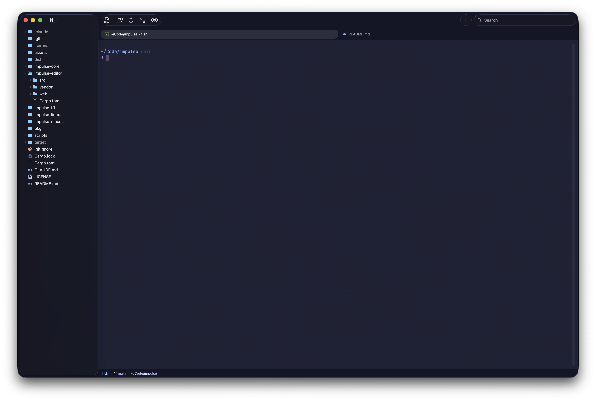

<p align="center">
  
</p>

<h1 align="center">Impulse</h1>

<p align="center">
  A terminal-first development environment built with Rust.
</p>

<p align="center">
  <a href="#features">Features</a> &bull;
  <a href="#installation">Installation</a> &bull;
  <a href="#building-from-source">Building from Source</a> &bull;
  <a href="#architecture">Architecture</a> &bull;
  <a href="#license">License</a>
</p>

---

<p align="center">
  
</p>

<p align="center">
  
</p>

Impulse combines a terminal emulator with a Monaco-powered code editor in a modern tabbed interface. It's designed for developers who live in the terminal but want integrated editing, file navigation, and project awareness without leaving their workflow.

## Features

**Terminal**

- Terminal emulator with shell integration (bash, zsh, fish)
- Horizontal and vertical terminal splitting
- OSC 133/7 escape sequence support for prompt/command/CWD tracking
- Configurable scrollback, cursor shape, copy-on-select, and more

**Editor**

- Monaco editor for full-featured code editing
- Syntax highlighting for 80+ languages
- LSP integration with managed language server installation (completions, hover, go-to-definition, references, rename, code actions, formatting, signature help)
- Auto-detected indentation, configurable tab width and spaces/tabs
- Code folding, minimap, bracket pair colorization, indent guides
- Git diff gutter showing added/modified/deleted lines
- Markdown preview with syntax-highlighted code blocks
- SVG preview with themed background
- Bundled JetBrains Mono font for editor and terminal

**Project Navigation**

- File sidebar with lazy-loaded directory tree
- File icons for 50+ languages and file types
- Git status coloring on filenames (added, modified, untracked, etc.)
- Project-wide file name and content search
- Quick-open file picker (Ctrl+P / Cmd+P)

**Automation**

- Per-file-type indentation overrides (tab width, spaces/tabs)
- Commands-on-save with file pattern matching and optional file reload (for formatters)
- Custom keybindings that run shell commands

**Interface**

- Tabbed interface with command palette and pin tab support
- New tabs open next to the active tab (browser/VS Code behavior)
- Seven built-in color themes: Kanagawa, Nord, Gruvbox, Tokyo Night, Tokyo Night Storm, Catppuccin Mocha, Rose Pine
- Settings UI with live-updating preferences for editor, terminal, appearance, automation, and keybindings
- Full keybinding visibility and customization UI — click any shortcut to rebind it
- Drag-and-drop file opening
- Image file preview

## Platform Support

| Platform | Status    | UI Framework      |
| -------- | --------- | ----------------- |
| Linux    | Available | GTK4 / libadwaita |
| macOS    | Available | AppKit / SwiftUI  |

## Installation

Download the latest package for your platform from [GitHub Releases](https://github.com/dowilcox/impulse/releases).

### macOS

Download `Impulse-X.Y.Z.dmg`, open it, and drag **Impulse.app** to your **Applications** folder.

Requires macOS 13 (Ventura) or later.

### Linux

<details>
<summary><strong>Arch / CachyOS / Manjaro</strong></summary>

```bash
sudo pacman -U impulse-0.11.0-1-x86_64.pkg.tar.zst
```

</details>

<details>
<summary><strong>Debian / Ubuntu</strong></summary>

```bash
sudo dpkg -i impulse_0.11.0-1_amd64.deb
sudo apt install -f   # install any missing dependencies
```

</details>

<details>
<summary><strong>Fedora / RHEL / openSUSE</strong></summary>

```bash
sudo rpm -i impulse-0.11.0-1.x86_64.rpm
```

</details>

### Building from Source

Impulse requires [Rust](https://rustup.rs/) and platform-specific system libraries.

<details>
<summary><strong>macOS</strong></summary>

Requires Xcode command line tools:

```bash
xcode-select --install
```

Clone and build using the macOS build script:

```bash
git clone https://github.com/dowilcox/impulse.git
cd impulse
./impulse-macos/build.sh                           # produces dist/Impulse.app
./impulse-macos/build.sh --dmg                     # also creates dist/Impulse-X.Y.Z.dmg
./impulse-macos/build.sh --sign                    # build + codesign with Developer ID
./impulse-macos/build.sh --sign --notarize --dmg   # build + sign + notarize + .dmg
```

The build script handles all steps automatically: building the Rust FFI library, copying Monaco editor assets, compiling the Swift app, and assembling the `.app` bundle. Code signing auto-detects your Developer ID from the keychain, or you can set `IMPULSE_SIGN_IDENTITY` explicitly.

To run the built app:

```bash
open dist/Impulse.app
```

</details>

<details>
<summary><strong>Linux (Arch / CachyOS)</strong></summary>

```bash
sudo pacman -S gtk4 libadwaita vte4 gtksourceview5 webkit2gtk-4.1
```

```bash
git clone https://github.com/dowilcox/impulse.git
cd impulse
cargo build --release -p impulse-linux
cargo run --release -p impulse-linux
```

</details>

<details>
<summary><strong>Linux (Debian / Ubuntu)</strong></summary>

```bash
sudo apt install libgtk-4-dev libadwaita-1-dev libvte-2.91-gtk4-dev libgtksourceview-5-dev libwebkitgtk-6.0-dev
```

```bash
git clone https://github.com/dowilcox/impulse.git
cd impulse
cargo build --release -p impulse-linux
cargo run --release -p impulse-linux
```

</details>

**Optional — install managed LSP servers** (for web language support):

```bash
./scripts/install-lsp-servers.sh
```

## Testing

```bash
cargo test                         # Run all tests
cargo test -p impulse-core         # Run only impulse-core tests
cargo test -p impulse-editor       # Run only impulse-editor tests
```

## Architecture

Impulse is a Rust workspace. Platform-agnostic logic lives in shared crates, with native frontends per platform.

| Crate            | Role                                                                                                |
| ---------------- | --------------------------------------------------------------------------------------------------- |
| `impulse-core`   | Platform-agnostic backend: PTY management, shell integration, filesystem, search, git, LSP          |
| `impulse-editor` | Monaco editor assets, WebView protocol, and preview renderers (markdown, SVG)                       |
| `impulse-ffi`    | C-compatible FFI static library wrapping `impulse-core` and `impulse-editor` for non-Rust frontends |
| `impulse-linux`  | Linux frontend (GTK4 / libadwaita)                                                                  |
| `impulse-macos`  | macOS frontend (AppKit / SwiftUI, linked via `impulse-ffi`)                                         |

Dependency direction is strictly one-way: frontends depend on `impulse-core` and `impulse-editor`, never the reverse.

## Releasing

The release script tags a version, builds platform-appropriate packages, and optionally creates a GitHub release. Since Linux and macOS can't cross-compile each other's packages, a full release runs on both platforms:

```bash
# 1. On Linux — tag, build, and package Linux artifacts
./scripts/release.sh 0.11.0

# 2. On macOS — build signed + notarized macOS .app and .dmg (no tagging, tag already exists)
./scripts/release.sh 0.11.0 --macos-only

# 3. On either — push tag and upload all dist/ artifacts to GitHub
./scripts/release.sh 0.11.0 --push
```

If you only need one platform, you can combine steps:

```bash
./scripts/release.sh 0.11.0 --push             # Linux tag + build + push (on Linux)
./scripts/release.sh 0.11.0 --linux-only        # Linux build only (skip tagging)
./scripts/release.sh 0.11.0 --macos-only --push # macOS build + upload to existing release
```

The macOS build step automatically codesigns with your Developer ID and submits for Apple notarization. See the [macOS build script](#macos) for required environment variables.

The `dist/` directory will contain:

| Format         | Platform | Target                                      |
| -------------- | -------- | ------------------------------------------- |
| `.deb`         | Linux    | Debian, Ubuntu                              |
| `.rpm`         | Linux    | Fedora, RHEL, openSUSE                      |
| `.pkg.tar.zst` | Linux    | Arch, CachyOS, Manjaro (requires `makepkg`) |
| `.dmg`         | macOS    | macOS 13+ (signed and notarized)            |
| `SHA256SUMS`   | Both     | Checksums for all packages                  |

The script automatically bumps the version in all `Cargo.toml` files, creates an annotated git tag, and installs `cargo-deb` / `cargo-generate-rpm` if needed on Linux.

## License

[GPLv3](LICENSE)
