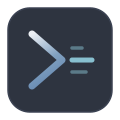
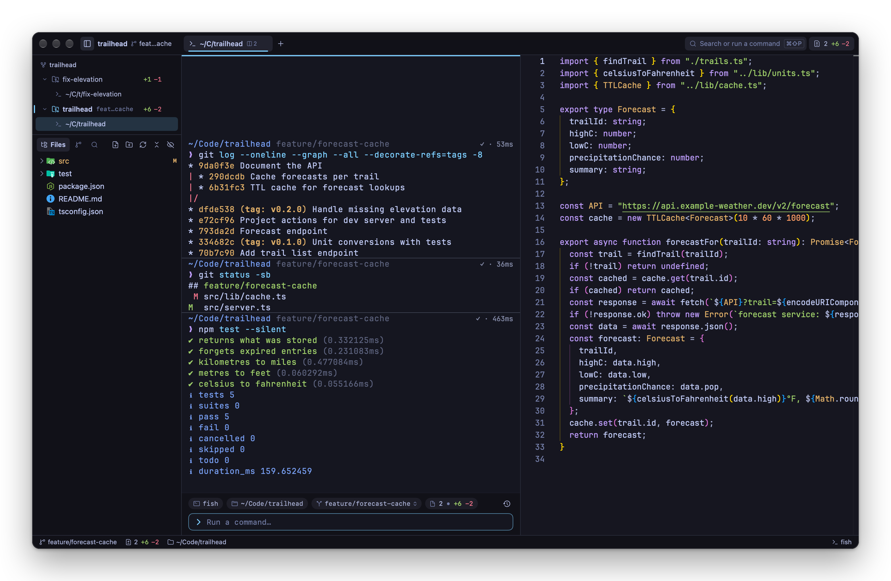
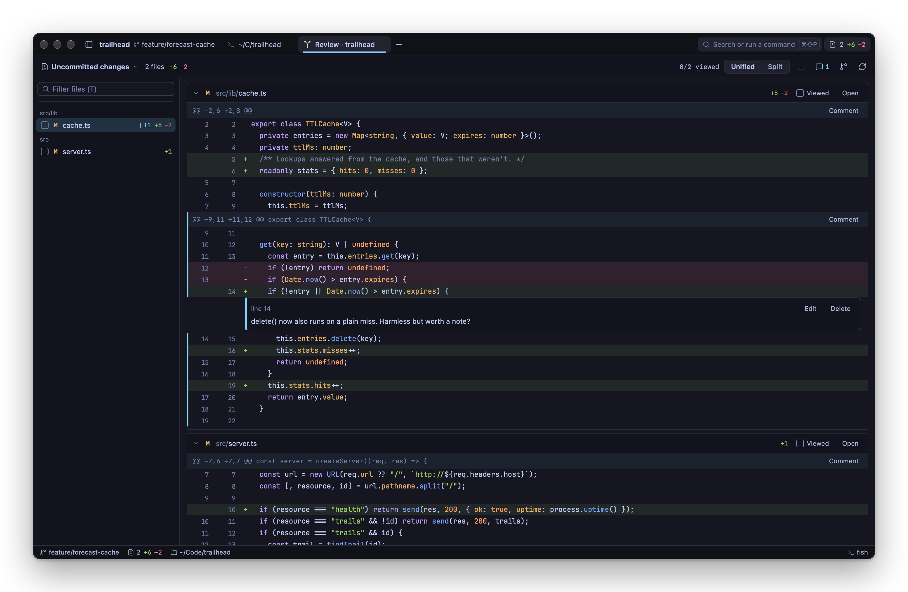
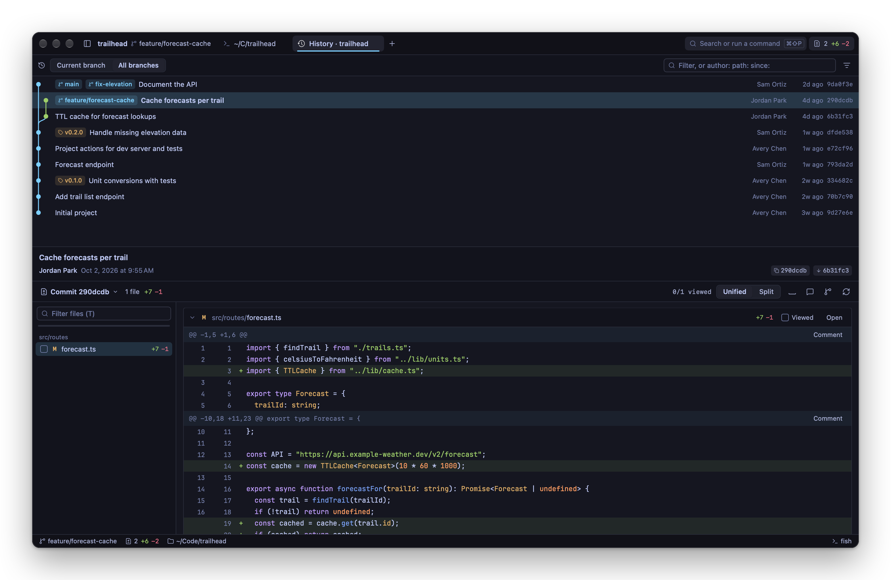

<p align="center">
  
</p>

<h1 align="center">Impulse</h1>

<p align="center">
  A terminal-first development environment for the Mac.
</p>

<p align="center">
  <a href="#features">Features</a> &bull;
  <a href="docs/README.md">Documentation</a> &bull;
  <a href="#installation">Installation</a> &bull;
  <a href="#building-from-source">Building from Source</a> &bull;
  <a href="#architecture">Architecture</a> &bull;
  <a href="#license">License</a>
</p>

---

<p align="center">
  
</p>

Impulse is a terminal IDE: a fast terminal with Warp-style command blocks, a Monaco code editor, deep git integration, and first-class support for the coding agents you run in your terminals. It's built for developers who live in the terminal but want editing, review and project awareness next to it.

The app is native Swift (AppKit + SwiftUI); terminal emulation runs on a Rust core built on `alacritty_terminal`. Impulse never calls an AI service itself; it hosts the agent CLIs you already use.

**[Read the documentation](https://impulse-terminal.app/docs/)** for how every feature works, with screenshots (also in [`docs/`](docs/README.md)).

> **Impulse is macOS-only.** Linux is no longer supported: the GTK4 Linux app was retired with the move to a native Mac app. Its last packages (`.deb`, `.rpm` and Arch) are on the `v0.28.0` release and won't get updates or fixes.

## Features

**Workbench**

- Workspaces in the sidebar: one per folder, each with its own tabs, with worktrees of the same repository grouped together, plus a Scratch workspace for terminals that don't belong to a project
- Tabs in the titlebar (or listed in the sidebar) and split panes of any surface; a file tree with git status
- Session restore of every window's workspaces, layouts and terminal output
- Fuzzy command palette with modes: files, `>` commands, `:` line, `%` text, `@`/`#` symbols, `t:` tabs, `w:` workspaces, `b:` branches, `h:` history, `pr:` pull requests, `a:` project actions, `set:` settings (`?` lists them all)
- Project actions and worktree setup from `.impulse/project.toml`; the `impulse` command-line tool, which also lets Impulse be your `$EDITOR`
- An optional quick terminal on a global shortcut; ⇧⌘T reopens a closed tab (or ⌘Z right after closing it)
- 19 built-in themes plus user themes; Settings and Keyboard Shortcuts as searchable tabs
- Workspace trust: language servers, formatters on save and background fetch only run in folders you trust

**Terminal**

- Shell integration for bash, zsh and fish; command blocks with status, duration, selection, bookmarks and actions
- A multi-line input editor with shell highlighting, history (⌃R), completions for subcommands, options, branches and scripts, and an underline on commands the shell can't run (optionally with fish's own completions)
- Find with match counts and regex; hints mode to open URLs, paths, SHAs and ports from the keyboard
- Persistent command history, background notifications, listening ports, the kitty keyboard protocol, OSC 8 links and iTerm2 session status

**Coding agents**

- Recognizes Claude Code, Codex, Gemini CLI, Aider, opencode, Amp, Copilot CLI, Cursor Agent, Goose, Qwen Code and Crush in its terminals, and shows when each is working or waiting for you (⇧⌘U jumps to the next one that needs you)
- Checkpoints every agent turn so you can review it, restore files from before it, or send review comments back
- A composer (⌘I), a toolbelt, and "send to agent" for code, files and command output
- Task worktrees for parallel work; hooks and resume after a restart for Claude Code and Codex

**Git**

- Changes panel with a commit composer and keyboard control; commit and push in one step if you like
- Review with scopes (unstaged, staged, all uncommitted, against a branch, a commit, a range, a stash, the last agent turn, or everything since your last review), hunk and line staging, comments, and GitHub pull request threads
- Live change marks, inline blame, and an editable side-by-side diff view in the editor
- History (⇧⌘H) with a commit graph across branches, compare, author/path/date filters and fork-point dimming
- Branch switching and management, undoable stashes, merge-conflict resolution, and GitHub pull requests through `gh`
- Fetch, pull (fast-forward, rebase or merge), push and force push with lease from the Git menu or palette, with optional background fetch
- Tags from History or at HEAD (lightweight or annotated, optionally pushed right away); merge, rebase and "open on GitHub" (or GitLab, Bitbucket, Gitea, Azure DevOps) from History

<table>
  <tr>
    <td width="50%"></td>
    <td width="50%"></td>
  </tr>
  <tr>
    <td align="center">Review, with a comment for the agent</td>
    <td align="center">History across all branches</td>
  </tr>
</table>

**Editor**

- Monaco with language servers: completions, hover, definitions, references, rename across files, code actions, inlay hints, highlights, formatting and diagnostics in a Problems panel
- Go to symbol in a file or the project, project-wide find and replace with a preview
- Markdown and SVG preview beside the editor, with Run buttons on shell code blocks; image preview tabs
- Optional Vim keybindings; bundled JetBrains Mono for editor and terminal

**Accessibility**

- VoiceOver can read terminal output; agents needing input or finishing are announced
- Reduce Motion and Increase Contrast are honored

## Installation

Download `Impulse-X.Y.Z.dmg` from [GitHub Releases](https://github.com/dowilcox/impulse/releases), open it, and drag **Impulse.app** to your **Applications** folder.

Requires **macOS 26 (Tahoe)** or later on an **Apple silicon** Mac. Impulse checks GitHub for new releases on launch; you can turn that off in Settings.

**Language servers.** Rust, Python and C/C++ use the `rust-analyzer`, `pyright` and `clangd` on your `PATH`. For TypeScript/JavaScript, PHP, HTML, CSS, JSON, Tailwind, Vue, Svelte, GraphQL, YAML, Dockerfile and Bash, run **Install Web LSP Servers** from the command palette (or **Install All** in Settings → Language Servers). That needs Node.js and npm.

> **Linux:** no longer supported. The last Linux packages are on [`v0.28.0`](https://github.com/dowilcox/impulse/releases/tag/v0.28.0); `v0.29.0` is the last tag whose source includes the Linux app.

## Building from Source

Requires [Rust](https://rustup.rs/), Xcode (for the Swift toolchain) and CMake (for the vendored libgit2). `rsvg-convert` draws the app icon, and `create-dmg` is only needed for `--dmg`:

```bash
brew install cmake librsvg create-dmg
```

```bash
git clone https://github.com/dowilcox/impulse.git
cd impulse
./impulse-macos/build.sh                           # produces dist/Impulse.app
./impulse-macos/build.sh --dev                     # produces dist/Impulse Dev.app (separate bundle ID)
./impulse-macos/build.sh --dmg                     # also creates dist/Impulse-X.Y.Z.dmg
./impulse-macos/build.sh --sign                    # build + codesign with Developer ID
./impulse-macos/build.sh --sign --notarize --dmg   # build + sign + notarize + .dmg
```

The build script runs every step: the vendored libgit2, the Rust terminal FFI library, the Monaco editor assets, the Swift app, and the `.app` bundle. Code signing finds your Developer ID in the keychain, or uses `IMPULSE_SIGN_IDENTITY`. Notarizing needs `IMPULSE_NOTARY_KEY`, `IMPULSE_NOTARY_KEY_ID` and `IMPULSE_NOTARY_ISSUER`.

The `--dev` flag builds with bundle ID `dev.impulse.Impulse.Devel`, so the dev build runs side-by-side with an installed release.

To run the built app:

```bash
open dist/Impulse.app
```

## Testing

```bash
# Swift (the wrapper adds the flags the active toolchain needs)
impulse-macos/swiftw test

# Rust terminal core
cargo test -p impulse-terminal
```

## Architecture

The app is a Swift package with a small Rust core for terminal emulation.

| Component          | Role                                                                                        |
| ------------------ | ------------------------------------------------------------------------------------------- |
| `ImpulseApp`       | The app: AppKit/SwiftUI UI, CoreText terminal renderer, native review, Monaco WebViews      |
| `ImpulseKit`       | Pure logic: themes, previews, palette, completion, layouts, agents, git models, LSP edits   |
| `ImpulseGit`       | Git layer: reads on a vendored static libgit2, writes through the git CLI                   |
| `ImpulseLSP`       | LSP client: server processes, JSON-RPC framing, document sync, managed installs             |
| `ImpulseProtocol`  | Control-socket messages shared by the app and the `impulse` CLI                             |
| `ImpulseCLI`       | The `impulse` command-line tool: open, edit, review, split, notify from an Impulse terminal |
| `impulse-terminal` | Rust: terminal emulation (`alacritty_terminal`), OSC parsing, command blocks, history       |
| `impulse-ffi`      | Rust: C FFI static library exposing the terminal core to Swift                              |

Much of the Swift logic is verified against golden fixtures generated from the original Rust implementation (see `impulse-macos/Tests/*/Fixtures`).

## Releasing

```bash
./scripts/release.sh 0.30.0          # bump VERSION, build signed+notarized .app/.dmg, commit, tag
./scripts/release.sh 0.30.0 --push   # …then push and create the GitHub release
```

The script writes the top-level `VERSION` file (the single source of truth) and the crate versions, builds via `impulse-macos/build.sh --dmg --sign --notarize`, and only then commits the version bump and tags it. It also generates `SHA256SUMS`, and with `--push` it pushes and uploads everything in `dist/`.

## License

[GPLv3](LICENSE)
