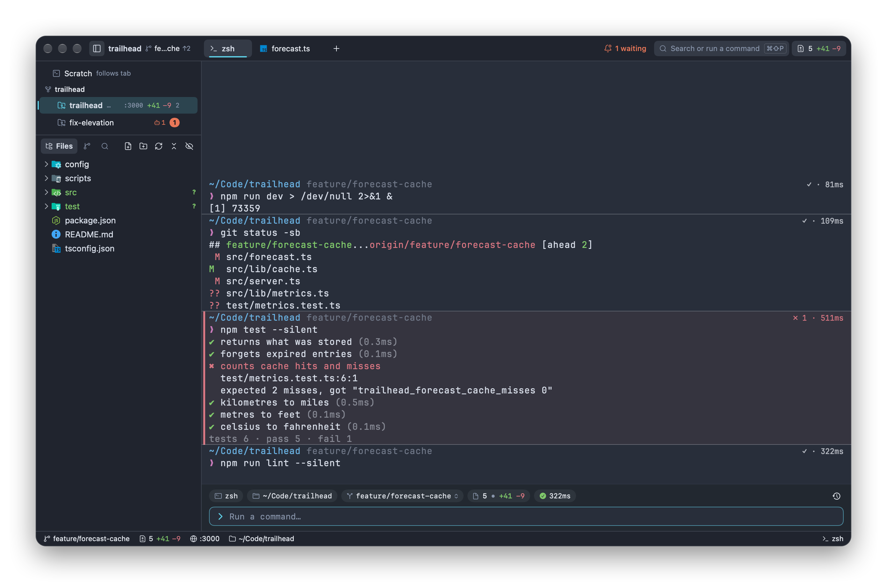

# Impulse documentation

Impulse is a terminal IDE for the Mac: a terminal with command blocks, a code editor, git tools and support for the coding agents you run in its terminals, in one window. These pages explain every part of it, with screenshots of a small example project, `trailhead`.



## Start here

- [Getting started](getting-started.md): install Impulse, a tour of the window, opening a project, and workspace trust.

## Working in Impulse

- [Workspaces, tabs and panes](workspaces-and-tabs.md): the workspaces sidebar, tabs, split panes, the Files, Changes and Search panels, session restore, and the quick terminal.
- [Terminal](terminal.md): command blocks, the input bar, completions, history, find, hints, notifications and ports.
- [Editor](editor.md): the editor, language servers, Problems, project-wide find and replace, previews, and git in the editor.
- [Command palette](command-palette.md): one field for commands, files, lines, symbols, tabs, workspaces, branches, history and settings.

## Parallel work and agents

- [Tasks](tasks.md): a branch in its own folder, opened as its own workspace, so you (or an agent) can work on several things at once.
- [Agents](agents.md): how Impulse follows Claude Code, Codex and other agents, checkpoints their turns, and tells you when one needs you.

## Git

- [Git](git.md): the Changes panel, committing, branches, stashes, fetch, pull and push, merge conflicts and tags.
- [Review](review.md): read and stage changes, comment on them, and send the comments to an agent.
- [History](history.md): the commit graph, filters, comparing, and actions on commits, branches and tags.

## Configuration and reference

- [Project configuration](project-config.md): `.impulse/project.toml` and `.worktreeinclude`.
- [Command-line tool](cli.md): the `impulse` command, and Impulse as your `$EDITOR`.
- [Settings and themes](settings-and-themes.md): every setting, `settings.json`, themes and custom shortcuts.
- [Keyboard shortcuts](keyboard-shortcuts.md): every shortcut, in the menus and inside panels.
- [Accessibility](accessibility.md): VoiceOver, Reduce Motion, Increase Contrast and keyboard-only use.

## Common workflows

| To…                                                            | See                                                                                    |
| -------------------------------------------------------------- | -------------------------------------------------------------------------------------- |
| Work on a second thing without stashing or switching branches  | [Tasks](tasks.md)                                                                      |
| Run two agents side by side and see which one needs you        | [Tasks](tasks.md#example-two-agents-in-parallel), [Agents](agents.md)                  |
| See exactly what an agent changed in its last turn, or undo it | [Agents › Checkpoints and turns](agents.md#checkpoints-and-turns), [Review](review.md) |
| Commit part of a file                                          | [Review › Staging, unstaging and reverting](review.md#staging-unstaging-and-reverting) |
| Send review comments back to an agent                          | [Review › Comments](review.md#comments)                                                |
| Find when a line changed, and who changed it                   | [History](history.md), [Editor › Inline blame](editor.md#inline-blame)                 |
| Run your project's dev server or tests from the palette        | [Project configuration › Project actions](project-config.md#project-actions)           |
| Make `git commit` open its message in Impulse                  | [Command-line tool](cli.md#use-impulse-as-your-editor)                                 |

## Updating the screenshots

The screenshots are generated, not taken by hand. `scripts/docs/make_demo.py` builds the `trailhead` example (a repository with history, branches, task worktrees and uncommitted work, plus a stand-in home folder and stand-in agent commands), and `scripts/docs/capture.py` runs the dev build in its headless snapshot mode for each shot in `scripts/docs/shots.py`, then frames the result into `docs/images/`. Nothing appears on screen while it runs.

```sh
./impulse-macos/build.sh --dev
python3 scripts/docs/capture.py                  # every shot
python3 scripts/docs/capture.py review- tasks-   # shots whose names start with these
```
