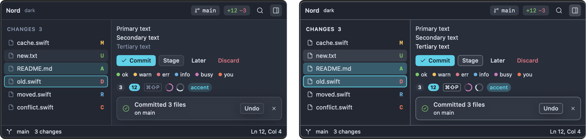

# Accessibility

Impulse works with VoiceOver, follows the Reduce Motion and Increase Contrast settings in macOS, and can be driven from the keyboard. This page explains what each of these does in Impulse, the settings that make text easier to read, and where the current limits are.

## VoiceOver

### Terminal output

VoiceOver sees each terminal as a read-only text area, described as "terminal". It contains the text that's on screen in that terminal, one line per row, so you can read it with the usual VoiceOver text commands: by line, by word or by character. VoiceOver also knows which line the cursor is on, and reads the text you've selected.

- When the output changes, Impulse tells VoiceOver, at most twice a second, so a busy program doesn't flood you with updates. This only happens while VoiceOver is running.
- Only the visible screen is exposed, not the scrollback. Scroll the terminal to read earlier output, or select command blocks and copy them (see [Terminal](terminal.md)).

You type commands in the input bar below the output, which is a standard macOS text field labeled "Command input". When a program asks for a password, the field becomes a secure field labeled "Password input", and what you type isn't shown or spoken.

### Announcements for agents

When a coding agent in one of your terminals stops to wait for you, or finishes its turn, Impulse asks VoiceOver to announce it, for example "Claude Code needs your input in trailhead" or "Codex finished in fix-elevation". The announcement names the agent and the tab it's in, uses high priority so it isn't dropped, and is made once each time the agent's state changes. Announcements are made only while VoiceOver is running.

To go to the agent that needs you, press ⇧⌘U (**Next Agent Needing You**). See [Agents](agents.md).

### Labels

Impulse's controls have labels VoiceOver reads. Some examples:

- **Buttons that show only an icon** are labeled with the same text as their tooltip, for example "New Tab (⌘T)".
- **Buttons that open a menu**, such as a workspace row's **+**, Review's scope menu and the agent toolbelt's turns, are buttons to VoiceOver: its press action opens the menu, and so does Space when they have the keyboard (with **Keyboard navigation** on in System Settings ▸ Keyboard).
- **Tabs** read as "Terminal: _title_" or "Editor: _title_", followed by "needs attention", the program's status or a progress percentage when there is one. Each tab's close button reads "Close _title_", and the tab strip as a whole is labeled "Tabs".
- **Workspaces** read as "Workspace _name_", with the branch and how many tabs need attention.
- **Agents**: the status icon reads "Agent working", "Agent needs input", "Agent finished" or "Agent idle". The inbox button in the titlebar reads, for example, "Agents: 1 working, 2 waiting", and each row in the inbox gives the agent, its tab and its state.
- **Changes panel** rows read the file's path and its status, for example "src/forecast.ts, modified".
- **Review** reads each diff line as "Added line 12: …", "Removed line 9: …" or "Unchanged line 4: …". In the split layout, a row reads both sides. File headers say whether you've marked the file viewed, and the progress meter reads "Viewed 40 percent".
- **History** rows read the commit's subject, author and short SHA.
- **Settings** rows are labeled with the setting's name. Spinners and progress rings read "In progress" or a percentage.
- Other named fields include "Palette query", "Commit message" and "Project files" (the file tree).

### The code editor

The editor is Monaco, the editor from VS Code, running inside a web view. Impulse uses Monaco's default accessibility behavior and doesn't add its own VoiceOver support to the editor.

## Reduce Motion

When **Reduce motion** is on in **System Settings › Accessibility › Display**, Impulse turns off these animations:

- The quick terminal appears in place instead of sliding down from the top of the screen.
- The terminal's find bar appears and disappears without sliding.
- Tabs move without animation when you drag to reorder them, and the tab strip doesn't animate when it scrolls to the selected tab.
- Spinners stop spinning. A spinner still shows that something is in progress, and VoiceOver still reads "In progress".

## Increase Contrast

When **Increase contrast** is on in **System Settings › Accessibility › Display**, Impulse strengthens the window's own colors, in every theme:

- Dividers and borders are firmer.
- Hover, pressed and selected backgrounds are stronger.
- Focus rings are fully opaque.
- Secondary text moves halfway toward the main text color, and the faintest text uses the theme's muted color instead of its comment color.

The change applies as soon as you turn the setting on or off; you don't need to restart Impulse.

Increase Contrast doesn't change the editor's or terminal's colors, which come from the theme. For the terminal, use **Minimum contrast** (see [Text and color](#text-and-color)); for everything, pick a theme that suits you (see [Themes](settings-and-themes.md#themes)).

Impulse's window doesn't use translucent materials, so **Reduce transparency** has nothing to change.

## Text and color

### Text size

| What                         | How                                                                                                                                                            |
| ---------------------------- | -------------------------------------------------------------------------------------------------------------------------------------------------------------- |
| Editor and terminal together | ⌘= and ⌘- make both one point larger or smaller (6 to 72 points); ⌘0 sets both back to 14. The new sizes apply in every window and are saved in your settings. |
| Editor only                  | **Settings › Editor › Font size** (`font_size`) and **Line height** (`editor_line_height`, in points; 0 uses the font's own).                                  |
| Terminal only                | **Settings › Terminal › Font size** (`terminal_font_size`).                                                                                                    |
| Fonts                        | **Font family** under **Editor** and under **Terminal** lists the monospaced fonts installed on your Mac.                                                      |

The terminal's input bar and the agent composer follow the terminal's font size (a point smaller) and zoom, and the Review and History diffs follow the editor's font family and size (slightly smaller: 12 points at the default 14). The window's sidebar, tabs and panels use fixed sizes.

### Contrast in the terminal

**Settings › Terminal › Minimum contrast** (`terminal_minimum_contrast`) lifts terminal text colors until they reach at least the contrast ratio you set against their background. It's set to 3 by default; WCAG's AA level for normal text is 4.5, and 7 is AAA. Set it to 1 to show programs' colors exactly as they ask. Programs that print dim gray text on a dark background become readable without changing the theme.

**Bold text uses bright colors** (`terminal_bold_is_bright`) also makes bold text stand out more.

### Themes

Impulse has 15 dark and 4 light built-in themes. The Harbor theme's text colors were chosen to meet WCAG AA (4.5:1) against its backgrounds. See [Themes](settings-and-themes.md#themes) for the list and for writing your own theme with colors you choose.

### Status beyond color

Impulse pairs colors with text or shapes in most places:

- Files in the Changes panel show a status letter (such as M, A, D or U) next to the colored name, and deleted files are struck through.
- The agent inbox spells out each agent's state in words.
- A command that the shell can't run gets a dashed underline in the input bar, with a tooltip saying "command not found".

The badge on an agent's icon differs in shape as well as color: a dot in the theme's orange when the agent needs you, a check mark in its green when the agent has finished. Open the inbox to see the state in words, or use VoiceOver, which reads it with the tab.

### Cursors and motion in the editor and terminal

- **Settings › Terminal › Blinking cursor** (`terminal_cursor_blink`) turns the terminal cursor's blinking off. **Cursor shape** picks a block, underline or beam.
- **Settings › Editor › Cursor blinking** set to **Solid** stops the editor cursor blinking. **Cursor style** offers thicker and thinner shapes.
- **Smooth scrolling** in the editor is off by default.

## Use Impulse from the keyboard

Most of Impulse can be used without a pointer. The full list is in [Keyboard shortcuts](keyboard-shortcuts.md); these are the ones for getting around.

### Move between areas

| Keys             | Goes to                                            |
| ---------------- | -------------------------------------------------- |
| ⇧⌘P              | Command palette: every command, by name            |
| ⌘P               | Go to a file                                       |
| ⌃⌘O              | Switch workspace                                   |
| ⌘1 … ⌘9, ⌃⇥, ⌃⇧⇥ | Tabs in the current workspace                      |
| ⌥⌘← → ↑ ↓        | The pane to the left, right, above or below        |
| ⇧⌘E              | The file tree                                      |
| ⌃⇧G              | The Changes panel                                  |
| ⇧⌘F              | Find in Project                                    |
| ⇧⌘U              | The next agent that needs you                      |
| ⌘I               | The composer for the agent in the current terminal |
| ⌘B               | Show or hide the sidebar                           |

Pressing ⇧⌘E, ⌃⇧G or ⇧⌘F a second time, while that panel has the keyboard, takes you back to the tab you were working in. Esc in the Changes panel returns you to the terminal.

In a terminal, Esc in the input bar moves the keyboard to the terminal output, and ⌘↑ selects command blocks so you can copy them or send them to an agent without the mouse. ⇧⌘Space labels every link, path, commit and port on screen so you can open, copy or insert one by typing its letters.

### Lists

The file tree, the Changes panel, the History commit list, the command palette and Review all work with the arrow keys:

- **File tree**: ↑ and ↓ move, → and ← expand and collapse folders, ↩ opens.
- **Changes panel**: ↑ and ↓ move, Space stages or unstages, ↩ opens the file's changes, ⌫ discards (after asking).
- **History**: ↑ and ↓ move between commits.
- **Review**: j and k move between hunks, n and p between files, and single keys stage, unstage, revert, comment and mark files viewed.

### Focus indicators

- The selected row in the Changes panel and in History gets a focus ring while that list has the keyboard, so you can tell which list your arrow keys will move.
- The commit message box and the filter fields in Review and History draw a focus ring in the theme's accent color while you type in them.
- The input bar's border turns to the accent color while it has the keyboard.
- The file tree shows its selection without a ring, like Finder's sidebar.

With Increase Contrast on, focus rings are fully opaque.

### Tooltips

Icon-only buttons show a tooltip with their name, and often their shortcut, after half a second (macOS normally waits longer).

### Sheets and dialogs

In sheets such as **New Task…** and in confirmation dialogs, ↩ presses the default button and Esc cancels.

### Changing shortcuts

In the Keyboard Shortcuts tab (⌥⌘,), choose a command's shortcut and press the new keys. A key that can't be a shortcut, such as a letter without ⌘, ⌃ or ⌥, is refused: the shortcut shows why, VoiceOver announces it, and the tab waits for other keys until you press a valid shortcut or Esc. See [Customize keyboard shortcuts](settings-and-themes.md#customize-keyboard-shortcuts).

## Sound and notifications

These settings are under **Settings › Terminal › Bell & notifications**:

- **Audible bell** plays the system alert sound when a program rings the terminal bell. Turn it off if you'd rather not hear it.
- **Request attention on bell** marks the terminal as needing attention, bounces the Dock icon when Impulse is in the background, and posts a notification.
- **Allow terminal notifications** lets programs and agents post macOS notifications.
- **Notify when long commands finish** tells you when a command that ran longer than **Long command threshold** (30 seconds by default) finishes.

Impulse's Dock icon shows a badge with the number of terminals that need your attention.

## Related

- [Keyboard shortcuts](keyboard-shortcuts.md)
- [Settings and themes](settings-and-themes.md)
- [Terminal](terminal.md)
- [Agents](agents.md)
- [Getting started](getting-started.md)
