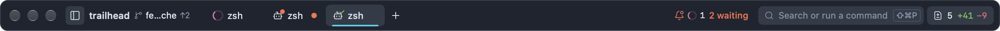
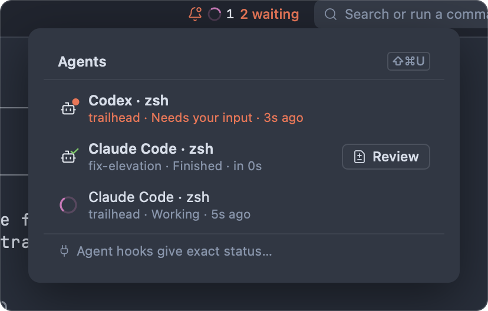
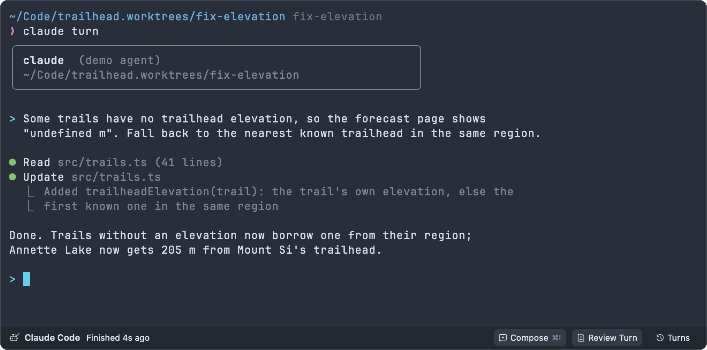
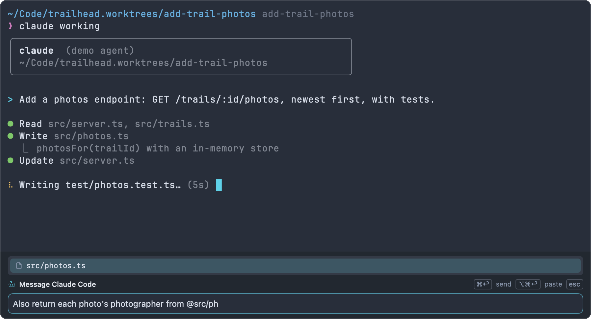
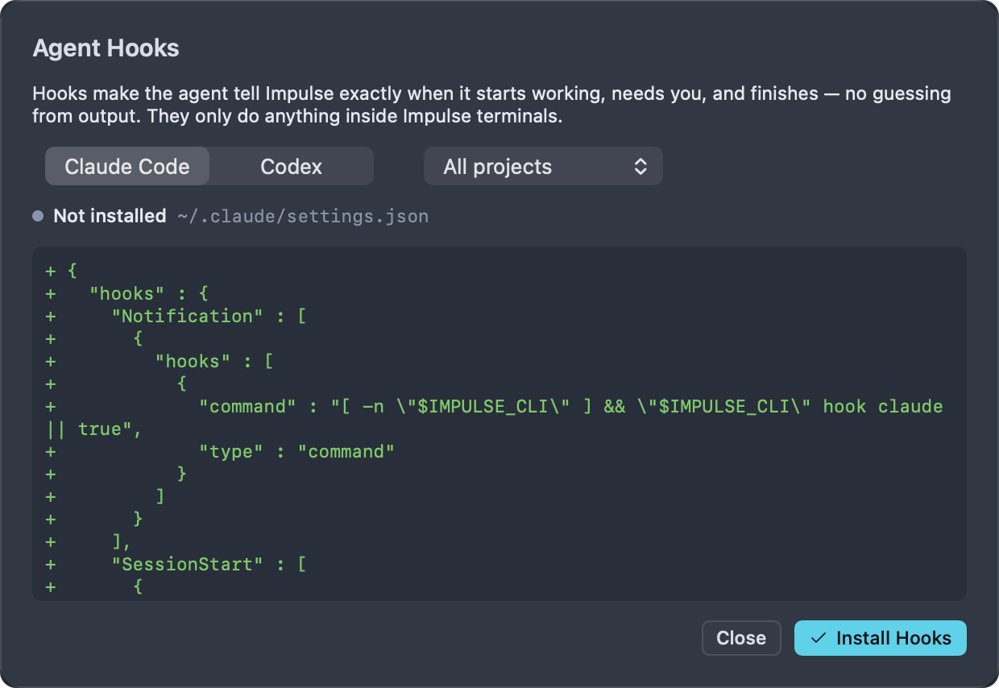

# Agents

Impulse recognizes coding agents such as Claude Code and Codex when they run in its terminals, shows what each one is doing, and tells you when one needs you. It records a checkpoint around every agent turn so you can review exactly what the agent changed, restore files from before it, or send review comments back.

Impulse never calls an AI model itself. The agents are the command-line programs you already use; Impulse hosts them in its terminals and watches what they do.

## Supported agents

| Agent        | Recognized command |
| ------------ | ------------------ |
| Claude Code  | `claude`           |
| Codex        | `codex`            |
| Gemini CLI   | `gemini`           |
| Aider        | `aider`            |
| opencode     | `opencode`         |
| Amp          | `amp`              |
| Copilot CLI  | `copilot`          |
| Cursor Agent | `cursor-agent`     |
| Goose        | `goose`            |
| Qwen Code    | `qwen`             |
| Crush        | `crush`            |

Run the agent the way you normally do, in any Impulse terminal. Nothing needs to be configured for Impulse to notice it. [Hooks](#agent-hooks) make the status exact for Claude Code and Codex.

## How Impulse recognizes an agent

When a command starts in a terminal, Impulse looks at the terminal's foreground process shortly after it starts, then every two seconds while it runs. A process counts as an agent when:

- its executable or its first argument is one of the commands above (`claude`, `codex`, …), with or without a `.js`, `.mjs`, `.cjs` or `.py` extension;
- it's an interpreter (`node`, `bun`, `deno`, `python`, `ruby`, `uv`, `uvx`, `npx`, `pnpm`, `bunx`, or a shell such as `sh`, `bash`, `zsh`) running a script with one of those names, or a script from the agent's package (for example `node …/@anthropic-ai/claude-code/cli.js`);
- or it's one level down from the foreground process, so wrappers such as `caffeinate claude` work.

This relies on shell integration telling Impulse that a command is running (bash, zsh and fish; see [Terminal](terminal.md)). An agent that reports in through [hooks](#agent-hooks) or the `impulse status` command is tracked even without it.

Impulse stops tracking the agent when its command ends or another program takes over the terminal.

## Agent states

| State                | Glyph                         | Meaning                                                                           |
| -------------------- | ----------------------------- | --------------------------------------------------------------------------------- |
| **Working**          | A spinning ring               | The agent is taking a turn.                                                       |
| **Needs your input** | A bot with an orange dot      | The agent stopped mid-turn to ask you something: a permission prompt, a question. |
| **Finished**         | A bot with a green check mark | The agent finished a turn you haven't looked at yet.                              |
| **Idle**             | A dim bot                     | The agent is running and nothing is asked of you (or you've seen its result).     |
| **Exited**           | A dim bot                     | The agent's command ended. It leaves the agent list.                              |

The dot and the check mark use your theme's attention and success colors. They also differ in shape, so you can tell **Needs your input** from **Finished** without relying on color. VoiceOver reads the state with the tab, for example "Terminal: claude, Claude Code: Needs your input".

### How the state is worked out

Without hooks, Impulse infers the state from what a terminal can see:

- Pressing Return in the agent (sending a prompt, answering a question) means **Working**.
- Output that keeps coming for about a second and a half (a spinner, streaming text) means **Working**. Output right after you type is treated as the echo of your typing.
- A braille spinner at the start of the terminal's title means **Working**.
- A progress report (OSC 9;4) means **Working** while it's shown, and **Finished** when it's cleared.
- A desktop notification from the agent (OSC 9, 777 or 99) that mentions permission, approval, allowing, confirming, "needs your input" or a question means **Needs your input**; any other notification means **Finished**.
- A bell while the agent is working means **Finished**.
- No output for 5 seconds while working means **Finished** (2 minutes for agents that report progress, since they can pause for longer).

With [hooks](#agent-hooks) installed, the agent tells Impulse directly and the guesses above are switched off (Return and permission-style notifications still count):

| Hook event                       | State                                                                        |
| -------------------------------- | ---------------------------------------------------------------------------- |
| `SessionStart` (Claude Code)     | **Idle**                                                                     |
| `UserPromptSubmit` (Claude Code) | **Working**                                                                  |
| `Notification` (Claude Code)     | **Needs your input** when it asks for permission or input, else **Finished** |
| `Stop` (Claude Code)             | **Finished**                                                                 |
| Turn complete (Codex)            | **Finished**                                                                 |

## Where the status shows

- **The tab.** A terminal tab running an agent shows the agent's glyph instead of the terminal icon. Hover it for the agent's name and state.
- **The workspace row.** In the sidebar, a workspace shows a spinner while any of its agents work, and a bot icon with a count when agents are waiting for you (needs input or finished). Rows also show a badge with the number of tabs that need attention.
- **The Agents button.** While any agent runs in the window, the titlebar shows an Agents button with a spinner and count for working agents, and "N waiting" when some want you. Click it to open the agent list.
- **The toolbelt.** A bar under the focused agent's terminal shows its state and how long it has been in it. See [The toolbelt](#the-toolbelt).
- **Desktop notifications.** When Impulse is in the background and an agent needs input or finishes, you get a notification: "Claude Code needs your input" or "Claude Code finished", naming the workspace and tab. Notifications are grouped by workspace. Clicking one brings the window forward and focuses that terminal, and they're removed once you look at the terminal. macOS asks for permission the first time.
- **The Dock.** The Dock icon bounces once when an agent wants you while Impulse is in the background, and its badge counts the terminals, in all windows, that need attention.
- **VoiceOver.** With VoiceOver on, Impulse announces "Claude Code needs your input in …" and "Claude Code finished in …". See [Accessibility](accessibility.md).



### The agent list



Click the Agents button in the titlebar to see every agent in the window, most urgent first: needs input, then finished, then working, then idle. Each row shows the agent and its tab's title, then the workspace, the state, the message from the agent's last [`impulse status`](cli.md#impulse-status) if it gave one, and how long ago the state changed.

- Click a row to go to that agent's pane (its workspace, tab and pane are brought forward).
- Click **Review** to review the agent's last turn. The button appears on agents with a recorded turn: always once they've finished, otherwise when you hover the row.
- **Agent hooks give exact status…** at the bottom opens the [hooks sheet](#agent-hooks).

## Attention

When an agent needs input or finishes and you aren't looking at its terminal, Impulse flags the terminal as needing attention: the tab and its workspace row are marked, the Dock badge counts it, and you get the notification described above.

"Looking at it" means Impulse is the active app, the window is the key window and the terminal has keyboard focus. If you're looking at an agent when it finishes, Impulse treats the turn as seen: nothing is flagged and the agent goes straight back to **Idle**.

The flag clears, and a **Finished** agent becomes **Idle**, when you:

- select the agent's tab (in the tab strip, in the sidebar's tab list, or by switching to a workspace that shows that tab);
- focus its pane in a split;
- click into the terminal;
- click its input bar;
- jump to it with ⇧⌘U or by clicking its notification or its row in the agent list.

## Jump to the next agent that needs you

Press ⇧⌘U (**File ▸ Next Agent Needing You**, also in the command palette) to bring forward the next agent in this window that's waiting for you. Agents that need input come first, then finished ones, most recent first. Press it again to move on to the next one; it cycles past the agent you're already looking at. If none are waiting, Impulse says "No agents are waiting for you."

## The toolbelt



While an agent runs in the focused terminal, a bar under the terminal shows:

- The agent's glyph and name, and its status: "Working · 42s", "Needs your input", "Finished 2m ago" or "Idle", followed by the message from its last [`impulse status`](cli.md#impulse-status), if any.
- **Compose** (⌘I): opens the [composer](#the-composer).
- **Review Turn**: reviews the agent's last turn. It's dimmed until a turn has been recorded.
- **Turns**: a menu of the agent's 12 most recent turns, each with **Review Turn 3 · 3:42 PM** and **Restore Files to Before Turn 3 · 3:42 PM…**. A turn still in progress is marked "(running)". See [Checkpoints and turns](#checkpoints-and-turns).

## The composer

Agent prompts in a terminal are awkward for long or multi-line messages. The composer (⌘I) gives you a real editor for them.



1. Focus the agent's terminal and press ⌘I (**File ▸ Compose Message to Agent**, **Compose Message to Agent** in the palette, or **Compose** on the toolbelt).
2. Type your message. Return starts a new line.
3. Type `@` and part of a file name to mention a file from the workspace. Choose with ↑ and ↓, then press Tab (or click) to insert its path, such as `@src/lib/units.ts`.
4. Press ⌘↩ to send. Impulse pastes the message into the agent's prompt and presses Return, then closes the composer and puts focus back in the terminal.

| Key    | In the composer                                                              |
| ------ | ---------------------------------------------------------------------------- |
| ⌘↩     | Send: paste into the agent and press Return                                  |
| ⌥⌘↩    | Paste into the agent without pressing Return (the composer stays open)       |
| Return | New line                                                                     |
| `@`    | Mention a file; ↑/↓ choose, Tab inserts                                      |
| ↑ / ↓  | In an empty composer, step through messages you've sent before (the last 50) |
| ⌃C     | Send an interrupt to the agent                                               |
| Esc    | Close the mention list, or close the composer and return to the terminal     |
| ⌘I     | Close the composer                                                           |

The composer keeps an unsent draft when you close it. It works over any program that has taken over the terminal, not only agents. In a terminal where the input bar is showing (no program has taken over), ⌘I focuses the input bar instead.

To have the composer open on its own when the focused agent asks for input, turn on **Open the composer when an agent needs input** (`agent_composer_auto_show`) in Settings ▸ Terminal ▸ Agents. It's off by default. See [Settings and themes](settings-and-themes.md).

## Send things to an agent

You can hand code, files and command output to an agent without copying and pasting.

| From            | How                                                                                                                          | What the agent receives                                                             |
| --------------- | ---------------------------------------------------------------------------------------------------------------------------- | ----------------------------------------------------------------------------------- |
| The editor      | Select code, then run **Send Selection to Agent** from the command palette                                                   | "In @src/forecast.ts, lines 12–18:" and the code in a fenced block                  |
| The file tree   | Right-click a file and choose **Mention in Agent**                                                                           | `@src/lib/cache.ts`                                                                 |
| A command block | Click the block's **Send to agent** button, right-click it and choose **Send to Agent**, or select blocks (⌘↑) and press ⇧⌘A | "I ran \`npm test\` in … (exit status 1). Output:" and the last 200 lines of output |
| Review          | Add comments, then choose **Send Comments to Claude Code · …** from the comments menu                                        | Your comments with their files and lines                                            |
| Problems        | Click **Fix with Agent** in the Problems panel and choose **Send to Claude Code · …**                                        | The problems the panel is showing                                                   |
| Merge conflicts | **Ask Agent** in the Changes panel                                                                                           | A request to resolve the conflicted files                                           |

The editor, file tree and command-block actions pick the agent for you: one in the active workspace that's waiting for you, else any agent in the active workspace, else any agent in the window (never the terminal the command block came from). If no agent is running in the window, Impulse says so. Review, Problems and conflicts list the running agents so you choose one.

Text is pasted into the agent's prompt without pressing Return, so you can read it and add to it first. A toast says "Sent to Claude Code. Review it in its prompt, then press Return." with a **Show** button that takes you there. If the agent is in the middle of a turn (working or waiting on a question), the text is queued instead ("Queued for Claude Code; it's sent when the current turn ends.") and pasted when the turn ends.

For the details of each source, see [Editor](editor.md), [Terminal](terminal.md), [Review](review.md) and [Git](git.md).

## Checkpoints and turns

A turn is one stretch of an agent's work: it starts when the agent goes to **Working** from **Idle** or **Finished**, and ends when it's **Finished**, **Idle** or exits. A question in the middle (**Needs your input**) doesn't split the turn.

At the start and end of every turn, Impulse records a checkpoint of the git repository the agent's terminal is in: every tracked file and every untracked file that isn't ignored, plus what's staged. Checkpoints don't touch your branch, staged changes or stash. Terminals outside a git repository get no checkpoints.

### Review the last turn

Press ⇧⌘I (**File ▸ Review Last Agent Turn**, or **Review Last Agent Turn** in the palette) to open Review on what the agent changed in its last turn. It uses the agent in the focused terminal, or else the most recent turn of any agent in the window's repository. The same review opens from:

- **Review Turn** on the toolbelt;
- **Review** in the agent list;
- **Last agent turn (Claude Code)** in Review's scope menu;
- `impulse review last-turn` in a terminal (see [Command-line tool](cli.md)).

A finished turn is shown as "Agent turn at 3:42 PM" (the start checkpoint against the end one). A turn still running is shown as "Agent turn since 3:42 PM", against the live files, and switches to the finished diff when the turn ends. The diff covers everything that changed in the repository during the turn, including edits you made yourself in that time.

If no turn has been recorded yet, Impulse says "No agent turns recorded yet in this repository."

### Review or restore an earlier turn

Open **Turns** on the toolbelt to pick any of the agent's 12 most recent turns:

- **Review Turn 3 · 3:42 PM** opens Review on that turn.
- **Restore Files to Before Turn 3 · 3:42 PM…** puts the repository's files back to how they were when that turn started.

Turns from an earlier day show the day too ("Turn 2 · Yesterday, 4:10 PM"). The toolbelt, and with it **Turns**, only shows while an agent runs in the terminal: after Impulse restarts, [resume the agent](#resume-after-a-restart) and the terminal's restored turns are in **Turns** again. ⇧⌘I reviews the last one straight away, agent running or not.

To restore:

1. Choose **Restore Files to Before Turn 3 · 3:42 PM…**.
2. Confirm. The dialog explains: "Every file in the repository goes back to how it was when Claude Code started that turn. Commits are kept, and you can undo this right after."
3. Impulse takes a safety snapshot of the current files, then restores. A toast says "Restored files to before turn 3" with **Undo**.

Restoring puts back the content (and staged state) of every file the checkpoint holds. Files created after the checkpoint are left where they are, ignored files aren't touched, and commits stay as they are.

### Send review comments back

In Review, add comments on the agent's lines, then open the comments menu in Review's header and choose **Send Comments to Claude Code · …**. The comments, anchored to their files and lines, go into the agent's prompt (queued if it's busy). See [Review](review.md).

### Where checkpoints are kept

Checkpoints are commits under `refs/impulse/checkpoints/` in your repository, one folder per terminal. They're outside `refs/heads` and `refs/tags`, so a normal `git push` never sends them. The first time in each session that a turn is recorded in a repository, and each time `impulse checkpoint` records one, Impulse deletes that repository's checkpoints older than 14 days, and any beyond the newest 200.

The list of turns (the **Turns** menu, **Review Turn** and ⇧⌘I) is saved with each terminal in your session. When Impulse restores the session, each terminal gets its latest 50 finished turns back, except turns whose checkpoints have since been pruned or are older than 14 days (they'd be pruned next); a turn that was still running when the session was saved isn't restored. When checkpoints are pruned while Impulse runs, the turns that used them leave **Turns** too. Without a restored session (**Restore session** off), the lists start empty, though the checkpoint refs are still in the repository.

You can also record a checkpoint yourself with `impulse checkpoint` (see [Command-line tool](cli.md#impulse-checkpoint)).

## Agent hooks

Without hooks, Impulse infers an agent's state from its output, which is usually right but can lag or misread a pause. Claude Code and Codex can call a program at key moments ("hooks"). Install Impulse's hooks and the agent tells Impulse exactly when it starts working, needs you and finishes. Hooks also let Impulse [resume](#resume-after-a-restart) the agent's session after a restart.

The hooks call the `impulse` command-line tool through the `IMPULSE_CLI` environment variable, which only Impulse terminals set. In any other terminal, the hook does nothing and exits successfully, so it's safe to install them for all projects.

### Install hooks



1. Run **Install Agent Hooks…** from the command palette, or click **Agent hooks give exact status…** at the bottom of the agent list.
2. Choose **Claude Code** or **Codex**.
3. For Claude Code, choose **All projects** or **This project only** (only available when the window is in a git repository).
4. Check the status line ("Installed" or "Not installed", and the file that will change) and the preview of the change: added lines are marked `+`, removed lines `-`.
5. Click **Install Hooks**. Impulse shows "Installed Claude Code hooks. Restart running agents to pick them up."
6. Quit and restart any agents that were already running.

Before writing, Impulse saves the previous version of the file beside it as `<file>.impulse-backup`. If the file is a symlink (as with many dotfile managers), Impulse writes through the link.

### What gets written

- **Claude Code, All projects:** `~/.claude/settings.json`.
- **Claude Code, This project only:** `.claude/settings.local.json` in the window's repository. In a [task](tasks.md) workspace that's the task's folder, which is removed when you archive the task; the sheet says so and names the main checkout. Install project hooks in the main checkout instead: new tasks copy `.claude/settings.local.json` from it (unless the repository's `.worktreeinclude` leaves it out; see [Which files are copied](tasks.md#which-files-are-copied)).

Impulse adds a hook for each of the `SessionStart`, `UserPromptSubmit`, `Notification` and `Stop` events, and for `PreToolUse` (shell commands, `"matcher": "Bash"`) and `PostToolUse` (edits and shell commands, `"matcher": "Edit|Write|MultiEdit|NotebookEdit|Bash"`), keeping your other settings and hooks. Each one looks like this:

```json
{
  "hooks": {
    "Stop": [
      {
        "hooks": [
          {
            "command": "[ -n \"$IMPULSE_CLI\" ] && \"$IMPULSE_CLI\" hook claude || true",
            "type": "command"
          }
        ]
      }
    ]
  }
}
```

Impulse rewrites the file pretty-printed with its keys sorted. Hooks that are already there aren't added twice. Hooks installed by an older version of Impulse show as "Out of date: install again to add the newer hooks"; **Install Hooks** then adds only the missing ones.

### What the hooks tell agents

In a repository with [tasks](tasks.md), Impulse's Claude Code hooks also tell the agent about the other workspaces, which it otherwise can't see. Each can be turned off in Settings ▸ Terminal ▸ Agents.

| When                                                                                                                                                                       | The agent is told                                                                                                                                                                                        | Setting                   |
| -------------------------------------------------------------------------------------------------------------------------------------------------------------------------- | -------------------------------------------------------------------------------------------------------------------------------------------------------------------------------------------------------- | ------------------------- |
| A session starts                                                                                                                                                           | A short summary: which workspace it's in, the others with their agents, uncommitted files and the files they share with it, and to run `impulse tasks` before merging a branch or making sweeping edits. | `agent_hook_task_summary` |
| It edits a file that another workspace also changes                                                                                                                        | "Impulse: src/lib/units.ts is also changed in the task fix-elevation, where Claude Code is working…" Once per file.                                                                                      | `agent_hook_shared_files` |
| It runs `git merge`, `git rebase` or `git pull` on a task's branch while that task is still being worked on (its agent working or waiting for input, or uncommitted files) | Nothing: Claude Code stops and asks you first, showing the same reason as Impulse's own [merge question](tasks.md#merge-the-work-back).                                                                  | `agent_hook_merge_guard`  |
| Its `git pull`, merge or checkout brought in a changed lock file or `Dockerfile`                                                                                           | Which files changed, and the commands from the project's [`[on_change]` rules](project-config.md#when-files-change) to run before testing.                                                               | `agent_hook_dependencies` |

Nothing is written into your repository or its instruction files (`CLAUDE.md`, `AGENTS.md`): it all goes through the hooks. Codex only tells Impulse when a turn ends, so it gets none of this; it can still run `impulse tasks`.

**Codex:** `~/.codex/config.toml`. Impulse adds Codex's `notify` program at the top of the file:

```toml
# Tells Impulse when Codex finishes a turn (no-op outside Impulse).
notify = ["sh", "-c", "[ -n \"$IMPULSE_CLI\" ] && \"$IMPULSE_CLI\" hook codex \"$1\" || true", "impulse-hook"]
```

Codex allows only one `notify` program. If your `config.toml` already sets one, the sheet says "config.toml already sets notify; add Impulse's command by hand" and changes nothing.

### Remove hooks

Open the sheet again, choose the same agent (and, for Claude Code, the same scope), check the preview of the lines that will be removed, and click **Remove Hooks**. Impulse shows "Removed Impulse's Claude Code hooks." (or Codex), and keeps the previous version as `<file>.impulse-backup`, as when installing.

- **Claude Code:** Impulse removes only its own hook entries, and drops events (and the `hooks` object) that end up empty.
- **Codex:** Impulse removes its `notify` line, the comment above it and the blank line it added after them. A `notify` program that isn't Impulse's is left alone. If Impulse's command was edited onto several lines, the sheet says to remove it from `config.toml` by hand.

## Resume after a restart

With hooks installed, Claude Code and Codex report their session id to Impulse. When Impulse saves your session and later restores it, each terminal that was running one of them comes back with the command that resumes the conversation already typed into its input bar:

```
claude --resume 4f1c2a9e-…
codex resume 7d0b…
```

Press Return to resume, or clear it to start fresh. This only applies to Claude Code and Codex, and only once the agent has sent at least one hook event. See [Workspaces and tabs](workspaces-and-tabs.md) for session restore.

## The `impulse` command for agents

The `impulse` command-line tool, available in every Impulse terminal, has commands for agents and for scripts that wrap them. See [Command-line tool](cli.md) for the full reference.

| Command                                                    | Use                                                                                                                                                                                                    |
| ---------------------------------------------------------- | ------------------------------------------------------------------------------------------------------------------------------------------------------------------------------------------------------ |
| `impulse hook <claude\|codex> [event]`                     | What the installed hooks run. Reads the hook's JSON from standard input (Claude Code) or its last argument (Codex).                                                                                    |
| `impulse status <working\|waiting\|done\|idle> [message…]` | Report a state (and a message shown with it) from a program running in this pane: a wrapper around an agent without hooks, or your own long-running script.                                            |
| `impulse notify <title> [message…]`                        | Flag this pane and send a desktop notification.                                                                                                                                                        |
| `impulse checkpoint [message…]`                            | Snapshot the repository under `refs/impulse/checkpoints/manual/`.                                                                                                                                      |
| `impulse tasks [--json]`                                   | List the repository's workspaces: what each task's agent is doing, uncommitted files, and the files they share with this one. `impulse tasks wait <task>` waits until that task's agent stops working. |
| `impulse review last-turn`                                 | Open Review on the last agent turn.                                                                                                                                                                    |

## Run agents in parallel

Several agents in one checkout get in each other's way. Give each one its own task worktree: **New Task…** (⌥⌘N) creates a branch in its own folder, opens it as a workspace and can start the agent for you. See [Tasks](tasks.md), and [Running agents in parallel](tasks.md#running-agents-in-parallel) for habits that keep their work from colliding.

## Troubleshooting

- **The agent isn't recognized.** Check that it's one of the [supported agents](#supported-agents) and that your shell is bash, zsh or fish with shell integration working. Agents launched through an unusual wrapper may not be recognized from the process; install [hooks](#agent-hooks) (Claude Code, Codex) or call `impulse status` from your wrapper.
- **The state is wrong or late.** Without hooks, Impulse guesses from output. Install hooks for Claude Code or Codex, then restart the agent.
- **No desktop notifications.** They're only shown when Impulse is in the background, and macOS must allow notifications for Impulse (System Settings ▸ Notifications).
- **Review Last Agent Turn finds nothing.** Turns are only recorded in a git repository, and after a restart they come back only for terminals restored with the session.
- **The hooks sheet shows an error.** The settings file isn't the JSON object Impulse expects (for example, a syntax error), Codex already has a `notify` program, or Impulse's own `notify` line can't be found to remove. Fix the file, then open the sheet again.

## Related

- [Tasks](tasks.md): one worktree per agent, so agents work in parallel
- [Review](review.md): the Review surface, comments and sending them to agents
- [Terminal](terminal.md): shell integration, command blocks and the input bar
- [Command-line tool](cli.md): `impulse hook`, `status`, `notify`, `checkpoint` and `review`
- [Workspaces and tabs](workspaces-and-tabs.md): session restore
- [Keyboard shortcuts](keyboard-shortcuts.md)
