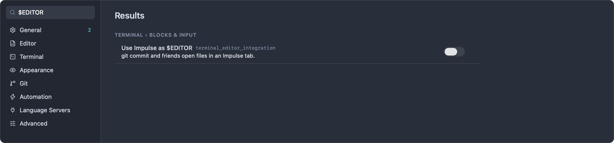
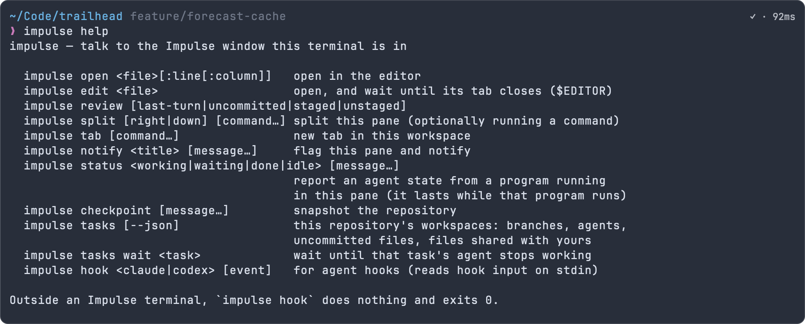

# Command-line tool

`impulse` is a small command-line tool that drives the Impulse window your terminal is in: open files in the editor, wait on an edit (so Impulse can be your `$EDITOR`), open Review, split the pane, notify yourself, and report agent status. It's bundled with the app and is already on `PATH` in every Impulse terminal.

## Where it lives

The tool is inside the app bundle:

```
/Applications/Impulse.app/Contents/Resources/bin/impulse
```

Every terminal Impulse starts gets that `bin` folder at the front of its `PATH`, so `impulse` works without any setup. Impulse terminals also get these environment variables:

| Variable             | Value                                                                                                                 |
| -------------------- | --------------------------------------------------------------------------------------------------------------------- |
| `IMPULSE_SOCKET`     | The Unix socket the tool talks to: `~/Library/Application Support/impulse/impulse.sock`.                              |
| `IMPULSE_PANE_TOKEN` | A token naming this terminal pane, so commands can act on "this pane" (split it, flag it, report its agent's status). |
| `IMPULSE_CLI`        | The full path of the `impulse` tool. Agent hooks call it through this variable.                                       |
| `TERM_PROGRAM`       | `Impulse`                                                                                                             |
| `EDITOR`, `VISUAL`   | Set only when [Impulse is your `$EDITOR`](#use-impulse-as-your-editor).                                               |

The socket belongs to the running app and serves all its windows. Only your user account can connect to it. The development build ("Impulse Dev") uses `~/Library/Application Support/impulse-dev/impulse.sock` instead.

If your shell startup files replace `PATH` outright (rather than adding to it), `impulse` may not be found; use `"$IMPULSE_CLI"` in scripts, or add the folder back to `PATH` in your shell config.

## Commands

| Command                                                     | What it does                                                                     |
| ----------------------------------------------------------- | -------------------------------------------------------------------------------- |
| `impulse open <file>[:line[:column]]`                       | Open a file in the editor (a folder opens as a workspace).                       |
| `impulse edit <file>`                                       | Open a file and wait until its tab closes. For `$EDITOR`.                        |
| `impulse review [last-turn\|uncommitted\|staged\|unstaged]` | Open Review on the current repository.                                           |
| `impulse split [right\|down] [command…]`                    | Split this pane, optionally running a command in the new pane.                   |
| `impulse tab [command…]`                                    | Open a new terminal tab, optionally running a command.                           |
| `impulse notify <title> [message…]`                         | Flag this pane and send a desktop notification.                                  |
| `impulse status <working\|waiting\|done\|idle> [message…]`  | Report an agent state for this pane.                                             |
| `impulse checkpoint [message…]`                             | Snapshot the repository's files.                                                 |
| `impulse hook <claude\|codex> [event]`                      | Used by agent hooks.                                                             |
| `impulse help`                                              | Print the usage summary. `-h` and `--help` do the same, as does `impulse` alone. |

Relative paths are resolved against your current directory, and `~` is expanded.

### `impulse open`

```
impulse open <file>[:line[:column]]
```

Opens the file in an editor tab in the Impulse window this terminal belongs to, and brings Impulse to the front. Add `:line` or `:line:column` to jump to a position, the format compilers, linters and `grep -n` print:

```sh
impulse open src/forecast.ts
impulse open src/forecast.ts:42
impulse open src/forecast.ts:42:7
```

With a line and no column, the cursor goes to column 1. If the path is a folder, it opens as a workspace (`impulse open .` opens the current folder). If the file doesn't exist, `impulse` prints `No such file: …` and exits with status 1.

### `impulse edit`

```
impulse edit <file>
```

Opens the file like `impulse open`, then waits until you close its tab before exiting. That's what an editor launched by `git commit`, `crontab -e` or `kubectl edit` must do, which makes `impulse edit` usable as `$EDITOR`. See [Use Impulse as your `$EDITOR`](#use-impulse-as-your-editor).

- If the file doesn't exist, Impulse creates it empty and opens it.
- Images, binary files and folders don't get an editor tab to close, so `impulse edit` returns right away for them.
- `:line[:column]` works as with `open`.
- If Impulse quits while `impulse edit` is waiting, it exits with status 1 ("no answer from Impulse").

### `impulse review`

```
impulse review [last-turn|uncommitted|staged|unstaged]
```

Opens a Review tab for the git repository of your current directory. With no argument, it shows all uncommitted changes.

| Argument      | Review shows                                                                                                                                                  |
| ------------- | ------------------------------------------------------------------------------------------------------------------------------------------------------------- |
| `uncommitted` | Staged and unstaged changes together (the default).                                                                                                           |
| `staged`      | What the next commit will contain.                                                                                                                            |
| `unstaged`    | Changes not yet staged, including untracked files.                                                                                                            |
| `last-turn`   | What the agent in this pane changed in its last turn, or else the latest agent turn in the window's repository. See [Agents](agents.md#review-the-last-turn). |

Outside a git repository, it prints `Not in a git repository.` and exits with status 1. See [Review](review.md).

### `impulse split`

```
impulse split [right|down] [command…]
```

Splits the pane you ran it in: `right` (the default) puts the new pane beside it, `down` below it. The new terminal starts in your current directory. Anything after the direction is run in the new pane:

```sh
impulse split right npm run dev
impulse split down 'npm test -- --watch'
```

The command's words are joined with spaces and typed into the new pane's shell, so quote a command that has its own quoting or shell operators as one argument.

### `impulse tab`

```
impulse tab [command…]
```

Opens a new terminal tab in your current directory, in the workspace you're looking at, and runs the command if you give one:

```sh
impulse tab npm run dev
```

### `impulse notify`

```
impulse notify <title> [message…]
```

Flags this pane as needing attention (its tab and workspace row are marked and the Dock badge counts it) and, when Impulse is in the background, bounces the Dock icon and posts a desktop notification with the title and message. Clicking the notification brings you to the pane. Useful at the end of anything long:

```sh
npm run build; impulse notify "Build finished" "trailhead"
```

The flag clears when you look at the pane. See [Terminal](terminal.md) for Impulse's built-in notifications when long commands finish.

### `impulse status`

```
impulse status <working|waiting|done|idle> [message…]
```

Reports an agent state for this pane, for agents that Impulse doesn't recognize or that have no hooks, and for your own long-running tools:

| Argument  | State                |
| --------- | -------------------- |
| `working` | **Working**          |
| `waiting` | **Needs your input** |
| `done`    | **Finished**         |
| `idle`    | **Idle**             |

If no agent was recognized in the pane, Impulse starts tracking one called "Agent". `waiting` and `done` flag the pane and notify you like any agent; see [Agents](agents.md#agent-states). Once a pane has reported a status, Impulse stops guessing that agent's state from its output. A message may follow the state; Impulse doesn't currently display it.

Call it from the program running in the pane (a wrapper script around your agent, for example). Impulse stops tracking an agent when the pane's current command ends, so running `impulse status` by itself at the prompt has no lasting effect.

```sh
#!/bin/sh
# my-agent: report status around a tool Impulse doesn't know
impulse status working
long-running-agent "$@"
impulse status done
read -r _   # keep the command running until you've seen the result
```

### `impulse checkpoint`

```
impulse checkpoint [message…]
```

Records a snapshot of the repository you're in: every tracked file, every untracked file that isn't ignored, and what's staged. It doesn't change your files, branch, staged changes or stash. The snapshot is a commit under `refs/impulse/checkpoints/manual/`, and `impulse` prints its ref:

```sh
$ impulse checkpoint before units refactor
refs/impulse/checkpoints/manual/1791382210345-before-units-refactor
```

Without a message, the name ends in `manual-checkpoint`. Use the ref with git, for example to see what changed since, or to bring one file back:

```sh
git diff refs/impulse/checkpoints/manual/1791382210345-before-units-refactor
git restore --source=refs/impulse/checkpoints/manual/1791382210345-before-units-refactor -- src/lib/units.ts
```

Manual checkpoints don't appear in an agent's **Turns** menu. Like agent checkpoints, they're not sent by a normal `git push`, and they're pruned along with them: each time `impulse checkpoint` records one, and the first time in each session that Impulse records an agent turn in the repository, checkpoints older than 14 days, and any beyond the newest 200, are deleted. Outside a git repository, the command prints `Not in a git repository.` and exits with status 1.

### `impulse hook`

```
impulse hook <claude|codex> [event]
```

What the hooks installed by **Install Agent Hooks…** run; you don't normally call it yourself. Claude Code passes its hook input as JSON on standard input; Codex passes its notification JSON as the last argument. Impulse reads the event name (from the argument, or from the JSON), the message and the session id from it:

| Event                               | Effect on the pane's agent                                                          |
| ----------------------------------- | ----------------------------------------------------------------------------------- |
| `SessionStart`                      | **Idle**                                                                            |
| `UserPromptSubmit`                  | **Working**                                                                         |
| `Notification`                      | **Needs your input** if the message asks for permission or input, else **Finished** |
| `Stop`, `agent-turn-complete`       | **Finished**                                                                        |
| Anything else (tool use, subagents) | No change                                                                           |

Outside an Impulse terminal, or when Impulse isn't running, `impulse hook` does nothing and exits with status 0, so the hooks never get in the agent's way. See [Agents](agents.md#agent-hooks).

## Exit status

| Status | Meaning                                                                                                  |
| ------ | -------------------------------------------------------------------------------------------------------- |
| 0      | Success. For `edit`, the tab was closed.                                                                 |
| 1      | Impulse reported an error, couldn't be reached, or the command isn't running inside an Impulse terminal. |
| 2      | A usage error: an unknown command or a missing argument. The usage summary is printed to standard error. |

Messages from Impulse are printed to standard output on success (such as the ref from `checkpoint`) and to standard error on failure.

## Use Impulse as your `$EDITOR`

When `git commit`, `git rebase -i`, `crontab -e` and similar commands need you to edit a file, they open `$EDITOR`. Impulse can be that editor: the file opens in an editor tab, and the command continues when you close the tab.



To turn it on, do one of:

- Turn on **Use Impulse as $EDITOR** (`terminal_editor_integration`) in Settings ▸ Terminal ▸ Blocks & input.
- Run **Use Impulse as $EDITOR in Terminals** from the command palette. It toggles the setting and says "New terminals use Impulse as $EDITOR (git commit opens a tab)." or "New terminals keep your own $EDITOR."

New terminals then start with `EDITOR` and `VISUAL` set to the bundled tool's `edit` command. Terminals that are already open keep their environment, so open a new tab after turning it on. It's off by default.

Then, for example:

1. Run `git commit` in an Impulse terminal.
2. `COMMIT_EDITMSG` opens in an editor tab.
3. Write the message, save (⌘S) and close the tab (⌘W).
4. git finishes the commit. To abort instead, close the tab without writing a message; git sees an empty message and stops.

If your shell startup files set `EDITOR` or `VISUAL` themselves, theirs wins, because they run after Impulse sets the variables. To keep your own editor elsewhere and use Impulse inside Impulse terminals, set it conditionally in your shell config instead of using the setting:

```sh
# ~/.zshrc or ~/.bashrc
if [ -n "$IMPULSE_SOCKET" ]; then
  export EDITOR="impulse edit" VISUAL="impulse edit"
fi
```

```fish
# ~/.config/fish/config.fish
if set -q IMPULSE_SOCKET
    set -gx EDITOR "impulse edit"
    set -gx VISUAL "impulse edit"
end
```

## Use it outside Impulse terminals

In a terminal that Impulse didn't start (Terminal.app, an SSH session, an IDE's terminal), `IMPULSE_SOCKET` isn't set, and `impulse` prints:

```
impulse: not running inside an Impulse terminal (IMPULSE_SOCKET isn't set)
```

You can set the variable yourself to reach a running Impulse from your own Mac:

```sh
export IMPULSE_SOCKET="$HOME/Library/Application Support/impulse/impulse.sock"
alias impulse=/Applications/Impulse.app/Contents/Resources/bin/impulse
impulse open ~/Code/trailhead/src/server.ts:12
```

Without a pane token, requests go to the frontmost Impulse window. `open`, `edit`, `review` and `checkpoint` work this way. `split`, `tab`, `notify` and `status` act on a pane, so they refuse with "Run this inside an Impulse terminal.", and `hook` does nothing.

## Examples

```sh
# Open the first failing test's location
impulse open test/metrics.test.ts:9

# Dev server in a pane beside this one, tests watching below
impulse split right npm run dev
impulse split down 'npm test -- --watch'

# Look over what's staged before committing
impulse review staged

# Snapshot before a risky change, notify when a long job ends
impulse checkpoint before units refactor
./scripts/import-trails.sh; impulse notify "Import done" "$(wc -l < trails.csv) trails"
```



## Related

- [Agents](agents.md): hooks, agent states and checkpoints
- [Terminal](terminal.md): shell integration and notifications
- [Review](review.md): what `impulse review` opens
- [Settings and themes](settings-and-themes.md): the `terminal_editor_integration` setting
- [Tasks](tasks.md): task worktrees
