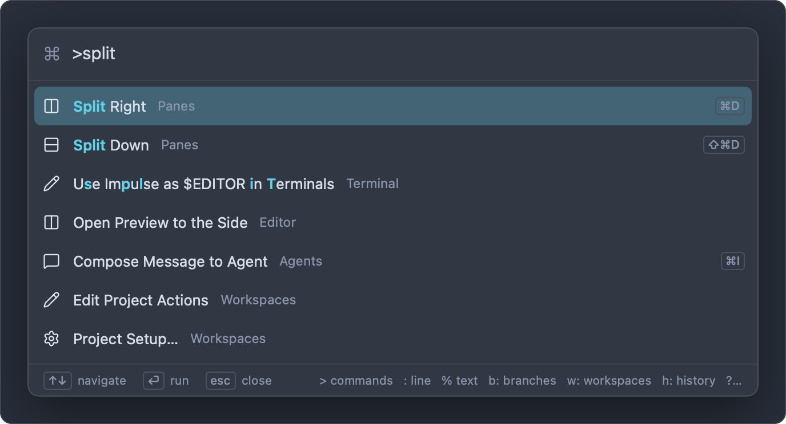
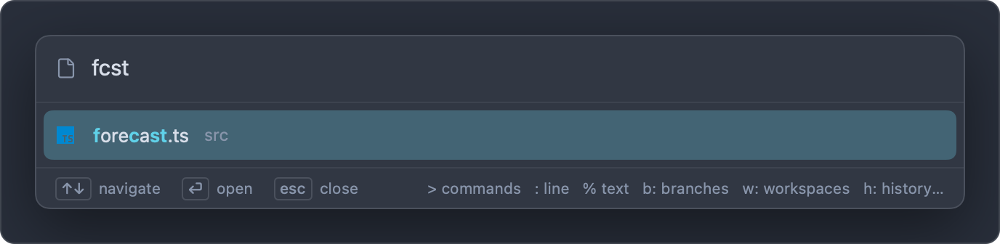
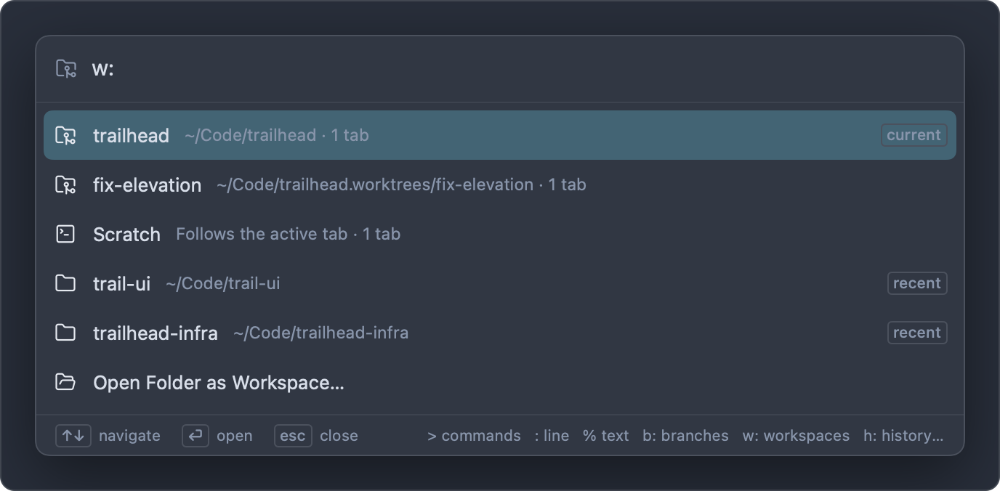
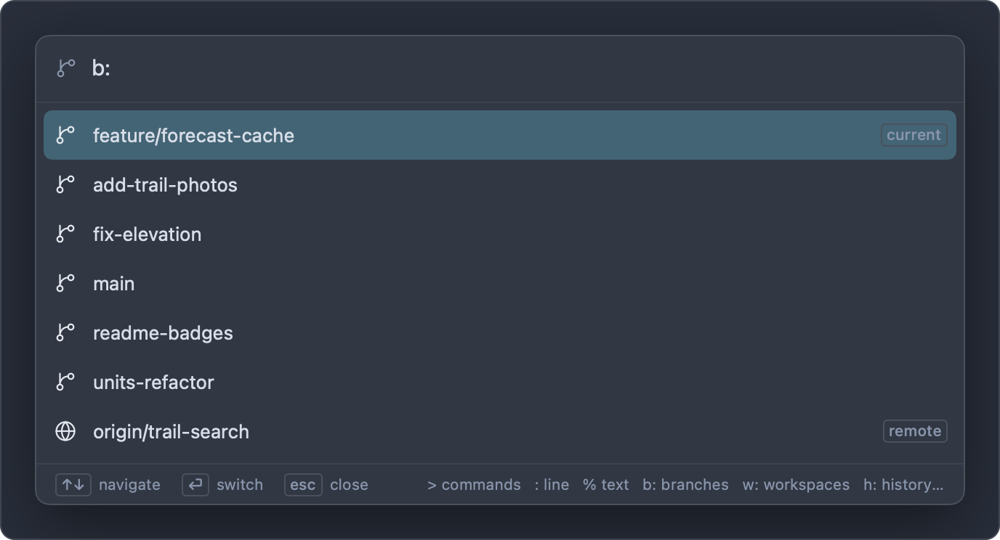
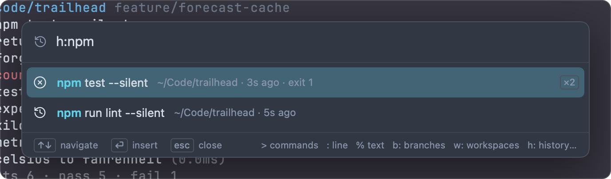
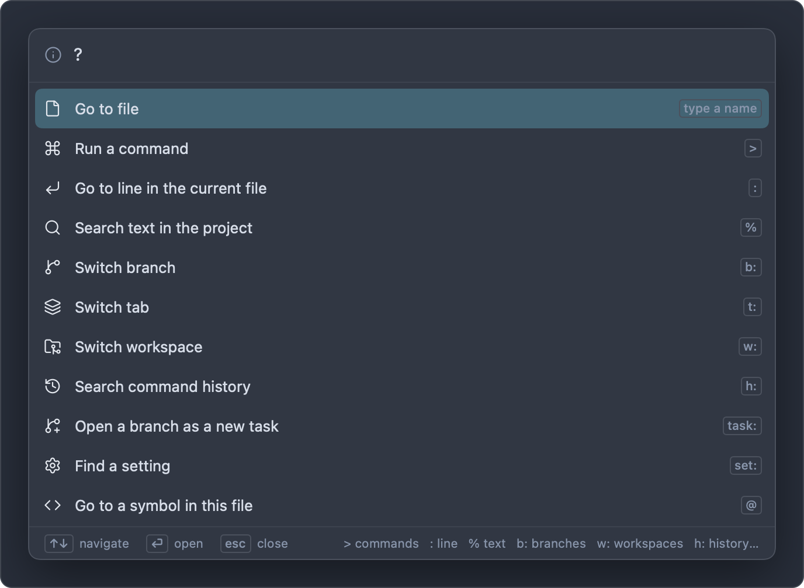

# Command palette

The command palette is one search field for most of what you do in Impulse: running commands, opening files, jumping to a line or symbol, switching tabs, workspaces and branches, finding a past command, opening a branch as a task, running a project action and finding a setting. What you type first picks the mode: `>` for commands, `:` for a line, `b:` for branches, and so on.

## Opening the palette

The palette opens near the top of the window, already in the mode you asked for:

| How                                                                                                                     | Opens in                            |
| ----------------------------------------------------------------------------------------------------------------------- | ----------------------------------- |
| ⇧⌘P (**View ▸ Command Palette**)                                                                                        | Commands (`>`)                      |
| Click **Search or run a command** in the titlebar                                                                       | Commands (`>`)                      |
| ⌘P (**View ▸ Go to File…**)                                                                                             | Files (no prefix)                   |
| ⌘G (**Edit ▸ Go to Line…**), when the selected tab is an editor                                                         | Go to line (`:`)                    |
| ⇧⌘O (**View ▸ Go to Symbol in File…**)                                                                                  | Symbols in this file (`@`)          |
| ⌥⌘O (**View ▸ Go to Symbol in Project…**)                                                                               | Symbols in the project (`#`)        |
| ⌃⌘O (**File ▸ Switch Workspace…**), or click the workspace name in the titlebar                                         | Workspaces (`w:`)                   |
| ⌃⌘B (**Git ▸ Switch Branch…**), or click the branch in the titlebar, the status bar, the input bar or the Changes panel | Branches (`b:`)                     |
| ⌃⌘R (**View ▸ Run Project Action…**)                                                                                    | Project actions (`a:`)              |
| ⌃R in the input bar, the input bar's history button, or **Command History…** in a terminal's context menu               | Command history (`h:`)              |
| **File ▸ New Task from Branch…**                                                                                        | Branches to open as tasks (`task:`) |

Some palette commands also just open the palette in another mode: **Go to File…** (files), **Switch Tab…** (`t:`), **Search Text in Project…** (`%`), **Command History…** (`h:`), **Find a Setting…** (`set:`), **Go to Symbol in File…** (`@`), **Go to Symbol in Project…** (`#`) and **Run Project Action…** (`a:`).

Whichever way you open it, you can change modes by editing the prefix: delete the `>` to search files, or type `b:` in its place to switch branches.

## Using the palette

| Key           | Action                                                       |
| ------------- | ------------------------------------------------------------ |
| Type          | Filter the results.                                          |
| ↑ ↓, or ⌃P ⌃N | Move the highlight. It wraps from the last row to the first. |
| ↩             | Run the highlighted row.                                     |
| Esc           | Close the palette.                                           |

You can also click a row to run it. The palette closes when it runs a row, when you press Esc, or when you click anywhere outside it or switch to another app. Each time it opens, it starts fresh with only the mode's prefix typed and the cursor after it.

The field's icon and placeholder show the current mode. A spinner appears while results are loading (indexing files, asking a language server or git). The footer reminds you of the keys and of the most-used prefixes, and its ↩ label says what Return does in this mode: **run** for commands, **insert** for history, **switch** for branches, **open** for the rest.

Matched letters in result titles are highlighted in the accent color.

## Modes

| Prefix  | Mode                                               | Return                                   |
| ------- | -------------------------------------------------- | ---------------------------------------- |
| (none)  | [Files](#files-no-prefix)                          | Opens the file                           |
| `>`     | [Commands](#commands-)                             | Runs the command                         |
| `:`     | [Go to line](#go-to-line-)                         | Moves the cursor in the current file     |
| `%`     | [Text in files](#text-in-files-)                   | Opens the file at the match              |
| `@`     | [Symbols in this file](#symbols-in-this-file-)     | Moves the cursor to the symbol           |
| `#`     | [Symbols in the project](#symbols-in-the-project-) | Opens the file at the symbol             |
| `t:`    | [Tabs](#tabs-t)                                    | Shows the tab                            |
| `w:`    | [Workspaces](#workspaces-w)                        | Shows the workspace, or opens the folder |
| `b:`    | [Branches](#branches-b)                            | Switches to the branch, or creates it    |
| `h:`    | [Command history](#command-history-h)              | Puts the command in the input bar        |
| `task:` | [Branches as tasks](#branches-as-tasks-task)       | Opens the branch as a new task           |
| `a:`    | [Project actions](#project-actions-a)              | Runs the action                          |
| `set:`  | [Settings](#settings-set)                          | Opens Settings at that setting           |
| `?`     | [Help](#help-)                                     | Switches to the chosen mode              |

## Files (no prefix)

With no prefix, the palette finds files in the project by name. The project is the folder the file tree shows: the active workspace's folder, or in Scratch, the active tab's folder.

- Before you type, it lists the files open in the window (up to 12).
- Type a few letters of the name or path: `fcst` finds `src/forecast.ts`, and `libca` finds `src/lib/cache.ts`. See [How matching works](#how-matching-works).
- Each row shows the file name with its folder beside it. Up to 60 results are shown.
- ↩ opens the file in an editor tab, or shows its tab if it's already open.

In a git repository the list is what git knows about: tracked files plus untracked files that aren't ignored, so `.impulse/project.toml` is there but an ignored `.env` and `node_modules` aren't. Outside a repository Impulse walks the folder, skipping dot files. When you open the palette, Impulse rebuilds the list if the folder changed or the list is more than 20 seconds old; "Indexing files…" shows while it loads.

⌘P (**View ▸ Go to File…**) opens the palette in this mode; you can also open the palette and delete the `>`. To search file contents, use [`%`](#text-in-files-) or the sidebar's [Search panel](workspaces-and-tabs.md#search-panel).

## Commands (`>`)

`>` lists Impulse's commands: most of what's in the menus, and more that isn't, such as **Install Web LSP Servers**, **Trust This Folder…**, **Toggle Quick Terminal** and **Import Shell History**.

- Each row shows the command's icon, its title, its category (Git, Editor, Panes, Workspaces…) and its shortcut, if it has one. Shortcuts you've changed in Keyboard Shortcuts show as you set them.
- Before you type, the commands you ran most recently come first, then the rest in alphabetical order.
- When you type, titles are matched first. If the title doesn't match, the category and the command's keywords are tried, so `git` finds **Review Changes** and `worktree` finds **New Task…**; those rows rank lower and show no highlight.
- Commands you ran recently get a small boost in the ranking.

Custom shortcuts that run shell commands (`custom_keybindings` in `settings.json`) appear here too, in the **Custom** category. They run in the focused terminal, or in a new terminal tab when no terminal is focused, it's busy, or the input bar is off. See [Settings and themes](settings-and-themes.md).

## Go to line (`:`)

`:` moves the cursor in the file open in the selected editor tab.

- Type a line number, `:42`, or a line and column, `:42:7`, and press ↩.
- Without an editor in front, the palette says "Open a file in the editor to go to a line".

⌘G opens this mode directly when the selected tab is an editor.

## Text in files (`%`)

`%` searches the contents of the project's files for the text you type and lists the matching lines.

- Type at least two characters. The search starts a moment after you stop typing.
- The match is literal text, not a pattern. It ignores case unless your text has an uppercase letter.
- Each row shows the matching line, with the file's path and line number beside it, such as `src/server.ts:18`. Up to 200 matches are shown.
- ↩ opens the file with the cursor at the match.
- Dot files and folders, files git ignores, binary files and files over 1 MB aren't searched.

For a persistent list of results, or to replace across files, use the sidebar's Search panel (⇧⌘F). See [Workspaces, tabs and panes](workspaces-and-tabs.md#search-panel) and [Editor](editor.md).

## Symbols in this file (`@`)

`@` lists the functions, classes, types and other symbols in the file open in the selected editor, as reported by its language server.

- Before you type, symbols are listed in the order they appear, indented to show nesting.
- Type to filter them by name.
- Each row shows the symbol's name, what contains it (and any detail the server gives), and its kind and line, such as `function · 24`.
- ↩ moves the cursor to the symbol.

This needs an editor tab in front and a language server for its language, which only runs in [trusted folders](getting-started.md#workspace-trust). Otherwise the palette says "Open a file to see its symbols" or "No language server for this file". ⇧⌘O opens this mode directly.

## Symbols in the project (`#`)

`#` asks the language server of the file in front to search the whole project for symbols whose names match what you type.

- Type a name; the search runs a moment after you stop typing.
- Each row shows the symbol's name, what contains it, its file and line, and its kind. Up to 200 results are shown.
- ↩ opens the file at the symbol.

Like `@`, it needs an editor in front with a language server for its language: the server is what searches the project. ⌥⌘O opens this mode directly.

## Tabs (`t:`)

`t:` lists every tab in the window, in every workspace, matched by title.

- When the window has more than one workspace, each row names the tab's workspace, followed by its folder.
- The first nine tabs of the active workspace show their ⌘1 to ⌘9 shortcuts.
- ↩ shows the tab, switching workspaces if it's in another one.

## Workspaces (`w:`)

`w:` lists, in order:

1. The window's open workspaces, with each folder (or "Follows the active tab" for Scratch) and its number of tabs. The active one is marked `current`.
2. Folders you opened recently that aren't open now and still exist, marked `recent`.
3. **Open Folder as Workspace…**, to choose another folder.

↩ on an open workspace switches to it; on a recent folder it opens the folder as a workspace again. See [Workspaces, tabs and panes](workspaces-and-tabs.md#workspaces).

## Branches (`b:`)

`b:` lists the repository's branches: the current branch first (marked `current`), then the other local branches, most recently committed first, then remote branches that have no local branch of the same name (marked `remote`).

- ↩ on a local branch switches to it. On a remote branch such as `origin/trail-search`, it creates the local branch `trail-search` tracking it and switches to that.
- When what you type isn't an existing branch but is a valid branch name, the last row offers **Create branch “…”** from the current branch.
- If the switch can't happen (uncommitted changes in the way, for example), a sheet explains why.

Outside a repository the palette says "Not a git repository". For managing branches (renaming, deleting, publishing), see [Git](git.md).

## Command history (`h:`)

`h:` searches the commands you've run in Impulse terminals, newest first.

- Each command appears once. Its row shows the folder it last ran in, how long ago, its exit code if it failed, and `×3` if you ran it more than once. Multi-line commands show `⏎` between lines.
- Type to match commands fuzzily. Add these words anywhere in the query to narrow the list:

| Filter    | Keeps commands that                          |
| --------- | -------------------------------------------- |
| `@here`   | ran in the focused terminal's current folder |
| `@repo`   | ran in the window's repository               |
| `@failed` | exited with an error                         |
| `@today`  | ran today                                    |

- ↩ puts the command in the focused terminal's input bar without running it, so you can edit it first. When a program owns the terminal (the input bar is hidden), it's typed at the program's prompt instead. With no terminal focused, it's copied to the clipboard.

To bring in your zsh, bash or fish history, run **Import Shell History**. See [Terminal](terminal.md) for history in the input bar.

## Branches as tasks (`task:`)

`task:` lists the branches you can open as a new task: local branches that no checkout has open, then remote branches with no local branch, marked "remote".

- Type to match the branch name.
- ↩ opens the branch as a task, in its own folder and workspace. See [Open a branch as a task](tasks.md#open-a-branch-as-a-task).

When every branch is already checked out somewhere, the list says "No branches to open: each one is checked out already".

## Project actions (`a:`)

`a:` lists the actions defined in the repository's `.impulse/project.toml`, such as `dev`, `test` and `lint` in the example project.

- Each row shows the action's name and its command, with `split` when it opens beside the current pane rather than in a new tab.
- ↩ runs it in a new terminal (the first time, and whenever the file changes, Impulse asks you to trust the file's commands).
- The last row, **Edit project actions…** (or **Add project actions…** when there are none), opens [Project Setup](project-config.md#project-setup) at its Actions.

See [Project configuration](project-config.md) for the file format.

## Settings (`set:`)

`set:` finds a setting by its title or its `settings.json` key.

- Each row shows the setting's title with its place in Settings, such as `General › Startup`, and `changed` when it isn't at its default.
- ↩ opens the Settings tab at that setting.

See [Settings and themes](settings-and-themes.md) for every setting.

## Help (`?`)

`?` lists every mode with its prefix. Choose one (↩ or click) to switch the palette to it.

## How matching works

Most modes match fuzzily: the letters you type must appear in the result in the same order, but not next to each other. `rlat` finds **Review Last Agent Turn**.

Results are ranked so the one you probably mean comes first. Matches score higher when they:

- start a word (after `/`, `_`, `-`, `.`, `:`, a space, or at a capital in camelCase),
- are at the very start,
- are next to each other,
- for files, fall in the file name rather than in the folders,
- are in a shorter result, when everything else is equal.

Matching ignores case unless you type an uppercase letter: `cache` matches `Cache.ts` and `cache.ts`, but `Cache` matches only `Cache.ts`.

Two modes don't match fuzzily: `%` matches literal text in files, and `:` reads a line number.

## Recent items

- **Commands.** The last 20 commands you ran from the palette are remembered across windows and launches. They're listed first when you open `>` and get a boost when you type.
- **Files.** With nothing typed, file mode lists the files open in the window.
- **Workspaces.** `w:` lists the folders you opened recently (Impulse remembers the last 20).
- **History.** `h:` starts with your most recent commands.

## Related

- [Keyboard shortcuts](keyboard-shortcuts.md)
- [Workspaces, tabs and panes](workspaces-and-tabs.md)
- [Editor](editor.md)
- [Git](git.md)
- [Terminal](terminal.md)
- [Project configuration](project-config.md)
- [Settings and themes](settings-and-themes.md)
