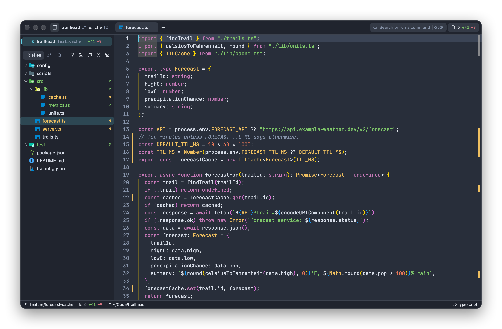
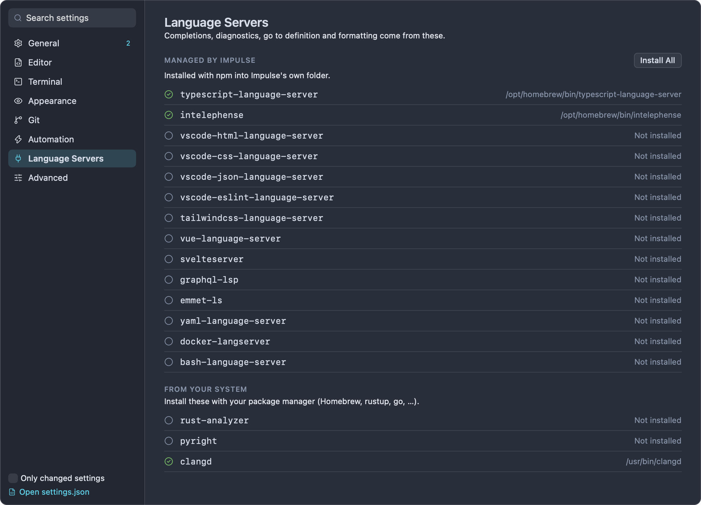
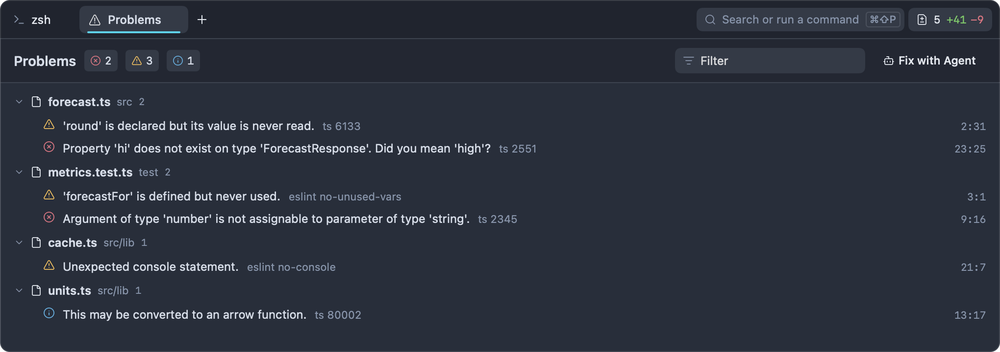
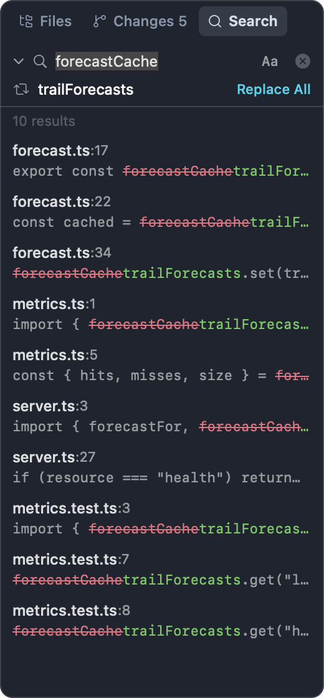
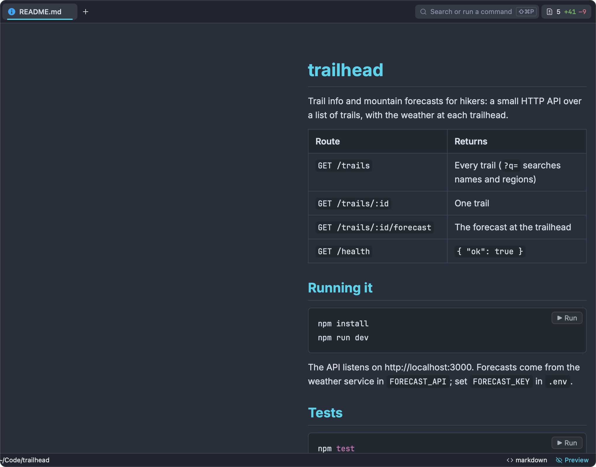
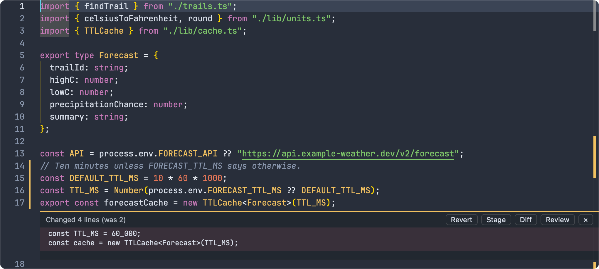
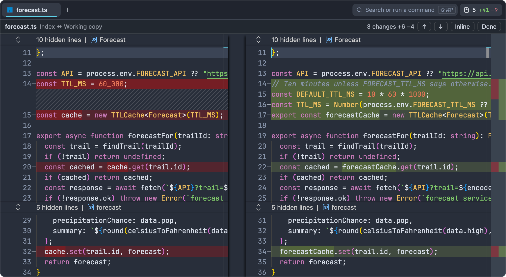
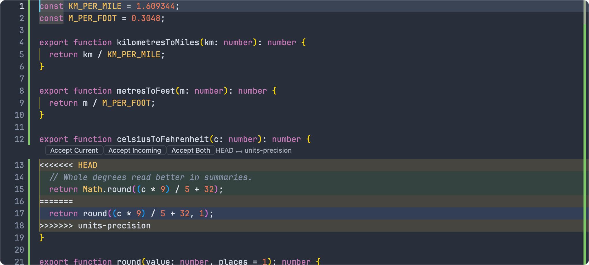

# Editor

Impulse's editor is [Monaco](https://microsoft.github.io/monaco-editor/), the editing component from VS Code, running in a tab beside your terminals. Impulse adds language servers, a Problems tab, project-wide find and replace, Markdown and SVG previews, and git awareness: live change marks, inline blame, an editable diff view and merge-conflict buttons.



## Opening files

Every file opens in its own editor tab. A file that's already open in the window isn't opened twice: Impulse switches to its tab (and moves to the line, if you asked for one).

| From                              | How                                                                                                                                                                                                         |
| --------------------------------- | ----------------------------------------------------------------------------------------------------------------------------------------------------------------------------------------------------------- |
| The file tree                     | Click a file to preview it, double-click (or press Return) to open it for good, ⌥-click to open it beside the current tab. Right-click for **Open to the Side** and **Open with Default App**.              |
| Quick open                        | Press ⌘P (View ▸ Go to File…), type part of the path, and press Return. With nothing typed, the list starts with the files you have open. See [Command palette](command-palette.md).                        |
| Terminal output                   | ⌘-click a path such as `src/forecast.ts:42:7`. It opens at that line and column. See [Terminal](terminal.md).                                                                                               |
| The command line                  | In an Impulse terminal, `impulse open src/forecast.ts:42` opens the file; `impulse edit <file>` opens it and waits until you close the tab, which is what `$EDITOR` needs. See [Command-line tool](cli.md). |
| The menu bar                      | File ▸ Open… (⌘O) opens a file in a tab, or a folder as a workspace.                                                                                                                                        |
| Finder                            | Choose **Open With ▸ Impulse** on a source file.                                                                                                                                                            |
| Search results, Problems, symbols | Click a result to open the file at that spot.                                                                                                                                                               |

**New File** (⌘N) opens an empty, untitled editor. The first time you save it, a Save panel asks where to put it (starting in the current folder), and the editor then picks the language from the file name.

Some files don't open as text:

- **Images** (`.png`, `.jpg`, `.jpeg`, `.gif`, `.webp`, `.bmp`, `.ico`, `.tiff`, `.tif`) open in an image tab. See [Image tabs](#image-tabs).
- **Binary files** (anything with a NUL byte in its first 8 KB, or over 10 MB) don't open. A message offers **Open in Default App**.
- **Files that aren't UTF-8** don't open either, so a save can't overwrite them with the wrong encoding. The same **Open in Default App** button appears.
- **Files over 5 MB** open read-only, so the editor stays responsive.

Text files that start with a UTF-8 byte-order mark keep it when you save.

### Preview tabs

A single click in the file tree shows the file in a _preview tab_, whose title is in italics. The next file you click replaces it, so browsing the tree doesn't fill the tab bar. The tab becomes a normal one when you:

- double-click the file in the tree, or double-click the tab,
- start editing the file, or
- open the same file another way (quick open, Return in the tree, a search result).

Each workspace has at most one preview tab. To always open files in normal tabs, turn off **Preview files from the file tree** (Settings ▸ Editor ▸ Behavior, `editor_preview_tabs`). Pinning tabs is covered in [Workspaces and tabs](workspaces-and-tabs.md).

## Working in the editor

The editor behaves like Monaco in VS Code, with a few changes so it fits with the rest of the window:

- **⌘-click** a symbol to go to its definition (the symbol underlines while you hold ⌘). **⌥-click** adds another cursor.
- **⌘F** (Edit ▸ Find…) opens Monaco's find widget for the current file. Its arrow on the left shows the replace field.
- **⌘G** (Edit ▸ Go to Line…) opens the palette's line mode: type `42` or `42:7` and press Return.
- **⇧⌘O** is Impulse's Go to Symbol in File (see [Go to symbol](#go-to-symbol)), not Monaco's outline. **⌥⌘↑** and **⌥⌘↓** move between split panes instead of adding cursors.
- Where Monaco and Impulse use the same keys, Impulse's command runs: **⌘D** splits right (not Monaco's Add Selection to Next Find Match), **⌘G** is Go to Line (in the find widget, Return and ⇧Return or F3 and ⇧F3 step through matches), **⇧⌘G** opens Review and **⇧⌘↩** zooms the pane (not Insert Line Above). Monaco keeps the keys of Impulse's terminal-only commands: **⌘I** shows suggestions, **⇧⌘K** deletes the line and **⇧⌘Space** shows parameter hints. Removing or changing an Impulse shortcut in Keyboard Shortcuts gives its keys back to Monaco.
- Right-click for Monaco's context menu (Go to Definition, Go to References, Rename Symbol, Format Document, Command Palette and so on). Impulse adds **Show Commit for This Line**.
- **⌘=**, **⌘-** and **⌘0** make the editor and terminal text bigger, smaller, or back to 14 pt.

When an editor tab is focused, the status bar shows the cursor position (`Ln 42, Col 7`; click it to go to a line), the indentation (`Spaces: 4` or `Tab Size: 4`), the encoding, and the language. For Markdown and SVG files it also has a **Preview** button.

A dot on the tab means the file has unsaved changes.

### Editor settings

These are in Settings ▸ Editor (⌘,). The key is the name in `settings.json`; [Settings and themes](settings-and-themes.md) covers the file.

| Setting                                                                               | Key                               | Default                    |
| ------------------------------------------------------------------------------------- | --------------------------------- | -------------------------- |
| Font family                                                                           | `font_family`                     | `JetBrains Mono` (bundled) |
| Font size                                                                             | `font_size`                       | 14                         |
| Font ligatures                                                                        | `font_ligatures`                  | On                         |
| Line height (in points; 0 uses the font's own)                                        | `editor_line_height`              | 0                          |
| Tab width                                                                             | `tab_width`                       | 4                          |
| Insert spaces instead of tabs                                                         | `use_spaces`                      | On                         |
| Indent guides                                                                         | `indent_guides`                   | On                         |
| Line numbers                                                                          | `show_line_numbers`               | On                         |
| Word wrap                                                                             | `word_wrap`                       | Off                        |
| Minimap                                                                               | `minimap_enabled`                 | Off                        |
| Highlight current line                                                                | `highlight_current_line`          | On                         |
| Bracket pair colors                                                                   | `bracket_pair_colorization`       | On                         |
| Render whitespace: None, Boundary, Selection, Trailing, All                           | `render_whitespace`               | Selection                  |
| Right margin                                                                          | `show_right_margin`               | On                         |
| Right margin column                                                                   | `right_margin_position`           | 120                        |
| Sticky scroll (keep enclosing scopes pinned at the top)                               | `sticky_scroll`                   | Off                        |
| Scroll beyond last line                                                               | `scroll_beyond_last_line`         | Off                        |
| Smooth scrolling                                                                      | `smooth_scrolling`                | Off                        |
| Lines kept around the cursor                                                          | `editor_cursor_surrounding_lines` | 3                          |
| Cursor style: Line, Block, Underline, Thin line, Block outline, Thin underline        | `editor_cursor_style`             | Line                       |
| Cursor blinking: Blink, Smooth, Phase, Expand, Solid                                  | `editor_cursor_blinking`          | Smooth                     |
| Auto-close brackets: Always, Language defined, Before whitespace, Never               | `editor_auto_closing_brackets`    | Language defined           |
| Code folding                                                                          | `folding`                         | On                         |
| Save when focus leaves the editor                                                     | `auto_save`                       | Off                        |
| Vim keybindings                                                                       | `editor_vim_mode`                 | Off                        |
| Preview files from the file tree                                                      | `editor_preview_tabs`             | On                         |
| Highlight matches of the selection                                                    | `editor_selection_highlight`      | On                         |
| Highlight occurrences of the symbol                                                   | `editor_occurrences_highlight`    | On                         |
| Inlay hints: On, Off, While holding ⌃⌥, Hidden while holding ⌃⌥                       | `editor_inlay_hints`              | On                         |
| Word-based suggestions: Off, Current file, Files of the same language, All open files | `editor_word_based_suggestions`   | Files of the same language |

Changes apply to open editors right away.

## Saving

Press **⌘S** (File ▸ Save) to save the focused editor. If **Save when focus leaves the editor** is on, Impulse also saves a modified file whenever you click or switch away from its editor.

Each save runs the same steps: write the file, run its formatter if one is set up, tell the language servers, run any matching commands on save, and refresh the git change marks and the file tree's git status.

### Closing with unsaved changes

Closing a tab or pane (⌘W) that holds an editor with unsaved changes asks first, in an **Unsaved Changes** sheet:

- **Save & Close** saves (asking for a name if the file is untitled) and closes once the save has landed. If the save fails, the tab stays open.
- **Don't Save** closes and drops the changes.
- **Cancel** keeps the tab.

When a tab has several modified editors in split panes, you're asked about each in turn. Quitting asks the usual "Do you want to save the changes made to…?" question for each modified file.

### When a file changes on disk

Agents, git and other tools often rewrite files you have open. Impulse watches every open file:

- If the editor has no unsaved changes, it reloads the new contents.
- If you have unsaved changes, it leaves your buffer alone and shows "_file_ changed on disk while you have unsaved edits." with a **Reload** button, which discards your edits and loads the disk version.
- If you then save anyway, a sheet says the file changed on disk and offers **Save Anyway** (your version replaces theirs), **Reload from Disk** (theirs replaces yours) or **Cancel**.

### Format on save and commands on save

You can have Impulse run a program after saving files that match a pattern, for example a formatter or a code generator. Both are set up in Settings ▸ Automation:

- **Commands on save**: click **Add**, then fill in a name, a file pattern and the command with its arguments. Tick **Reload** when the command rewrites the file you saved, so the editor shows the result.
- **File types**: click **Add**, enter a file pattern, and type the formatter command in the **formatter (optional)** field. A formatter always reloads the file afterwards.

The same lists live in `settings.json` as `commands_on_save` and `file_type_overrides`:

```json
{
  "commands_on_save": [
    {
      "name": "Regenerate routes",
      "file_pattern": "*.ts",
      "command": "/usr/local/bin/gen-routes",
      "args": ["--quiet"],
      "reload_file": false
    }
  ],
  "file_type_overrides": [
    {
      "pattern": "*.ts",
      "format_on_save": {
        "command": "/usr/local/bin/my-formatter",
        "args": ["--write", "."]
      }
    }
  ]
}
```

How these commands run:

- **Patterns** are `*` (every file), `*.ext` (an extension, any case) or an exact file name such as `Makefile`. The first file-type entry with a formatter that matches wins.
- The command runs **in the saved file's folder**, with exactly the arguments you gave. Impulse doesn't add the file's path, so use arguments that tell your tool what to work on (`.` for the folder, for instance).
- There's no shell: no pipes, `&&`, globbing or `~`. The command must be a plain program name or an absolute path. A relative path such as `./node_modules/.bin/prettier` isn't run.
- A plain program name is looked up in the `PATH` Impulse itself was started with. When you open Impulse from the Dock or Finder, that `PATH` doesn't include Homebrew or npm folders, so give the full path (for example `/opt/homebrew/bin/…`).
- Output isn't shown anywhere. If a command fails, the file just stays as you saved it.
- If you keep typing while a formatter runs, your newer text is kept (and stays unsaved) instead of the formatter's result.
- Formatters and commands on save run only in [trusted folders](getting-started.md), because they run a project's own tools and configuration.

To format with a language server instead, use **Format Document** (⌥⇧F, or right-click ▸ Format Document) before saving. It uses your tab width and spaces settings.

## Language servers

Completions, hover information, go to definition, rename, code actions, formatting and error checking come from language servers: separate programs, one or more per language, that Impulse starts and talks to over the Language Server Protocol. Impulse doesn't include any servers itself. It finds the ones on your `PATH`, and it can install the Node-based web servers for you.

### Languages and servers

| Language               | File types                                            | Servers                                                                                                  | Where they come from            |
| ---------------------- | ----------------------------------------------------- | -------------------------------------------------------------------------------------------------------- | ------------------------------- |
| TypeScript, JavaScript | `.ts` `.mts` `.cts` `.tsx` `.js` `.mjs` `.cjs` `.jsx` | `typescript-language-server`, `vscode-eslint-language-server`, `tailwindcss-language-server`, `emmet-ls` | Managed by Impulse              |
| HTML                   | `.html` `.htm`                                        | `vscode-html-language-server`, `tailwindcss-language-server`, `emmet-ls`                                 | Managed by Impulse              |
| CSS, SCSS, Less        | `.css` `.scss` `.less`                                | `vscode-css-language-server`, `tailwindcss-language-server`, `emmet-ls`                                  | Managed by Impulse              |
| Vue                    | `.vue`                                                | `vue-language-server`, `vscode-eslint-language-server`, `tailwindcss-language-server`, `emmet-ls`        | Managed by Impulse              |
| Svelte                 | `.svelte`                                             | `svelteserver`, `vscode-eslint-language-server`, `tailwindcss-language-server`, `emmet-ls`               | Managed by Impulse              |
| JSON                   | `.json` `.jsonc`                                      | `vscode-json-language-server`                                                                            | Managed by Impulse              |
| YAML                   | `.yaml` `.yml`                                        | `yaml-language-server`                                                                                   | Managed by Impulse              |
| PHP                    | `.php`                                                | `intelephense`                                                                                           | Managed by Impulse              |
| GraphQL                | `.graphql` `.gql`                                     | `graphql-lsp`                                                                                            | Managed by Impulse              |
| Dockerfile             | `Dockerfile`, `Containerfile`, `Dockerfile.*`         | `docker-langserver`                                                                                      | Managed by Impulse              |
| Shell                  | `.sh` `.bash` `.zsh`                                  | `bash-language-server`                                                                                   | Managed by Impulse              |
| Rust                   | `.rs`                                                 | `rust-analyzer`                                                                                          | Your `PATH`                     |
| Python                 | `.py` `.pyi`                                          | `pyright-langserver` (from pyright)                                                                      | Your `PATH`                     |
| C, C++                 | `.c` `.cpp` `.cc` `.cxx` `.h` `.hpp` `.hh` `.hxx`     | `clangd`                                                                                                 | Your `PATH`                     |
| Swift                  | `.swift`                                              | `sourcekit-lsp`                                                                                          | Xcode or the Command Line Tools |

When a language has several servers, they all run: in `trailhead`, TypeScript files get type checking from `typescript-language-server`, lint results from ESLint, and Tailwind and Emmet completions where they apply. Each request goes to the first server that supports it.

Other languages (Go, Ruby, Java and so on) get Monaco's syntax highlighting but no server unless you add one; see [Adding or replacing servers](#adding-or-replacing-servers).

### Installing servers

**Servers on your `PATH`.** Install `rust-analyzer`, `pyright` and `clangd` with your usual tools (rustup, Homebrew, npm, …). Impulse looks them up in your login shell's `PATH`, so it finds them even when you start it from the Dock. `sourcekit-lsp` comes with Xcode and the Command Line Tools.

**Managed web servers.** The TypeScript, web, PHP, YAML, Dockerfile, GraphQL and shell servers are npm packages that Impulse installs into its own folder, separate from your projects:

1. Make sure Node.js and npm are installed (`npm --version` works in a terminal).
2. Run **Install Web LSP Servers** from the command palette (⇧⌘P), or open Settings ▸ Language Servers and click **Install All**.
3. Wait for the "Language servers installed" message. Files you open afterwards get their servers.

The packages go into `~/Library/Application Support/impulse/lsp`. Run the command again to update them. A server found on your `PATH` is used before the managed copy.

Settings ▸ Language Servers lists the managed servers, then `rust-analyzer`, `pyright` and `clangd` under "From your system", each with a check mark and the path where it was found, or "Not installed".



### Trusted folders only

Language servers can run a project's own code (TypeScript plugins, build scripts, config files), so Impulse starts them only for files in folders you trust. In a folder you haven't trusted, the status bar shows **Restricted**, the editor works without language features, and the first file you open shows "Language servers are off in “_folder_”: it isn't a trusted folder." with a **Trust…** button. When you trust the folder, servers start for its open files right away; when you restrict it again (**Restrict This Folder** in the palette), its servers stop and their problems are cleared. See [Getting started](getting-started.md) for workspace trust.

### How servers run

- A server starts the first time you open a file in its language, in the background, so the file opens without waiting. Opening more files of the same project reuses it, across all windows.
- Each server works on one project root: the nearest folder above the file that contains one of `Cargo.toml`, `package.json`, `tsconfig.json`, `jsconfig.json`, `pnpm-workspace.yaml`, `yarn.lock`, `package-lock.json`, `bun.lockb`, `turbo.json`, `nx.json`, `go.mod`, `pyproject.toml`, `setup.py`, `composer.json`, `Gemfile`, `deno.json`, `deno.jsonc` or `Package.swift`, or failing that, the nearest folder with a `.git`. In a monorepo, each package gets its own server.
- Long-running work a server reports (indexing, loading a project) shows in the status bar with its progress.
- Messages a server wants you to see (errors, warnings and information) appear as notifications.
- If a server isn't installed, you're told once, for example: "LSP server 'typescript-language-server' requires 'typescript-language-server' but it is not installed. Install them with "Install Web LSP Servers" in the command palette or Settings → Language Servers." Impulse looks for it again (at most every 15 seconds) as you keep working in the file, so once you install it, it starts without a restart.
- If a server crashes, you see "The _name_ language server stopped unexpectedly. Impulse restarts it." It comes back after a short delay that grows if it keeps crashing, and is told about the files you have open.
- Untitled files have no language server until you save them.

### Adding or replacing servers

To add a server for another language, or run a server with different arguments, create `~/.config/impulse/lsp.json`. It has three optional keys:

- `servers`: server ids, each with a `command`, optional `args` and optional `initialization_options`.
- `language_servers`: language ids mapped to the list of server ids to run for them. This replaces the built-in list for that language.
- `root_markers`: file names that mark a project root, replacing the list above.

For example, to use `gopls` for Go files:

```json
{
  "servers": {
    "gopls": { "command": "gopls" }
  },
  "language_servers": {
    "go": ["gopls"]
  }
}
```

Language ids are Monaco's (`go`, `ruby`, `java`, …), except `typescriptreact` and `javascriptreact` for `.tsx` and `.jsx`, `shellscript` for shell scripts, and `jsonc`, `vue` and `svelte`. If the file has a mistake, Impulse ignores all of it. Quit and reopen Impulse after editing it.

## Language features

| Feature                                             | How to use it                                                                                                                                                                                                  |
| --------------------------------------------------- | -------------------------------------------------------------------------------------------------------------------------------------------------------------------------------------------------------------- |
| Completions                                         | Appear as you type (after `.`, `:`, `<`, `"`, `/`, `@`, `\` or a space), or press ⌃Space. **Word-based suggestions** adds words from your files to the list.                                                   |
| Hover                                               | Rest the pointer on a symbol to see its type and documentation.                                                                                                                                                |
| Signature help                                      | Typing `(` or `,` in a call shows the function's parameters, with the current one highlighted.                                                                                                                 |
| Go to Definition                                    | ⌘-click, or F12. A definition in another file opens in its own tab at that line.                                                                                                                               |
| Go to Declaration, Type Definition, Implementations | Right-click and choose the command. They jump like Go to Definition, or list the choices when there are several.                                                                                               |
| Go to References                                    | ⇧F12, or right-click ▸ Go to References. Lists every use of the symbol, including its declaration.                                                                                                             |
| Highlight occurrences                               | Put the cursor on a symbol to highlight its other uses in the file, as the server finds them (without a server, other occurrences of the same word). Turn it off with **Highlight occurrences of the symbol**. |
| Inlay hints                                         | Inferred types and parameter names shown inline, if the server provides them. The **Inlay hints** setting turns them off or shows them only while you hold ⌃⌥ (or hides them while you hold ⌃⌥).               |
| Rename Symbol                                       | F2, type the new name, press Return. Renames across files; see below.                                                                                                                                          |
| Code actions                                        | Click the light bulb that appears when the cursor is on something with actions, or press ⌘. (Quick Fix): imports, fixes, refactorings and source actions from the server.                                      |
| Format Document                                     | ⌥⇧F or right-click ▸ Format Document.                                                                                                                                                                          |
| Diagnostics                                         | Errors and warnings are underlined as the server finds them; hover for the message. All of them collect in the [Problems tab](#problems).                                                                      |

TypeScript and JavaScript errors come only from the language server, which reads your `tsconfig.json`. Monaco's own built-in checker is turned off because it doesn't know your project's settings.

### Rename and other edits across files

Each editor tab only edits its own file, so when a rename or code action changes other files, Impulse applies the change itself:

- Files open in an editor (in any window) are changed in the editor, as one undo step each, and stay unsaved until you save them.
- Files that aren't open are rewritten on disk.
- Files the change creates, moves or deletes are handled too; deleted files go to the Trash.

When more than one file changed, a notification such as "Renamed in 6 files" appears with an **Undo** button that reverts the whole change: open editors undo their step (if it's still their latest change) and files on disk go back to what they were (if nothing has changed them since). A change limited to the current file undoes with ⌘Z like any edit.

Impulse refuses a change that would go wrong, and tells you why: when a file changed while the server was working on it ("…changed while the language server was working on it. Try again."), or when the change would move or delete a file you have open ("Close _file_ first: the change moves or removes it.").

Servers sometimes make changes on their own (for example after you pick a code action that runs a server command). Those are applied the same way.

### Problems

Every diagnostic the language servers report, for open files and for any other files they check, is collected in the Problems tab. Open it with **Show Problems** (⌃⌘M, or View ▸ Show Problems), or click the error and warning counts in the status bar, which appear whenever there are problems.



- Problems are grouped by file, files with errors first, each sorted by position. Click a file's header to collapse it.
- Each row shows the message, the server and its code (for example `eslint no-unused-vars`), and `line:column`. Click a row to open the file there.
- The three counts at the top (errors, warnings, and information and hints) are toggles: click one to hide or show that severity.
- The **Filter** field keeps problems whose message, file path, source or code contains the text.
- **Fix with Agent** sends the visible problems, as a list of `path:line:column` entries with their messages, to a coding agent running in this window (one **Send to …** item per agent), or copies the same text with **Copy as Prompt**. See [Agents](agents.md).

The tab updates live as servers report.

## Go to symbol

- **Go to Symbol in File…** (⇧⌘O, View ▸ Go to Symbol in File…) opens the palette with `@`. With nothing typed it lists the file's symbols as an outline; type to filter, then press Return to jump.
- **Go to Symbol in Project…** (⌥⌘O, View ▸ Go to Symbol in Project…) opens the palette with `#`. Type a name to search the whole project.

Both ask the language server of the file in the focused editor, so a file must be open and its server running. Otherwise the palette says "No language server for this file". See [Command palette](command-palette.md) for the other palette modes.

## Find and replace in the project

To search every file in the project, press **⇧⌘F** (View ▸ Find in Project), or click **Search** at the top of the left dock. The search covers the folder shown in the file tree.



1. Type in the **Search project…** field. Results appear as you type: files whose name matches, and every line that contains the text, as `file:line` with the line below. The count is at the top.
2. Click **Aa** to match case. Otherwise the search ignores case.
3. Click a result to open the file at that line.
4. Press Escape to clear the field, and Escape again (or click the ✕) to go back to the file tree.

The search is for literal text, not regular expressions, and matches never span lines. In a git repository it skips files your `.gitignore` ignores. It also skips binary files and files over 1 MB, and stops after 500 matches. The results refresh when files are created, deleted or renamed.

To replace:

1. Click the arrow at the left of the search field to show the **Replace with…** field.
2. Type the replacement. Each result line now shows the match struck out and the replacement after it.
3. Click **Replace All** (or press Return in the replace field). A sheet asks you to confirm: "Replace in 4 files?"
4. Click **Replace All** in the sheet.

Every occurrence is replaced in each file listed, with the case setting you chose. Files you have open with unsaved changes are skipped (the sheet says how many); other open files reload with the change. A notification reports how many matches were replaced, and its **Undo** button, available for 20 seconds, puts every file back. If the search stopped at 500 matches, search again afterwards to find the rest.

For a quick search without the panel, type `%` and the text in the palette. See [Command palette](command-palette.md).

## Previews

### Markdown

Markdown files (`.md`, `.markdown`, `.mdown`, `.mkd`, `.mkdn`) can be shown rendered:

- **Toggle Markdown Preview** (⇧⌘M, in the View menu, or the **Preview** button in the status bar) swaps the editor for the rendered page in the same tab. Do it again to go back to the text.
- **Open Preview to the Side** (in the command palette) puts the rendered page in the right half of the tab, with the editor on the left. It updates shortly after you stop typing and keeps its scroll position. Run it again to close it.



The preview renders GitHub-flavored Markdown, including tables, strikethrough and task lists, in your theme's colors, with syntax highlighting in code blocks. Relative image paths load from the file's folder. Clicking a web or `mailto:` link opens your browser; clicking a link to a local file opens it in an editor tab; `#anchor` links scroll the page.

Raw HTML in the Markdown isn't rendered: it's left out of the preview, and unsafe link targets are removed. This is deliberate, so a repository's README can't run anything in Impulse. Files over 1 MB aren't previewed.

**Run buttons.** Code blocks marked as shell (`bash`, `sh`, `shell`, `zsh`, `fish`, `console`, `shell-session` or `terminal`) get a **▶ Run** button. Clicking it runs the block in a terminal:

- If the block has lines starting with `$ `, only those lines run, without the `$ `. Otherwise every line runs.
- If the preview is in a tab that's split with a terminal, the command runs in that terminal. Otherwise a new terminal opens below the editor, in the Markdown file's folder, and runs it.

For example, a `trailhead` README block containing `$ npm install` and `$ npm run dev` runs those two commands in order.

### SVG

SVG files open as text, highlighted as XML. **Toggle Markdown Preview** (⇧⌘M) and **Open Preview to the Side** show the drawing instead, centered on your theme's background. The side preview redraws as you edit. Scripts, `foreignObject` elements, event handlers and `javascript:` links are removed before the drawing is shown, and files over 1 MB aren't previewed.

### Image tabs

Opening an image (`.png`, `.jpg`, `.jpeg`, `.gif`, `.webp`, `.bmp`, `.ico`, `.tiff`, `.tif`) shows it in its own tab, scaled down to fit and centered. Images always open in a normal tab, never a preview tab. ⌥-click in the file tree or **Open to the Side** puts the image beside the current tab.

## Vim mode

Turn on **Vim keybindings** (Settings ▸ Editor ▸ Behavior, `editor_vim_mode`) to edit with Vim's normal, insert and visual modes. Impulse uses [monaco-vim](https://github.com/brijeshb42/monaco-vim), which provides Vim's common motions, operators, registers, search and `:` commands such as `:s`. The current mode, and the command line while you type a `:` command, show in the bottom-right corner of the editor.

- Save with ⌘S. Vim's `:w` isn't connected to saving.
- ⌘ shortcuts keep working as usual.
- Vim keybindings apply to the normal editor, not to the [diff view](#diff-view).
- The setting applies to every editor tab as soon as you change it.

## Git in the editor

For files in a git repository, the editor shows what has changed since the last `git add`, who last changed each line, and buttons for resolving merge conflicts. For committing, branches and the Changes panel, see [Git](git.md).

### Change marks

A colored bar in the gutter, to the left of the text, marks every line that differs from the file's staged version (the index, which is the last commit's version when nothing is staged): one color for added lines, one for changed lines, and a small mark where lines were removed. The same colors appear along the scrollbar. The marks follow your typing, before you save. In a file git doesn't track yet, every line is marked as added. Files outside a repository, or ignored by it, have no marks.

Click a mark to open a _peek_ under the change:



- The title says what changed: "2 lines added", "1 line removed" or "Changed 3 lines (was 2)". Below it are the original lines.
- **Revert** puts the original lines back in the editor. It's an ordinary edit: ⌘Z brings your change back, and nothing is written until you save.
- **Stage** stages this change (`git add` of just this hunk). The file must be saved first; if it isn't, a notification offers **Save**. When it works you see "Staged the change", and the mark disappears.
- **Diff** opens the [diff view](#diff-view) for the whole file.
- **Review** opens the Review tab on its Unstaged scope, at this file. See [Review](review.md).
- **✕**, or clicking the mark again, closes the peek.

### Inline blame

When the cursor rests on a line for about half a second, faded text at the end of the line says who last changed it, when, and the commit's summary, for example "Maya Chen, 3 weeks ago · Cache forecasts per trail". Click that text, or right-click and choose **Show Commit for This Line**, to open History with the commit selected.

Blame describes the saved file, so it isn't shown on lines you've changed, on lines that aren't committed yet, or anywhere in the file once it has unsaved edits (it returns after you save). To see every commit that touched the file, use **Show History of This File** (⌃⇧⌘H). See [History](history.md).

### Diff view

**Toggle Diff View** (⌥⌘G, Git ▸ Toggle Diff View, or the **Diff** button in a peek) shows the focused file side by side with its staged version, in the same tab.



- The left side is the staged version and is read-only. The right side is your live buffer: you can type in it, language features work, ⌘S saves, and the diff updates as you edit.
- The bar at the top shows the file name, "Index ↔ Working copy", and a summary such as "2 changes +5 −2".
- **↑** and **↓** jump to the previous and next change.
- **Inline** shows both versions in one column; the button then reads **Side by Side** to switch back. A narrow pane shows the inline layout on its own.
- Long runs of unchanged lines are folded away, leaving three lines of context around each change.
- **Done**, or ⌥⌘G again, returns to the normal editor with the cursor where you left it.

The diff view is only for files in a git repository; otherwise you see "This file isn't in a git repository." To compare against other commits or branches, use [Review](review.md).

### Merge conflicts

When a file contains conflict markers (`<<<<<<<`, `=======`, `>>>>>>>`, and optionally a `|||||||` base section), the editor tints the two sides and puts a bar above each conflict:



- **Accept Current** keeps your side (the part after `<<<<<<<`, for example `HEAD`).
- **Accept Incoming** keeps the other side (the part before `>>>>>>>`, for example `units-precision`).
- **Accept Both** keeps your side followed by the incoming side.

Each choice replaces the whole block, markers included (a base section is dropped), as one edit you can undo with ⌘Z. The bar names the two sides ("HEAD ⟷ units-precision"); when the file has more than one conflict it also shows "1 of 3" and **↑**/**↓** buttons to move between them. **Go to Next Merge Conflict** and **Go to Previous Merge Conflict** are also in the editor's own command list (right-click ▸ Command Palette, or F1).

You can also edit the block by hand. When the last conflict in a file git lists as conflicted is gone, a notification says "No conflicts left in units.ts." with **Save & Mark Resolved**, which saves the file and stages it as resolved. Resolving whole merges, rebases and cherry-picks is covered in [Git](git.md).

## Sending code to an agent

Select some code and run **Send Selection to Agent** from the command palette. Impulse sends the selection, with the file's path and line numbers (for example "In @src/forecast.ts, lines 12–30:" followed by the code), to a coding agent running in a terminal in this window: preferably one in the same workspace that's waiting for you. Impulse only types into the agent's terminal; it never calls an AI model itself. See [Agents](agents.md).

## Splitting editors

Any tab can be split into panes, so you can put two files, or a file and a terminal, side by side. **Open to the Side** (or ⌥-click) in the file tree opens a file in a new pane to the right of the current tab; **Split Right** and **Split Down** add a terminal pane beside or below it. A file can only be open once per window, so selecting a file that's already open takes you to it. See [Workspaces and tabs](workspaces-and-tabs.md) for panes, focus and layouts.

## Related

- [Workspaces and tabs](workspaces-and-tabs.md): the file tree, tabs, split panes, session restore
- [Command palette](command-palette.md): quick open, `@`, `#`, `%` and `:` modes
- [Git](git.md): the Changes panel, committing, merge conflicts
- [Review](review.md): reviewing and staging changes hunk by hunk
- [History](history.md): commits, blame and file history
- [Agents](agents.md): sending code and problems to coding agents
- [Command-line tool](cli.md): `impulse open`, `impulse edit` and `$EDITOR`
- [Settings and themes](settings-and-themes.md): every setting, `settings.json`, keyboard shortcuts
- [Getting started](getting-started.md): workspace trust
