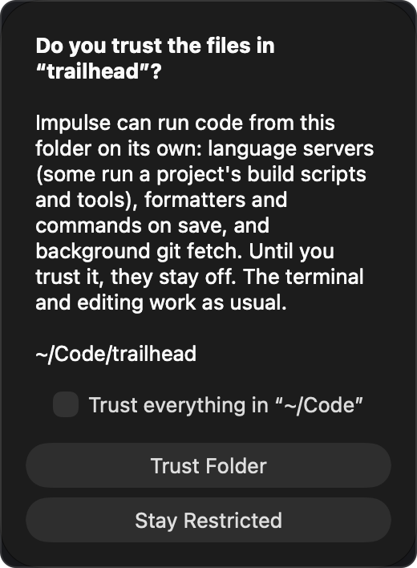

# Getting started

Impulse is a terminal with an editor, git tools and coding-agent support built around it. This page covers installing it, what you see the first time it opens, how to open a project, and how workspace trust decides what Impulse may run on its own.

## Install

1. Download `Impulse-X.Y.Z.dmg` from [GitHub Releases](https://github.com/dowilcox/impulse/releases).
2. Open the disk image and drag **Impulse.app** to your **Applications** folder.
3. Open Impulse from Applications, Launchpad or Spotlight.

Impulse needs macOS 26 (Tahoe) or later on an Apple silicon Mac.

### Updates

At launch Impulse asks GitHub whether a newer release exists. When one does, an **Update X.Y.Z** item appears at the right end of the status bar; click it to open the release page, then install the new disk image the same way. To stop the check, turn off **Check for updates on launch** (`check_for_updates`) in Settings ▸ General ▸ Startup.

### Language servers

Code intelligence in the editor comes from language servers, which Impulse starts for you in [trusted folders](#workspace-trust).

- Rust, Python and C/C++ use the `rust-analyzer`, `pyright` and `clangd` on your `PATH`.
- For TypeScript/JavaScript, PHP, HTML, CSS, JSON, Tailwind, Vue, Svelte, GraphQL, YAML, Dockerfile and Bash, run **Install Web LSP Servers** from the [command palette](command-palette.md) (⇧⌘P), or click **Install All** in Settings ▸ Language Servers. This needs Node.js and npm.

See [Editor](editor.md) for what the language servers do.

## First launch

The first time Impulse opens you get one window with one terminal tab. It belongs to the **Scratch** workspace, a place for terminals that aren't tied to a project, and it starts in your home folder (or in the folder set as **Scratch folder**, `scratch_directory`, in Settings ▸ General ▸ Workspaces).

There is nothing to configure before you start typing:

- Shell integration for zsh, bash and fish loads automatically in Impulse terminals. It is what gives you [command blocks](terminal.md) and lets Impulse follow each terminal's current folder.
- The fonts the editor and terminal use (JetBrains Mono and Inter) are copied into `~/Library/Fonts` if they aren't there yet.
- The sidebar is open, with your workspaces above the Files panel. Press ⌘B, or click the sidebar button at the left of the titlebar, to hide or show it.
- Session restore is on: when you quit and open Impulse again, your windows, workspaces, tabs and splits come back. To start fresh each time, turn off **Restore previous session** (`restore_session`) in Settings ▸ General ▸ Startup. See [Session restore](workspaces-and-tabs.md#session-restore).

A few things are off until you turn them on:

| Setting                                                    | Where                                | What it does                                                                                                                |
| ---------------------------------------------------------- | ------------------------------------ | --------------------------------------------------------------------------------------------------------------------------- |
| **Quick terminal** (`quick_terminal_enabled`)              | Settings ▸ General ▸ Quick terminal  | A terminal that drops down over any app on a global shortcut. See [Quick terminal](workspaces-and-tabs.md#quick-terminal).  |
| **Use Impulse as $EDITOR** (`terminal_editor_integration`) | Settings ▸ Terminal ▸ Blocks & input | `git commit` and other tools open files in an Impulse tab. See [Command-line tool](cli.md).                                            |

Settings open as a tab with ⌘, (**Impulse ▸ Settings…**). Every setting is described in [Settings and themes](settings-and-themes.md).

## A tour of the window


From top to bottom, left to right:

### Titlebar

- **Sidebar button** shows and hides the sidebar (⌘B).
- **Workspace name and branch.** The name of the active workspace (`trailhead`) is followed by its git branch (`feature/forecast-cache`) and, when your branch is ahead of or behind its upstream, counts such as `↑2 ↓1`. Click the name to switch workspaces (⌃⌘O) and the branch to switch branches (⌃⌘B); both open the [command palette](command-palette.md). When the branch has a GitHub pull request (found with the GitHub CLI, `gh`), a chip with its number and check status follows; click it to open the pull request in your browser.
- **Tabs.** The active workspace's tabs, with a **+** button for a new terminal tab (⌘T). To list them in the sidebar instead, turn on **List tabs in the sidebar** (`sidebar_tabs`) in Settings ▸ General ▸ Sidebar. See [Tabs](workspaces-and-tabs.md#tabs).
- **Agents button.** Appears while a coding agent runs in one of the window's terminals. It shows how many agents are working and how many are waiting for you; click it for the list. See [Agents](agents.md).
- **Search or run a command.** Opens the [command palette](command-palette.md) (⇧⌘P).
- **Changes pill.** When the repository has uncommitted changes, it shows the number of changed files and the lines added and removed. Click it to open [Review](review.md) (⇧⌘G).

Double-clicking empty space in the titlebar zooms or minimizes the window, following your macOS setting.

### Sidebar

The sidebar has two parts:

- **Workspaces** at the top: one row per open folder plus Scratch, with each row's branch, changes, ports and agent status. Worktrees of the same repository are grouped together. See [Workspaces](workspaces-and-tabs.md#workspaces).
- **Files, Changes and Search** below it, switched with the three buttons in its header:
  - **Files** (⇧⌘E): the file tree with git status. See [Files panel](workspaces-and-tabs.md#files-panel).
  - **Changes** (⌃⇧G): staging and committing. See [Git](git.md).
  - **Search** (⇧⌘F): find text and file names in the project. See [Search panel](workspaces-and-tabs.md#search-panel).

### Center

The selected tab fills the center: a terminal, an editor, Review, History, Settings and so on. A tab can be split into panes that show several of these side by side. See [Split panes](workspaces-and-tabs.md#split-panes).

### Input bar

Under the focused terminal is the input bar, where you type commands in a multi-line editor with shell highlighting, history and completions. A row of chips above it shows the shell, the folder, the branch, pending changes and the last command's exit status. While a full-screen program or an agent's interface owns the terminal, the input bar steps aside and your keys go straight to the program. See [Terminal](terminal.md).

### Status bar

Along the bottom: the branch, pending changes, Problems, ports that programs in the workspace listen on, and the folder on the left; editor position, language and shell on the right. Most items can be clicked. See [Status bar](workspaces-and-tabs.md#status-bar).

### Notices

Short messages, such as the notice after you close a tab, appear at the bottom center of the window, some with a button such as **Undo**. If `settings.json` can't be read, a banner under the titlebar says so and offers **Open Settings File**.

## Open a project

Impulse works in **workspaces**: a folder you open gets its own tabs, file tree and git state, and a row in the sidebar. Opening a folder that is already open in the window switches to it.

### From Impulse

- **File ▸ Open Folder as Workspace…**, then choose the folder and click **Open Workspace**.
- **File ▸ Open…** (⌘O) accepts a file or a folder: a file opens in an editor tab, a folder opens as a workspace.
- Press ⌃⌘O (**File ▸ Switch Workspace…**) to open the palette's workspace list. It shows open workspaces, then folders you opened recently (marked `recent`), then **Open Folder as Workspace…**.
- Hover over a workspace row in the sidebar, click its **+**, and choose **Open Folder as Workspace…**.

When the window holds nothing but its untouched first terminal, the folder replaces it, so you don't end up with an empty Scratch workspace beside your project.

### From an Impulse terminal

Inside any Impulse terminal the `impulse` command-line tool is on your `PATH`:

```sh
cd ~/Code/trailhead
impulse open .            # open the folder as a workspace
impulse open src/server.ts:42   # open a file at a line
```

It only works in terminals that Impulse started. See [Command-line tool](cli.md) for every command.

### From Finder

Control-click a folder in Finder and choose **Services ▸ New Impulse Workspace Here**. Impulse comes forward and opens the folder as a workspace in its front window. Select several folders to open each one.

Impulse is also listed as an editor for source files, so you can choose it in a file's **Open With** menu; the file opens in an editor tab.

### What a folder workspace changes

In a folder workspace:

- The file tree stays on the folder, whatever folder the terminal `cd`s into.
- The titlebar, status bar and Changes panel show the folder's repository.
- New terminals (⌘T) start in the folder.

In Scratch, the file tree and git state follow the active tab instead: the terminal's current folder, or the folder of the file you're editing. More in [Workspaces, tabs and panes](workspaces-and-tabs.md).

## Workspace trust

Some things Impulse does without being asked can run code from the project itself:

- **Language servers.** Some run the project's build scripts and tools (`rust-analyzer` runs `build.rs`; ESLint loads the project's config and plugins).
- **Formatters and commands on save**, which load project configuration.
- **Background fetch**, which follows the repository's own git configuration (ssh commands, credential helpers).

So these only run in folders you trust. Everything you run yourself, such as terminals, editing and git actions, works the same in every folder.

### The trust prompt

When you open a folder that isn't trusted, Impulse asks:



- **Trust Folder** trusts the folder and everything inside it. Language servers start for its open files right away.
- **Stay Restricted** keeps it restricted. Impulse doesn't ask again about that folder until you quit.
- **Trust everything in “~/Code”** (when shown) trusts the parent folder instead, so every project you keep there is trusted at once. It isn't offered when the parent is your home folder, `/`, `/Users` or `/Volumes`.

Workspaces brought back by session restore don't ask; they show as restricted until you trust them. A [task worktree](tasks.md) created from a trusted repository is trusted with it.

### Restricted mode

While the active folder workspace isn't trusted, the status bar shows **Restricted** at its left end. Hover over it for a reminder of what's off, and click it to bring up the trust prompt.


In Scratch, trust applies file by file: a file belongs to its repository's folder, or to its own folder outside a repository. When you open a file whose language server is off for that reason, a notice says so and offers **Trust…**.

### Changing your mind

These commands are in the [command palette](command-palette.md):

| Command                    | What it does                                                                                                                                                                                                                                                 |
| -------------------------- | ------------------------------------------------------------------------------------------------------------------------------------------------------------------------------------------------------------------------------------------------------------ |
| **Trust This Folder…**     | Shows the trust prompt for the active folder workspace, or for the open file's repository or folder in Scratch.                                                                                                                                              |
| **Restrict This Folder**   | Stops trusting the folder and anything trusted inside it; its language servers stop, and its repositories' trusted `.impulse/project.toml` files are forgotten. If the folder is trusted because a parent folder is, a notice offers to restrict the parent. |
| **Forget Trusted Folders** | Restricts every folder until you trust it again, and forgets every trusted `.impulse/project.toml` (see [Project configuration](project-config.md#trusting-the-project-file)).                                                                               |

### Turning trust off

Turn off **Ask before trusting folders** (`workspace_trust`) in Settings ▸ General ▸ Workspaces to treat every folder as trusted and never be asked.

Project actions and task setup scripts from `.impulse/project.toml` have a separate confirmation: Impulse lists the commands in the file and asks before running them the first time, and again whenever the file changes. See [Project configuration](project-config.md).

## Where Impulse keeps its files

Impulse keeps its data in `~/Library/Application Support/impulse/`:

| File or folder         | What it holds                                                                                                                                                                      |
| ---------------------- | ---------------------------------------------------------------------------------------------------------------------------------------------------------------------------------- |
| `settings.json`        | Your settings. Edit it with **Open settings.json** in the palette; changes made outside Impulse are picked up automatically. See [Settings and themes](settings-and-themes.md). |
| `session-state.json`   | Windows, workspaces, tabs and splits from the last session.                                                                                                                        |
| `scrollback/`          | Each restored terminal's saved output.                                                                                                                                             |
| `trusted-folders.json` | The folders you trust.                                                                                                                                                             |
| `history.sqlite3`      | Command history from the input bar.                                                                                                                                                |
| `themes/`              | Your own themes.                                                                                                                                                                   |

## Next steps

- Learn the window: [Workspaces, tabs and panes](workspaces-and-tabs.md).
- Get around by keyboard: [Command palette](command-palette.md) and [Keyboard shortcuts](keyboard-shortcuts.md).
- Work in the terminal: [Terminal](terminal.md).
- Run coding agents: [Agents](agents.md), and parallel work in [Tasks](tasks.md).
- Commit and review: [Git](git.md) and [Review](review.md).

## Related

- [Workspaces, tabs and panes](workspaces-and-tabs.md)
- [Command palette](command-palette.md)
- [Settings and themes](settings-and-themes.md)
- [Command-line tool](cli.md)
- [Project configuration](project-config.md)
- [Accessibility](accessibility.md)
