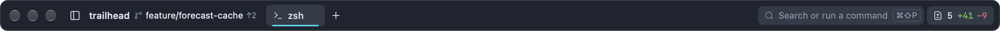
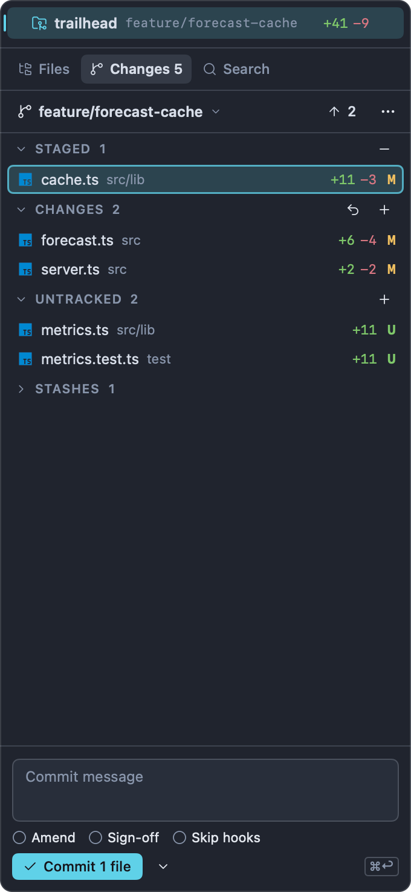
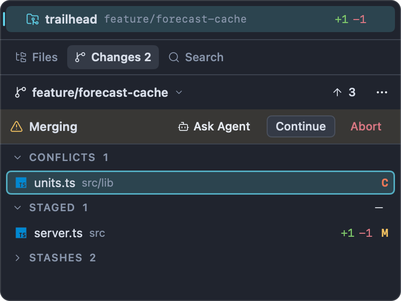
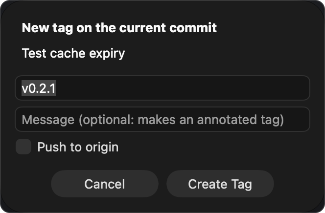

# Git

Impulse has git built into the window: a Changes panel for staging and committing, branch switching and management, stashes, fetch/pull/push, merge-conflict resolution and tags. Impulse uses git alone, so all of it works the same whichever host your repository is on (GitHub, GitLab, your own server); it never talks to a host's website or tools. This page covers all of it except reviewing diffs, which has its own page ([Review](review.md)), and browsing commits ([History](history.md)).

## How Impulse works with git

Impulse reads repository state (status, diffs, blame, log) with a built-in copy of libgit2, and makes every change by running the `git` on your `PATH`. That means anything you do from Impulse behaves the way it would in a terminal:

- Your hooks run (unless you ask to skip them when committing).
- Commits are signed if your git configuration says so (`commit.gpgsign`).
- Credential helpers, your SSH agent, LFS and other clean/smudge filters all apply.

Git itself must be installed (Homebrew or the Xcode Command Line Tools). If it isn't, git actions fail with a message saying so.

Impulse doesn't open a password prompt of its own for remote operations, and git can't ask in a terminal from there. If a fetch, pull or push needs credentials that your credential helper or SSH agent can't supply, the action fails with "Git couldn't authenticate with the remote. Run the command in a terminal to sign in." Run the same command once in a terminal and sign in there; once your credential helper or SSH agent holds the credentials, Impulse uses them too.

When a git action fails, Impulse shows a sheet with a plain-English explanation and git's own output underneath.

## Which repository Impulse uses

Every window has one active repository at a time. It's what the Changes panel, the branch in the titlebar, the Git menu and the commands in this page act on.

- **In a folder workspace**, the active repository is the one containing the workspace's folder, whatever tab you're in. A task worktree (for example `~/Code/trailhead.worktrees/fix-elevation`) is its own checkout, so its workspace works on that worktree's branch and changes. See [Tasks](tasks.md).
- **In the Scratch workspace**, the repository follows the active tab: the terminal's current directory, or the folder of the file in the active editor. Change directory into another repository in a Scratch terminal and the Changes panel follows.

Impulse watches the repository and updates live as files change, as you or an agent run git in a terminal, and as refs move.

If the active folder isn't inside a repository, the Changes panel says "Not a git repository" and git commands show "Not in a git repository."

## Where git shows up in the window



- **Titlebar breadcrumb.** After the workspace name comes the branch, with `↑2` / `↓1` when the branch is ahead of or behind its upstream. Click the branch to switch branches.
- **Changed-files pill.** At the right of the titlebar, the number of changed files and the lines added and removed. Click it to open [Review](review.md).
- **Status bar.** The branch (click to switch) and the same change count (click to review). See [Workspaces and tabs](workspaces-and-tabs.md) for the rest of the status bar.
- **Terminal context bar.** Below a terminal, chips for the branch and the changes, with the same actions. See [Terminal](terminal.md).
- **File tree.** Files and folders are colored by their git status.
- **Changes panel.** In the left dock, described next.

## The Changes panel

The Changes panel is the left-dock panel for staging, committing and the everyday git commands. Show it with **Git ▸ Show Changes** (⌃⇧G), or click **Changes** at the top of the left dock (it reads "Changes 3" when three files have changed). Pressing ⌃⇧G again while the panel has the keyboard takes you back to the tab you were working in.



### The header

From left to right:

- **The branch.** Click it to switch branches (the same as ⌃⌘B). In a detached HEAD it reads "detached at" and the short commit ID.
- **Sync button.** What it shows depends on the branch:
  - **Publish** when the branch has no upstream yet. It pushes the branch and sets it to track the remote branch.
  - **↓ 3** and/or **↑ 2** when the branch is behind or ahead of its upstream. Click the down arrow to pull and the up arrow to push.
  - A refresh icon when the branch is in sync. Click it to fetch.
- **⋯ (More git actions).** A menu with **Fetch**, **Fetch All Remotes**, **Pull**, **Pull (Rebase)**, **Push**, **Force Push (With Lease)…**, **Create Tag…**, **Push All Tags**, **Stage All Changes**, **Unstage All Changes**, **Stash All Changes**, **Pop Latest Stash**, **Undo Last Commit**, **Review Uncommitted Changes** and **Refresh**.

While a remote operation runs, a line under the header shows its progress, using git's own progress output ("Receiving objects: 45%…").

During a merge, rebase, cherry-pick or revert, a banner appears under the header. See [Merge conflicts](#merge-conflicts).

### Sections

| Section   | What's in it                                                                                                                                                                  | Section buttons                                    |
| --------- | ----------------------------------------------------------------------------------------------------------------------------------------------------------------------------- | -------------------------------------------------- |
| Conflicts | Files with unresolved merge conflicts. Shown only during a conflicted operation.                                                                                              | none                                               |
| Staged    | Changes in the index: what the next commit contains.                                                                                                                          | **−** Unstage All                                  |
| Changes   | Tracked files changed in the working tree but not staged.                                                                                                                     | **↶** Discard All Changes, **+** Stage All Changes |
| Untracked | New files git doesn't track yet (ignored files aren't listed). Large folders of untracked files are cut off at 2,000 entries; the header then reads "Untracked (first 2000)". | **+** Stage All Untracked                          |
| Stashes   | Your stashes. Collapsed until you open it.                                                                                                                                    | none                                               |

Click a section header to collapse or expand it. When there's nothing to commit, the panel shows "No changes" and "Working tree clean on" the branch.

Each file row shows the file name, its folder, the lines added and removed (or "bin" for a binary file) and a status letter:

| Letter | Meaning                                            |
| ------ | -------------------------------------------------- |
| `M`    | Modified                                           |
| `A`    | Added                                              |
| `D`    | Deleted (the name is struck through)               |
| `R`    | Renamed (hover to see the old path)                |
| `T`    | Type changed (for example a file became a symlink) |
| `U`    | Untracked                                          |
| `C`    | Conflicted                                         |

Note that `U` means untracked here, not "unmerged" as in `git status --short`.

### Working with files

- **Click** a file to open [Review](review.md) scrolled to it: the Unstaged scope for a file under Changes or Untracked, Staged for a staged file, and All uncommitted for a conflicted one.
- **Double-click** a file to open it in the editor.
- **Hover** a row for its buttons:
  - Every row: **Open File**.
  - Staged: **Unstage**.
  - Changes and Untracked: **Discard Changes** and **Stage**.
  - Conflicts: **Keep Current (HEAD) for the whole file**, **Take Incoming for the whole file** and **Mark Resolved**.
- **Right-click** a row for its context menu:

| Item                                                                                     | Where                                                                                                                                                                                     |
| ---------------------------------------------------------------------------------------- | ----------------------------------------------------------------------------------------------------------------------------------------------------------------------------------------- |
| Open Changes                                                                             | Every row. Opens Review at the file.                                                                                                                                                      |
| Open in Diff Editor                                                                      | Changes and Untracked (not deleted files). Opens the file in the editor's side-by-side diff view, where you can edit the working copy beside the staged version. See [Editor](editor.md). |
| Open File                                                                                | Every row.                                                                                                                                                                                |
| Unstage                                                                                  | Staged.                                                                                                                                                                                   |
| Discard Staged and Unstaged Changes…                                                     | Staged. Puts the file back to the last commit.                                                                                                                                            |
| Stage                                                                                    | Changes, Untracked.                                                                                                                                                                       |
| Discard Changes…                                                                         | Changes, Untracked.                                                                                                                                                                       |
| Open to Resolve, Keep Current (HEAD), Take Incoming, Mark Resolved, Ask Agent to Resolve | Conflicts. See [Merge conflicts](#merge-conflicts).                                                                                                                                       |
| Copy Path                                                                                | Every row. Copies the repository-relative path.                                                                                                                                           |
| Reveal in Finder                                                                         | Every row.                                                                                                                                                                                |

### Using the panel from the keyboard

When the panel has the keyboard (⌃⇧G puts it there and selects the first file), you can stage and review without the mouse:

| Key   | Action                                                                                                                               |
| ----- | ------------------------------------------------------------------------------------------------------------------------------------ |
| ↑ / ↓ | Move through the files (collapsed sections are skipped).                                                                             |
| Space | Stage the file, or unstage it if it's staged. On a conflicted file, mark it resolved.                                                |
| ↩     | Open the file's changes in Review.                                                                                                   |
| ⌥↩    | Open the file in the editor's diff view (Changes and Untracked only).                                                                |
| ⌘↩    | Open the file in the editor.                                                                                                         |
| ⌫     | Discard the file's changes (asks first). On a staged file, discards staged and unstaged changes. Not available for conflicted files. |
| Esc   | Give the keyboard back to the terminal.                                                                                              |
| ⌃⇧G   | Go back to the tab you were working in.                                                                                              |

### Discarding changes

Discarding asks first ("Discard changes to “forecast.ts”?") and then:

- Reverts tracked files to their staged version (or to the last commit, for **Discard Staged and Unstaged Changes…**).
- Moves untracked files to the Trash rather than deleting them.
- Records a [safety snapshot](#safety-snapshots-and-undo) first, and shows a toast with **Undo** for about 10 seconds. Undo puts the files back exactly as they were.

Open editors reload the files they show, so you never keep editing the discarded version.

## Committing

### The commit composer

The commit composer sits at the bottom of the Changes panel.

1. Stage what you want to commit: hover a file and click **+**, press Space on it, or stage individual hunks and lines in [Review](review.md#staging-unstaging-and-reverting).
2. Type the message in the **Commit message** field. The first line is the subject; a counter at the top right shows its length and turns yellow past 50 characters and red past 72.
3. Click the commit button, or press ⌘↩.

The button says what will happen: "Commit 2 files", "Commit 2 files & Push", or "Amend". When the commit is made, a toast shows its short ID ("Committed 4e1b9c2") with an **Uncommit** button for a few seconds.

Other things the composer does:

- **Message history.** In an empty field, ↑ brings back your previous commit messages for this repository (the last 25), and ↓ goes forward again. Once you edit a recalled message, the arrows move the cursor as usual.
- **Amend.** Turn on **Amend** to change the last commit. The field fills with the last commit's message for you to edit; staged changes are added to the commit. If you clear the field, the existing message is kept. You can amend with nothing staged to reword the message only.
- **Sign-off.** Adds a `Signed-off-by:` trailer (`git commit --signoff`). This is not cryptographic signing; signing follows your git configuration.
- **Skip hooks.** Runs `git commit --no-verify`, so pre-commit and commit-msg hooks don't run. If a hook rejects a commit, the error sheet shows the hook's output.
- **The chevron menu** next to the button: **Commit**, **Commit & Push**, and **Amend Last Commit** (amends right away, keeping the last message unless you've typed a new one).

**Amend** turns itself off after each commit. **Sign-off** and **Skip hooks** stay as you set them while the panel is open, but they aren't saved settings: check them before committing.

### What gets committed

- Only staged changes are committed.
- If nothing is staged but tracked files have changed, Impulse asks: "Commit all 3 changed tracked files? Untracked files aren't included." Click **Commit All** to stage and commit them in one step (`git commit --all`). New files are never added without you staging them.
- If nothing has changed at all, a toast says "Stage the files you want to commit first."

### Commit and push in one step

Turn on **Commit and push** in Settings ▸ Git (`git_commit_and_push`) to make the commit button and ⌘↩ push right after committing. Either way, ⇧⌘↩ does the other one: with the setting off, ⇧⌘↩ commits and pushes; with it on, ⇧⌘↩ only commits. (⇧⌘↩ is also **View ▸ Zoom Pane**; while the commit message field has the keyboard, it commits instead.)

Amending never pushes by default, because pushing a rewritten commit would need a force push. Use **Commit & Push** from the chevron menu if you really mean it.

If the branch hasn't been published yet, the push publishes it (see [Push and publish](#push-and-publish)).

### Undoing a commit

- Right after committing, click **Uncommit** in the toast.
- Any time later, choose **Git ▸ Undo Last Commit** (also in the panel's ⋯ menu and the command palette). The commit is removed (`git reset --soft HEAD~1`) and its changes stay staged. A toast offers **Redo** for about 15 seconds.
- If the commit is already on the upstream, Impulse asks first ("Undo a pushed commit?"), because the next push would then have to be a force push.

## Branches

### Switching branches

Open the branch switcher in any of these ways:

- Press ⌃⌘B, or choose **Git ▸ Switch Branch…**.
- Click the branch in the titlebar, the status bar, the terminal context bar or the Changes panel header.
- Type `b:` in the [command palette](command-palette.md).


The list shows local branches first (the current one on top, marked "current", then the most recently committed), followed by remote branches that don't have a local branch yet (with a globe icon, marked "remote"). Type to filter, then press ↩:

- **A local branch** is checked out with `git switch`.
- **A remote branch** such as `origin/trail-search` creates a local `trail-search` that tracks it, and switches to it.
- **A new name.** If what you typed isn't an existing branch, the last row reads "Create branch “trail-photos”" with "from" and the current branch. Choose it to create the branch at the current commit and switch to it.

If switching would overwrite uncommitted changes, Impulse asks "Your changes would be overwritten" and offers **Stash & Switch**. That stashes everything (untracked files included), switches, and shows a toast with **Pop Stash** so you can bring the changes over to the new branch.

### Managing branches

**Git ▸ Manage Branches…** (also in the command palette) opens a sheet listing every local branch.


Each row shows:

- The branch name. The current branch has a filled circle instead of the branch icon.
- Badges:

  | Badge         | Meaning                                                                                                                                                             |
  | ------------- | ------------------------------------------------------------------------------------------------------------------------------------------------------------------- |
  | merged        | Every commit on the branch is already in the default branch, so it's safe to delete. The sheet's title says which branch that is ("merged means merged into main"). |
  | stale         | No commits for more than 30 days (never shown on the current branch).                                                                                               |
  | upstream gone | The branch tracked a remote branch that has since been deleted.                                                                                                     |

- A line with its upstream ("→ origin/feature/forecast-cache", or "not published"), how far it is ahead (`↑2`) or behind (`↓1`), when it last changed, and the subject of its last commit.
- **Switch**, for every branch except the current one.
- **⋯**, a menu with:

  | Item                        | What it does                                                                                                                                                                                                                                                               |
  | --------------------------- | -------------------------------------------------------------------------------------------------------------------------------------------------------------------------------------------------------------------------------------------------------------------------- |
  | Merge into main             | Merges the branch into the current branch (named in the item). See [Merging and rebasing](#merging-and-rebasing). Not on the current branch.                                                                                                                               |
  | Rebase main onto This       | Rebases the current branch onto this branch. Not on the current branch.                                                                                                                                                                                                    |
  | Compare with Current Branch | Opens [Review](review.md) showing what the current branch (uncommitted work included) changed since it split from this branch. Not on the current branch.                                                                                                                  |
  | Show History                | Opens [History](history.md) on that branch's commits.                                                                                                                                                                                                                      |
  | Rename…                     | Asks for a new name and renames the branch.                                                                                                                                                                                                                                |
  | Publish to origin           | Pushes the branch and sets it as the upstream. The item names the remote: the branch's configured remote, else `origin`, else the only remote there is (the same rule as [Push](#push-and-publish)). Only for branches without an upstream, in a repository with a remote. |
  | Delete…                     | Deletes the branch. Disabled for the current branch.                                                                                                                                                                                                                       |

Type in **Filter** to narrow the list by name. Click **Done** (or press ↩) to close the sheet. Switching, comparing, merging, rebasing and showing history close the sheet first; renaming, publishing and deleting keep it open so you can tidy several branches in a row.

Deleting a branch happens straight away when git considers it fully merged (`git branch -d`). When it doesn't, Impulse asks first ("trail-search isn't merged", with the branch its commits aren't in yet) and deletes it anyway only if you click **Delete**. Either way, a toast offers **Undo** for about 15 seconds, which recreates the branch at the same commit.

### Detached HEAD

When you check out a commit rather than a branch (for example with **Check Out (Detached)** in History), the titlebar shows the short commit ID instead of a branch name, and the Changes panel reads "detached at" and the ID. Switch to a branch to get back.

## Stashes

A stash saves your uncommitted changes and cleans the working tree, so you can switch to something else and come back.

- **Stash All Changes** (Git menu, the panel's ⋯ menu, or the palette) stashes everything, untracked files included, and shows "Stashed your changes".
- **Pop Latest Stash** applies the newest stash and removes it from the list. What was staged when you stashed comes back staged, when that still applies cleanly. A toast offers **Undo** for about 10 seconds, which puts the files back as they were before the pop and stores the stash again. With no stashes, a toast says "There are no stashes."
- **The Stashes section** of the Changes panel lists every stash by message, with its `stash@{n}` name. Hover a stash for:
  - **Apply**: apply it and keep it in the list.
  - **Pop**: apply it and remove it (with Undo, as above).
  - **Drop**: delete it without applying. There's no confirmation; instead the toast offers **Undo** for about 15 seconds, which stores it again.
- **Click a stash** to see what's in it, in [Review](review.md) with the stash scope.

## Fetch, pull and push

All of these are in the **Git** menu, the Changes panel's ⋯ menu and the command palette. None has a shortcut by default; Fetch, Pull and Push can be given one in Keyboard Shortcuts (see [Settings and themes](settings-and-themes.md)).

### Fetch

- **Fetch** runs `git fetch --prune` for the current branch's remote. Remote-tracking branches whose branch was deleted on the server are removed.
- **Fetch All Remotes** does the same for every remote (`--all`), for example `origin` and an `upstream`.

The toast says what came in for your branch: "Fetched: 2 commits to pull" or "Fetched: nothing new for this branch".

### Pull

**Pull** brings in the upstream's commits using the strategy set in Settings ▸ Git ▸ **When pulling** (`git_pull_mode`):

| Setting             | Label                | What happens                                                                                                                                                                                            |
| ------------------- | -------------------- | ------------------------------------------------------------------------------------------------------------------------------------------------------------------------------------------------------- |
| `ff-only` (default) | Fast-forward only    | Moves your branch forward only when it hasn't diverged. Never makes a merge commit. If your branch and the upstream have both moved, the pull stops with "Your branch and its upstream have diverged…". |
| `rebase`            | Rebase local commits | Replays your local commits on top of the upstream.                                                                                                                                                      |
| `merge`             | Merge                | Merges the upstream in, with a merge commit when they diverged.                                                                                                                                         |

**Pull (Rebase)** always rebases, whatever the setting.

The toast says "Pulled 3 commits" or "Already up to date". A pull that rebases or merges records a [safety snapshot](#safety-snapshots-and-undo) first, and its toast offers **Undo** for about 15 seconds, which moves your branch back to where it was and restores the working tree. If a pull stops with conflicts, see [Merge conflicts](#merge-conflicts).

### Push and publish

**Push** pushes the current branch to its upstream. If the remote has commits you don't have, it fails with "The remote has commits you don't have. Pull before pushing."

If the branch has no upstream yet, Push publishes it: it pushes to the branch's configured remote (or `origin`, or the only remote there is) and sets the upstream, then says "Published feature/forecast-cache to origin". The **Publish** button in the Changes panel does the same, and so does **Publish to …** in the [Branch Manager](#managing-branches). Tags are pushed to, and deleted from, the current branch's remote chosen the same way.

With **Push annotated tags with commits** on (`git_push_follow_tags`), Push uses `git push --follow-tags`, so annotated tags on the commits you push go along with them.

When the server sends a message back during a push (git prints these as `remote:` lines), the toast shows it under "Pushed" or "Published …", with **Open Link** when it has a web address in it. Many hosts use this to offer a link for opening a merge request or pull request for the branch, for example "origin: To create a merge request for fix-elevation, visit:". Click **Open Link** to open it in your browser. Impulse shows what the server said without knowing which host it is.

### Force push with lease

After rewriting commits you've already pushed (a rebase, an amend), a normal push is refused. **Force Push (With Lease)…** replaces the upstream branch with yours.

1. Choose **Git ▸ Force Push (With Lease)…**.
2. Read the confirmation: it names the upstream that will be replaced and warns that commits only it has are dropped.
3. Click **Force Push**.

Impulse uses `--force-with-lease --force-if-includes`: the push stops if someone else pushed to the branch since your last fetch, and also if you fetched their commits but haven't looked at or integrated them yet (which matters when background fetch keeps your remote-tracking branches current behind your back).

### Background fetch

**Fetch in the background** (Settings ▸ Git, `git_auto_fetch_minutes`) fetches the repositories open in your windows every few minutes, so the ahead/behind counts, the sync button and [History](history.md)'s incoming-commit markers stay current without you pressing Fetch. It's off (`0`) by default; set it to up to 120 minutes (Settings moves in steps of 5).

Background fetches:

- Only run in folders you trust. Fetching follows the repository's own configuration (SSH commands, credential helpers), so a folder you haven't trusted is never fetched in the background. See [Getting started](getting-started.md) for workspace trust.
- Only fetch repositories whose current branch has an upstream.
- Never ask for credentials and never show errors. If one fails, nothing happens.
- Skip a repository while another git operation is running in it.
- Count any fetch or pull you do yourself, so the interval starts over.

### The remote's address

**Open Repository in Browser** turns the current branch's remote (or `origin`, or the only remote there is) into a web address and opens it: `git@git.example.edu:web/trailhead.git` becomes `https://git.example.edu/web/trailhead`. Impulse doesn't know which host that is, so it opens the repository's front page, not a particular branch or commit. If the remote is a local path, a toast says it isn't a web address; if there's no remote, a toast says so.

**Copy Remote URL** copies the remote's address as git has it, for example to clone the repository somewhere else.

## Merging and rebasing

You can merge or rebase from the Branch Manager (**Merge into main**, **Rebase main onto This**) and from [History](history.md#commit-actions) (on any commit, branch or tag).

- **Merge** runs `git merge --no-edit`: a fast-forward when possible, otherwise a merge commit with git's default message.
- **Rebase** runs `git rebase`, replaying the current branch's own commits on top of the other branch or commit.

Both record a [safety snapshot](#safety-snapshots-and-undo) first. When they finish, the toast ("Merged feature/forecast-cache into main", "Rebased feature/forecast-cache onto main") offers **Undo** for about 15 seconds, which puts the branch and working tree back as they were. If there was nothing to do, the toast says so ("main already has feature/forecast-cache").

If a merge or rebase stops with conflicts, an error sheet says so and the Changes panel shows the operation banner. Continue from [Merge conflicts](#merge-conflicts).

## Safety snapshots and Undo

Before an action that could throw work away, Impulse records your working tree (including untracked files that aren't ignored) and your index as a commit under a private ref, `refs/impulse/oplog/<time>-<what>`. That snapshot is what the **Undo** button in the action's toast restores.

- The refs live outside `refs/heads` and `refs/tags`, so a normal `git push` never sends them (only `git push --mirror` would).
- If the snapshot can't be made (an unreadable file, an LFS filter that isn't installed), actions that discard work don't run at all, and the error starts "Nothing was changed: Impulse couldn't save a safety snapshot to undo it with."
- Undoing an action that moved your branch first snapshots the current state too, so edits you made since aren't lost without a record.

| Action                                                    | Safety snapshot                 | What the toast offers              |
| --------------------------------------------------------- | ------------------------------- | ---------------------------------- |
| Discard changes to files (Changes panel, Review)          | Yes, required                   | Undo                               |
| Revert a hunk or lines (Review)                           | Yes, required                   | Undo                               |
| Keep Current (HEAD) / Take Incoming for a conflicted file | Yes, required                   | Undo                               |
| Pull with rebase or merge                                 | Yes                             | Undo                               |
| Merge, Rebase                                             | Yes                             | Undo                               |
| Reset (History)                                           | Yes (required for a hard reset) | Undo                               |
| Cherry-pick, Revert (History)                             | Yes                             | Undo                               |
| Pop a stash                                               | Yes                             | Undo                               |
| Abort a merge, cherry-pick or revert                      | Yes                             | Undo                               |
| Drop a stash                                              | The stash commit is kept        | Undo                               |
| Delete a branch                                           | The branch's commit is kept     | Undo                               |
| Create, move or delete a tag                              | The tag's target is kept        | Undo (not after pushing a new tag) |
| Commit                                                    | —                               | Uncommit                           |
| Undo Last Commit                                          | —                               | Redo                               |
| Switch branch with Stash & Switch                         | The changes are in the stash    | Pop Stash                          |

Each toast's Undo lasts about 10 to 15 seconds. After that, the snapshots are still in the repository: Impulse keeps the newest 200 for up to two weeks, and deletes older ones whenever it takes a new snapshot. To dig one out by hand:

```bash
git for-each-ref --sort=-creatordate refs/impulse/oplog
git restore --source=refs/impulse/oplog/1767225600123-discard-forecast-ts -- src/forecast.ts
```

Two other folders under `refs/impulse/` hold the agent-turn checkpoints (`refs/impulse/checkpoints/`, see [Agents](agents.md)) and your "reviewed up to here" marks (`refs/impulse/reviews/`, see [Review](review.md#marking-files-viewed)). Checkpoints are pruned the same way as snapshots each time an agent turn or `impulse checkpoint` records one; the last 20 review marks are kept.

## Merge conflicts

When a merge, rebase, cherry-pick, revert or pull stops with conflicts, the Changes panel shows:

- A banner under the header naming the operation ("Merging", "Rebasing 2/5", "Cherry-picking", "Reverting", "Applying patches", "Bisecting"), with **Ask Agent**, **Continue**, **Skip** (rebase, cherry-pick, revert and `git am` only) and **Abort**.
- A **Conflicts** section listing the conflicted files, each marked `C`.



### Resolving conflicts

1. Click a conflicted file to see its changes in Review, or right-click it and choose **Open to Resolve** to open it in the editor.
2. In the editor, each conflict block is tinted, with a bar above it:
   - **Accept Current** keeps your side (between `<<<<<<<` and `=======`).
   - **Accept Incoming** takes the other side.
   - **Accept Both** keeps your side followed by the incoming one.
   - The bar names both sides (for example "HEAD ⟷ units-precision") and, when there are several conflicts, shows "1 of 3" with **↑** / **↓** to move between them.

   Or edit the file by hand. Each choice is a normal edit you can undo with ⌘Z.

3. When the last conflict marker is gone, a toast says "No conflicts left in units.ts." with **Save & Mark Resolved**. Click it to save the file and stage it.
4. Repeat for the other files, then click **Continue** in the banner.

To resolve a whole file in one step instead, hover it in the Conflicts section and click **Keep Current (HEAD) for the whole file** or **Take Incoming for the whole file** (or use the context menu). This takes one side for every conflict in the file and marks it resolved. A safety snapshot is taken first, and the toast ("Took incoming in units.ts") offers **Undo** for about 15 seconds, which puts the file back in conflict, with any edits you had made to it. Undo only works while the merge (or rebase, cherry-pick or revert) is still where it was: once you've committed, continued, skipped or aborted, it leaves the file resolved and says the operation is no longer in progress or has moved on.

To mark a file resolved after editing it yourself, click **Mark Resolved** (or select it and press Space). This stages the file.

During a rebase, "current" (HEAD) is the branch you're rebasing onto plus the commits replayed so far, and "incoming" is your commit being replayed. This is git's own meaning of the two sides, and it's the reverse of what you might expect.

**Abort** asks first ("Abort merging?"), then puts your files back as they were before the operation started:

1. Impulse saves everything as it is now in a [safety snapshot](#safety-snapshots-and-undo).
2. It runs `git merge --abort` (or `git cherry-pick --abort`, `git revert --abort`).
3. If git refuses, which it does once you've edited a file the merge had already changed ("Entry 'link.tsx' not uptodate. Cannot merge."), Impulse resets to the commit you were on and puts back the uncommitted work you had before the merge. When the merge started while Impulse was open (including one an agent started in a terminal), Impulse noted that work at that moment, so it brings back exactly that. Otherwise it keeps every changed file the merge doesn't touch, which can include edits you made while resolving; the toast says so.

The toast ("Aborted merging") offers **Undo** for 15 seconds. For a merge, Undo starts the merge again, so its conflicts are back, and puts every file back as it was when you chose Abort. For a cherry-pick or revert, Undo puts the files back without restarting it. A rebase uses `git rebase --abort`, which doesn't refuse this way. For a bisect, **Abort** runs `git bisect reset`; drive the bisect itself from the terminal.

### Handing conflicts to an agent

If a coding agent is running in one of your terminals, it can resolve the conflicts for you.

- **Ask Agent** in the banner sends every conflicted file.
- **Ask Agent to Resolve** in a conflicted file's context menu sends that file.

Both list the running agents by agent and tab ("Claude Code · trailhead"), plus **Copy as Prompt**. The prompt contains each file's conflict blocks and what operation is in progress. Impulse types it into the agent's prompt without pressing Return, so you can read it and add to it first; if the agent is in the middle of a turn, it's queued and sent when the turn ends. When the agent is done, check its edits, mark the files resolved and click **Continue**.

If no conflict markers are left in the files, a toast says "No conflict markers left. Mark the files resolved." See [Agents](agents.md) for more on sending things to agents.

## Tags

### Creating a tag

1. Choose **Git ▸ Create Tag…** (also in the Changes panel's ⋯ menu and the palette) to tag the current commit, or **Create Tag Here…** on any commit in [History](history.md#commit-actions).
2. In the sheet ("New tag on the current commit", with the commit's subject underneath):
   - **Name** starts with a suggestion: your newest version-like tag with its last number bumped. With `v0.2.0` as the newest tag, it suggests `v0.2.1`. Tags with a pre-release suffix such as `v1.0.0-rc1` aren't bumped.
   - **Message** is optional. With a message, the tag is annotated (it records who tagged, when and why); without one, it's a lightweight tag (just a name for the commit).
   - **Push to origin** pushes the tag right away (the checkbox names the remote: the current branch's, else `origin`, else the only one). It starts checked when **Push new tags to the remote** (`git_push_tags_on_create`) is on, and is hidden when the repository has no remote.
3. Click **Create Tag**.



If the tag isn't pushed, the toast ("Tagged v0.2.1") offers **Undo** for about 10 seconds. If it is pushed, the toast says "Tagged and pushed v0.2.1 to origin"; if the push fails, the tag is still created locally.

If a tag with that name already exists, Impulse asks whether to move it to this commit (**Move Tag**). Anyone who already fetched the old tag keeps it.

An invalid name (with spaces, `..`, `~`, `:` and so on) is refused with "“v 1” isn't a valid tag name."

### Pushing and deleting tags

- **Git ▸ Push All Tags** pushes every local tag to the remote (`git push --tags`).
- With **Push annotated tags with commits** on, annotated tags also go along with a normal push.
- In [History](history.md#branch-and-tag-actions), right-click a tag's chip for **Push to origin**, **Merge into main**, **Copy Name**, **Delete Tag** and **Delete from origin…**.
  - **Delete Tag** deletes the local tag, with **Undo** for about 15 seconds (an annotated tag comes back with its message).
  - **Delete from origin…** asks first, and removes the tag from the remote only; your local tag stays. This can't be undone on the remote.

## Pull requests and merge requests

Impulse uses git only, so pull requests (merge requests on GitLab) are opened, reviewed and merged on your host's website. Two things connect the two:

- After a push, the toast shows the server's link for opening a request for the branch, when the host sends one. See [Push and publish](#push-and-publish).
- To try a colleague's branch without disturbing your own work, open it as a task with **File ▸ New Task from Branch…**. See [Tasks](tasks.md#open-a-branch-as-a-task).

## The Git menu

| Item                       | Shortcut | What it does                                                                               |
| -------------------------- | -------- | ------------------------------------------------------------------------------------------ |
| Show Changes               | ⌃⇧G      | Show the Changes panel and give it the keyboard.                                           |
| Review Changes             | ⇧⌘G      | Open [Review](review.md).                                                                  |
| Show Git History           | ⇧⌘H      | Open [History](history.md).                                                                |
| Show History of This File  | ⌃⇧⌘H     | History of the file in the active editor.                                                  |
| Toggle Diff View           | ⌥⌘G      | The active editor's side-by-side diff against the staged version. See [Editor](editor.md). |
| Switch Branch…             | ⌃⌘B      | The branch switcher.                                                                       |
| Manage Branches…           |          | The Branches sheet.                                                                        |
| Fetch                      |          | Fetch the branch's remote.                                                                 |
| Fetch All Remotes          |          | Fetch every remote.                                                                        |
| Pull                       |          | Pull with the **When pulling** setting.                                                    |
| Pull (Rebase)              |          | Pull, rebasing local commits.                                                              |
| Push                       |          | Push, or publish a new branch.                                                             |
| Force Push (With Lease)…   |          | Overwrite the upstream branch, after asking.                                               |
| Create Tag…                |          | Tag the current commit.                                                                    |
| Push All Tags              |          | Push every local tag.                                                                      |
| Stash All Changes          |          | Stash everything, untracked files included.                                                |
| Pop Latest Stash           |          | Apply and remove the newest stash.                                                         |
| Undo Last Commit           |          | Uncommit, keeping the changes staged.                                                      |
| Open Repository in Browser |          | The remote's address as a web page.                                                        |
| Copy Remote URL            |          | Copy the remote's address.                                                                 |

Every item is also a command in the [command palette](command-palette.md) (category Git). The items with a shortcut, plus Manage Branches…, Fetch, Pull, Push and Create Tag…, can have their shortcut set or changed in Keyboard Shortcuts (see [Keyboard shortcuts](keyboard-shortcuts.md)). **Review Last Agent Turn** (⇧⌘I) is in the File menu; see [Agents](agents.md).

## Git settings

These are in Settings ▸ Git, and in `settings.json` under the keys shown. See [Settings and themes](settings-and-themes.md).

| Key                       | Setting                          | Default   | What it does                                                                                                                |
| ------------------------- | -------------------------------- | --------- | --------------------------------------------------------------------------------------------------------------------------- |
| `git_commit_and_push`     | Commit and push                  | Off       | The commit button and ⌘↩ push right after committing; ⇧⌘↩ only commits.                                                     |
| `git_pull_mode`           | When pulling                     | `ff-only` | How **Pull** brings in upstream commits: `ff-only` (Fast-forward only), `rebase` (Rebase local commits) or `merge` (Merge). |
| `git_push_follow_tags`    | Push annotated tags with commits | Off       | Push uses `--follow-tags`.                                                                                                  |
| `git_auto_fetch_minutes`  | Fetch in the background          | `0` (Off) | Minutes between background fetches, 0 to 120.                                                                               |
| `git_push_tags_on_create` | Push new tags to the remote      | Off       | Where the Create Tag sheet's **Push to origin** checkbox starts.                                                            |
| `review_context_lines`    | Context lines                    | `3`       | Unchanged lines shown around each change in [Review](review.md) and [History](history.md), 0 to 100.                        |

Background fetch also depends on **Ask before trusting folders** (`workspace_trust`, in Settings ▸ General): while it's on, only trusted folders are fetched in the background. Turning it off trusts every folder.

## Related

- [Review](review.md): read and stage diffs, comment, and send comments to agents
- [History](history.md): the commit graph, filters, compare and commit actions
- [Editor](editor.md): change marks, inline blame and the diff view
- [Tasks](tasks.md): parallel work in worktrees
- [Agents](agents.md): checkpoints, "review last turn" and sending text to agents
- [Command palette](command-palette.md): the `b:` and `pr:` modes
- [Settings and themes](settings-and-themes.md)
