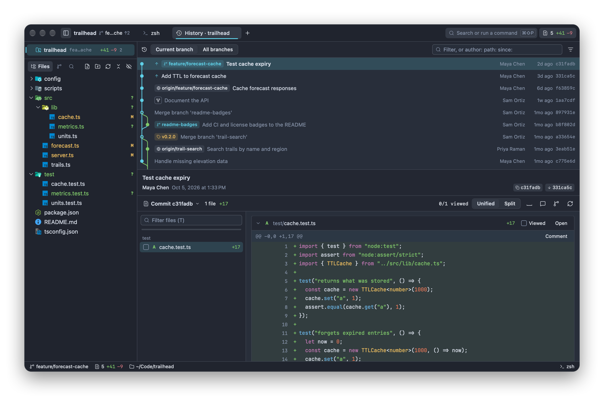
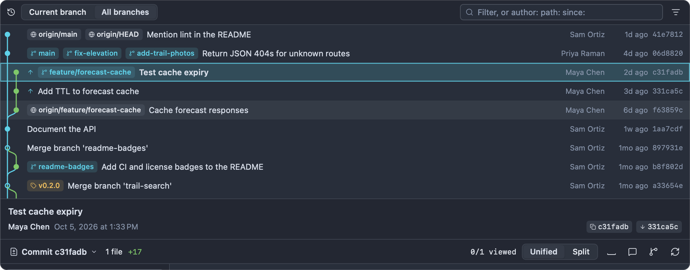
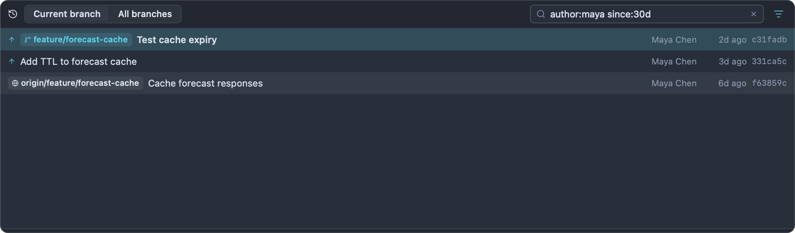

# History

History shows a repository's commits as a graph, with the selected commit's message and changes underneath. Use it to find when something changed and who changed it, to compare commits and branches, and to act on a commit: branch or tag from it, merge or rebase onto it, cherry-pick, revert or reset.



## Opening History

| From           | How                                                                              | Shows                                                                                      |
| -------------- | -------------------------------------------------------------------------------- | ------------------------------------------------------------------------------------------ |
| Git menu       | **Git ▸ Show Git History** (⇧⌘H), or **Show Git History** in the command palette | The repository's history                                                                   |
| Git menu       | **Git ▸ Show History of This File** (⌃⇧⌘H)                                       | The history of the file in the active editor (the whole repository if no editor is active) |
| File tree      | Right-click a file or folder ▸ **Show History**                                  | That file's or folder's history                                                            |
| Editor         | Click a line's inline blame, or right-click ▸ **Show Commit for This Line**      | The commit that last changed that line, selected (see [Editor](editor.md))                 |
| Terminal       | Pick a commit hash with terminal hints (⇧⌘Space)                                 | That commit, selected (see [Terminal](terminal.md))                                        |
| Branch Manager | **⋯ ▸ Show History**                                                             | The repository's history                                                                   |

The tab is titled "History · trailhead", or "History · cache.ts" for one file. Each repository has one History tab, plus one per file or folder whose history you open; opening the same one again brings its tab forward and reloads it. History tabs are restored with your session.

When History opens, the newest commit is selected and the commit list has the keyboard, so ↑ and ↓ move through commits right away.

## The layout

- **The top half** is the commit list with its graph, and a header with the scope and the filter.
- **The bottom half** shows the selected commit: its full message and details, then its changes in the same diff view as [Review](review.md).

Drag the divider between them to give either half more room. Impulse remembers the height of the top half.

## Current branch or all branches

The header's **Current branch** / **All branches** switch decides which commits are listed:

- **Current branch** shows the history of `HEAD`: the commits your checked-out branch is built on.
- **All branches** shows every local branch, remote branch and tag, so you can see how `feature/forecast-cache`, `main` and `origin/main` relate. (Impulse's own refs under `refs/impulse/` are never included.)



For a file or folder's history, the header shows its path instead of the switch, and the list is that path's commits on the current branch. A single file's history follows it through renames.

## The commit list

Each row shows, from left to right:

| Column         | What it shows                                                                                                                                                         |
| -------------- | --------------------------------------------------------------------------------------------------------------------------------------------------------------------- |
| Graph          | One lane per line of development, in colors that repeat after six. A filled dot is a commit; a hollow ring is a merge commit. Up to eight lanes are drawn.            |
| Sync marker    | ↑ "Not pushed yet": the commit is on your branch but not its upstream. ↓ "On the upstream, not pulled yet" (visible with **All branches**).                           |
| Compare marker | Shown on the commit you picked with **Select for Compare**.                                                                                                           |
| Ref chips      | Branches (branch icon; the checked-out branch in bold), remote branches (globe icon, such as `origin/main`), tags (tag icon, such as `v0.2.0`) and a detached `HEAD`. |
| Fork point     | A fork icon on the commit where your branch left the default branch ("Fork point: this branch left origin/main here").                                                |
| Subject        | The first line of the message, in bold for the commit you have checked out.                                                                                           |
| Author         | Who wrote the commit.                                                                                                                                                 |
| Date           | How long ago it was written ("3d ago", "2w ago").                                                                                                                     |
| SHA            | The short commit ID.                                                                                                                                                  |

Hover a row for the full subject, the author's name and email, and the full commit ID.

The list loads 300 commits at a time and loads more as you scroll toward the end. It updates by itself when refs move, for example when you commit, tag, fetch or switch branches, keeping your selection.

The ↑ and ↓ markers come from your last fetch. To keep them current without fetching by hand, turn on **Fetch in the background** (see [Git](git.md#background-fetch)).

## Fork-point dimming

On **Current branch**, when you're on a branch other than the default one, commits that were already on the default branch when your branch was created are dimmed. Your branch's own work stands out, and the fork-point icon marks where it begins.

For example, on `feature/forecast-cache` the commits Sam Ortiz and Priya Raman made on `main` before the branch was created are gray, and the three commits of the cache work are in full color.

There's no dimming on the default branch itself, on **All branches**, or when the branch has more than 2,000 commits of its own. The default branch is the remote's (`origin/main` when `origin/HEAD` is set), or else a local `main`, `master`, `trunk` or `develop`.

## The selected commit

Click a commit (or move to it with ↑ and ↓) to show it in the bottom half.

- **The details** at the top: the subject, the rest of the message (long messages show four lines with **Show more**), the author and date, "committed by" when someone else committed it, the commit ID (click it to copy) and its parents (click one to show that commit; a merge commit has two).
- **The changes** below: the commit compared with its first parent, in the same view as Review, so the [Review](review.md) features work here too: unified and split layouts, hiding whitespace, marking files viewed, and comments. Nothing can be staged from here, since a commit isn't your working tree.

When History is narrow, the changes hide the file list; widen the window or the tab to get it back.

In a file's history, the changes scroll to that file. The commit's other files are listed too.

## Filtering

Type in the filter field at the top right ("Filter, or author: path: since:") to narrow the list.

Plain words match the commits already loaded: their subjects, authors, short or full IDs, and branch and tag names.

`key:value` tokens search all of history with `git log`, including commits that aren't loaded yet:

| Token     | Aliases        | Example                                 | Matches                                                                                                  |
| --------- | -------------- | --------------------------------------- | -------------------------------------------------------------------------------------------------------- |
| `author:` | `by:`          | `author:maya`, `author:"Maya Chen"`     | Commits whose author name or email matches (ignoring case; git treats the value as a regular expression) |
| `path:`   | `file:`, `in:` | `path:src/lib/`, `path:src/forecast.ts` | Commits that touched that file or folder                                                                 |
| `since:`  | `after:`       | `since:2w`, `since:2026-09-01`          | Commits on or after that date                                                                            |
| `until:`  | `before:`      | `until:2026-09-30`                      | Commits on or before that date                                                                           |

Dates can be:

- Relative: a number and a unit, `h` (hours), `d` (days), `w` (weeks), `m` (months) or `y` (years). `since:30d` means the last 30 days.
- A day, `YYYY-MM-DD`. `since:` counts from the start of that day and `until:` up to its end.
- Anything else git understands, such as `since:yesterday`.

Combine tokens and words freely. Use double quotes for values with spaces:

```text
author:"Maya Chen" path:src/lib/ since:30d cache
```

The graph is hidden while a filter is active, because filtered commits no longer connect.

The filter icon next to the field (highlighted while tokens are active) has presets: **My Commits** (your `user.name` as the author), **Last 7 Days**, **Last 30 Days**, **Last Year** and **Clear Filter**. Presets replace the same token if it's already there and keep the rest.



## Comparing

Comparisons open in the repository's [Review](review.md) tab, where you get the file list and every review feature:

- **Compare a commit with your working tree.** Right-click it ▸ **Compare with Working Tree**. Review shows everything that changed since that commit, uncommitted work included.
- **Compare two commits.**
  1. Right-click the first commit ▸ **Select for Compare**. A compare marker appears on it.
  2. Right-click the second commit ▸ **Compare with 4e1b9c2 · Cache forecast responses** (the first commit's ID and subject).

  Review shows the changes from the older commit to the newer one, whichever you picked first. To cancel, right-click the marked commit ▸ **Clear Compare Selection**.

- **Compare two branches.** Do the same on the commits the two branches' chips are on (use **All branches** to see both). Or, to see what your current branch changed relative to another branch, use **Compare with Current Branch** in the Branch Manager (see [Git](git.md#managing-branches)).

## Commit actions

Right-click a commit for:

| Item                                         | What it does                                                                                                                                                                                                                          |
| -------------------------------------------- | ------------------------------------------------------------------------------------------------------------------------------------------------------------------------------------------------------------------------------------- |
| Check Out (Detached)                         | Check out the commit itself (`git switch --detach`), to look at or build an old version. Switch back to a branch when you're done.                                                                                                    |
| Create Branch Here…                          | Ask for a name, create a branch at this commit and switch to it.                                                                                                                                                                      |
| Create Tag Here…                             | The Create Tag sheet for this commit. See [Tags](git.md#tags).                                                                                                                                                                        |
| Merge into main                              | Merge this commit into the current branch (named in the item). If a branch (local or remote) or a tag points at the commit, that name is merged, so the merge commit's message names it. Disabled on the commit you have checked out. |
| Rebase main onto Here                        | Rebase the current branch onto this commit (or the branch or tag on it). Disabled on the checked-out commit and when no branch is checked out.                                                                                        |
| Cherry-Pick                                  | Apply this commit's changes on top of the current branch as a new commit.                                                                                                                                                             |
| Revert                                       | Make a new commit that undoes this commit's changes.                                                                                                                                                                                  |
| Reset main Here ▸                            | Move the current branch to this commit: **Soft (keep changes staged)**, **Mixed (keep changes)** or **Hard (discard changes)…**.                                                                                                      |
| Branch … / Remote Branch … / Tag … ▸         | One submenu per branch or tag on the commit, with that ref's actions (below).                                                                                                                                                         |
| Compare with Working Tree                    | See [Comparing](#comparing).                                                                                                                                                                                                          |
| Compare with …                               | Shown once another commit is selected for compare.                                                                                                                                                                                    |
| Select for Compare / Clear Compare Selection | See [Comparing](#comparing).                                                                                                                                                                                                          |
| Copy SHA                                     | Copy the full commit ID.                                                                                                                                                                                                              |
| Copy Subject                                 | Copy the first line of the message.                                                                                                                                                                                                   |
| Open Commit on GitHub                        | Open the commit on the remote's website. The item names the host: GitHub, GitLab, Bitbucket, Gitea, Codeberg, Azure DevOps, or the server's name for other hosts. Shown when the remote has a web address.                            |

### Branch and tag actions

Right-click a ref chip on a commit for its actions (the same ones are in the commit menu's submenu for that ref):

| Ref                    | Items                                                                                                                                         |
| ---------------------- | --------------------------------------------------------------------------------------------------------------------------------------------- |
| Local branch           | **Switch to units-refactor**, **Merge into main**, **Rebase main onto units-refactor**, **Copy Name**, **Delete Branch…**                     |
| The checked-out branch | **Copy Name**                                                                                                                                 |
| Remote branch          | **Check Out trail-search** (creates a local branch tracking it), **Merge into main**, **Rebase main onto origin/trail-search**, **Copy Name** |
| Tag                    | **Push to origin**, **Open on GitHub**, **Merge into main**, **Copy Name**, **Delete Tag**, **Delete from origin…**                           |

**Push to origin** and **Delete from origin…** appear when the repository has a remote, and use `origin` if there is one. **Open on GitHub** appears when the remote has a web address. Deleting a branch or a local tag can be undone from the toast; deleting a tag from the remote asks first and can't be undone there. See [Git](git.md#pushing-and-deleting-tags).

### Merge and rebase

Merging and rebasing from History work as described in [Merging and rebasing](git.md#merging-and-rebasing): Impulse takes a safety snapshot first, the toast offers **Undo** for about 15 seconds, and if the operation stops with conflicts, the Changes panel shows the operation banner so you can resolve them and continue (see [Merge conflicts](git.md#merge-conflicts)).

### Reset

**Reset main Here** moves the current branch to the commit:

| Mode                       | Your changes                                                                          |
| -------------------------- | ------------------------------------------------------------------------------------- |
| Soft (keep changes staged) | The commits after this one become staged changes.                                     |
| Mixed (keep changes)       | The commits after this one become unstaged changes.                                   |
| Hard (discard changes)…    | The commits after this one, and any uncommitted changes, are thrown away. Asks first. |

Every reset records a safety snapshot (a hard reset doesn't run without one), and the toast ("Reset to 4e1b9c2 (hard)") offers **Undo** for about 15 seconds, which brings back the branch, your files and your index.

### Cherry-pick and revert

Cherry-Pick and Revert each make a new commit on the current branch. If the change doesn't apply cleanly, git stops with conflicts and the Changes panel's banner offers **Continue**, **Skip** and **Abort** (see [Merge conflicts](git.md#merge-conflicts)). A safety snapshot is taken first, but there's no Undo button; to take the new commit back, use **Git ▸ Undo Last Commit** and discard its changes, or revert it.

## Tags in History

Tags appear as chips with a tag icon on the commits they point at. With **Current branch**, you see the tags on your branch's history; with **All branches**, every tag.

To tag a commit, right-click it ▸ **Create Tag Here…**. To push, open or delete a tag, right-click its chip. See [Tags](git.md#tags) for annotated and lightweight tags, the suggested next version, and pushing.

## Keyboard

| Key   | Action                                                         |
| ----- | -------------------------------------------------------------- |
| ⇧⌘H   | Open History                                                   |
| ⌃⇧⌘H  | Open the history of the file in the active editor              |
| ↑ / ↓ | Previous / next commit (when the commit list has the keyboard) |

Click into the changes in the bottom half to use Review's keys there (J and K for hunks, N and P for files, V to mark viewed, C to comment). See [Review](review.md#keyboard-shortcuts).

## Related

- [Review](review.md): the diff view History uses, and comparing in depth
- [Git](git.md): branches, tags, merging, safety snapshots and Undo
- [Editor](editor.md): inline blame and "Show Commit for This Line"
- [Terminal](terminal.md): opening commit hashes from terminal output with hints
- [Keyboard shortcuts](keyboard-shortcuts.md)
