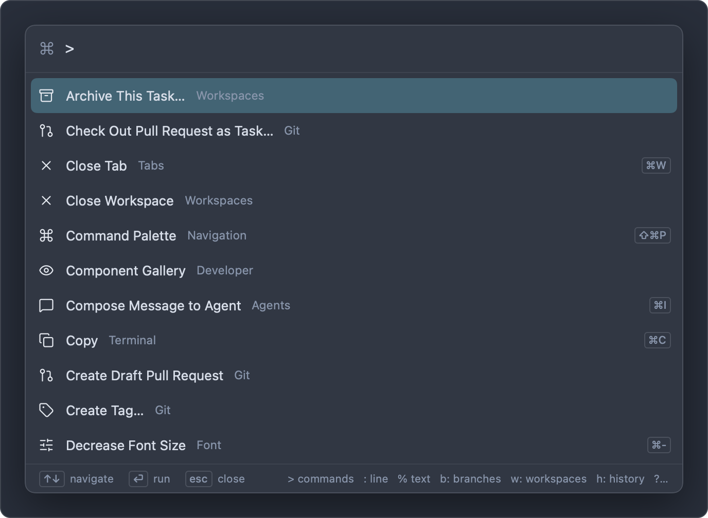

# Keyboard shortcuts

This page lists every keyboard shortcut in Impulse: the commands in the menu bar, and the keys that work inside a particular panel or field, such as the terminal's input bar, the Changes panel and Review. Shortcuts with an ID in the last column can be changed in the Keyboard Shortcuts tab; see [Customize keyboard shortcuts](settings-and-themes.md#customize-keyboard-shortcuts).

## How to read this page

Shortcuts are written the way macOS menus show them: ⌃ Control, ⌥ Option, ⇧ Shift, ⌘ Command, then the key. ↩ is Return, ⇥ is Tab, ⌫ is Delete, ⌦ is Forward Delete, and Esc is Escape.

- **ID** is the command's id in the Keyboard Shortcuts tab and in `keybinding_overrides` in `settings.json`. A dash means the shortcut is fixed.
- "Unbound" means the command has no shortcut by default, but you can give it one.
- The shortcuts here are the defaults. If you've changed one, the menus and the command palette show your version.

You don't need to memorize this page. Every command in the command palette (⇧⌘P) shows its current shortcut on the right, and so do the menus.

## General

| Shortcut | Command                                                 | Menu    | ID                                                                                                |
| -------- | ------------------------------------------------------- | ------- | ------------------------------------------------------------------------------------------------- |
| ⌘,       | Settings…                                               | Impulse | `open_settings`                                                                                   |
| ⌥⌘,      | Keyboard Shortcuts…                                     | Impulse | `open_keybindings`                                                                                |
| ⇧⌘P      | Command Palette                                         | View    | `command_palette`                                                                                 |
| ⌘P       | Go to File… (the palette's file mode)                   | View    | `quick_open`                                                                                      |
| ⌘B       | Toggle Sidebar                                          | View    | `toggle_sidebar`                                                                                  |
| ⇧⌘N      | New Window                                              | File    | `new_window`                                                                                      |
| ⌃⌘F      | Toggle Full Screen                                      | View    | `fullscreen`                                                                                      |
| ⌘=       | Increase Font Size (editor and terminal, one point)     | View    | `font_increase`                                                                                   |
| ⌘-       | Decrease Font Size (editor and terminal, one point)     | View    | `font_decrease`                                                                                   |
| ⌘0       | Reset Font Size (editor and terminal back to 14 points) | View    | `font_reset`                                                                                      |
| `` ⌃` `` | Show or hide the quick terminal, from any app           | —       | Set in **Settings › General › Quick terminal shortcut**; works only when **Quick terminal** is on |

## Workspaces, tabs and tasks

| Shortcut | Command                                                              | Menu        | ID                     |
| -------- | -------------------------------------------------------------------- | ----------- | ---------------------- |
| ⌘T       | New Tab (a terminal)                                                 | File        | `new_tab`              |
| ⌘W       | Close Tab: closes the focused pane, or the tab if it has only one    | File        | `close_tab`            |
| ⇧⌘T      | Reopen Closed Tab                                                    | File        | `reopen_tab`           |
| ⌘Z       | Right after closing a tab or pane (within 10 seconds): bring it back | Edit › Undo | —                      |
| ⌃⇥       | Show Next Tab (in the current workspace)                             | Window      | `next_tab`             |
| ⌃⇧⇥      | Show Previous Tab (in the current workspace)                         | Window      | `prev_tab`             |
| ⌘1 … ⌘9  | Tab 1 … Tab 9: the first to ninth tab of the current workspace       | Window      | —                      |
| ⌃⌘O      | Switch Workspace… (the palette in `w:` mode)                         | File        | `switch_workspace`     |
| ⌘O       | Open…: a file in an editor tab, or a folder as a workspace           | File        | —                      |
| ⌥⌘N      | New Task…                                                            | File        | `new_task`             |
| Unbound  | New Task from Branch… (the palette in `task:` mode)                  | File        | `new_task_from_branch` |
| ⌃⌘R      | Run Project Action… (the palette in `a:` mode)                       | View        | `project_actions`      |

The palette commands **Switch Tab…** (`t:` mode), **Open Folder as Workspace…**, **Rename Workspace…**, **Close Workspace** and **Archive Task…** have no shortcut. To reorder workspaces, use **Move Up** and **Move Down** in a workspace row's context menu. See [Workspaces and tabs](workspaces-and-tabs.md) and [Tasks](tasks.md).

## Panes

All of these are in **View › Panes**.

| Shortcut | Command                                      | ID                  |
| -------- | -------------------------------------------- | ------------------- |
| ⌘D       | Split Right                                  | `split_right`       |
| ⇧⌘D      | Split Down                                   | `split_down`        |
| ⌥⌘←      | Focus Pane Left                              | `focus_pane_left`   |
| ⌥⌘→      | Focus Pane Right                             | `focus_pane_right`  |
| ⌥⌘↑      | Focus Pane Above                             | `focus_pane_up`     |
| ⌥⌘↓      | Focus Pane Below                             | `focus_pane_down`   |
| Unbound  | Next Pane                                    | `next_pane`         |
| Unbound  | Previous Pane                                | `prev_pane`         |
| ⌃⌘←      | Grow Pane Left                               | `resize_pane_left`  |
| ⌃⌘→      | Grow Pane Right                              | `resize_pane_right` |
| ⌃⌘↑      | Grow Pane Up                                 | `resize_pane_up`    |
| ⌃⌘↓      | Grow Pane Down                               | `resize_pane_down`  |
| ⌃⌘=      | Even Out Panes                               | `equalize_panes`    |
| ⇧⌘↩      | Zoom Pane (press again to restore the split) | `zoom_pane`         |
| Unbound  | Move Pane to New Tab                         | `move_pane_to_tab`  |

## Sidebar panels

| Shortcut | Command         | Menu | ID               |
| -------- | --------------- | ---- | ---------------- |
| ⇧⌘E      | Show Files      | View | `show_files`     |
| ⇧⌘F      | Find in Project | View | `project_search` |
| ⌃⇧G      | Show Changes    | Git  | `show_changes`   |

Each of these opens the sidebar on that panel and gives it the keyboard. Press the same shortcut again while the panel has the keyboard to go back to the tab you were working in.

## Command palette

Keys while the palette is open:

| Keys    | Action                           |
| ------- | -------------------------------- |
| ↑ / ↓   | Move the selection               |
| ⌃N / ⌃P | Move the selection down / up     |
| ↩       | Run the command or open the item |
| Esc     | Close the palette                |

What you type at the start of the query picks the mode, for example `>` for commands, `:` for a line number, `%` for text in the project or `set:` for a setting. Type `?` to list them all. See [Command palette](command-palette.md).

## Terminal

### Commands

| Shortcut         | Command                                                                                                                                          | Menu                  | ID                        |
| ---------------- | ------------------------------------------------------------------------------------------------------------------------------------------------ | --------------------- | ------------------------- |
| ⌘C               | Copy                                                                                                                                             | Edit                  | `copy`                    |
| ⌘V               | Paste                                                                                                                                            | Edit                  | `paste`                   |
| ⌘F               | Find…: in a terminal, opens the find bar                                                                                                         | Edit                  | `find`                    |
| ⇧⌘Space          | Show Hints                                                                                                                                       | View › Command Blocks | `terminal_hints`          |
| ⌘↑ in a terminal | Select Blocks: selects the most recent command block                                                                                             | View › Command Blocks | `select_blocks`           |
| Unbound          | Previous Block                                                                                                                                   | View › Command Blocks | `previous_block`          |
| Unbound          | Next Block                                                                                                                                       | View › Command Blocks | `next_block`              |
| Unbound          | Last Failed Block                                                                                                                                | View › Command Blocks | `last_failed_block`       |
| ⇧⌘K              | Bookmark Block                                                                                                                                   | View › Command Blocks | `toggle_block_bookmark`   |
| Unbound          | Previous Bookmark                                                                                                                                | View › Command Blocks | `previous_block_bookmark` |
| Unbound          | Next Bookmark                                                                                                                                    | View › Command Blocks | `next_block_bookmark`     |
| ⌘A               | Select All: selects the visible screen when the terminal output has the keyboard                                                                 | Edit                  | —                         |
| ⌘-click          | Open a link or file path under the pointer (when **Clickable links** is on); on a command block, add it to or remove it from the block selection | —                     | —                         |

⌘↑ selects blocks from the input bar or the terminal output, except while a full-screen program owns the terminal. It's fixed; the menu's **Select Blocks** has no shortcut until you give it one.

See [Terminal](terminal.md) for command blocks, hints and find.

### Input bar

The input bar is where you type commands below the terminal output.

| Keys                     | Action                                                                                                                            |
| ------------------------ | --------------------------------------------------------------------------------------------------------------------------------- |
| ↩                        | Run the command (or, with the completion list open, accept the highlighted item)                                                  |
| ⇧↩ or ⌥↩                 | Insert a new line                                                                                                                 |
| ↑ on the first line      | The previous command from history (with the completion list open, move up in it)                                                  |
| ↓ on the last line       | The next command from history, then back to what you were typing (with the completion list open, move down in it)                 |
| ⇥                        | Complete: opens the completion list when there are several candidates, inserts a single candidate, or accepts the gray suggestion |
| → at the end of the text | Accept the gray suggestion                                                                                                        |
| ⌥→ at the end of text    | Accept the next word of the gray suggestion                                                                                       |
| ⌃R                       | Search command history (the palette in `h:` mode)                                                                                 |
| ⌃C                       | Interrupt the running command                                                                                                     |
| ⌘↑                       | Select the most recent command block                                                                                              |
| Esc                      | Close the completion list; with no list open, move the keyboard to the terminal output                                            |

### Completion list

| Keys  | Action                                                               |
| ----- | -------------------------------------------------------------------- |
| ↑ / ↓ | Move the highlight (wraps around)                                    |
| ⇥     | Accept the highlighted item; for a folder, keep completing inside it |
| ↩     | Accept the highlighted item and close the list                       |
| Esc   | Close the list                                                       |

### Password prompts

When a program asks for a password, the input bar hides what you type.

| Keys | Action                                   |
| ---- | ---------------------------------------- |
| ↩    | Send the password                        |
| ⌃C   | Interrupt the program                    |
| Esc  | Move the keyboard to the terminal output |

### Selected command blocks

After ⌘↑ (or **View › Command Blocks › Select Blocks**):

| Keys          | Action                                                                             |
| ------------- | ---------------------------------------------------------------------------------- |
| ↑ / ↓         | Select the previous / next block; ↓ past the newest block returns to the input bar |
| ⇧↑ / ⇧↓       | Extend the selection                                                               |
| ⌘↑            | Select the previous block                                                          |
| ⌘C            | Copy the selected blocks (each command and its output)                             |
| ⇧⌘A           | Send the selected blocks to an agent                                               |
| ⇧⌘K           | Bookmark the selected blocks                                                       |
| Esc           | Return to the input bar                                                            |
| Any other key | Leave the selection; what you type goes to the input bar                           |

### Hints mode

After ⇧⌘Space, letters appear over the URLs, file paths, commit SHAs and ports on screen.

| Keys                   | Action                             |
| ---------------------- | ---------------------------------- |
| The letters of a label | Open that item                     |
| ⇧ and the letters      | Copy the item                      |
| ⌥ and the letters      | Insert the item into the input bar |
| ⌫                      | Remove the last letter you typed   |
| Esc                    | Leave hints mode                   |

### Find in the terminal

| Keys | Action             |
| ---- | ------------------ |
| ↩    | Next match         |
| ⇧↩   | Previous match     |
| Esc  | Close the find bar |

## Editor

| Shortcut | Command                                                                                                               | Menu | ID                        |
| -------- | --------------------------------------------------------------------------------------------------------------------- | ---- | ------------------------- |
| ⌘N       | New File                                                                                                              | File | `new_file`                |
| ⌘S       | Save                                                                                                                  | File | `save`                    |
| ⌘F       | Find…: opens the editor's find widget                                                                                 | Edit | `find`                    |
| ⌘G       | Go to Line… (the palette in `:` mode)                                                                                 | Edit | `go_to_line`              |
| ⇧⌘O      | Go to Symbol in File… (the palette in `@` mode)                                                                       | View | `go_to_symbol`            |
| ⌥⌘O      | Go to Symbol in Project… (the palette in `#` mode)                                                                    | View | `go_to_project_symbol`    |
| ⇧⌘M      | Toggle Markdown Preview (Markdown and SVG files)                                                                      | View | `toggle_markdown_preview` |
| ⌃⌘M      | Show Problems                                                                                                         | View | `show_problems`           |
| ⌥⌘G      | Toggle Diff View                                                                                                      | Git  | `diff_view`               |
| Hold ⌃⌥  | Show or hide inlay hints, when **Settings › Editor › Inlay hints** is "While holding ⌃⌥" or "Hidden while holding ⌃⌥" | —    | —                         |

The editor is Monaco, and Monaco's own keybindings work in it too, except where Impulse uses the same keys: then Impulse's command runs, so ⌘D, ⌘G, ⇧⌘G, ⇧⌘↩, ⌥⌘↑, ⌥⌘↓ and ⇧⌘O do what this page lists while you edit (Monaco binds them to add next occurrence, find next and previous, insert line above, add cursor above or below and quick outline). Monaco keeps ⌘F, ⌘S, ⌘C and ⌘V, which do the same thing either way, and the keys of terminal-only commands: ⌘I shows suggestions, ⇧⌘K deletes the line and ⇧⌘Space shows parameter hints. Removing or changing an Impulse shortcut gives its keys back to Monaco. With **Vim keybindings** on, the editor also has Vim's modes and keys. See [Editor](editor.md).

## Git

### Commands

| Shortcut | Command                    | Menu | ID                    |
| -------- | -------------------------- | ---- | --------------------- |
| ⌃⇧G      | Show Changes               | Git  | `show_changes`        |
| ⇧⌘G      | Review Changes             | Git  | `review_changes`      |
| ⇧⌘H      | Show Git History           | Git  | `git_history`         |
| ⌃⇧⌘H     | Show History of This File  | Git  | `file_history`        |
| ⌥⌘G      | Toggle Diff View           | Git  | `diff_view`           |
| ⌃⌘B      | Switch Branch…             | Git  | `switch_branch`       |
| Unbound  | Manage Branches…           | Git  | `manage_branches`     |
| Unbound  | Fetch                      | Git  | `git_fetch`           |
| Unbound  | Pull                       | Git  | `git_pull`            |
| Unbound  | Push                       | Git  | `git_push`            |
| Unbound  | Create Tag…                | Git  | `git_create_tag`      |
| Unbound  | Fetch All Remotes          | Git  | `git_fetch_all`       |
| Unbound  | Pull (Rebase)              | Git  | `git_pull_rebase`     |
| Unbound  | Force Push (With Lease)…   | Git  | `git_force_push`      |
| Unbound  | Push All Tags              | Git  | `git_push_tags`       |
| Unbound  | Stash All Changes          | Git  | `git_stash`           |
| Unbound  | Pop Latest Stash           | Git  | `git_pop_stash`       |
| Unbound  | Undo Last Commit           | Git  | `git_undo_commit`     |
| Unbound  | Open Repository in Browser | Git  | `git_open_remote`     |
| Unbound  | Copy Remote URL            | Git  | `git_copy_remote_url` |

Every Git menu command can be given a shortcut in the Keyboard Shortcuts tab. See [Git](git.md).

### Changes panel

When the Changes panel has the keyboard (press ⌃⇧G or click a file):

| Keys   | Action                                                                                         |
| ------ | ---------------------------------------------------------------------------------------------- |
| ↑ / ↓  | Select the previous / next file                                                                |
| Space  | Stage the selected file, or unstage it if it's staged; for a conflicted file, mark it resolved |
| ↩      | Open the file's changes in Review                                                              |
| ⌘↩     | Open the file in an editor tab                                                                 |
| ⌥↩     | Open the file in the editor's diff view (unstaged and untracked files)                         |
| ⌫ or ⌦ | Discard the file's changes (asks first, and you can undo it)                                   |
| Esc    | Return to the terminal                                                                         |

### Commit message

In the message box under the Changes panel:

| Keys                  | Action                                                                    |
| --------------------- | ------------------------------------------------------------------------- |
| ⌘↩                    | Commit. When **Settings › Git › Commit and push** is on, commit and push. |
| ⇧⌘↩                   | Commit and push. When **Commit and push** is on, only commit.             |
| ↑ in an empty message | Recall your earlier commit messages; ↓ moves forward again                |

## Review and History

### Review

When the Review diff has the keyboard:

| Keys       | Action                                                                                                  |
| ---------- | ------------------------------------------------------------------------------------------------------- |
| j / k      | Next / previous hunk                                                                                    |
| n / p      | Next / previous file                                                                                    |
| ⇧N         | Next file you haven't marked as viewed                                                                  |
| s or ⌘Y    | Stage the focused hunk, or the lines you selected in it                                                 |
| u or ⇧⌘Y   | Unstage the focused hunk, or the selected lines                                                         |
| x or ⌥⌘Z   | Revert the focused hunk, or the selected lines, in the working tree (an Undo button appears afterwards) |
| v          | Mark the file as viewed, or not viewed                                                                  |
| c          | Comment on the focused hunk                                                                             |
| o          | Open the file in an editor tab at the focused hunk                                                      |
| ↩ or Space | Expand or collapse the file                                                                             |
| Esc        | Clear the line selection                                                                                |
| t or /     | Move to the file filter (when the file list is showing beside the diff)                                 |
| ⌘C         | Copy the selected lines                                                                                 |

Staging (s) and reverting (x) work when you're reviewing unstaged changes, and unstaging (u) when you're reviewing staged changes; in other scopes these keys do nothing. See [Review](review.md).

### Comments

While writing or editing a review comment:

| Keys | Action           |
| ---- | ---------------- |
| ⌘↩   | Save the comment |
| Esc  | Cancel           |

### History

| Keys  | Action                            |
| ----- | --------------------------------- |
| ↑ / ↓ | Select the previous / next commit |

See [History](history.md).

## Agents

### Commands

| Shortcut | Command                  | Menu | ID                  |
| -------- | ------------------------ | ---- | ------------------- |
| ⌘I       | Compose Message to Agent | File | `agent_composer`    |
| ⇧⌘U      | Next Agent Needing You   | File | `next_agent`        |
| ⇧⌘I      | Review Last Agent Turn   | File | `review_agent_turn` |

The palette command **Send Selection to Agent** has no shortcut. In the terminal, ⇧⌘A sends selected command blocks to an agent (see [Selected command blocks](#selected-command-blocks)).

### Composer

In the composer (⌘I):

| Keys                   | Action                                                                                           |
| ---------------------- | ------------------------------------------------------------------------------------------------ |
| ↩                      | Insert a new line                                                                                |
| ⌘↩                     | Send: paste the message into the agent and press Return                                          |
| ⌥⌘↩                    | Paste the message into the agent without sending it                                              |
| @                      | Mention a file. While the list of files is showing: ↑ / ↓ choose, ⇥ inserts, Esc closes the list |
| ↑ in an empty composer | Recall messages you sent earlier; ↓ moves forward again                                          |
| ⌃C                     | Interrupt the agent                                                                              |
| Esc                    | Close the composer                                                                               |

See [Agents](agents.md).

## Other panels and fields

### File tree

When the Files panel has the keyboard (press ⇧⌘E):

| Keys  | Action                                                                    |
| ----- | ------------------------------------------------------------------------- |
| ↑ / ↓ | Select the previous / next item                                           |
| →     | Expand the selected folder; on an expanded folder, move to its first item |
| ←     | Collapse the selected folder, or move to the parent folder                |
| ↩     | Open the selected file, or expand or collapse the selected folder         |

### Find in Project

| Keys                    | Action                                                |
| ----------------------- | ----------------------------------------------------- |
| ↩ in the search field   | Search now                                            |
| Esc in the search field | Clear the query; in an empty field, clear the results |
| ↩ in the Replace field  | Replace All (asks first)                              |

### Settings and Keyboard Shortcuts tabs

| Keys         | Where                                   | Action                             |
| ------------ | --------------------------------------- | ---------------------------------- |
| Esc          | Settings search field                   | Clear the search                   |
| Any shortcut | Keyboard Shortcuts tab, while recording | Becomes the command's new shortcut |
| ⌫            | Keyboard Shortcuts tab, while recording | Remove the command's shortcut      |
| Esc          | Keyboard Shortcuts tab, while recording | Cancel                             |

### Sheets and dialogs

In sheets such as **New Task…** and in confirmation dialogs, ↩ presses the default (highlighted) button and Esc cancels.

## Standard macOS shortcuts

These work as in other Mac apps and can't be changed in Impulse.

| Shortcut | Command                                 | Menu    |
| -------- | --------------------------------------- | ------- |
| ⌘H       | Hide Impulse                            | Impulse |
| ⌥⌘H      | Hide Others                             | Impulse |
| ⌘Q       | Quit Impulse                            | Impulse |
| ⇧⌘W      | Close Window                            | File    |
| ⌘M       | Minimize                                | Window  |
| ⌘Z       | Undo                                    | Edit    |
| ⇧⌘Z      | Redo                                    | Edit    |
| ⌘X       | Cut                                     | Edit    |
| ⌥⇧⌘V     | Paste and Match Style                   | Edit    |
| ⌘A       | Select All                              | Edit    |
| ⌘?       | Impulse Help (the user guide on GitHub) | Help    |

## Related

- [Settings and themes](settings-and-themes.md), including customizing shortcuts
- [Command palette](command-palette.md)
- [Terminal](terminal.md)
- [Git](git.md)
- [Review](review.md)
- [Agents](agents.md)
- [Accessibility](accessibility.md)
