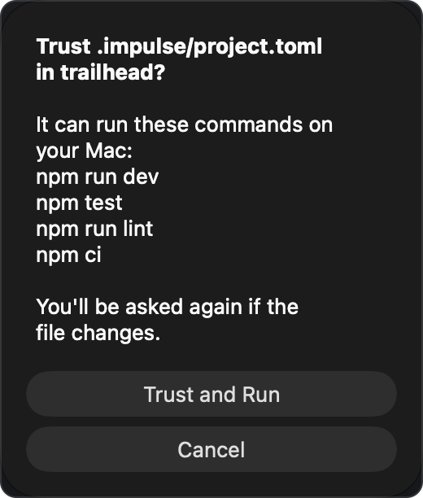
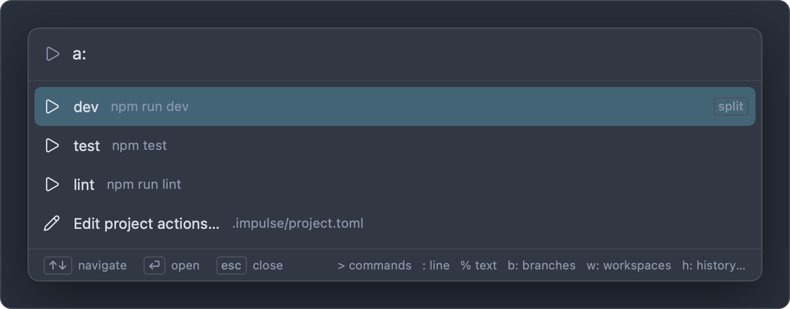

# Project configuration

A repository can tell Impulse about itself in `.impulse/project.toml`: commands to run from the command palette (project actions), scripts that set up and clean up task worktrees, and extra files to copy into new tasks. A second file, `.worktreeinclude`, lists the untracked files that new tasks need. Commands from `project.toml` only run after you trust the file.

Both files live at the root of a git repository and are meant to be committed, so everyone who works on the project (and every task worktree) gets them. To keep the settings to yourself instead, put them in `.git/impulse/project.toml`, which is never committed; see [Settings for this Mac only](#settings-for-this-mac-only).

## Create the file

Run **Edit Project Actions** from the command palette (⇧⌘P), or open the project actions list (⌃⌘R) and choose **Add project actions…** at the bottom. If the repository has no `.impulse/project.toml`, Impulse creates one with this example and opens it in the editor:

```toml
# Impulse project settings. Commands here only run after you trust
# this file, and you're asked again whenever it changes.

# Palette actions (a: in the palette). open = "tab" | "right" | "down".
[[actions]]
name = "Dev server"
command = "npm run dev"
open = "right"

[[actions]]
name = "Tests"
command = "npm test"

# Task worktrees (New Task…).
[scripts]
# setup = "npm ci"      # runs in a new task's first terminal
# archive = ""          # runs before a task's folder is removed

[worktrees]
# Untracked files to copy into new tasks, in addition to .worktreeinclude.
copy = []
```

If the file already exists, the same command opens it. The repository is the active workspace's; if the active workspace isn't in a git repository, Impulse says "Open a folder in a git repository first."

## An example

The trailhead project's `.impulse/project.toml`:

```toml
[[actions]]
name = "dev"
command = "npm run dev"
open = "right"

[[actions]]
name = "test"
command = "npm test"

[[actions]]
name = "lint"
command = "npm run lint"

[scripts]
setup = "npm ci"

[worktrees]
copy = ["config/*.local.json"]
```

With it, ⌃⌘R lists `dev`, `test` and `lint`; `dev` opens the dev server in a split to the right. Every new task runs `npm ci` in its first terminal, and gets the local config files copied in alongside the `.env` from `.worktreeinclude`.

## Reference

Every key is optional. Keys Impulse doesn't know are ignored.

### `[[actions]]`

Each `[[actions]]` table is one project action.

| Key       | Type   | Required | Meaning                                                                                                                                                                               |
| --------- | ------ | -------- | ------------------------------------------------------------------------------------------------------------------------------------------------------------------------------------- |
| `name`    | string | Yes      | What the action is called in the palette. Matched when you type after `a:`.                                                                                                           |
| `command` | string | Yes      | The shell command to run.                                                                                                                                                             |
| `cwd`     | string | No       | The folder to run in, relative to the repository root, for example `"web"`. Default: the repository root.                                                                             |
| `open`    | string | No       | Where the action's terminal opens: `"tab"` (a new tab, the default), `"right"` (a split to the right of the current tab) or `"down"` (a split below it). Any other value opens a tab. |

Actions with an empty `name` or `command` are left out.

### `[scripts]`

| Key       | Type   | Meaning                                                                                             |
| --------- | ------ | --------------------------------------------------------------------------------------------------- |
| `setup`   | string | Runs in a new task's first terminal, before the agent you chose. See [Setup script](#setup-script). |
| `archive` | string | Runs in a task's folder before **Archive Task…** removes it. See [Archive script](#archive-script). |

An empty string means no script.

### `[worktrees]`

| Key    | Type             | Meaning                                                                                                                                               |
| ------ | ---------------- | ----------------------------------------------------------------------------------------------------------------------------------------------------- |
| `copy` | array of strings | Untracked files to copy into new tasks, in addition to `.worktreeinclude` (or its defaults). Same patterns as [`.worktreeinclude`](#worktreeinclude). |

### When the file has a mistake

If the file isn't valid TOML, or a key has the wrong type (for example `copy = ".env"` instead of `copy = [".env"]`), Impulse ignores the project's settings until it's fixed, including the other file when there are two. When you open the project actions list, a warning toast names the file (`.impulse/project.toml:` or `.git/impulse/project.toml:`) followed by the error. Fix the file and open the list again.

## Settings for this Mac only

When a project's settings shouldn't be committed (the other people on the project don't use Impulse, or the setup only suits your Mac), put them in `.git/impulse/project.toml` instead. It takes the same keys as `.impulse/project.toml`.

- It's inside the repository's `.git` folder, so git never sees it: it can't be committed or pushed, and a clone doesn't bring one with it.
- Every task uses it straight away, because all of a repository's worktrees share that folder. You don't commit it first, as you would `.impulse/project.toml` (see [Setup script](#setup-script)).
- Its commands need trusting like the committed file's (see [Trusting the project file](#trusting-the-project-file)), and separately: trusting one file doesn't trust the other.

Create it from a terminal in the main checkout (in a task, `.git` is a file; `git rev-parse --git-common-dir` prints the folder to use), then open it in Impulse:

```sh
mkdir -p .git/impulse && touch .git/impulse/project.toml
impulse open .git/impulse/project.toml
```

The trailhead project keeps its Docker setup there:

```toml
[scripts]
setup = "docker compose up -d && npm ci"
archive = "docker compose down -v"

[[actions]]
name = "test"
command = "docker compose exec web npm test"
```

### When both files exist

Impulse reads both, and `.git/impulse/project.toml` wins key by key:

| In `.git/impulse/project.toml`     | Result                                                                 |
| ---------------------------------- | ---------------------------------------------------------------------- |
| A key the committed file also sets | The local value is used.                                               |
| A key it doesn't set               | The committed file's value is used.                                    |
| An empty script (`setup = ""`)     | The committed file's script is turned off.                             |
| `[worktrees] copy`                 | Replaces the committed file's list.                                    |
| An action with the same `name`     | Replaces the committed file's action; the others from both files stay. |

## Trusting the project file

A `project.toml` is part of the repository, so anyone who can commit to it can put commands in it. Impulse never runs those commands until you've trusted that exact file. The same goes for `.git/impulse/project.toml`, which is trusted on its own: when both files have commands you haven't trusted, one prompt lists both files' commands.

The first time something would run a command from the file (an action, a task's setup script or a task's archive script), Impulse asks:



> **Trust .impulse/project.toml in trailhead?**
>
> It can run these commands on your Mac: _(each command in the file, one per line, up to eight, then "…and N more")_
>
> You'll be asked again if the file changes.

- **Trust and Run** remembers your answer and runs the command.
- **Cancel** runs nothing from the file. Impulse asks again next time.

What you trust is the file's exact content (a SHA-256 hash of it) in that repository. Any change to the file, even a comment, makes Impulse ask again, so you see new commands before they run. Task worktrees share their repository's trust: a task whose copy of the file is identical to the one you trusted doesn't ask again. The exception is the setup script of a pull request checked out as a task, which asks every time (see [Setup script](#setup-script)).

Some things don't need trust: listing the actions in the palette, and copying the files named in `[worktrees] copy`. A file with no actions and no scripts never asks.

Trusting `project.toml` is separate from [workspace trust](getting-started.md), which controls language servers, formatters on save and background fetch: trusting one doesn't trust the other. Taking trust back covers both, though:

- **Restrict This Folder** (command palette) also forgets the trusted `project.toml` of the folder's repository and of every repository inside the folder.
- **Forget Trusted Folders** also forgets every trusted `project.toml`.

After either, Impulse asks again before running a command from the file. Editing the file asks again too.

## Project actions

Project actions are the commands you run over and over in a project (dev server, tests, linting), one keystroke away instead of retyped in a terminal.



1. Press ⌃⌘R (**View ▸ Run Project Action…**, or **Run Project Action…** in the palette). The palette opens with the `a:` prefix; typing `a:` in the palette does the same.
2. Type part of the action's name to filter the list. Each row shows the action's name and its command; actions that open in a split are marked "split".
3. Press Return to run the selected action.

The action runs in a new terminal: a new tab, or a split to the right of or below the current tab, depending on `open`. The terminal starts in the repository root (or `cwd`) and the command is typed into its shell, so the output appears as a command block and the terminal stays open when the command finishes. Run it again from the terminal, or re-run the block.

Actions come from the active workspace's repository. In a [task](tasks.md) workspace, they come from the task's own copy of the file and run in the task's folder, so `npm run dev` in a task serves the task's code.

The last row of the list is **Add project actions…** when the file has no actions, or **Edit project actions…** when it does. Both open (or create) `.impulse/project.toml`.

## Setup script

`[scripts] setup` runs when you create a task with **New Task…**, to get a fresh worktree ready to use: installing dependencies, building, generating local config.

- It runs in the task's first terminal, in the task folder, where you can watch it. Its output is a command block like any other.
- If you chose an agent under **Start**, the agent runs after it, as one command joined with `&&` (for example `npm ci && claude`). If setup fails, the agent doesn't start; fix the problem in that terminal and start the agent yourself.
- Impulse reads the script from the new task's own copy of `.impulse/project.toml`, which is whatever is committed on the base branch. Commit changes to the file before relying on them in new tasks, or put the script in [`.git/impulse/project.toml`](#settings-for-this-mac-only), which every new task sees as soon as you save it.
- If you haven't trusted the file, Impulse asks first. If you cancel, the script doesn't run, and the task's terminal still opens (and starts the agent, if you chose one).
- **Check Out Pull Request as Task…** reads it from the pull request's own copy of the file and always asks before running it, showing the script and the pull request's number and author, even if you trusted the file: a pull request can change what the script runs (a `package.json` script, for example) without changing the file. The answer isn't remembered, and **Don't Run** opens the task without it.

## Archive script

`[scripts] archive` runs when you choose **Archive Task…**, before the task's folder is removed: for example to stop the task's containers (`docker compose down`) or drop a database it created.

- It runs in the task folder with `/bin/sh -c` and your login shell's `PATH`, without a terminal. Its output isn't shown.
- If it exits with an error, or runs for more than two minutes (it's stopped then), a toast says "The archive script failed; archiving anyway." and the task is archived regardless.
- It needs the file to be trusted, like any command from it. If you cancel the trust prompt, the task is archived without running it.

## Copying files into tasks

A new task worktree contains only the files git tracks. Untracked files your project needs, such as `.env`, are copied in from the repository when the task is created. Two sources decide which:

- `.worktreeinclude` at the repository root, or, when that file doesn't exist, the defaults `.env`, `.env.local` and `.claude/settings.local.json` (Claude Code's project-only settings, so new tasks keep the project's [agent hooks](agents.md#agent-hooks));
- plus `[worktrees] copy` in `.impulse/project.toml`.

The New Task sheet's **Copies** line lists exactly which files will be copied. See [Tasks](tasks.md#which-files-are-copied).

### `.worktreeinclude`

A plain text file at the repository root with one pattern per line. The trailhead project's:

```
# Local settings a fresh checkout doesn't have
.env
```

The rules:

- Each line is one pattern, a path relative to the repository root. A leading `/` is allowed and means the same thing.
- Blank lines are ignored. Lines starting with `#` are comments. A `#` later in a line is part of the pattern, so don't put comments after a pattern.
- Spaces at the start and end of a line are trimmed.
- The last part of a pattern may use shell wildcards: `*` (any characters, including a leading dot), `?` (one character) and `[…]` (one of a set). Wildcards in folder names, and `**`, don't work.
- Only files are copied. A pattern that names a folder copies nothing, and folders aren't searched recursively.
- Patterns that start with `~` or contain `..` are ignored, so nothing outside the repository can be copied.
- A file is only copied when it exists in the repository and doesn't already exist in the new task.
- When `.worktreeinclude` exists, the defaults (`.env`, `.env.local`, `.claude/settings.local.json`) no longer apply: list them if you want them. An empty `.worktreeinclude` turns copying off (apart from `[worktrees] copy`).

| Pattern               | Copies                                               |
| --------------------- | ---------------------------------------------------- |
| `.env`                | `.env`                                               |
| `.env*`               | `.env`, `.env.local`, `.env.test`, … at the root     |
| `config/*.local.json` | `config/dev.local.json`, `config/test.local.json`, … |
| `/certs/dev.pem`      | `certs/dev.pem`                                      |
| `node_modules`        | Nothing (it's a folder; use a setup script)          |
| `../shared/.env`      | Nothing (outside the repository)                     |

### `[worktrees] copy`

`copy` in `.impulse/project.toml` takes the same patterns as `.worktreeinclude`, as a TOML array, with one difference: write them without a leading `/`. They're added to the `.worktreeinclude` patterns, or to the defaults when there's no `.worktreeinclude`.

```toml
[worktrees]
copy = [".env", "config/*.local.json"]
```

Use whichever file suits your project: `.worktreeinclude` keeps the list in a file of its own, `copy` keeps everything about tasks in `project.toml`. **New Task…** and **Check Out Pull Request as Task…** both use the two together.

## Related

- [Tasks](tasks.md): New Task…, setup, copies and archiving
- [Command palette](command-palette.md): the `a:` prefix and the other modes
- [Getting started](getting-started.md): workspace trust
- [Keyboard shortcuts](keyboard-shortcuts.md)
