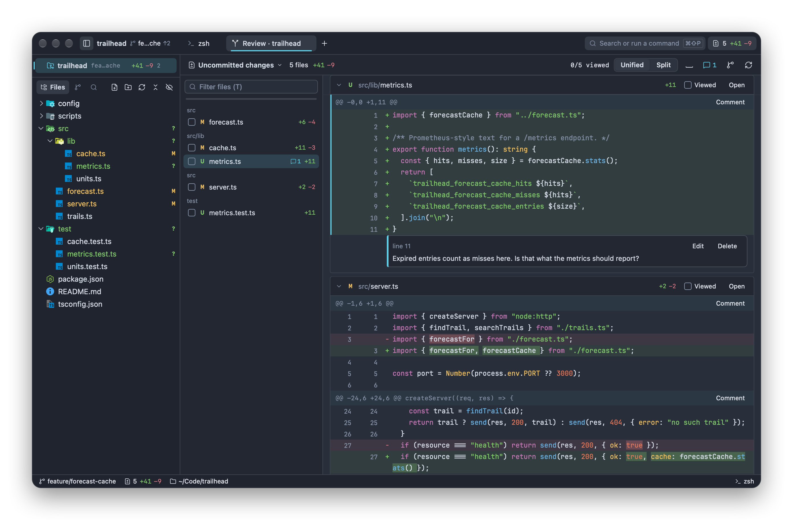
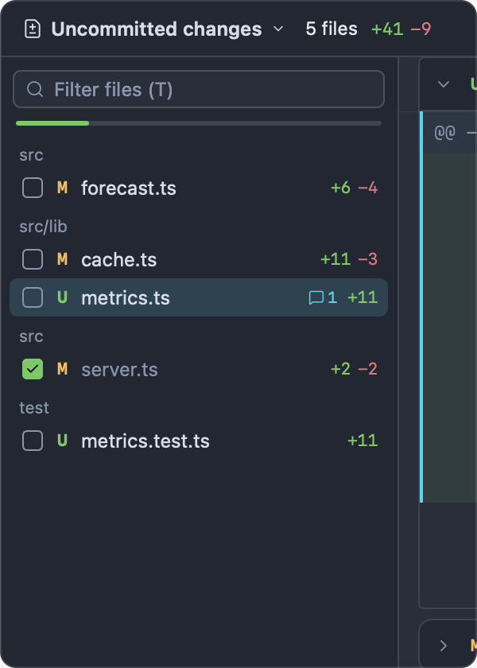
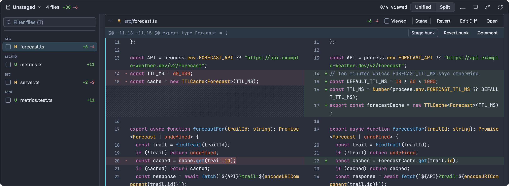
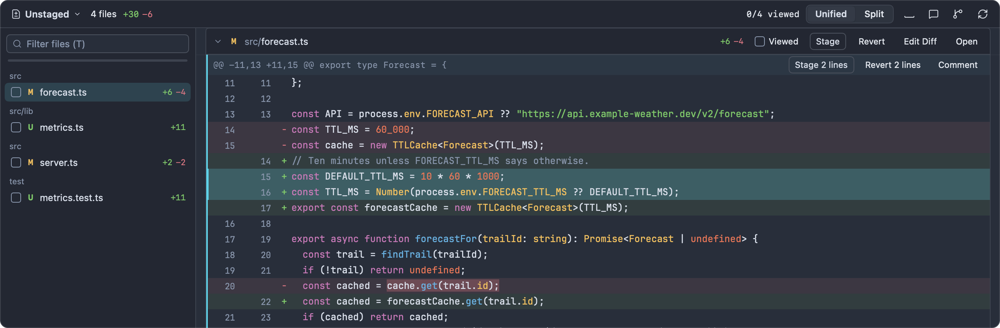
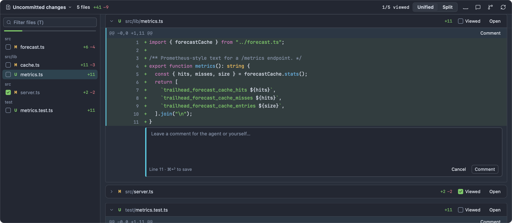
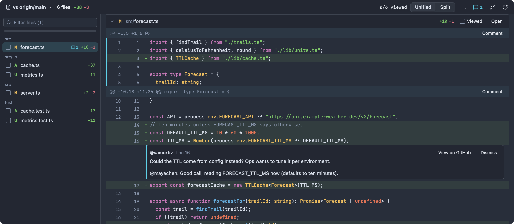

# Review

Review is where you read changes before they go anywhere: your own uncommitted work, what a coding agent did in its last turn, a branch against `main`, a commit or a stash. You can stage or revert hunks and single lines, mark files as viewed, write comments, and send those comments to an agent as one prompt.



## Opening a review

| From                           | How                                                                                                                                        | Opens on                                                                   |
| ------------------------------ | ------------------------------------------------------------------------------------------------------------------------------------------ | -------------------------------------------------------------------------- |
| Git menu                       | **Git ▸ Review Changes** (⇧⌘G), or **Review Changes** in the command palette                                                               | The scope it last showed, or the default scope (below)                     |
| Titlebar and status bar        | Click the changed-files count ("3 +42 −7")                                                                                                 | Same as above                                                              |
| Terminal context bar           | Click the changes chip                                                                                                                     | Same as above                                                              |
| Changes panel                  | Click a file (or select it and press ↩)                                                                                                    | That file, in Unstaged, Staged or All uncommitted depending on its section |
| Changes panel ⋯ menu           | **Review Uncommitted Changes**                                                                                                             | All uncommitted changes                                                    |
| Changes panel, Stashes section | Click a stash                                                                                                                              | That stash                                                                 |
| Editor                         | Click a change mark in the gutter, then **Review**                                                                                         | That file, Unstaged                                                        |
| Agents                         | **File ▸ Review Last Agent Turn** (⇧⌘I), **Review** on an agent in the inbox, **Review Turn** or a turn in the turns menu of the agent bar | The agent's last (or chosen) turn                                          |
| Branch Manager                 | **⋯ ▸ Compare with Current Branch**                                                                                                        | The current branch against that branch                                     |
| History                        | **Compare with Working Tree**, **Compare with …**                                                                                          | A commit against the working tree, or a range of commits                   |
| Command line                   | `impulse review` in an Impulse terminal                                                                                                    | See below                                                                  |

From a terminal inside Impulse:

```bash
impulse review              # all uncommitted changes
impulse review unstaged
impulse review staged
impulse review last-turn    # this terminal's agent's last turn
```

The command uses the repository of the terminal's current directory. See [Command-line tool](cli.md).

Each repository has one Review tab, titled "Review · trailhead". Opening Review again brings that tab forward and re-reads the changes; if the place you opened it from names a scope or a file, the tab switches to that scope and scrolls to that file. Review tabs are restored with your session, scope included.

When Review opens with no scope given, it starts on **Unstaged** if anything is unstaged or untracked, else **Staged** if anything is staged, else **All uncommitted changes**.

Review follows the repository live: when files change on disk (you edit, an agent edits, you stage from the terminal), the affected diffs are read again within a moment, and the scroll position stays where it was. A comment you're typing is never interrupted by a refresh.

## Scopes

The scope decides what is compared with what. Pick it from the menu at the left of the header (it shows the current scope's name, such as "Unstaged" or "vs origin/main").

| Scope                  | Header shows                                 | Compares                                                                                                                                   | How to get it                                                                             | Stage / revert |
| ---------------------- | -------------------------------------------- | ------------------------------------------------------------------------------------------------------------------------------------------ | ----------------------------------------------------------------------------------------- | -------------- |
| Unstaged               | Unstaged                                     | The index with the working tree, untracked files included                                                                                  | Scope menu: **Unstaged changes**                                                          | Stage, revert  |
| Staged                 | Staged                                       | The last commit with the index: what the next commit contains                                                                              | Scope menu: **Staged changes**                                                            | Unstage        |
| All uncommitted        | Uncommitted changes                          | The last commit with the working tree (staged and unstaged together)                                                                       | Scope menu: **All uncommitted changes**                                                   | —              |
| Against a branch       | vs origin/main                               | The point where your branch split from the other branch, with your working tree: everything your branch changed, uncommitted work included | Scope menu: **Compare with origin/main**; Branch Manager: **Compare with Current Branch** | —              |
| A commit               | Commit 4e1b9c2 (Commit HEAD for Last commit) | One commit with its first parent                                                                                                           | Scope menu: **Last commit**; selecting a commit in [History](history.md)                  | —              |
| A range                | 4e1b9c2d0a…9a8b7c6d5e                        | One commit's files with another's                                                                                                          | History: **Select for Compare**, then **Compare with …** on another commit                | —              |
| Since a commit         | Since and the commit ID                      | A commit with your working tree                                                                                                            | History: **Compare with Working Tree**                                                    | —              |
| A stash                | stash@{0}                                    | A stash with the commit it was made on                                                                                                     | Click a stash in the Changes panel                                                        | —              |
| Last agent turn        | Agent turn at 3:41 PM                        | The repository when the agent started its turn with when it finished (with the working tree while the turn is still running)               | Scope menu: **Last agent turn (Claude Code)**; ⇧⌘I and the other agent entry points       | —              |
| Since your last review | Since your review at 3:41 PM                 | The repository when you last finished a review with your working tree                                                                      | Scope menu: the "Since your review at …" item                                             | —              |

Notes:

- **The base branch** for "Compare with" is the remote's default branch (`origin/main` when `origin/HEAD` is set), or else a local `main`, `master`, `trunk` or `develop`. If none exists, the item isn't in the menu.
- **Last commit** always means the current `HEAD`, so after you commit again it shows the new commit.
- **Agent turns.** The menu item appears once an agent has recorded a turn in this repository since Impulse started (see [Agents](agents.md)). If you open a turn while it's still running, Review follows it and switches to the finished diff when the turn ends.
- **Since your last review** appears after you've finished a review once (see [Marking files viewed](#marking-files-viewed)).
- Only **Unstaged** and **Staged** change your files or index. Every other scope is read-only: you can read, mark viewed and comment, but not stage or revert.

## The header

From left to right:

- **The scope menu.** Shows the current scope; click to change it.
- **File count and line counts**, such as "4 files +58 −12", and a spinner while changes are read.
- **"2/4 viewed"**: how many files you've marked viewed. It turns green when all are.
- **Unified / Split**: the layout of the diff.
- **Whitespace** (the space-bar icon): hide changes that only touch whitespace. Click again to show them.
- **Comments** (the speech-bubble icon, with the number of comments): send, copy, import or delete comments. See [Comments](#comments).
- **Show Changes panel to commit** (the branch icon): show the [Changes panel](git.md#the-changes-panel), where you commit (⌃⇧G does the same).
- **Refresh**: read the changes again now.

## The file navigator

The column on the left lists the changed files, grouped by folder.



- **Filter files (T)** at the top narrows the list by path. Press T or / in the diff to jump to it, and ↩ in the field to go to the first match.
- A thin bar under the filter fills as you mark files viewed.
- Each row has a **viewed checkbox** (click it to mark or unmark the file), the status letter (`M`, `A`, `D`, `R`, `T`, `U` for untracked, `C` for conflicted), the file name, a yellow dot if the file changed since you viewed it, its comment count, and its lines added and removed.
- Click a row to scroll the diff to that file (expanding it if it was collapsed). The file at the top of the diff is highlighted as you scroll.

When Review is narrower than about 620 points (in a split pane, or in History's lower half), the navigator is hidden to give the diff the room.

## Reading diffs

### Files and hunks

Each file is a card. Its header stays pinned at the top while you scroll through the file, and shows:

- A chevron (click anywhere on the header to collapse or expand the file).
- The status letter and the path. For a rename, the old path is struck through before the new one.
- "changed since viewed", when the file changed after you marked it viewed.
- The lines added and removed, or "binary".
- **Viewed**, a checkbox (or press V).
- Buttons that depend on the scope: **Stage**, **Unstage**, **Revert** and **Edit Diff** (see [Staging, unstaging and reverting](#staging-unstaging-and-reverting)).
- **Open**, which opens the file in the editor at its first change.

Right-click a file header for **Copy Path**, **Open File**, **Open in Diff Editor** (Unstaged only) and **Collapse** / **Expand**.

Inside the card, each hunk starts with its `@@ … @@` header line and its buttons. Hunks show three lines of unchanged context around each change; to see more of the file, open it.

Instead of hunks, a file can show a notice:

| Notice                                                 | Why                                                                                                                                   |
| ------------------------------------------------------ | ------------------------------------------------------------------------------------------------------------------------------------- |
| Binary file — no diff shown                            | The file isn't text.                                                                                                                  |
| File too large to display — open it in the editor      | The diff is too big to show.                                                                                                          |
| No textual changes                                     | There are no changed lines to show: for example only the file's mode changed, or every change is whitespace and whitespace is hidden. |
| Diff truncated — the file has more changes than shown. | The file has more changes than Review shows; open it to see the rest.                                                                 |

### Unified and split layouts

- **Unified** shows one column with old and new line numbers side by side in the gutter, removed lines (−, red) above added lines (+, green).
- **Split** shows the old file on the left and the new file on the right, with each run of removed lines beside the added lines that replaced it. Where one side has no line, that side is hatched.



Long lines wrap rather than scroll sideways. Code uses the editor's font family (`font_family`).

### Syntax colors and word-level highlights

- Code is colored with your theme's syntax colors. The old and new sides are colored separately, so a string or comment opened on one side doesn't spill into the other.
- Within a changed line, the words that actually changed get a stronger background. When most of a line changed, the word highlights are left out because they'd box every token.

## Staging, unstaging and reverting

In the **Unstaged** scope you can stage changes or revert them in the working tree. In the **Staged** scope you can unstage them. In every other scope, Review is read-only.

### Whole files

The file header's buttons:

- **Stage** (Unstaged): stage the whole file.
- **Unstage** (Staged): unstage the whole file.
- **Revert** (Unstaged): discard the file's changes. This asks first; untracked files go to the Trash; the toast offers **Undo**.
- **Edit Diff** (Unstaged, not for deleted files): open the file in the editor's diff view, where you can edit the working copy beside its staged version. See [Editor](editor.md).

### Hunks

Each hunk header has **Stage hunk** and **Revert hunk** (Unstaged) or **Unstage hunk** (Staged), and **Comment** in every scope. From the keyboard, first put the focus on a hunk (click a line in it or its header, or move with J and K; the focused hunk has an accent bar on its left), then:

| Key      | Action                                                 |
| -------- | ------------------------------------------------------ |
| S or ⌘Y  | Stage the focused hunk (Unstaged)                      |
| U or ⇧⌘Y | Unstage the focused hunk (Staged)                      |
| X or ⌥⌘Z | Revert the focused hunk in the working tree (Unstaged) |

Right-clicking any line also offers **Stage Hunk**, **Unstage Hunk** or **Revert Hunk…** for its hunk.

### Individual lines

To stage, unstage or revert only some lines of a hunk:

1. Click the line number (or the + / − marker) of a changed line to select it. Click more lines to add them (click a selected line again to drop it), or ⇧-click to select every changed line between the last one you clicked and this one. Selected lines are tinted with an accent bar.
2. The hunk's buttons now read "Stage 2 lines", "Unstage 2 lines" or "Revert 2 lines". Click one, or press S, U or X (or ⌘Y, ⇧⌘Y, ⌥⌘Z).



A selection lives in one hunk at a time; selecting a line in another hunk starts a new selection. Unchanged context lines can't be selected. Press Esc to clear the selection, and ⌘C to copy the selected lines' text.

### What to expect

- Reverting a hunk or lines doesn't ask first. Impulse records a [safety snapshot](git.md#safety-snapshots-and-undo) before it, and the toast ("Reverted changes in forecast.ts") offers **Undo** for about 10 seconds. Editors showing the file reload it.
- If the file changed after the diff was drawn and the hunk you acted on no longer matches, Impulse refuses rather than apply the wrong lines ("Couldn't stage the selection"), and the diff is read again so you can try once more.
- A file being staged or reverted is dimmed until the change is done.
- To commit what you've staged, open the Changes panel with the branch icon in the header (or ⌃⇧G). See [Committing](git.md#committing).

## Marking files viewed

Mark a file viewed when you're done with it: click **Viewed** in its header, click its checkbox in the navigator, or press V. A viewed file collapses, and its name is dimmed in the navigator. Unmarking it expands it again. Press ⇧N to jump to the next file you haven't viewed.

Viewed marks remember the diff they were made on:

- They're kept per repository and per scope (viewing `src/server.ts` in Unstaged doesn't mark it viewed in Staged), and they survive restarts.
- If the file's changes are different the next time you look (you or an agent edited it again), it comes back unviewed and expanded, marked "changed since viewed" in its header and with a yellow dot in the navigator.

**Since your last review.** When you mark the last file in a review viewed, or send your comments to an agent, Impulse records "reviewed up to here": a snapshot of the repository under `refs/impulse/reviews/` (the last 20 are kept, and at most one every 10 seconds). The scope menu then offers "Since your review at 3:41 PM", which shows only what changed after that moment. This is the quickest way to see what an agent did with your comments.

## Comments

Comments are notes on lines of a diff, for yourself or for a coding agent.

### Adding a comment

- Hover a line and click the **+** button that appears at the left of its gutter. The comment goes on that line.
- Or click **Comment** in a hunk's header, or press C with a hunk focused. The comment goes on the selected lines, or else the hunk's last changed line.
- Or right-click a line and choose **Comment on This Line**.

If you have lines selected and comment on one of them, the comment covers the whole selected range.

A composer opens under the line, saying which lines it's for ("Lines 12–14 · ⌘↩ to save"; "Removed line 8" for a deleted line). Type your comment and press ⌘↩ or click **Comment**. Press Esc or click **Cancel** to throw it away.



Comments appear as cards under the last line they cover, with the line range ("lines 12–14", or "removed line 8") and **Edit** and **Delete** buttons. While editing, ⌘↩ saves and Esc cancels.

### Outdated comments

A comment remembers the text of the lines it was written on. If those lines change (you or an agent edited them, or the hunk was staged or reverted so it's no longer in this diff), the comment is outdated: it moves to the top of its file, under "Outdated comments — their lines changed or aren't in this diff", with a gray edge instead of the accent color.

### Where comments live

- Comments belong to the repository, not to a scope or a tab: the same comments show in every scope where their file and lines appear.
- They're saved in Impulse's own data folder, never inside the repository, and survive restarts.
- The count in the header, and sending or copying comments, cover every comment in the repository, including ones on files the current scope doesn't show.

### Sending comments to an agent

The comments menu in the header (the speech-bubble icon) has:

| Item                                     | What it does                                                                            |
| ---------------------------------------- | --------------------------------------------------------------------------------------- |
| Send Comments to Claude Code · trailhead | One item per running agent. Types all comments into that agent's prompt as one message. |
| Import Review Threads from #12           | When the branch has a GitHub pull request. See below.                                   |
| Copy Comments as Prompt                  | Copies the same message to the clipboard, for an agent running somewhere else.          |
| Delete All Comments…                     | Deletes every comment in the repository, after asking.                                  |

Sending types the prompt but doesn't press Return, so you can read it and add to it in the agent's terminal; if the agent is in the middle of a turn, the prompt is queued and sent when the turn ends. Sending also records "reviewed up to here", so when the agent is done you can choose "Since your review at …" to see exactly what it changed.

The prompt lists the comments by file and line, with the lines each one is about:

````text
Please address these review comments on the current changes:

1. src/lib/cache.ts:16-18
```
    if (!entry || entry.expires <= this.now()) {
      if (entry) this.entries.delete(key);
      this.misses++;
```
Expired entries count as misses here. Is that what the metrics should report?

2. src/forecast.ts:14 (removed lines)
```
const TTL_MS = 60_000;
```
Ten minutes is a big jump from one. Was that on purpose?
````

Comments stay after you send them, so you can check each one against what the agent did. Delete them (one by one, or with **Delete All Comments…**) once they're addressed.

Impulse never calls an AI model itself: sending comments only types text into an agent CLI you're already running. See [Agents](agents.md).

## Pull request review threads

If the current branch has a GitHub pull request (see [Pull requests](git.md#pull-requests-github-cli)), you can bring its open review threads into Review, to work through them yourself or send them to an agent along with your own comments.

1. Open the comments menu in the header and choose **Import Review Threads from #12**.
2. Impulse loads the pull request's unresolved threads through `gh` and adds each as a comment, with every reply folded into its text. Resolved threads are skipped.
3. If any threads came in, Review switches to the branch scope ("vs origin/main"), where the threads' lines are.



An imported thread shows its author ("@samortiz") and has **View on GitHub** (opens the thread) and **Dismiss** (removes it from Impulse) instead of Edit and Delete. Threads GitHub marks as outdated, and threads on lines that aren't in the current diff, go to the top of their file with the outdated comments.

Importing again replaces the earlier import, so threads resolved on GitHub since then disappear. Nothing is posted back to GitHub. If `gh` can't load the threads (signed out, offline), a toast says so.

## Opening files

- **Open** in a file's header opens the file at its first change.
- **Open File at This Line** (right-click a line) opens the file at that line.
- Press O to open the focused file at its focused hunk.
- **Open in Diff Editor** (file header's context menu) and **Edit Diff** open the editor's diff view (Unstaged).
- Right-click a line for **Copy Line** too.

## Keyboard shortcuts

These work when the diff has the keyboard; click anywhere in the diff first.

| Key        | Action                                                      |
| ---------- | ----------------------------------------------------------- |
| J / K      | Next / previous hunk (moves into the next or previous file) |
| N / P      | Next / previous file                                        |
| ⇧N         | Next file you haven't viewed                                |
| ↩ or Space | Collapse or expand the current file                         |
| V          | Mark the current file viewed (or not)                       |
| S or ⌘Y    | Stage the focused hunk, or its selected lines               |
| U or ⇧⌘Y   | Unstage the focused hunk, or its selected lines             |
| X or ⌥⌘Z   | Revert the focused hunk, or its selected lines              |
| C          | Comment on the focused hunk or its selected lines           |
| O          | Open the file at the focused hunk                           |
| T or /     | Jump to the file filter (when the navigator is showing)     |
| Esc        | Clear the line selection                                    |
| ⌘C         | Copy the selected lines                                     |
| ⌘↩         | Save a comment (in the composer)                            |

See [Keyboard shortcuts](keyboard-shortcuts.md) for the full list.

## Related

- [Git](git.md): the Changes panel, committing, and safety snapshots
- [History](history.md): selecting commits and comparing them uses the same diff view
- [Agents](agents.md): checkpoints, reviewing a turn, and restoring files to before it
- [Editor](editor.md): change marks and the side-by-side diff view
- [Command-line tool](cli.md): `impulse review`
