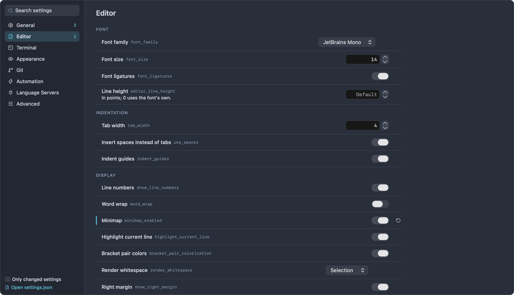
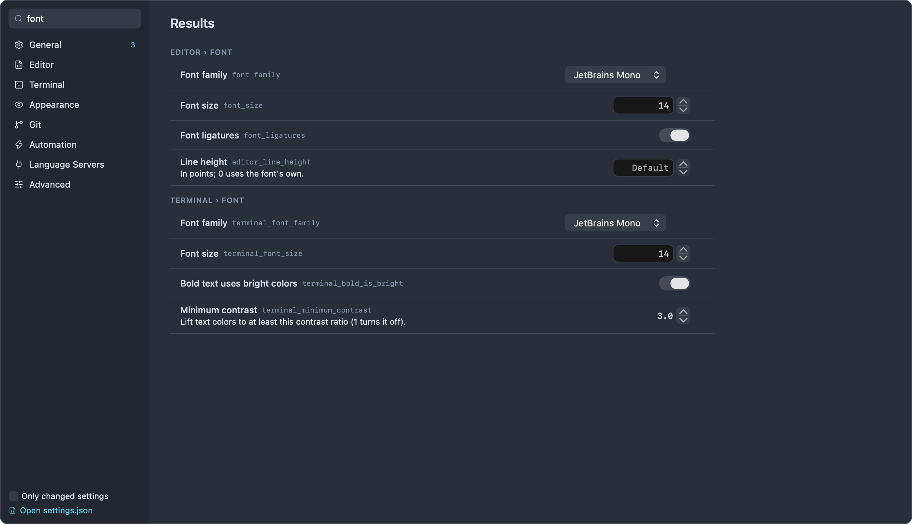
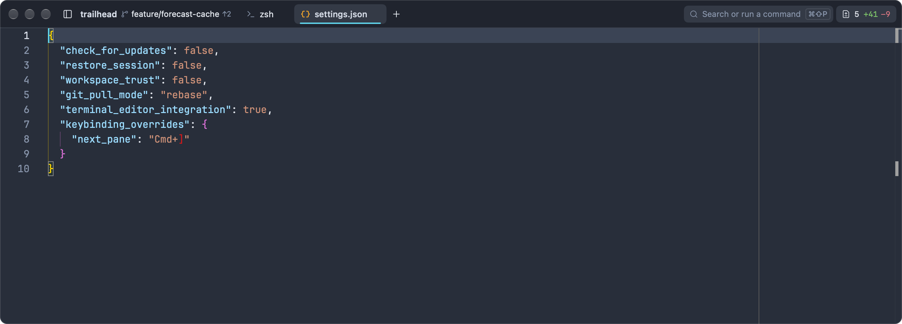
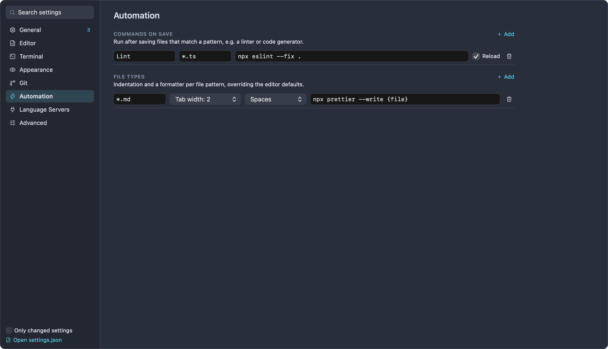
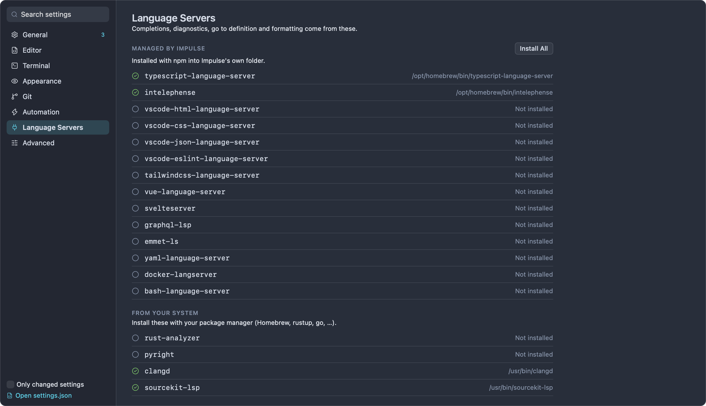
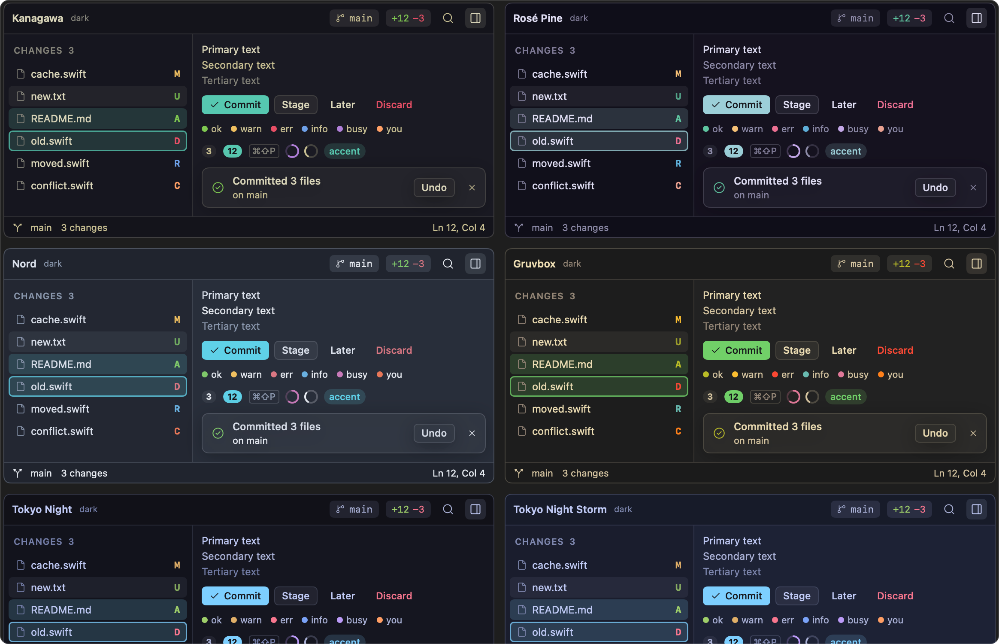
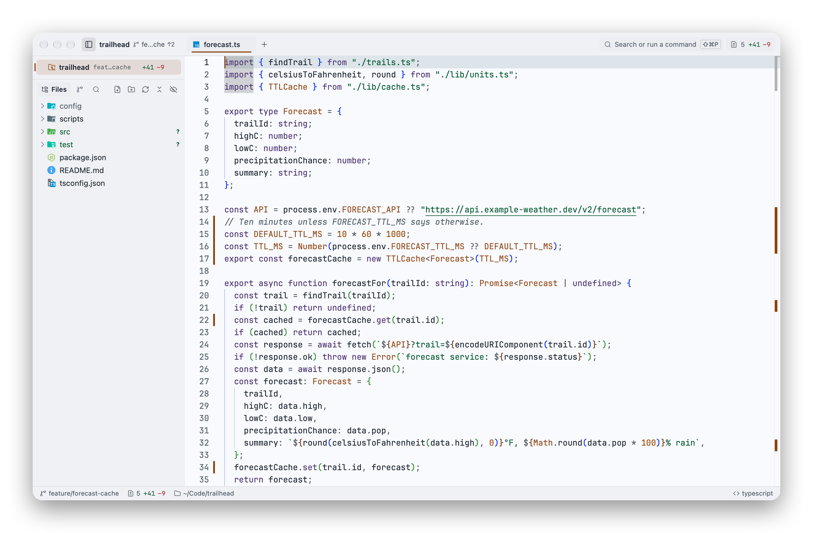
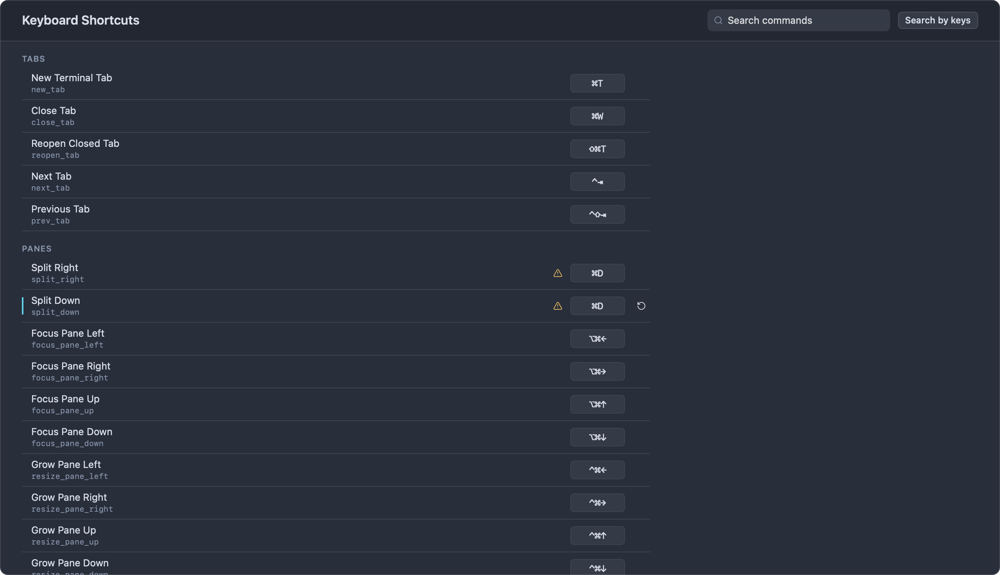

# Settings and themes

Impulse keeps its settings in one JSON file and shows them in a searchable Settings tab, where every change applies as soon as you make it. This page covers the Settings tab, editing `settings.json` directly, every setting and its default, the built-in themes and how to write your own, and how to change keyboard shortcuts.

## Open Settings

Settings opens as a tab in the current window, next to your terminals and editors. Each window has at most one Settings tab; opening it again brings the existing one forward.

- Press ⌘, or choose **Impulse › Settings…**.
- From the command palette (⇧⌘P), run **Open Settings**.
- To jump straight to one setting, run **Find a Setting…** in the palette (or type `set:` in the palette) and pick it. See [Find a setting](#find-a-setting).



The left column lists the categories: **General**, **Editor**, **Terminal**, **Appearance**, **Git**, **Automation**, **Language Servers** and **Advanced**. A number next to a category counts the settings in it that differ from their defaults. At the bottom of the column are the **Only changed settings** checkbox and the **Open settings.json** link.

Each setting row shows its title, its `settings.json` key in small type (you can select and copy it), a short description, and its control. A setting you've changed from its default has an accent-colored bar on its left edge and a **Reset to default** button (a circular arrow) on its right. There is no "reset everything" button; see [Start over](#start-over) for that.

How the controls work:

- Switches and menus apply when you click them.
- Number fields take a typed value when you press Return or move out of the field; the arrows beside them step the value. Values outside the allowed range are clamped to the nearest limit.
- Text fields (such as **Quick terminal shortcut**) apply when you press Return or move out of the field.
- Font menus list the monospaced font families installed on your Mac. JetBrains Mono comes with Impulse.
- **Scratch folder** takes a typed path (`~` works) or a folder you pick with **Choose…**.

Impulse saves `settings.json` a moment after each change; you never need to save Settings yourself.

## Find a setting

When you open Settings, the cursor is in the **Search settings** field at the top of the left column. Type part of a setting's title, its key, its section name or a word from its description. Results come from every category and are grouped under headings like **Editor › Font** and **Terminal › Font**. Press Esc to clear the search, or click a category to leave the results.



- **Only changed settings** lists every setting you've changed, across all categories. Combined with a search, it narrows the results to changed settings that match.
- The **Automation**, **Language Servers** and **Advanced** categories are separate pages and don't appear in search results.

From the command palette, type `set:` followed by part of a setting's name (for example `set:minimap`), or run **Find a Setting…**. Changed settings are marked "changed" in the list. Choosing one opens the Settings tab with that setting's key in the search field.

## Edit settings.json

Every setting lives in one file:

```
~/Library/Application Support/impulse/settings.json
```

The development build ("Impulse Dev") uses `~/Library/Application Support/impulse-dev/settings.json` instead, which is copied from the release build's file the first time the dev build runs.

Impulse writes the file as formatted JSON with the keys sorted, and it writes every setting, so the file always shows the current value of each one. The file is readable only by you (permissions `0600`). If `settings.json` is a symbolic link (for example into a dotfiles repository), Impulse writes through the link to the real file instead of replacing the link.

### Open it in the editor

Open the file in an Impulse editor tab with any of these:

- The **Open settings.json** link at the bottom of the Settings tab's left column.
- **Settings › Advanced › settings.json**.
- The palette command **Open settings.json**.
- The **Open Settings File** button on the warning banner described below.

If the file doesn't exist yet, Impulse writes it first. In the editor, the file is checked against a schema of every setting: you get completions for keys and values, descriptions when you hover over a key, and warnings for wrong types, values that aren't allowed, and numbers outside their range.



`settings.json` is plain JSON. Comments and trailing commas aren't allowed.

### When your edits apply

Impulse watches the file. When you save it, from Impulse's editor or any other app, the new values apply to every window within a moment, the theme (`color_scheme`) included.

### Values Impulse can't use

- A key whose value has the wrong type (for example `"font_size": "big"`) falls back to that setting's default. The rest of the file still loads.
- A number outside its setting's range (the **Values** column in the tables below) is clamped to the nearest limit, the same as in the Settings tab.
- A value that isn't one of a menu's choices is kept, and the menu in Settings shows it as an extra item.
- Keys Impulse doesn't know are ignored, and they disappear the next time Impulse saves the file.

### If the file can't be read

If `settings.json` isn't valid JSON (a missing comma, a stray comment) or can't be read, a banner appears under the window's titlebar: **Settings file could not be loaded**, with **Open Settings File** and a dismiss button. The banner says which settings are in use; hover over it to see the error.

- If this happens when Impulse starts, Impulse uses the default settings ("Using the default settings") and copies the broken file next to the original as `settings.invalid-<timestamp>.json`, so nothing you wrote is lost. The banner shows where the copy is, for example `~/Library/Application Support/impulse/settings.invalid-1759834200.json`.
- If the file breaks while Impulse is running (you saved it mid-edit), Impulse keeps the settings it already had ("Keeping the settings Impulse already had").

Either way, Impulse stops saving settings until the file is fixed, so it never overwrites your broken file with defaults. Changes you make in the Settings tab meanwhile apply but aren't saved. Fix the file and save it; Impulse reloads it and the banner goes away.

### Start over

To return every setting to its default, quit Impulse and delete `settings.json`. Impulse starts with the defaults and writes a new file the next time a setting changes.

## Settings reference

The tables below list every setting in the order the Settings tab shows them. "Key" is the name in `settings.json`. Switches are `true` or `false` in the file.

### General

#### Quick terminal

| Setting                 | Key                       | Values                                              | Default      | What it does                                                                                                                                                                                                |
| ----------------------- | ------------------------- | --------------------------------------------------- | ------------ | ----------------------------------------------------------------------------------------------------------------------------------------------------------------------------------------------------------- |
| Quick terminal          | `quick_terminal_enabled`  | on / off                                            | off          | A terminal that drops down from the top of the screen, over any app, on a global shortcut.                                                                                                                  |
| Quick terminal shortcut | `quick_terminal_shortcut` | A shortcut, for example `` Ctrl+` `` or `Alt+Space` | `` Ctrl+` `` | The global shortcut that shows and hides the quick terminal. It must include Cmd, Ctrl or Alt, plus a letter, digit, punctuation key, Space, Tab or Return. A shortcut Impulse can't register does nothing. |

#### Startup

| Setting                     | Key                  | Values   | Default | What it does                                                    |
| --------------------------- | -------------------- | -------- | ------- | --------------------------------------------------------------- |
| Restore previous session    | `restore_session`    | on / off | on      | Reopen workspaces, tabs, splits and terminal folders on launch. |
| Restore terminal scrollback | `restore_scrollback` | on / off | on      | Bring back each terminal's output when the session is restored. |
| Check for updates on launch | `check_for_updates`  | on / off | on      | Check GitHub for a newer release each time Impulse starts.      |

#### Window

| Setting                              | Key                      | Values   | Default | What it does                                                                                                                        |
| ------------------------------------ | ------------------------ | -------- | ------- | ----------------------------------------------------------------------------------------------------------------------------------- |
| Warn before closing running commands | `confirm_close_warnings` | on / off | on      | Ask before closing a tab or window, or quitting, while a terminal is still running a command. Unsaved files are always asked about. |

#### Sidebar

| Setting                  | Key                   | Values   | Default | What it does                                                                                                                                                |
| ------------------------ | --------------------- | -------- | ------- | ----------------------------------------------------------------------------------------------------------------------------------------------------------- |
| List tabs in the sidebar | `sidebar_tabs`        | on / off | off     | Show the active workspace's tabs under it in the sidebar instead of in the titlebar. See [Tabs in the sidebar](workspaces-and-tabs.md#tabs-in-the-sidebar). |
| Show hidden files        | `sidebar_show_hidden` | on / off | off     | Show hidden files (dotfiles) in the file tree.                                                                                                              |

#### Workspaces

| Setting                     | Key                 | Values                                      | Default | What it does                                                                                                                                                                                                                |
| --------------------------- | ------------------- | ------------------------------------------- | ------- | --------------------------------------------------------------------------------------------------------------------------------------------------------------------------------------------------------------------------- |
| Scratch folder              | `scratch_directory` | A folder path; empty means your home folder | empty   | Where terminals in the Scratch workspace start, and where a new window's file tree begins.                                                                                                                                  |
| Ask before trusting folders | `workspace_trust`   | on / off                                    | on      | Language servers, formatters on save and background fetch can run a project's own code, so they only run in folders you trust. Off: every folder is trusted. See [Getting started](getting-started.md) for workspace trust. |

### Editor

#### Font

| Setting        | Key                  | Values                              | Default                | What it does                                                                                                         |
| -------------- | -------------------- | ----------------------------------- | ---------------------- | -------------------------------------------------------------------------------------------------------------------- |
| Font family    | `font_family`        | An installed monospaced font family | `JetBrains Mono`       | The editor's font.                                                                                                   |
| Font size      | `font_size`          | 6–72                                | 14                     | The editor's font size in points. ⌘= and ⌘- change it together with the terminal font size; ⌘0 sets both back to 14. |
| Font ligatures | `font_ligatures`     | on / off                            | on                     | Draw the font's ligatures (for example `=>` as one glyph).                                                           |
| Line height    | `editor_line_height` | 0–100                               | 0 (shown as "Default") | In points; 0 uses the font's own.                                                                                    |

#### Indentation

| Setting                       | Key             | Values   | Default | What it does                                   |
| ----------------------------- | --------------- | -------- | ------- | ---------------------------------------------- |
| Tab width                     | `tab_width`     | 1–16     | 4       | Columns per indentation level.                 |
| Insert spaces instead of tabs | `use_spaces`    | on / off | on      | Indent with spaces rather than tab characters. |
| Indent guides                 | `indent_guides` | on / off | on      | Draw vertical lines at each indentation level. |

[File types](#file-types) under Automation can set a different tab width or indentation for files that match a pattern.

#### Display

| Setting                | Key                         | Values                                                                                        | Default     | What it does                                       |
| ---------------------- | --------------------------- | --------------------------------------------------------------------------------------------- | ----------- | -------------------------------------------------- |
| Line numbers           | `show_line_numbers`         | on / off                                                                                      | on          | Show line numbers in the gutter.                   |
| Word wrap              | `word_wrap`                 | on / off                                                                                      | off         | Wrap long lines at the window edge.                |
| Minimap                | `minimap_enabled`           | on / off                                                                                      | off         | Show a miniature of the file at the right edge.    |
| Highlight current line | `highlight_current_line`    | on / off                                                                                      | on          | Tint the line the cursor is on.                    |
| Bracket pair colors    | `bracket_pair_colorization` | on / off                                                                                      | on          | Color matching brackets by nesting level.          |
| Render whitespace      | `render_whitespace`         | `none`, `boundary`, `selection`, `trailing`, `all` (None, Boundary, Selection, Trailing, All) | `selection` | Where to draw dots and arrows for spaces and tabs. |
| Right margin           | `show_right_margin`         | on / off                                                                                      | on          | Draw a vertical line at the right margin column.   |
| Right margin column    | `right_margin_position`     | 1–500                                                                                         | 120         | The column the right margin line is drawn at.      |

#### Scrolling

| Setting                      | Key                               | Values   | Default | What it does                                                                       |
| ---------------------------- | --------------------------------- | -------- | ------- | ---------------------------------------------------------------------------------- |
| Sticky scroll                | `sticky_scroll`                   | on / off | off     | Keep the enclosing scopes pinned at the top while scrolling.                       |
| Scroll beyond last line      | `scroll_beyond_last_line`         | on / off | off     | Let the last line scroll up to the top of the editor.                              |
| Smooth scrolling             | `smooth_scrolling`                | on / off | off     | Animate scrolling.                                                                 |
| Lines kept around the cursor | `editor_cursor_surrounding_lines` | 0–20     | 3       | How many lines stay visible above and below the cursor when it moves near an edge. |

#### Cursor

| Setting         | Key                      | Values                                                                                                                                          | Default  | What it does                                         |
| --------------- | ------------------------ | ----------------------------------------------------------------------------------------------------------------------------------------------- | -------- | ---------------------------------------------------- |
| Cursor style    | `editor_cursor_style`    | `line`, `block`, `underline`, `line-thin`, `block-outline`, `underline-thin` (Line, Block, Underline, Thin line, Block outline, Thin underline) | `line`   | The editor cursor's shape.                           |
| Cursor blinking | `editor_cursor_blinking` | `blink`, `smooth`, `phase`, `expand`, `solid` (Blink, Smooth, Phase, Expand, Solid)                                                             | `smooth` | How the editor cursor blinks. `solid` doesn't blink. |

#### Behavior

| Setting                             | Key                             | Values                                                                                                                        | Default             | What it does                                                                                                             |
| ----------------------------------- | ------------------------------- | ----------------------------------------------------------------------------------------------------------------------------- | ------------------- | ------------------------------------------------------------------------------------------------------------------------ |
| Auto-close brackets                 | `editor_auto_closing_brackets`  | `always`, `languageDefined`, `beforeWhitespace`, `never` (Always, Language defined, Before whitespace, Never)                 | `languageDefined`   | When typing an opening bracket also inserts the closing one.                                                             |
| Code folding                        | `folding`                       | on / off                                                                                                                      | on                  | Show fold controls in the gutter.                                                                                        |
| Save when focus leaves the editor   | `auto_save`                     | on / off                                                                                                                      | off                 | Save a file when you move focus out of its editor.                                                                       |
| Vim keybindings                     | `editor_vim_mode`               | on / off                                                                                                                      | off                 | Normal, insert and visual modes in the editor (monaco-vim); the mode shows at the bottom right. See [Editor](editor.md). |
| Preview files from the file tree    | `editor_preview_tabs`           | on / off                                                                                                                      | on                  | A click shows a file in an italic tab the next click reuses; double-click or edit it to keep it.                         |
| Highlight matches of the selection  | `editor_selection_highlight`    | on / off                                                                                                                      | on                  | Highlight other occurrences of the selected text.                                                                        |
| Highlight occurrences of the symbol | `editor_occurrences_highlight`  | on / off                                                                                                                      | on                  | Highlight other uses of the symbol under the cursor.                                                                     |
| Inlay hints                         | `editor_inlay_hints`            | `on`, `off`, `offUnlessPressed`, `onUnlessPressed` (On, Off, While holding ⌃⌥, Hidden while holding ⌃⌥)                       | `on`                | Types and parameter names from the language server, shown inline.                                                        |
| Word-based suggestions              | `editor_word_based_suggestions` | `off`, `currentDocument`, `matchingDocuments`, `allDocuments` (Off, Current file, Files of the same language, All open files) | `matchingDocuments` | Where completion takes plain words from, alongside the language server's suggestions.                                    |

### Terminal

#### Font

| Setting                      | Key                         | Values                              | Default          | What it does                                                                                                                       |
| ---------------------------- | --------------------------- | ----------------------------------- | ---------------- | ---------------------------------------------------------------------------------------------------------------------------------- |
| Font family                  | `terminal_font_family`      | An installed monospaced font family | `JetBrains Mono` | The terminal's font.                                                                                                               |
| Font size                    | `terminal_font_size`        | 6–72                                | 14               | The terminal's font size in points. ⌘= and ⌘- change it together with the editor font size.                                        |
| Bold text uses bright colors | `terminal_bold_is_bright`   | on / off                            | on               | Draw bold text in the bright variant of its color.                                                                                 |
| Minimum contrast             | `terminal_minimum_contrast` | 1–21, in steps of 0.5               | 3.0              | Lift text colors to at least this contrast ratio against their background (1 turns it off). See [Accessibility](accessibility.md). |

#### Cursor

| Setting         | Key                     | Values                                                | Default | What it does                                                                         |
| --------------- | ----------------------- | ----------------------------------------------------- | ------- | ------------------------------------------------------------------------------------ |
| Cursor shape    | `terminal_cursor_shape` | `block`, `underline`, `beam` (Block, Underline, Beam) | `block` | The terminal cursor's shape. In `settings.json`, `bar` and `ibeam` also mean `beam`. |
| Blinking cursor | `terminal_cursor_blink` | on / off                                              | on      | Blink the terminal cursor.                                                           |

#### Blocks & input

| Setting                       | Key                           | Values   | Default | What it does                                                                                                                                                                                            |
| ----------------------------- | ----------------------------- | -------- | ------- | ------------------------------------------------------------------------------------------------------------------------------------------------------------------------------------------------------- |
| Command blocks                | `terminal_blocks`             | on / off | on      | Separate each command and its output, with status, actions and navigation.                                                                                                                              |
| Input bar                     | `terminal_context_bar`        | on / off | on      | Type commands in Impulse's editor below the output instead of at the shell prompt.                                                                                                                      |
| Keep command history          | `terminal_persistent_history` | on / off | on      | Remember commands across sessions and terminals (stored locally).                                                                                                                                       |
| Ask the shell for completions | `terminal_shell_completions`  | on / off | off     | Add fish's own completions (its completion scripts and descriptions) to the Tab menu.                                                                                                                   |
| Use Impulse as $EDITOR        | `terminal_editor_integration` | on / off | off     | `git commit` and friends open files in an Impulse tab. Applies to terminals opened after you turn it on. The palette command **Use Impulse as $EDITOR in Terminals** toggles it too. See [CLI](cli.md). |

See [Terminal](terminal.md) for command blocks, the input bar, history and completions.

#### Agents

| Setting                                     | Key                        | Values   | Default | What it does                                                                                         |
| ------------------------------------------- | -------------------------- | -------- | ------- | ---------------------------------------------------------------------------------------------------- |
| Open the composer when an agent needs input | `agent_composer_auto_show` | on / off | off     | In the focused terminal, so you can answer without clicking into the agent. See [Agents](agents.md). |

#### Behavior

| Setting                    | Key                         | Values   | Default | What it does                                                                 |
| -------------------------- | --------------------------- | -------- | ------- | ---------------------------------------------------------------------------- |
| Copy on select             | `terminal_copy_on_select`   | on / off | on      | Copy text to the clipboard as soon as you select it in the terminal.         |
| Scroll to bottom on output | `terminal_scroll_on_output` | on / off | on      | Jump back to the newest output when a program prints.                        |
| Clickable links            | `terminal_allow_hyperlink`  | on / off | on      | Underline links and file paths under the pointer and open them with ⌘-click. |

#### Clipboard

| Setting                         | Key                          | Values   | Default | What it does                                                                                                                                             |
| ------------------------------- | ---------------------------- | -------- | ------- | -------------------------------------------------------------------------------------------------------------------------------------------------------- |
| Programs may set the clipboard  | `terminal_allow_osc52_write` | on / off | on      | OSC 52 writes, as used by tmux, vim and ssh sessions.                                                                                                    |
| Programs may read the clipboard | `terminal_allow_osc52_read`  | on / off | off     | Let programs ask for the clipboard's contents through OSC 52. Leave this off unless you need it: any program in the terminal could read what you copied. |

#### Bell & notifications

| Setting                          | Key                                  | Values   | Default | What it does                                                                                                                  |
| -------------------------------- | ------------------------------------ | -------- | ------- | ----------------------------------------------------------------------------------------------------------------------------- |
| Audible bell                     | `terminal_bell`                      | on / off | on      | Play the system alert sound when a program rings the bell.                                                                    |
| Request attention on bell        | `terminal_attention_on_bell`         | on / off | on      | Mark the terminal as needing attention, bounce the Dock icon if Impulse is in the background, and post a "Bell" notification. |
| Allow terminal notifications     | `terminal_allow_notifications`       | on / off | on      | OSC 9 / 99 / 777 notifications from programs and agents.                                                                      |
| Notify when long commands finish | `terminal_attention_on_long_command` | on / off | on      | Tell you when a command that ran longer than the threshold below finishes.                                                    |
| Long command threshold           | `terminal_long_command_seconds`      | 1–86,400 | 30      | Seconds.                                                                                                                      |

#### Scrollback

| Setting          | Key                   | Values                                   | Default | What it does                                  |
| ---------------- | --------------------- | ---------------------------------------- | ------- | --------------------------------------------- |
| Scrollback lines | `terminal_scrollback` | 100–1,000,000 (the arrows step by 1,000) | 10000   | How many lines of output each terminal keeps. |

### Appearance

| Setting | Key            | Values                                              | Default | What it does                                |
| ------- | -------------- | --------------------------------------------------- | ------- | ------------------------------------------- |
| Theme   | `color_scheme` | A theme id; see [Built-in themes](#built-in-themes) | `nord`  | Colors for the window, editor and terminal. |

### Git

#### Commit

| Setting         | Key                   | Values   | Default | What it does                                                                                                                  |
| --------------- | --------------------- | -------- | ------- | ----------------------------------------------------------------------------------------------------------------------------- |
| Commit and push | `git_commit_and_push` | on / off | off     | The commit button and ⌘↩ push right after committing; ⇧⌘↩ only commits. When off, ⌘↩ only commits and ⇧⌘↩ commits and pushes. |

#### Remote

| Setting                          | Key                      | Values                                                                        | Default   | What it does                                                                                                                                          |
| -------------------------------- | ------------------------ | ----------------------------------------------------------------------------- | --------- | ----------------------------------------------------------------------------------------------------------------------------------------------------- |
| When pulling                     | `git_pull_mode`          | `ff-only`, `rebase`, `merge` (Fast-forward only, Rebase local commits, Merge) | `ff-only` | Fast-forward only never makes a merge commit; it stops when the branch has diverged.                                                                  |
| Push annotated tags with commits | `git_push_follow_tags`   | on / off                                                                      | off       | Push uses `--follow-tags`: annotated tags on the commits being pushed go along.                                                                       |
| Fetch in the background          | `git_auto_fetch_minutes` | 0–120, in steps of 5 (0 shows as "Off")                                       | 0         | Minutes between fetches of the repositories open in windows, so ahead/behind stays current. Never asks for credentials. Only runs in trusted folders. |

#### Tags

| Setting                     | Key                       | Values   | Default | What it does                                                                           |
| --------------------------- | ------------------------- | -------- | ------- | -------------------------------------------------------------------------------------- |
| Push new tags to the remote | `git_push_tags_on_create` | on / off | off     | Creating a tag pushes it right away. The Create Tag sheet's checkbox starts from this. |

See [Git](git.md) for committing, pulling and tags.

### Automation

The Automation page has two lists, each with an **Add** button. Fields save when you press Return or move out of them, and the trash button removes a row.



Both lists match files by a simple pattern:

- `*` matches every file.
- `*.ts` matches files ending in `.ts` (ignoring case).
- Anything else must equal the file's name exactly, for example `Makefile` or `package.json`.

Both kinds of command run only for files inside folders you trust. They run in the folder that contains the saved file, with the arguments you give them; write `{file}` in an argument where the saved file's full path should go (Impulse doesn't add it otherwise). The command field is split into words like a shell would (quotes group words), but the command isn't run through a shell, so pipes, `&&` and variables don't work. The command must be a plain program name or an absolute path. A plain name is looked up on your login shell's `PATH`, the same one language servers use, so tools from Homebrew, npm and the like are found even when Impulse starts from the Dock. Output isn't shown, but when a command fails, a notification names it and shows the first line of its error output. A formatter that runs for more than a minute is stopped.

#### Commands on save

"Run after saving files that match a pattern, e.g. a linter or code generator." Each row has a **Name**, a pattern, a command with its arguments, and a **Reload** checkbox ("Reload the file afterwards (for commands that rewrite it)"). With **Reload** on, the editor shows what the command wrote to the file, unless you've kept typing since the save.

In `settings.json`, this list is `commands_on_save`:

```json
"commands_on_save": [
  {
    "name": "Lint",
    "command": "npx",
    "args": ["eslint", "--fix", "."],
    "file_pattern": "*.ts",
    "reload_file": true
  }
]
```

| Field          | Required | Meaning                                             |
| -------------- | -------- | --------------------------------------------------- |
| `name`         | yes      | A label for the row.                                |
| `command`      | yes      | The program to run.                                 |
| `args`         | no       | Its arguments, as a list of strings.                |
| `file_pattern` | yes      | Which saved files trigger it.                       |
| `reload_file`  | no       | `true` to reload the file in the editor afterwards. |

#### File types

"Indentation and a formatter per file pattern, overriding the editor defaults." Each row has a pattern, a **Tab width** menu (default, 2, 4 or 8), an **Indent** menu (default, **Spaces** or **Tabs**), and an optional formatter command.

When you save a file that matches, its formatter runs before the commands on save, and the editor then shows the formatted file (unless you've kept typing since the save). The first row whose pattern matches and that has a formatter is used.

The **Tab width** and **Indent** choices apply to editors whose file matches, in place of the **Editor › Indentation** settings; "default" keeps those. Each comes from the first matching row that sets it, so a `*.go` row with **Tabs** and a later `*.go` row with tab width 8 combine. Open editors change as soon as you edit a row.

In `settings.json`, this list is `file_type_overrides`:

```json
"file_type_overrides": [
  {
    "pattern": "*.md",
    "tab_width": 2,
    "use_spaces": true,
    "format_on_save": { "command": "npx", "args": ["prettier", "--write", "{file}"] }
  }
]
```

| Field            | Required | Meaning                                                             |
| ---------------- | -------- | ------------------------------------------------------------------- |
| `pattern`        | yes      | Which files the row applies to.                                     |
| `tab_width`      | no       | Tab width for these files (leave it out for the default).           |
| `use_spaces`     | no       | `true` for spaces, `false` for tabs (leave it out for the default). |
| `format_on_save` | no       | `{ "command": …, "args": [ … ] }`, the formatter to run on save.    |

### Language Servers

The Language Servers page shows the language servers that give the editor completions, diagnostics, go to definition and formatting. See [Editor](editor.md) for what they do.



- **Managed by Impulse** lists the web-language servers Impulse installs with npm into its own folder (`~/Library/Application Support/impulse/lsp`, or `~/.local/share/impulse/lsp` if an earlier install is there): `typescript-language-server`, `intelephense`, `vscode-html-language-server`, `vscode-css-language-server`, `vscode-json-language-server`, `vscode-eslint-language-server`, `tailwindcss-language-server`, `vue-language-server`, `svelteserver`, `graphql-lsp`, `emmet-ls`, `yaml-language-server`, `docker-langserver` and `bash-language-server`. Each row shows where the server was found, or "Not installed".
- **Install All** installs or updates all of them with npm. It needs Node.js and npm; without npm the button is disabled and the page says "Install Node.js (npm) to manage these." When the install finishes, the page shows "Language servers installed." or the error npm reported. The palette command **Install Web LSP Servers** does the same thing.
- **From your system** lists the servers you install yourself with a package manager such as Homebrew or rustup: `rust-analyzer`, `pyright-langserver`, `clangd` and `sourcekit-lsp` (which comes with Xcode and the Command Line Tools). Impulse looks for them on your login shell's `PATH`.

Language servers only start in folders you trust.

### Advanced

The Advanced page links to the two places where you edit settings that don't fit the Settings tab:

- **Keyboard shortcuts**: "Rebind any command, and add shortcuts that run shell commands." See [Customize keyboard shortcuts](#customize-keyboard-shortcuts).
- **settings.json**: "Every setting as JSON, with completion and validation in the editor." See [Edit settings.json](#edit-settingsjson).

### Keys that only appear in settings.json

| Key                                                                                                 | What it holds                                                                                     |
| --------------------------------------------------------------------------------------------------- | ------------------------------------------------------------------------------------------------- |
| `keybinding_overrides`                                                                              | Your shortcut changes. See [Shortcuts in settings.json](#shortcuts-in-settingsjson).              |
| `custom_keybindings`                                                                                | Shortcuts that run a shell command. See [Shortcuts in settings.json](#shortcuts-in-settingsjson). |
| `commands_on_save`                                                                                  | See [Commands on save](#commands-on-save).                                                        |
| `file_type_overrides`                                                                               | See [File types](#file-types).                                                                    |
| `window_width`, `window_height`, `sidebar_visible`, `sidebar_width`, `last_directory`, `open_files` | Window and session details that Impulse records itself. You don't need to edit them.              |

## Themes

A theme colors the whole window: the window chrome, the editor, the terminal (including its 16 ANSI colors), Markdown previews, the input bar's syntax colors and the review diff. Impulse has 19 built-in themes and loads your own from a folder.

### Choose a theme

1. Open Settings (⌘,) and select **Appearance**.
2. Choose a theme from the **Theme** menu.

The theme applies at once to every window and to the quick terminal. **Reset to default** next to the menu goes back to Nord.

You can also set `color_scheme` in `settings.json` to a theme's id. The theme changes as soon as you save the file.

### Built-in themes



| Theme             | `color_scheme` id   | Variant |
| ----------------- | ------------------- | ------- |
| Kanagawa          | `kanagawa`          | dark    |
| Rosé Pine         | `rose-pine`         | dark    |
| Nord (default)    | `nord`              | dark    |
| Gruvbox           | `gruvbox`           | dark    |
| Tokyo Night       | `tokyo-night`       | dark    |
| Tokyo Night Storm | `tokyo-night-storm` | dark    |
| Catppuccin Mocha  | `catppuccin-mocha`  | dark    |
| Dracula           | `dracula`           | dark    |
| Solarized Dark    | `solarized-dark`    | dark    |
| One Dark          | `one-dark`          | dark    |
| Ayu Dark          | `ayu-dark`          | dark    |
| Everforest Dark   | `everforest-dark`   | dark    |
| GitHub Dark       | `github-dark`       | dark    |
| Monokai Pro       | `monokai-pro`       | dark    |
| Palenight         | `palenight`         | dark    |
| Solarized Light   | `solarized-light`   | light   |
| Catppuccin Latte  | `catppuccin-latte`  | light   |
| GitHub Light      | `github-light`      | light   |
| Harbor            | `harbor`            | light   |

The menu lists them in this order. A theme's variant also sets the window's light or dark appearance.

The four light themes switch the whole window, chrome included, to a light appearance. Here is Harbor:



In `settings.json`, a few alternate spellings of the ids also work, such as `rose_pine`, `tokyonight` or `github_dark`.

### Create your own theme

Themes are TOML files. To add one:

1. Create the folder `~/Library/Application Support/impulse/themes` if it doesn't exist. (The dev build reads the same folder.)
2. Save a theme file there, for example `campfire.toml`. The file name without `.toml`, in lowercase, is the theme's id: `Campfire.toml` is the theme `campfire`.
3. In **Settings › Appearance**, choose it from the **Theme** menu. If the Settings tab was already open, close it and open it again so the menu picks up the new file.

The **Theme** menu lists your theme under the `name` inside the file. Your themes are listed after the built-in ones.

A file with the same id as a built-in theme (for example `nord.toml`) replaces that built-in theme.

Impulse reads the file each time the theme is applied. After editing it, choose another theme and then yours again, or restart Impulse.

If the file can't be parsed (a TOML syntax error, a missing required key or a value of the wrong type), Impulse uses the built-in theme with the same id, or Nord, and a notice at the bottom of the window names the file and the problem, such as "palette.accent is missing or isn't a string" or a syntax error with its line and column. Click **Open File** in the notice to fix it, then choose the theme again. Write every color as a hex value; color names and other formats aren't understood.

A complete theme needs only a name, a variant and ten colors. Everything else is worked out from them:

```toml
name = "Campfire"
variant = "dark"

[palette]
bg = "#1f1d1a"
fg = "#e8dfd0"
accent = "#e0a458"
red = "#e06c5b"
orange = "#e0915b"
yellow = "#e0c25b"
green = "#9cc27a"
cyan = "#6cc2b8"
blue = "#7aa6d6"
magenta = "#c58fc4"
```

Add the optional `[ui]`, `[syntax]` and `[terminal]` tables to set specific colors yourself:

```toml
[ui]
selection = "#e0a45840"
fg_comment = "#8a8072"

[syntax]
keyword = "#c58fc4"
string = "#9cc27a"
```

The built-in themes are good starting points; their files are in Impulse's source at `impulse-macos/Sources/ImpulseKit/Resources/Themes/`.

### Theme file reference

Colors are hex strings: `"#RRGGBB"`, or `"#RRGGBBAA"` with an alpha channel (for example a translucent selection, `"#68B0E050"`).

#### Top level

| Key       | Required | Meaning                                                                                                                     |
| --------- | -------- | --------------------------------------------------------------------------------------------------------------------------- |
| `name`    | yes      | The theme's name.                                                                                                           |
| `variant` | yes      | `"dark"` or `"light"`. Light themes get the light window appearance, and missing colors are derived for a light background. |

#### [palette]

| Key                                                           | Required | Meaning                                                                                                                                                                                                                                    |
| ------------------------------------------------------------- | -------- | ------------------------------------------------------------------------------------------------------------------------------------------------------------------------------------------------------------------------------------------ |
| `bg`                                                          | yes      | Background of the editor and terminal.                                                                                                                                                                                                     |
| `fg`                                                          | yes      | Main text color.                                                                                                                                                                                                                           |
| `accent`                                                      | yes      | Accent for focus, selection, the cursor and highlights.                                                                                                                                                                                    |
| `red`, `orange`, `yellow`, `green`, `cyan`, `blue`, `magenta` | yes      | The hues used for syntax, git status, the terminal and status colors in the window (green for success, yellow for warnings, red for errors, blue for information, magenta for working agents, orange for things that need your attention). |
| `surface`                                                     | no       | A surface shade; used for `ui.bg_surface` when that isn't set.                                                                                                                                                                             |
| `overlay`                                                     | no       | An overlay shade; used for `ui.border` when that isn't set.                                                                                                                                                                                |
| `muted`                                                       | no       | Muted text; used for `ui.fg_muted` when that isn't set.                                                                                                                                                                                    |
| `subtle`                                                      | no       | Subtle text such as comments; used for `ui.fg_comment` when that isn't set.                                                                                                                                                                |

#### [ui]

All optional.

| Key             | Meaning                                                                                                                 | When missing                                                          |
| --------------- | ----------------------------------------------------------------------------------------------------------------------- | --------------------------------------------------------------------- |
| `bg_dark`       | Darker background: editor pop-ups (suggestions, hover) and the minimap.                                                 | `bg`, 5% darker (dark themes) or 4% lighter (light themes).           |
| `bg_highlight`  | Highlighted background, such as the current line and the selected suggestion.                                           | `bg`, 8% lighter (dark) or 5% darker (light).                         |
| `bg_surface`    | The window background behind the titlebar.                                                                              | `palette.surface`, else `bg` 10% darker (dark) or 8% lighter (light). |
| `border`        | Borders.                                                                                                                | `palette.overlay`, else `bg` 4% lighter (dark) or 8% darker (light).  |
| `fg_muted`      | Muted text.                                                                                                             | `palette.muted`, else a desaturated `fg`.                             |
| `fg_comment`    | Dim text, comments and line numbers.                                                                                    | `palette.subtle`, else a desaturated `fg`.                            |
| `selection`     | Editor selection.                                                                                                       | `accent` at 25% opacity.                                              |
| `cursor`        | Cursor color.                                                                                                           | `accent`.                                                             |
| `git_added`     | Git: added files and lines.                                                                                             | `green`                                                               |
| `git_modified`  | Git: modified.                                                                                                          | `yellow`                                                              |
| `git_deleted`   | Git: deleted.                                                                                                           | `red`                                                                 |
| `git_renamed`   | Git: renamed.                                                                                                           | `blue`                                                                |
| `git_conflict`  | Git: conflicts.                                                                                                         | `orange`                                                              |
| `git_ignored`   | Git: ignored files.                                                                                                     | `fg_muted`                                                            |
| `surface_style` | `"flat"` or `"card"`. The workbench draws every theme edge to edge; `"card"` only drops the terminal find bar's border. | `"flat"`                                                              |

#### [syntax]

All optional. These color the editor, previews and diffs.

| Key         | When missing |
| ----------- | ------------ |
| `keyword`   | `magenta`    |
| `function`  | `blue`       |
| `type`      | `yellow`     |
| `string`    | `green`      |
| `number`    | `orange`     |
| `constant`  | `orange`     |
| `comment`   | `fg_comment` |
| `operator`  | `cyan`       |
| `tag`       | `red`        |
| `attribute` | `yellow`     |
| `variable`  | `fg`         |
| `delimiter` | `fg_muted`   |
| `escape`    | `orange`     |
| `regexp`    | `red`        |
| `link`      | `blue`       |

#### [terminal]

Optional, but if you include it you must give all 16 colors: `black`, `red`, `green`, `yellow`, `blue`, `magenta`, `cyan`, `white`, `bright_black`, `bright_red`, `bright_green`, `bright_yellow`, `bright_blue`, `bright_magenta`, `bright_cyan` and `bright_white`. The names match Alacritty, Ghostty and Kitty, so you can copy a palette from those.

Without a `[terminal]` table, Impulse builds the 16 colors from the palette: black is `bg` lightened by 10%, red through cyan (normal and bright) are the palette hues, white is `fg_muted`, bright black is `fg_comment`, and bright white is `fg`. The terminal's default text and background are always `fg` and `bg`.

## Customize keyboard shortcuts

Every command in the menus and the command palette that has (or can have) a shortcut is listed in the Keyboard Shortcuts tab, where you can rebind it, remove its shortcut, or add shortcuts that run shell commands. For the full list of default shortcuts, see [Keyboard shortcuts](keyboard-shortcuts.md).

### Open the Keyboard Shortcuts tab

- Press ⌥⌘, or choose **Impulse › Keyboard Shortcuts…**.
- Run **Keyboard Shortcuts** from the command palette.
- Click **Keyboard shortcuts** in **Settings › Advanced**.



Commands are grouped under **Tabs**, **Panes**, **Blocks**, **Terminal**, **Editor**, **Navigation**, **Git**, **Font** and **App**. Each row shows the command's name, its id in small type, and its shortcut, or **Unbound** if it has none.

To find a command, type in **Search commands** (it matches names, ids, categories and shortcuts), or click **Search by keys** and press a shortcut to list only the commands that use it. Click the small x next to the shortcut filter to clear it.

### Change a shortcut

1. Click the command's shortcut (or **Unbound**). It changes to "Press keys… (⌫ removes, esc cancels)".
2. Press the new shortcut.

The new shortcut works right away, in the menus, the command palette and the terminal. It must include ⌘, ⌃ or ⌥; only the function keys F1–F12 can be used alone. If you press a key without one of those modifiers, Impulse beeps, the chip says why (for example "⇧A needs ⌘, ⌃ or ⌥"), and it waits for another shortcut; press Esc to stop.

A changed shortcut gets an accent bar on its left edge and a **Reset to default** button (a circular arrow) on its right.

### Remove or reset a shortcut

- To remove a shortcut, click it and press ⌫ (Delete) on its own. The command shows **Unbound**.
- To go back to the default, click **Reset to default** on the command's row. Recording the default shortcut again has the same effect.
- Press Esc, or click anywhere else, while recording to cancel without changing anything.

### Conflicts

When two commands share a shortcut, both rows show a warning triangle. Hover over it to see the other command ("Also bound to …"). Conflicts include the shortcuts you add under **Run in Terminal**, and the shortcuts you can't change, such as ⌘1–⌘9, ⌘O or ⌘Q ("Also bound to Quit Impulse (can't be changed)"; see [What you can't change](#what-you-cant-change)).

Only one command can run for a given shortcut, so change one of them. A **Run in Terminal** shortcut takes priority over a built-in command with the same keys.

### Run a shell command from a shortcut

The **Run in Terminal** section at the end of the tab holds shortcuts that run a command for you. For example, to run the trailhead tests with ⌃⌥T:

1. Click **Add** next to **RUN IN TERMINAL**. A row named "New shortcut" appears.
2. Change the name to `Run tests`.
3. In the **Command** field, type `npm test`, then press Return.
4. Click the row's shortcut chip (**Unbound**) and press ⌃⌥T.

Pressing the shortcut runs the command in the focused terminal, as if you had typed it at the prompt. If no terminal is focused (you're in an editor, for example), the focused terminal is still running something, or the input bar is off (see [Classic prompt mode](terminal.md#classic-prompt-mode)), it opens a new terminal tab in the current tab's folder (a terminal's working directory, or the folder of the file you're editing) and runs the command there. Each entry with a name also appears in the command palette under "Custom", showing its shortcut.

The **Command** field is a command line for your shell, kept as you type it: quotes, pipes, `&&` and variables work, for example `npm run lint && npm test`. Click the trash button to remove an entry.

### Shortcuts in settings.json

Your changes are stored in `settings.json`, so you can also edit them there or copy them to another Mac.

`keybinding_overrides` maps a command id (shown under each command in the Keyboard Shortcuts tab) to a shortcut. Only changed shortcuts are stored; `"none"` removes a command's shortcut.

```json
"keybinding_overrides": {
  "split_right": "Cmd+Alt+D",
  "git_fetch": "Ctrl+Alt+F",
  "fullscreen": "none"
}
```

Write a shortcut as modifiers and a key joined by `+`:

- Modifiers: `Cmd` (or `Command`), `Ctrl` (or `Control`), `Alt` (or `Option`, `Opt`) and `Shift`, in any case.
- Keys: a single character (`D`, `5`, `,`, `=`), or one of `Tab`, `Left`, `Right`, `Up`, `Down`, `Space`, `Return` (or `Enter`), `Escape` (or `Esc`), `Delete` (or `Backspace`) and `F1`–`F20`.
- The plus key itself is written `Cmd++`.

`custom_keybindings` holds the **Run in Terminal** entries:

```json
"custom_keybindings": [
  { "name": "Run tests", "key": "Ctrl+Alt+T", "command": "npm test" }
]
```

| Field     | Meaning                                                                                     |
| --------- | ------------------------------------------------------------------------------------------- |
| `name`    | The name shown in the tab and in the command palette.                                       |
| `key`     | The shortcut, in the format above.                                                          |
| `command` | The command line to run, as you'd type it in the shell.                                     |
| `args`    | Optional. More arguments, as a list of strings, added after `command` with each one quoted. |

### What you can't change

- The standard macOS items: **About Impulse**, **Hide Impulse** (⌘H), **Hide Others** (⌥⌘H), **Quit Impulse** (⌘Q), **Open…** (⌘O), **Close Window** (⇧⌘W), **Minimize** (⌘M), the Edit menu's **Undo**, **Redo**, **Cut**, **Paste and Match Style** and **Select All**, and **Impulse Help** (⌘?). (**Copy**, **Paste**, **Find…** and **Go to Line…** can be changed.)
- **Tab 1** through **Tab 9** (⌘1–⌘9) in the Window menu.
- Keys inside a panel or field, such as the Review keys, the Changes panel keys, the input bar keys and hints mode. These are listed in [Keyboard shortcuts](keyboard-shortcuts.md).
- Commands that are only in the command palette (for example **Trust This Folder…** or **Import Shell History**) can't have a shortcut. Run them from the palette.

## Related

- [Keyboard shortcuts](keyboard-shortcuts.md)
- [Accessibility](accessibility.md)
- [Command palette](command-palette.md)
- [Editor](editor.md)
- [Terminal](terminal.md)
- [Getting started](getting-started.md)
