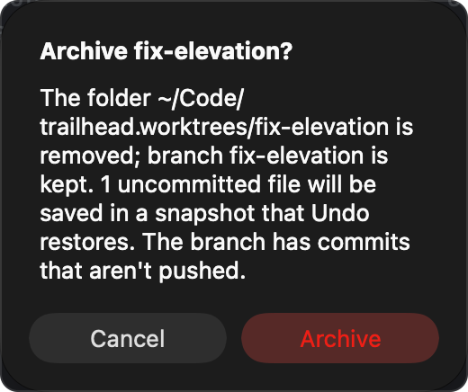

# Tasks

A task is a branch checked out in its own folder and opened as its own workspace. You can work on several things at once, or let several agents work in parallel, without stashing, switching branches or keeping a second clone. This page covers the whole lifecycle: starting a task, what Impulse sets up for you, working in it, and archiving it when you're done.

## Why tasks

A normal checkout has one working tree, so it holds one piece of work at a time. When you're halfway through `feature/forecast-cache` and a bug report comes in, you have to stash or commit half-done work, switch branches, fix the bug, and switch back. If an agent is editing files in that checkout, you can't touch the same files without getting in its way, and two agents in one checkout can't work at the same time.

Tasks remove that problem. Each task gets its own folder with its own branch, so:

- Your main checkout stays exactly as you left it while you fix the bug in a task.
- An agent can work in one task while you work in another, or while a second agent works in a third.
- Each task has its own terminals, file tree, git state and review, because each one is a separate workspace in the sidebar.

## Git worktrees in two sentences

A git worktree is an extra working folder attached to the same repository: it shares the repository's history, branches and objects, but has its own checked-out branch and its own files. Commits made in any worktree are immediately visible to all the others, because there is only one repository underneath.

Impulse's tasks are git worktrees with a naming convention and some setup on top. You don't need to run `git worktree` yourself.

## What a task gives you

When you create a task, Impulse:

- Creates a new branch from the base you choose (by default, the branch you're on).
- Checks it out in a folder beside your repository: `<repo>.worktrees/<branch>`. For `~/Code/trailhead`, a task named `fix-elevation` lives in `~/Code/trailhead.worktrees/fix-elevation`.
- Copies over the untracked files a fresh checkout lacks, such as `.env`.
- Opens the folder as a new workspace, grouped in the sidebar under its repository.
- Runs the project's setup script, then starts the agent you picked, in the task's first terminal.

When you're done, **Archive Task…** removes the folder and keeps the branch, with Undo.

## Start a task

### Where to start it

| Where                          | How                                                                                                           |
| ------------------------------ | ------------------------------------------------------------------------------------------------------------- |
| Menu bar                       | **File ▸ New Task…**                                                                                          |
| Keyboard                       | ⌥⌘N                                                                                                           |
| Command palette                | ⇧⌘P, then type `new task` and choose **New Task…**                                                            |
| A workspace row's **+** button | Hover the row in the sidebar, click **+** (tooltip "New workspace"), then choose **New Task from trailhead…** |
| A workspace row's context menu | Control-click (or right-click) the row and choose **New Task…**                                               |

The menu, shortcut and palette start a task from the repository of the active workspace (in the Scratch workspace, the repository of the active tab's directory). The **+** button and the context menu start it from that row's repository, so you can start a task for `trailhead` while you're looking at another workspace. The **+** and context-menu items only appear on rows that are in a git repository.

Tasks always come from the repository's main checkout. Started from a task's row, or with a task workspace active, the new task's folder still goes beside the repository (`~/Code/trailhead.worktrees/…`), and **From** defaults to the main checkout's branch, not the task's.

If there's no repository to start from, Impulse shows "Open a folder in a git repository to start a task." Open the repository as a workspace first (see [Workspaces and tabs](workspaces-and-tabs.md)).

### The New Task sheet


The sheet has three fields and a preview.

#### Task

A short description of the work, for example "Fix elevation". Impulse turns it into the branch name (see [How the branch name is made](#how-the-branch-name-is-made)). The title is only used for the name; it isn't stored anywhere else. **Create Task** stays disabled until you type something and Impulse has finished looking up the repository's branches and the files to copy (a moment after the sheet opens). Return in this field creates the task.

#### From

The base the new branch starts from. It's filled in with the branch checked out in the repository's main checkout, even when you start from a task (or `HEAD` if the main checkout is on a detached HEAD). You can type any other base git understands: a local branch (`main`), a remote branch (`origin/main`), a tag (`v0.2.0`) or a commit. If you clear the field, the branch starts from the repository's current `HEAD`.

#### Start

What runs in the task's first terminal. **Just a terminal** (the default) opens a shell and nothing else. The rest of the list is every supported agent that Impulse finds on your login shell's `PATH`, by its display name: Claude Code (`claude`), Codex (`codex`), Gemini CLI (`gemini`), Aider (`aider`), opencode (`opencode`), Amp (`amp`), Copilot CLI (`copilot`), Cursor Agent (`cursor-agent`), Goose (`goose`), Qwen Code (`qwen`) and Crush (`crush`). Agents that aren't installed don't appear. The agent starts with no arguments; type your first prompt into it once it's running.

#### The preview

The box below the fields shows what will happen before you commit to it:

| Line       | Shows                                                                                                                                                                                    |
| ---------- | ---------------------------------------------------------------------------------------------------------------------------------------------------------------------------------------- |
| **Branch** | The branch name made from the title, already made unique. Shows `—` until you type a title.                                                                                              |
| **Folder** | Where the task's folder will be, for example `~/Code/trailhead.worktrees/fix-elevation`. Shows `—` until you type a title.                                                               |
| **Copies** | The untracked files that will be copied into the task, for example `.env`. Shows `…` while Impulse looks them up, and "nothing (add patterns to .worktreeinclude)" when nothing matches. |

Click **Create Task** (it reads **Creating…** while it works) or press Return. **Cancel** or Esc closes the sheet without creating anything. If creation fails, the sheet stays open and shows the reason in red, so you can fix the title or base and try again.

### How the branch name is made

Impulse makes a branch name from the task title with these rules:

1. Accents are removed and letters are lowercased ("Élévation" becomes "elevation").
2. ASCII letters, digits and `/` are kept. Every run of other characters (spaces, punctuation, symbols) becomes a single `-`.
3. Dashes and slashes at the end are dropped, and the name is cut to at most 48 characters.
4. If nothing is left (for example, the title was all punctuation), the name is `task`.
5. If a local branch with that name already exists, Impulse adds `-2`, then `-3`, and so on until the name is free.

A `/` in the branch name is fine (`feat/search-ui`), but the task's folder replaces each `/` with `-`, so every task is a single folder: branch `feat/search-ui` lives in `trailhead.worktrees/feat-search-ui`.

| Task title                   | Branch              | Folder (under `~/Code/trailhead.worktrees/`) |
| ---------------------------- | ------------------- | -------------------------------------------- |
| `Fix elevation`              | `fix-elevation`     | `fix-elevation`                              |
| `Fix the login bug!`         | `fix-the-login-bug` | `fix-the-login-bug`                          |
| `feat/Search UI`             | `feat/search-ui`    | `feat-search-ui`                             |
| `Fix elevation` (taken once) | `fix-elevation-2`   | `fix-elevation-2`                            |
| `!!!`                        | `task`              | `task`                                       |

Only local branch names are checked. If you want a specific name, type it as the title (`fix/elevation-units`); the preview shows exactly what you'll get.

### What happens when you click Create Task

1. **Check the folder.** If the task's folder already exists, Impulse stops and shows "`~/Code/trailhead.worktrees/fix-elevation` already exists." in the sheet.
2. **Create the worktree.** Impulse runs the equivalent of `git worktree add -b fix-elevation ~/Code/trailhead.worktrees/fix-elevation main` from the repository, creating the `trailhead.worktrees` folder if needed. Any git error (for example, a base that doesn't exist) is shown in the sheet.
3. **Copy untracked files.** The files listed under **Copies** are copied from the repository into the same relative paths in the task. A file that already exists in the task (because it's tracked and was checked out) is left alone. See [Which files are copied](#which-files-are-copied).
4. **Carry over trust.** If the repository is a trusted folder, the task folder is trusted too, so language servers, formatters on save and background fetch work in it straight away. If the repository isn't trusted, the task folder isn't either, and you're asked about it like any other folder you open (when **Ask before trusting folders** is on). Trusting the parent folder from the trust prompt (for example `~/Code`) covers task folders too, because they live beside the repository. See [Getting started](getting-started.md) for workspace trust.
5. **Ask about the project file.** If the task has a `.impulse/project.toml` with commands in it and you haven't trusted that exact file yet, Impulse asks before running anything from it. See [Project configuration](project-config.md#trusting-the-project-file).
6. **Open the workspace.** The task opens as a new workspace with one terminal in the task folder. That terminal runs the project's setup script (if there is one and you trusted the file), then the agent you chose under **Start**. When both are set, they run as one command joined with `&&`, for example `npm ci && claude`, so the agent only starts if setup succeeds.
7. **Confirm.** A toast says "Started task fix-elevation."

### Which files are copied

A new worktree only contains tracked files. Files you keep out of git, such as `.env` with local secrets, aren't there, and your app may not run without them. Impulse copies them for you, based on:

- **`.worktreeinclude`** at the repository root, if the file exists: one pattern per line.
- **No `.worktreeinclude`**: the defaults `.env`, `.env.local` and `.claude/settings.local.json` (Claude Code's project-only settings, where "This project only" [agent hooks](agents.md#agent-hooks) live, so a new task keeps the project's hooks).
- **`[worktrees] copy`** in `.impulse/project.toml`: extra patterns, added to whichever of the two above applies.

In the trailhead project, `.worktreeinclude` contains:

```
# Local settings a fresh checkout doesn't have
.env
```

Patterns name files relative to the repository root and can use shell wildcards (`*`, `?`, `[…]`) in the last part of the path: `.env*` matches `.env`, `.env.local` and `.env.test`; `config/*.local.json` matches the matching files in `config/`. Only files are copied. A pattern that names a folder (`node_modules`, `config`) copies nothing, and folders aren't searched recursively. Patterns that point outside the repository are ignored. The full format is in [Project configuration](project-config.md#worktreeinclude).

The list is worked out when the sheet opens, from the files in the repository at that moment; the **Copies** line shows the result.

For things that are too big to copy or should be built fresh, such as `node_modules`, use a setup script instead (`setup = "npm ci"` in `.impulse/project.toml`). See [Setup script](project-config.md#setup-script).

## Tasks in the sidebar


A task appears in the Workspaces section at the top of the sidebar like any other workspace, named after its folder (`fix-elevation`). When two or more open workspaces belong to the same repository (the main checkout and its tasks, or several tasks), Impulse groups them under a header with the repository's name (`trailhead`) and indents their rows. With only one workspace open from a repository, there is no header.

Each row shows, from left to right:

- The workspace name, and the branch when it differs from the name. A task named after its branch (`fix-elevation` on branch `fix-elevation`) shows the name once.
- Listening ports from the task's terminals (`:3000`), for example its dev server.
- A spinner while an agent in the workspace is working, and a bot icon with a count when agents are waiting for you.
- The workspace's uncommitted changes as added and removed lines.
- A badge with the number of tabs that need attention, or the tab count.

Hover a row for its full path, branch, changed-file count and tab count. Click the chevron (or choose **Show Tabs** from the context menu) to list the workspace's tabs under it.

The row's context menu has **New Task…**, **Open Folder as Workspace…**, **Rename…**, **Reveal in Finder**, **Copy Path**, **Show Tabs** / **Hide Tabs**, **Archive Task…** (on task rows only) and **Close Workspace**.

Impulse treats any workspace that is a linked git worktree as a task, including worktrees you created yourself with `git worktree add`. They get **Archive Task…** too.

## Work in a task

A task workspace behaves like any folder workspace. Everything you do in it applies to the task's folder and branch, never to your main checkout.

- **Terminals.** New terminal tabs (⌘T) and splits start in the task folder. Switch between the task and your other workspaces by clicking rows in the sidebar or with **Switch Workspace…** (⌃⌘O).
- **Agents.** If you started an agent, it's running in the first terminal. Its status shows on the tab, on the workspace row and in the titlebar's Agents button, and ⇧⌘U jumps to whichever agent needs you next. See [Agents](agents.md).
- **Project actions.** **Run Project Action…** (⌃⌘R) runs the actions from the task's own copy of `.impulse/project.toml`, in the task folder. See [Project configuration](project-config.md#project-actions).
- **Review the task's changes.** **Git ▸ Review Changes** (⇧⌘G) opens Review on the task's uncommitted changes. To see everything the task changed since it branched (commits and uncommitted work together), open the scope menu at the top left of Review and choose **Compare with origin/main** (Impulse offers the remote's default branch, or a local `main`/`master` when there's no remote default). After an agent's turn, ⇧⌘I reviews just that turn. See [Review](review.md).
- **Commit.** **Git ▸ Show Changes** (⌃⇧G) opens the Changes panel for the task's repository, where you stage and commit. See [Git](git.md).
- **Push.** **Git ▸ Push** publishes the task's branch the first time (it sets the upstream on your default remote) and pushes after that.
- **Open a pull request.** **Git ▸ Open or Create Pull Request** opens the branch's pull request, or starts one in your browser through the GitHub CLI (`gh`). **Git ▸ Create Draft Pull Request** creates a draft titled and described from the branch's commits; if the branch isn't published yet, it offers to publish it first.

Because all tasks share one repository, a commit in a task is immediately visible from your main checkout and from other tasks: in History, in the branch switcher and to `git log`.

### Example: two agents in parallel

1. With the `trailhead` workspace active, press ⌥⌘N. Type "Fix elevation", leave **From** as `main`, choose **Claude Code** under **Start**, and click **Create Task**.
2. In the new `fix-elevation` workspace, type the prompt for Claude Code in its terminal.
3. Click the `trailhead` row in the sidebar and press ⌥⌘N again. Type "Add trail difficulty filter", choose **Codex**, and click **Create Task**.
4. Give Codex its prompt. Both agents now work in separate folders on separate branches.
5. Go back to `trailhead` and keep working on your own branch. When an agent finishes or needs input, its row and tab show it; press ⇧⌘U to jump to it.
6. When an agent finishes a turn, press ⇧⌘I in its terminal to review exactly what it changed.

## Finish a task

### Merge the work back

Two common ways:

- **Through a pull request.** Push the task's branch and open a pull request (see [Work in a task](#work-in-a-task)). Merge it on your git host as usual, then archive the task.
- **Locally.** Switch to the `trailhead` workspace (the main checkout, on `main`), choose **Git ▸ Manage Branches…**, open the **…** menu on the `fix-elevation` row and choose **Merge into main**. You can also merge from History (⇧⌘H): right-click the `fix-elevation` branch label (or its latest commit) and choose **Merge into main**. See [Git](git.md) and [History](history.md).

You can't check out the task's branch in your main checkout while the task exists: git only lets a branch be checked out in one worktree at a time. Merge it instead, or archive the task first.

### Archive the task

Archiving removes the task's folder and closes its workspace, and keeps its branch and commits. Use it when the work is merged, or when you want to put it aside.

1. Choose **Archive Task…** from the task row's context menu, or, with the task workspace active, run **Archive Task…** from the command palette.
2. Read the confirmation and click **Archive**. It says what will happen, for example: "The folder `~/Code/trailhead.worktrees/fix-elevation` is removed; branch fix-elevation is kept." It also warns when the task has uncommitted files ("3 uncommitted files will be saved in a snapshot that Undo restores."), when the folder has ignored files, naming up to three of them ("Ignored files in it (.env, node_modules/, …) are deleted, and Undo can't bring them back."), and when "The branch has commits that aren't pushed."
3. If the task's `.impulse/project.toml` has commands you haven't trusted yet, Impulse asks about the file (see [Project configuration](project-config.md#trusting-the-project-file)).
4. The workspace closes. As when closing any workspace, Impulse first asks about unsaved files and running processes in its tabs; if you cancel there, nothing is removed.
5. If the project file has an archive script and you trusted it, Impulse runs it in the task folder. If the script fails or runs longer than two minutes, a toast says "The archive script failed; archiving anyway."
6. Impulse saves any uncommitted work (modified and untracked files that aren't ignored) in a safety snapshot, then removes the worktree folder. If the snapshot can't be made, the task is not archived and Impulse tells you why.
7. A toast says "Archived fix-elevation. The branch is kept." with an **Undo** button.

**Undo** recreates the folder on the same branch, puts back the uncommitted files from the snapshot, trusts the folder again if the repository is trusted, and reopens the workspace. The toast stays for 15 seconds, so click it right away if you didn't mean to archive.



| Archiving…                                                         | Removes |            Keeps            |
| ------------------------------------------------------------------ | :-----: | :-------------------------: |
| The task's folder and everything in it                             |    ✓    |                             |
| The task's workspace and tabs                                      |    ✓    |                             |
| The branch and all its commits                                     |         |              ✓              |
| Uncommitted changes (tracked and untracked)                        |         | ✓ (in a snapshot, for Undo) |
| Ignored files in the folder (`.env`, `node_modules`, build output) |    ✓    |                             |

### Delete the branch

Archiving never deletes the branch. Once the work is merged, delete it from **Git ▸ Manage Branches…**: open the **…** menu on its row and choose **Delete…**. Merged branches are marked "merged" there. A branch can't be deleted while a task still has it checked out, so archive the task first.

### Close instead of archive

**Close Workspace** closes the task's workspace and leaves its folder and branch on disk. Reopen it later from **Switch Workspace…** (⌃⌘O), where it's listed as a recent folder, or with **File ▸ Open Folder as Workspace…**.

## Check out a pull request as a task

**Git ▸ Check Out Pull Request as Task…** opens the command palette in pull request mode (`pr:`), listing the repository's open pull requests through the GitHub CLI (`gh`). Choose one, and Impulse creates a worktree beside the repository's main checkout, has `gh` check out the pull request into it (setting up a fork's remote if needed), copies the same untracked files as **New Task…** (see [Which files are copied](#which-files-are-copied)), and opens it as a workspace. If the pull request's own `.impulse/project.toml` has a setup script, Impulse shows it, with the pull request's number, author and title, and asks whether to run it in the first terminal. It asks every time, even when you've trusted the repository's project file, because a pull request can change what the script does (a `package.json` script that `npm ci` runs, for example) without touching that file, and your answer isn't remembered. Choose **Don't Run** to open the task without it. The local branch is the pull request's branch name, or `pr-<number>-<branch>` when that name is taken locally or is a default branch name such as `main`. See [Git](git.md).

Unlike **New Task…**, checking out a pull request doesn't start an agent, and the folder doesn't inherit the repository's workspace trust: a pull request can come from someone else's fork, so you're asked about the folder like any other you open (unless a parent folder you trusted already covers it).

## Gotchas

- **"… already exists."** A folder with the task's name is already in `trailhead.worktrees`. Pick a different title, or move the folder away.
- **Deleting a task folder by hand.** If you remove a task's folder in Finder or with `rm` instead of archiving it, git still considers its branch checked out there, so you can't switch to or delete that branch. Run `git worktree prune` in the repository to clear it.
- **`node_modules` and build output aren't copied.** Only files matching `.worktreeinclude` (or the defaults) are copied, and folders never are. Add a setup script such as `npm ci` to `.impulse/project.toml`.
- **A `.worktreeinclude` replaces the defaults.** Once the file exists, `.env`, `.env.local` and `.claude/settings.local.json` are only copied if a pattern in it matches them. An empty `.worktreeinclude` copies nothing (except `[worktrees] copy` patterns).
- **The setup script comes from the task's own checkout.** Impulse reads `.impulse/project.toml` from the new task folder, which contains what's committed on the base branch. An uncommitted or untracked project file in your main checkout doesn't reach the task (unless you copy it with `.worktreeinclude`).
- **A failing setup script stops the agent from starting**, because the two are joined with `&&`. The error is right there in the task's first terminal; fix it and start the agent yourself.
- **Archiving deletes ignored files.** `.env`, `node_modules` and other ignored files in the task folder are removed with it, and Undo doesn't bring them back (the snapshot only holds files git would track). The confirmation names some of them when there are any. Copy anything you edited by hand before archiving.
- **Undo is short-lived.** If you miss the **Undo** button, the branch still exists and you can make a new worktree for it with `git worktree add ~/Code/trailhead.worktrees/fix-elevation fix-elevation`. The uncommitted files are in a commit under `refs/impulse/oplog/` in the repository (list them with `git for-each-ref refs/impulse/oplog`); the newest one ending in `archive-fix-elevation` holds them, and `git restore --overlay --source=<that ref> --worktree -- .` in the recreated folder puts them back. Don't wait too long: Impulse keeps these snapshots for two weeks at most, and only the newest 200 in the repository, deleting older ones whenever it takes a new snapshot there (see [Safety snapshots and Undo](git.md#safety-snapshots-and-undo)).
- **Branches checked out in a task can't be used elsewhere.** git refuses to switch your main checkout (or another task) to a branch that a task has checked out, and refuses to delete it. Archive the task first.
- **Tasks need a git repository.** In a folder that isn't in a repository, New Task… only shows "Open a folder in a git repository to start a task."

## Related

- [Agents](agents.md): agent status, review last turn, the composer and hooks
- [Project configuration](project-config.md): `.impulse/project.toml`, setup and archive scripts, `.worktreeinclude`
- [Workspaces and tabs](workspaces-and-tabs.md): the sidebar, switching and closing workspaces
- [Git](git.md): the Changes panel, pushing, Manage Branches and pull requests
- [Review](review.md): reviewing a task's changes against its base
- [Getting started](getting-started.md): workspace trust
