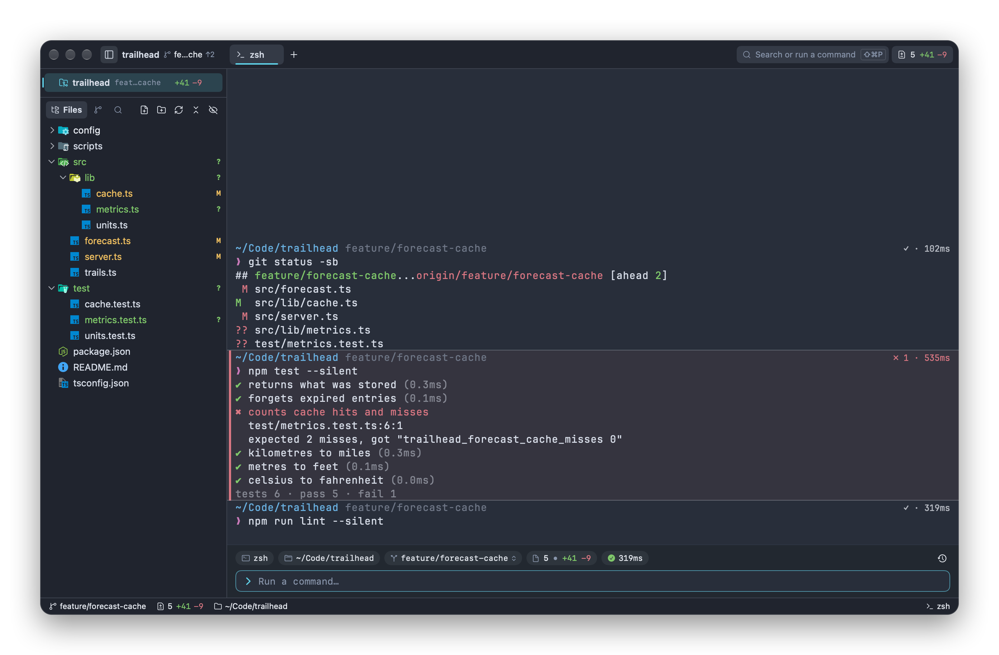
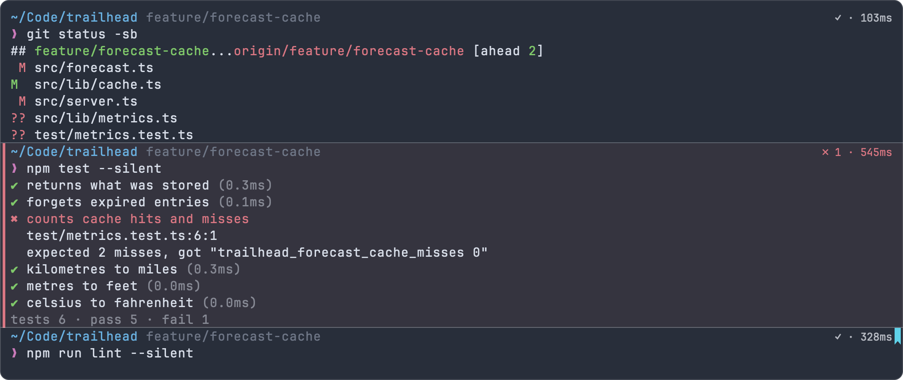
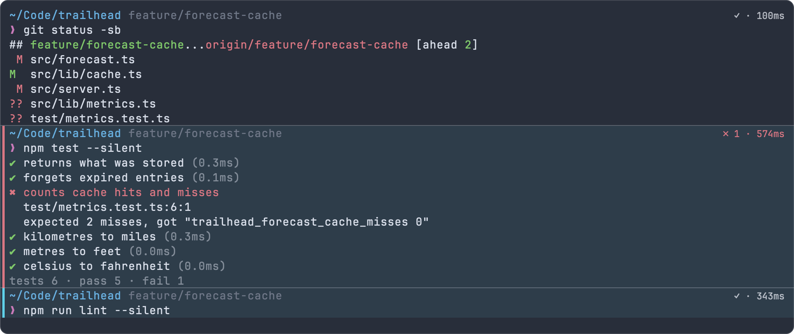
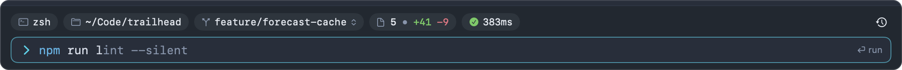
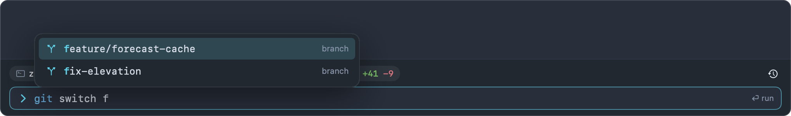
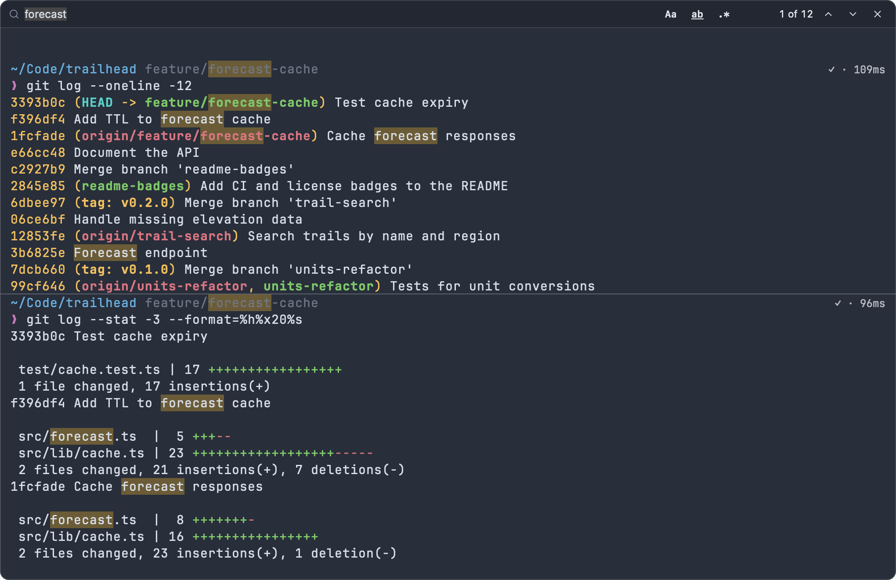
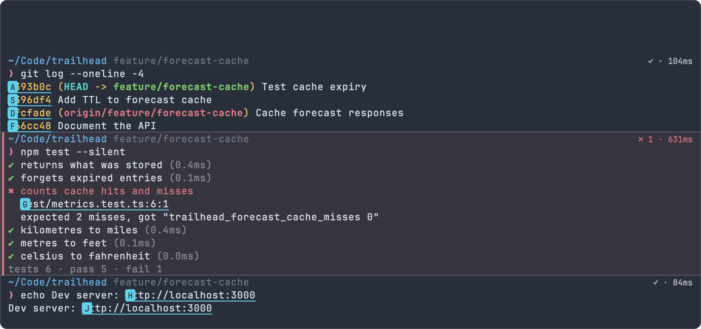
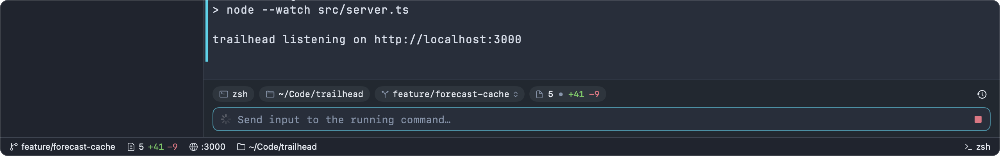

# Terminal

Impulse terminals run your own shell, with each command and its output kept together as a command block, and an input bar under the output where you type commands with highlighting, completions and history. This page covers everything about terminals: shell integration, blocks, the input bar, completions, history, find, hints, links, notifications, ports and the terminal settings.

## The terminal at a glance



A terminal tab has two parts:

- **The grid** shows output. With shell integration, Impulse splits it into [command blocks](#command-blocks): one per command, with its status and duration, separated by thin lines.
- **The input bar** sits below the grid of the focused terminal. Its top row holds context chips (shell, folder, branch, uncommitted changes, last command's status) and a history button; below them is the command editor, where you type. See [The input bar](#the-input-bar).

While a full-screen or raw-mode program (vim, htop, less, fzf, a coding agent) owns the terminal, the input bar steps aside and your keys go straight to the program. See [When the grid takes the keyboard](#when-the-grid-takes-the-keyboard).

If you prefer typing at your shell's own prompt, turn the input bar off. See [Classic prompt mode](#classic-prompt-mode).

## Shell integration

Shell integration is a small script Impulse loads into bash, zsh and fish. It tells Impulse where each prompt and command starts and ends, how each command exited, the shell's current folder, and what commands the shell can run. Command blocks, history, the unknown-command underline, the running indicator and long-command notifications all depend on it. You don't install anything: Impulse adds it every time it starts a shell, and it never changes your dotfiles.

### Choosing your shell

Impulse runs your login shell, the one recorded for your user account (what `chsh` sets). If it can't read that, it uses `$SHELL`, and then `/bin/bash`. There is no shell setting in Impulse. To use a different shell, change your login shell and open a new terminal:

```sh
chsh -s /opt/homebrew/bin/fish
```

The shell must be listed in `/etc/shells` for `chsh` to accept it. Terminals that are already open keep the shell they started with.

Shell integration is available for **bash**, **zsh** and **fish**, recognized by the shell program's name. Any other shell runs without integration (and without login-shell arguments).

### How Impulse loads it

Impulse loads your usual startup files first and the integration last, so your configuration runs as usual:

| Shell | How it starts                                                                                                                                                                                                                                                                                                                                                                         |
| ----- | ------------------------------------------------------------------------------------------------------------------------------------------------------------------------------------------------------------------------------------------------------------------------------------------------------------------------------------------------------------------------------------- |
| zsh   | A login shell with `ZDOTDIR` pointing at a temporary folder. Its startup files source your `.zshenv`, `.zprofile` and `.zshrc` from your own `ZDOTDIR` (your home folder unless you set one), load the integration after your `.zshrc` and give `ZDOTDIR` back to you, so your `.zlogin` runs as usual. If your `.zshenv` sets `ZDOTDIR`, the rest of your files are read from there. |
| bash  | `bash --rcfile` with a temporary file that sources `/etc/profile`, then the first of `~/.bash_profile`, `~/.bash_login` and `~/.profile` (or `~/.bashrc` when none of those exists), then the integration. This is what a login shell reads, so if your `~/.bash_profile` doesn't source `~/.bashrc`, `.bashrc` isn't read.                                                           |
| fish  | `fish --login --init-command <integration>`.                                                                                                                                                                                                                                                                                                                                          |

The temporary files are removed when the terminal closes. zsh still keeps its history in your own `.zsh_history` (in your `ZDOTDIR`, or your home folder), not in the temporary folder.

### What the integration reports

The script prints escape sequences that Impulse reads from the output stream:

| Sequence                 | When                             | What Impulse does with it                                                                                                                                               |
| ------------------------ | -------------------------------- | ----------------------------------------------------------------------------------------------------------------------------------------------------------------------- |
| OSC 133 `A`              | Each time a prompt is drawn      | Marks where the next block starts; the shell is idle at a prompt.                                                                                                       |
| OSC 133 `C`              | When a command starts running    | Starts the command's output and its timer.                                                                                                                              |
| OSC 133 `D;<exit code>`  | When the command finishes        | Ends the block and records its exit status and duration.                                                                                                                |
| OSC 7 `file://host/path` | At each prompt                   | The terminal's current folder (for the context chips, file tree, completions and links). Folders reported by a shell on another machine, such as over ssh, are ignored. |
| OSC 6973 `Command=`      | Just before a command runs       | The exact command text, for the block, history and Re-run.                                                                                                              |
| OSC 6973 `Names=`        | At a prompt, when they change    | The shell's aliases, functions, builtins and keywords, for the [unknown-command underline](#syntax-highlighting-and-the-unknown-command-underline).                     |
| OSC 6973 `Path=`         | At a prompt, when `PATH` changes | The shell's `PATH`; Impulse lists the executables on it in the background.                                                                                              |

The command text carries a secret that is unique to each terminal, so text that a program prints (a log file you `cat`, for example) can't pass itself off as a command and end up in your history.

### Environment variables in Impulse terminals

Impulse terminals inherit Impulse's environment, with these changes:

| Variable                                              | Value                                                                                                            |
| ----------------------------------------------------- | ---------------------------------------------------------------------------------------------------------------- |
| `TERM`                                                | `xterm-256color`                                                                                                 |
| `COLORTERM`                                           | `truecolor`                                                                                                      |
| `TERM_PROGRAM`                                        | `Impulse` (useful for Impulse-only settings in your shell config)                                                |
| `LANG`                                                | Your system's UTF-8 locale (for example `en_US.UTF-8`), only when none of `LANG`, `LC_ALL` and `LC_CTYPE` is set |
| `PATH`                                                | Starts with the folder that holds the bundled [`impulse` command-line tool](cli.md)                              |
| `IMPULSE_SOCKET`, `IMPULSE_PANE_TOKEN`, `IMPULSE_CLI` | Let the `impulse` tool find this window and this terminal                                                        |
| `EDITOR`, `VISUAL`                                    | `impulse edit`, only when **Use Impulse as $EDITOR** is on (see [CLI](cli.md))                                   |

Impulse leaves out the dynamic-loader variables (`DYLD_*`, `LD_PRELOAD` and similar) and its own `NO_COLOR`, `CLICOLOR`, `CLICOLOR_FORCE` and `FORCE_COLOR`. Your shell's startup files can still set any of these.

At launch, Impulse also runs your shell once in the background (`-i -l -c`) to learn your `PATH`, so it can find `git` and language servers even when started from the Dock. During that run `IMPULSE_RESOLVING_ENVIRONMENT=1` is set; check for it in your startup files to skip slow or interactive setup.

### Checking that integration works

After you run a command, its first line should end with a status such as `✓ · 120ms`, and the input bar's status chip should show the result. If commands never get a ✓ or ✗, the integration isn't running. To check from the shell, look for one of its functions:

```sh
type __impulse_precmd                 # zsh
declare -F __impulse_prompt_command   # bash
functions -q __impulse_prompt; and echo yes   # fish
```

Common reasons it isn't running:

- Your login shell isn't bash, zsh or fish.
- A startup file replaces the shell before the integration loads, for example with `exec tmux` or `exec fish` at the end of `.zshrc`. Shells started inside tmux, or by a nested `bash` or `ssh` session, aren't integrated either; the outer command's block lasts until you leave them.

### What you lose without it

Without shell integration a terminal still works as a terminal, but:

- Output isn't split into command blocks: no status chips, block actions, navigation, bookmarks or block selection.
- The input bar shows no status chip, no running indicator and no **Stop** button, and the unknown-command underline is off.
- Commands aren't added to the [command history](#command-history), and long-running commands don't notify you.
- Impulse learns the terminal's folder by checking every 5 seconds instead of at each prompt.
- Programs that draw inline without switching to the alternate screen (Claude Code, fzf) don't get the keyboard directly, because Impulse can't tell that a command is running.
- Impulse looks for coding agents when a command starts, so it only notices agents that announce themselves through [hooks](agents.md).

## Command blocks

A command block is one command and its output. Blocks make long sessions easy to scan, and they're what you copy, re-run, bookmark and send to agents.



### Reading a block

- **First line.** A block starts with your shell's prompt and the command, as the shell printed them. Whatever your prompt shows (folder, git branch) appears here.
- **Status chip.** When the command finishes, its result appears at the right end of the first line: `✓ · 1.2s` when it succeeded, or `✗ 1 · 3.4s` with the exit code when it failed. Durations read `850ms`, `1.2s`, `2m 5s` or `1h 2m`. The chip is left out when something already occupies that space, such as a right-side prompt.
- **Stripes.** A colored bar in the left margin marks a block that is still running (accent color) or failed (red, with a faint red tint over the block).
- **Separators.** A thin line separates blocks. Blank lines your prompt prints before itself are collapsed into a small gap.
- **Sticky header.** When you scroll partway through a long block, its command stays pinned along the top of the terminal (`❯ npm test`), with its status at the right, so you know whose output you're reading.

With the input bar on, the shell's prompt for the next command isn't drawn in the grid: the input bar takes its place, and the newest output sits directly above it.

### Block actions

Hover over a block to show its toolbar at the top-right corner:

| Button        | What it does                                                                                                                        |
| ------------- | ----------------------------------------------------------------------------------------------------------------------------------- |
| Copy output   | Copies the block's output (without the command).                                                                                    |
| Rerun command | Runs the block's command again. Shown when the block has a command and has finished.                                                |
| Send to agent | Sends the command, how it ended, and its output to a coding agent. See [Sending a block to an agent](#sending-a-block-to-an-agent). |
| More (⋯)      | Opens the block menu below, plus block navigation.                                                                                  |

Right-click a block for the same actions and more. The menu's first group acts on the block you clicked:

| Menu item                                                 | What it does                                                                                                                   |
| --------------------------------------------------------- | ------------------------------------------------------------------------------------------------------------------------------ |
| **Copy Command**                                          | Copies the command.                                                                                                            |
| **Copy Output**                                           | Copies the output.                                                                                                             |
| **Copy Command & Output**                                 | Copies both, separated by a blank line.                                                                                        |
| **Rerun Command**                                         | Runs the command again in the terminal's current folder (which may not be where it first ran). Unavailable while it's running. |
| **Send to Agent**                                         | Sends the block to an agent. Unavailable while it's running.                                                                   |
| **Bookmark Block** / **Remove Bookmark**                  | Toggles a [bookmark](#bookmarks).                                                                                              |
| **Copy**, **Paste**                                       | Copies the selected text; pastes the clipboard.                                                                                |
| **Copy Last Command**                                     | Copies the most recent command.                                                                                                |
| **Copy Last Command Output**                              | Copies the output of the most recent command that printed something.                                                           |
| **Rerun Last Command**                                    | Runs the most recent command again.                                                                                            |
| **Command History…**                                      | Opens [history search](#searching-history).                                                                                    |
| **Previous Block**, **Next Block**, **Last Failed Block** | Jump between blocks (see below).                                                                                               |
| **Select All**                                            | Selects the text on screen.                                                                                                    |
| **Clear**                                                 | Sends ⌃L to the shell, which clears the screen.                                                                                |

Right-clicking outside any block shows the same menu without the first group.

### Selecting blocks with the keyboard

Select blocks to copy several commands with their output at once, or to send them to an agent.

1. In the input bar or the grid, press ⌘↑. The newest block is selected and the keyboard moves to the blocks. (You can also choose **View ▸ Command Blocks ▸ Select Blocks**, or **Select Blocks** in the command palette.)
2. Press ↑ and ↓ to move to another block. Hold ⇧ to extend the selection over a range. ⌘-click a block to add it to the selection or remove it (⌘-click on a link opens the link instead).
3. Act on the selection:
   - ⌘C copies every selected block as `$ command` followed by its output, with a blank line between blocks.
   - ⇧⌘A sends the selected blocks to an agent.
4. Press Esc, or ↓ past the newest block, to go back to the input bar. Typing also leaves the selection, and what you type goes to the input bar. While a command is running, ⌃ keys such as ⌃C, and keys that don't type text (arrows, Tab, Return), leave the selection and go to the running program instead.



Selected blocks get an accent stripe and a light accent tint. Clicking elsewhere in the grid, or starting a new command, ends the selection.

### Jumping between blocks

The **View ▸ Command Blocks** menu moves through blocks: the target block is highlighted and scrolled into view.

| Menu item             | Shortcut | What it does                                                                                                            |
| --------------------- | -------- | ----------------------------------------------------------------------------------------------------------------------- |
| **Show Hints**        | ⇧⌘Space  | Labels links, files, commits and ports on screen. See [Hints mode](#hints-mode).                                        |
| **Select Blocks**     |          | Selects the newest block (⌘↑ from the input bar or the grid).                                                           |
| **Previous Block**    |          | The block before the highlighted one, or the newest block when none is highlighted.                                     |
| **Next Block**        |          | The block after the highlighted one, or the oldest block when none is. Past the newest block, it returns to the bottom. |
| **Last Failed Block** |          | The most recent block whose command failed.                                                                             |
| **Bookmark Block**    | ⇧⌘K      | Toggles a bookmark (see below).                                                                                         |
| **Previous Bookmark** |          | The previous bookmarked block, wrapping around.                                                                         |
| **Next Bookmark**     |          | The next bookmarked block, wrapping around.                                                                             |

**Select Blocks**, **Previous Block**, **Next Block**, **Last Failed Block**, **Previous Bookmark** and **Next Bookmark** have no shortcut by default (⌘↑ is a key of the input bar and the grid, not a menu shortcut, so it stays free in the editor and other text fields). You can give them one in Keyboard Shortcuts (see [Settings and themes](settings-and-themes.md)); it works whether the input bar or the grid has the keyboard.

### Bookmarks

Bookmark the blocks you'll want to find again, such as the failing test run you're fixing or the command that printed a token.

- ⇧⌘K (**Bookmark Block**) bookmarks the selected blocks; with none selected, the block you last jumped to; otherwise the newest block. Press it again to remove the bookmark. **Bookmark Block** in a block's right-click menu or ⋯ menu bookmarks that block.
- A bookmarked block has a small ribbon in the right margin of its first line.
- **Previous Bookmark** and **Next Bookmark** jump between them.

Bookmarks belong to the terminal and last until it closes; they aren't saved with the session.

### Sending a block to an agent

**Send to agent** turns a block into a message for a coding agent running in another terminal of the same window, for example to ask Claude Code why `npm test` failed. The message reads like:

````text
I ran `npm test` in /Users/you/Code/trailhead (exit status 1). Output:
```
…the output…
```
````

Long output is cut to its last 200 lines. Impulse picks the agent most likely meant: one waiting for you in the active workspace first, then any agent in that workspace, then any other agent in the window. The text is pasted into the agent's prompt without pressing Return, so you can add to it first; if the agent is in the middle of a turn, the text waits until the turn ends. If no agent is running in the window, Impulse tells you so. See [Agents](agents.md) for more.

### Turning blocks off

Turn off **Command blocks** (`terminal_blocks`) in Settings ▸ Terminal to draw output without separators, status chips, stripes, the hover toolbar or the sticky header. Shell integration keeps working, so history and notifications are unaffected.

## The input bar

The input bar is where you type commands. It edits like a text field (click anywhere, select, undo, use multiple lines), colors the command as you type, suggests completions, and keeps a draft per terminal: when you move to another terminal the bar goes with you, and your half-typed command waits in the terminal you left.



### Context chips

The top row shows where the next command will run:

| Chip    | Shows                                                                                        | Click to                                   |
| ------- | -------------------------------------------------------------------------------------------- | ------------------------------------------ |
| Shell   | The shell's name, such as `zsh`                                                              |                                            |
| Folder  | The terminal's current folder, with `~` for your home                                        |                                            |
| Branch  | The git branch                                                                               | Switch branches (see [Git](git.md))        |
| Changes | Changed files and lines added and removed (`3 • +42 -7`), when there are uncommitted changes | Open Review (⇧⌘G; see [Review](review.md)) |
| Status  | The last command's result: a check and its duration, or a cross with `exit 1 · 3.4s`         |                                            |

The clock button at the right opens [history search](#searching-history) (⌃R). In a narrow pane, chips drop off from the right, whole, to make room.

### Typing and running commands

Type a command and press Return to run it. The terminal scrolls to the bottom and the command's block appears above the bar.

- **Several lines.** Press ⇧↩ or ⌥↩ to start a new line. The bar grows to 8 lines and then scrolls. When you run a multi-line command, it reaches the shell as a single paste and runs as a whole, rather than line by line.
- **Pasting.** Pasted text keeps its newlines. Copied files paste as their paths, escaped for the shell. A copied image is saved as a PNG under `~/Library/Caches/Impulse/Pasted Images/` and its path is inserted.
- **Dropping files.** Drop files from Finder onto the terminal to insert their escaped paths into the input bar.
- **Typing or pasting while the grid has focus.** At a prompt, text you type or paste (⌘V) in the grid goes to the input bar, which takes the keyboard back, so it never sits unseen in the shell's own line.

When text is in the bar, a `⏎ run` hint shows at its right end.

### Syntax highlighting and the unknown-command underline

The bar colors the command with your theme's colors: the command name, options (`--watch`), quoted strings, variables and assignments, and operators such as `|`, `&&` and `>`.

A command name the shell can't run gets a dashed red underline once your cursor moves past it, with the tooltip `gti: command not found`. Impulse knows the shell's aliases, functions, builtins and keywords and every executable on its `PATH` (all reported by shell integration), so the underline doesn't fire for an alias like `gs` or a function from your config. Commands containing a `/` are checked on disk. Quoted or expanded words (`$cmd`, `"$(…)"`) are never underlined, and nothing is underlined until the shell has reported its commands.

A program you've just installed is found within about 10 seconds. bash reports its aliases and functions again only after commands that can define them (`alias`, `source`, `.`, function definitions, `unset`, `eval`); zsh and fish report whenever they change.

### Ghost suggestions

As you type, the rest of a likely command appears in dim text after the cursor:

1. **From history.** The most recent command that starts with what you typed, from this terminal's session first, then from your [history](#command-history) across terminals.
2. **Otherwise from completion.** A command name on your `PATH`, a common subcommand or option, or a path in the current folder.

The suggestion only shows when the cursor is at the end of the text, and not while a command runs.

- Press → at the end of the line to accept the whole suggestion, or ⌥→ to accept its next word (up to the next space or `/`), as in fish.
- Tab also accepts the whole suggestion when there's nothing else to complete. When several completions match, Tab opens the [completion menu](#completions) instead.

### Recalling recent commands

Press ↑ (on the first line of the bar) to step back through your 50 most recent commands, this terminal's first; press ↓ (on the last line) to step forward. Going past the newest brings back the draft you were typing. For anything older, use [history search](#searching-history).

### While a command runs

While a command runs, the bar's leading chevron becomes a spinner, the placeholder reads "Send input to the running command…", and a red **Stop** button (a square) appears at the right.

- **Stop** (or ⌃C in the bar) sends an interrupt (⌃C) to the program.
- Text you type and send with Return goes to the program as a line of input, exactly as typed (spaces included), which answers prompts like `Proceed? (y/N)` or feeds a REPL.
- Return on an empty bar sends a bare Return, for prompts like "Press Enter to continue". For a program that waits for a single key press, press Esc to move the keyboard into the grid and type there.

When the shell is back at a prompt, the bar takes the keyboard again.

### Password prompts

When a program turns off echo to read a password (`sudo`, `ssh`, `read -s`), the bar switches to a password field: a lock icon, the placeholder "Password (input hidden)…", and dots instead of characters. Return sends exactly what you typed, spaces included (an empty line is sent too). History, suggestions and completions are off for that field, and the draft you were typing is cleared when the field appears so it can't be sent as a password. ⌃C interrupts and Esc moves to the grid, as usual.

### When the grid takes the keyboard

Some programs need every key: full-screen programs on the alternate screen (vim, htop, less, tmux), and programs that switch on bracketed paste or mouse reporting while they run (Claude Code, Codex, fzf). While one of these owns the terminal, Impulse calls it direct interaction:

- The input bar hides and the grid gets the keyboard, including paste. Pasting an image there saves it to a temporary PNG and pastes its path, which agent CLIs pick up as an attachment.
- The command-block decorations are hidden so the program can draw everything.
- The tab's terminal icon changes to show that a program has the keyboard.
- When the program exits, the input bar comes back and takes the keyboard.

Outside direct interaction, clicking in the grid selects text but leaves the keyboard in the input bar. Press Esc in the input bar (with the completion menu closed) to move the keyboard into the grid when you need to send keys straight to the running program. At a prompt, nothing you type in the grid reaches the shell: text goes to the input bar, Return or Esc moves back to the bar, and other keys do nothing.

To write a longer prompt for an agent that owns the terminal, use the composer (⌘I); see [Agents](agents.md).

### Classic prompt mode

Turn off **Input bar** (`terminal_context_bar`) in Settings ▸ Terminal to type at your shell's own prompt in the grid instead. The grid then always has the keyboard, your shell's line editor, key bindings and completions work as they would in any terminal, and the shell's prompt is drawn as usual. Command blocks, history recording and notifications keep working (they come from shell integration); the input bar's chips, suggestions, completion menu and underline aren't available. ⌃R goes to your shell, and choosing a command from history search types it at the prompt. **Run in Terminal** shortcuts (see [Settings and themes](settings-and-themes.md#run-a-shell-command-from-a-shortcut)) run in a new terminal tab, so they never add to a command you're typing at the prompt.

The [quick terminal](workspaces-and-tabs.md) always uses the shell's own prompt.

### Input bar keys

| Key    | Action                                                                                            |
| ------ | ------------------------------------------------------------------------------------------------- |
| ↩      | Run the command (or accept the highlighted completion when the menu is open)                      |
| ⇧↩, ⌥↩ | New line                                                                                          |
| Tab    | Open the completion menu; accept the highlighted completion; or accept the ghost suggestion       |
| →      | At the end of the line: accept the ghost suggestion                                               |
| ⌥→     | At the end of the line: accept the next word of the ghost suggestion                              |
| ↑, ↓   | On the first or last line: previous or next command from history; in the menu: move the highlight |
| Esc    | Close the completion menu; otherwise move the keyboard into the grid                              |
| ⌃C     | Interrupt the running program                                                                     |
| ⌃R     | Search command history                                                                            |
| ⌘↑     | Select the newest command block (from the grid too)                                               |
| ⌘V     | Paste (files as paths, images as a saved PNG's path)                                              |

## Completions

Press Tab in the input bar to see what can come next at the cursor: commands, subcommands, options, git branches, package scripts, Makefile targets, ssh hosts or paths.



### Using the menu

1. Type part of a command, such as `git switch f`, and press Tab.
2. If exactly one candidate matches, Tab inserts it, like a shell's Tab (unless a ghost suggestion is showing, which Tab accepts instead). If several match, a menu opens above the bar. Typing narrows it.
3. Move with ↑ and ↓, then:
   - Press Tab or click a candidate to insert it. A folder ends in `/` and the menu reopens with its contents, so you can keep drilling down.
   - Press Return to insert it and close the menu.
   - Press Esc to close the menu without inserting anything.

Inserted values are quoted for the shell when they need it (a file named `trail notes.md` is inserted as `'trail notes.md'`), and a file gets a trailing space. Typing never opens the menu on its own. It closes when the input bar loses focus, the window moves or resizes, or a command starts.

Each row shows an icon for its kind, the name with the part you typed emphasized, and a note at the right: the option's or subcommand's description, the script's command, a path's git status (`M`, `A`, `?`, …), or `dir` / `file`. The menu shows up to 50 candidates.

### What gets completed

| Where the cursor is                                                                                                                 | Candidates                                                                                                   |
| ----------------------------------------------------------------------------------------------------------------------------------- | ------------------------------------------------------------------------------------------------------------ |
| The command word                                                                                                                    | Commands Impulse has completions for, common commands, and executables on your `PATH`                        |
| After `git`, `npm`, `pnpm`, `yarn`, `bun`, `cargo`, `docker`, `kubectl`, `swift`, `brew`, `gh`, `go`, `terraform`, `pip` and others | Their subcommands and options, with descriptions                                                             |
| A branch argument (`git switch`, `git merge`, `git push origin`, `git branch -d`, …)                                                | Local branches of the repository in the terminal's folder; remotes and tags where git expects them           |
| `npm run`, or a script name after `pnpm`, `yarn` or `bun`                                                                           | Scripts from the nearest `package.json`, with each script's command                                          |
| After `make`                                                                                                                        | Targets from the `Makefile` in the current folder                                                            |
| After `just`                                                                                                                        | Recipes from the nearest justfile, with the comment above each                                               |
| After `ssh` or `mosh`                                                                                                               | `Host` entries from `~/.ssh/config`                                                                          |
| After `cd`                                                                                                                          | Folders                                                                                                      |
| Anything else                                                                                                                       | Paths in the current folder: folders first, then files. Hidden files appear when you start the name with `.` |

### Fish's own completions

If your shell is fish, turn on **Ask the shell for completions** (`terminal_shell_completions`) in Settings ▸ Terminal to add everything fish's completion scripts know to the menu, with their descriptions. Impulse asks fish with `complete -C` in the terminal's folder, puts its own candidates first and adds what only fish knew, and reuses fish's answer for a few seconds while you type. A fish that takes longer than 1.5 seconds to answer is skipped. bash and zsh have no equivalent that works outside an interactive session, so this setting does nothing for them.

## Command history

Impulse keeps one history of the commands you run in all its terminals, with where each ran and how it ended. It feeds ghost suggestions, ↑/↓ in the input bar and history search.

### What is recorded

Each command recorded by shell integration is stored when it finishes, with its folder, repository, branch, exit status and duration. Commands that start with a space aren't recorded (the shells' usual way to keep a command out of history). The history lives in `~/Library/Application Support/impulse/history.sqlite3` and keeps your most recent 100,000 runs. It's stored only on your Mac.

To stop recording, turn off **Keep command history** (`terminal_persistent_history`) in Settings ▸ Terminal. Commands already stored stay in the file.

### Searching history

Press ⌃R in the input bar, click the clock button in the context chips, or choose **Command History…** in the command palette. History search opens in the command palette (its `h:` mode).

- Type to search (matching is fuzzy). With nothing typed, the most recent commands come first.
- Each result shows the folder it ran in, how long ago, `exit N` if it failed, and `×N` when you've run it more than once.
- Narrow the search with these words, alone or combined with text:

| Filter    | Shows commands                                    |
| --------- | ------------------------------------------------- |
| `@here`   | Run in the focused terminal's folder              |
| `@repo`   | Run anywhere in the focused terminal's repository |
| `@failed` | That exited with an error                         |
| `@today`  | Run since midnight                                |

Choosing a result puts the command in the input bar without running it, so you can edit it first. In a terminal without the input bar (or while a program owns the grid), it's typed at the prompt instead; with no terminal focused, it's copied to the clipboard. See [Command palette](command-palette.md) for more on the palette.

### Importing your shell history

To start with the commands you've already typed elsewhere, run **Import Shell History** from the command palette. It reads `~/.zsh_history` (including zsh's extended format), `~/.bash_history` and `~/.local/share/fish/fish_history`, and reports how many commands it added.

## Find in the terminal

Press ⌘F (**Edit ▸ Find…**) in a terminal to search its whole scrollback. The find bar opens along the top of the terminal.



- Matches are highlighted as you type, and the count shows at the right: `2 of 7`, `7 found`, `No results`, or `Invalid pattern` for a regular expression that doesn't parse. Counting stops at 9,999 (`9999+`).
- Press Return or click the down chevron for the next match; ⇧↩ or the up chevron for the previous one.
- **Aa** (Match case): searches are case-insensitive until you turn this on.
- **ab** (Whole word): matches whole words only.
- **.\*** (Regular expression): treats the text as a regular expression (Rust regex syntax).
- If you've selected text on a single line in the terminal, Find starts with it. Otherwise it searches again for your last query.
- Press Esc, click ✕, or press ⌘F again to close the bar. The highlights are cleared and the terminal gets the keyboard back.

## Links and file references

Impulse makes three kinds of text in the output clickable. Hover over one to underline it (the pointer becomes a hand), and ⌘-click to open it:

| What             | Example                                                                       | ⌘-click                                                     |
| ---------------- | ----------------------------------------------------------------------------- | ----------------------------------------------------------- |
| OSC 8 hyperlinks | Links that programs print with OSC 8, whose text can differ from their target | Opens the link's target. The tooltip shows the real target. |
| Web addresses    | `https://github.com/…`                                                        | Opens in your browser                                       |
| File references  | `src/forecast.ts:42:7`, `test/cache.test.ts(12,5)`, `File "app.py", line 8`   | Opens the file in the editor at that line and column        |

File references include paths with a slash or a file extension, with an optional `:line:column` or `(line,column)`, and Python traceback lines. Relative paths are resolved against the terminal's current folder, and only files that exist are linked. If you've changed folders since the output was printed, an old relative path may no longer resolve.

Links from program output can point anywhere, so Impulse is careful about opening them: `http`, `https` and `mailto` links open directly, `file` links open files in the editor and show folders in Finder (nothing is launched), and any other kind of link asks first, showing the full target.

To turn links off, turn off **Clickable links** (`terminal_allow_hyperlink`) in Settings ▸ Terminal.

## Hints mode

Hints mode lets you open, copy or insert anything on screen without the mouse. Press ⇧⌘Space (**View ▸ Command Blocks ▸ Show Hints**, or **Show Hints** in the command palette). Every target on screen is underlined and gets a short label made of home-row letters: single letters (`A`, `S`, `D`, …) when there are nine targets or fewer, otherwise two letters each (`AA`, `AS`, `AD`, …).



| Target          | What counts                                                           | Opening it                                      |
| --------------- | --------------------------------------------------------------------- | ----------------------------------------------- |
| URLs            | `http://`, `https://` and `file://` addresses                         | Opens in your browser                           |
| Ports           | `localhost:3000`, `127.0.0.1:8080`, `0.0.0.0:5173`, `[::1]:4000`      | Opens `http://localhost:<port>` in your browser |
| File references | Like [file links](#links-and-file-references); only files that exist  | Opens the file in the editor at the line        |
| Commit SHAs     | 7 to 40 hexadecimal characters with at least one letter and one digit | Opens [History](history.md) at that commit      |

Type a label to act on its target:

| Keys                           | Action                                                                                   |
| ------------------------------ | ---------------------------------------------------------------------------------------- |
| The label                      | Open the target                                                                          |
| ⇧ with the label's last letter | Copy the target (a file's full path) to the clipboard                                    |
| ⌥ with the label's last letter | Insert the target into the input bar (or at the prompt, when a program has the keyboard) |
| ⌫                              | Undo the last letter typed                                                               |
| Esc, or a click                | Leave hints mode                                                                         |

Hints cover only what's visible on screen. When there's nothing to label, Impulse beeps.

## Selecting, copying and pasting

- **Select** text by dragging. Double-click selects a word and triple-click a line. **Select All** (⌘A while the grid has the keyboard, or from the right-click menu) selects the visible screen.
- **Copy on select** (`terminal_copy_on_select`, on by default) copies a selection to the clipboard as soon as you release the mouse. ⌘C copies the selection too.
- **Services.** With text selected in the grid, the **Impulse ▸ Services** menu can act on it (Look Up, Search With…, Make New Sticky Note and other services you have).
- **Programs and the clipboard.** Programs can set the clipboard with OSC 52, as tmux, vim and ssh sessions do (**Programs may set the clipboard**, on by default). Reading the clipboard is off by default (**Programs may read the clipboard**); when you turn it on, Impulse answers the program's request with the clipboard's contents.
- **Pasting** follows the input bar rules: at a prompt, text goes into the input bar; while a program owns the grid, it's sent to the program, as a bracketed paste when the program asks for one. Trailing newlines are removed, and control characters are stripped from bracketed pastes so pasted text can't end the paste early.
- **Mouse reporting.** When a program turns on mouse reporting (htop, vim with `mouse=a`), clicks, drags and the scroll wheel go to the program instead of selecting text.

## Scrolling and scrollback

Each terminal keeps **Scrollback lines** (`terminal_scrollback`, 10,000 by default, up to 1,000,000) of output. A change applies to terminals you open afterward.

- Scroll with the trackpad or wheel. While you're scrolled up, new output doesn't move the view; scroll back to the bottom to follow it again. Running a command, or typing to a program in the grid, jumps to the bottom.
- **Scroll to bottom on output** (`terminal_scroll_on_output`, on by default) keeps the view at the newest output.
- In a full-screen program that doesn't use the mouse, scrolling sends Page Up and Page Down to it.

### Restored scrollback

When Impulse restores your session, each terminal starts a fresh shell in its previous folder and shows roughly the last 2,000 lines of its previous output, colors included, above a dim rule that reads `── restored from the previous session ──`. Restored output is plain text: it isn't split into command blocks. Reopening a closed tab brings its output back the same way. Turn off **Restore terminal scrollback** (`restore_scrollback`) in Settings ▸ General to start restored terminals empty. See [Workspaces and tabs](workspaces-and-tabs.md) for session restore.

## Font, cursor and colors

- **Zoom.** **View ▸ Increase Font Size** (⌘=), **Decrease Font Size** (⌘-) and **Reset Font Size** (⌘0) change the terminal and editor font sizes together, one point at a time between 6 and 72. Reset returns both to 14.
- **Font family** (`terminal_font_family`) defaults to JetBrains Mono, which comes with Impulse. **Font size** is `terminal_font_size`; the input bar's text follows it (and zoom), one point smaller, in the system's monospaced font.
- **Bold text uses bright colors** (`terminal_bold_is_bright`, on): bold text in one of the 8 basic colors uses its bright variant.
- **Minimum contrast** (`terminal_minimum_contrast`, 3 by default): Impulse lifts text colors that are too close to their background to at least this contrast ratio. Set it to 1 to turn it off.
- **Cursor shape** (`terminal_cursor_shape`: block, underline or beam) and **Blinking cursor** (`terminal_cursor_blink`).
- Colors come from your theme. See [Settings and themes](settings-and-themes.md).

## Clearing, interrupting and exiting

- **Interrupt.** Click **Stop** in the input bar or press ⌃C there. With the grid focused, ⌃C goes to the running program as usual.
- **Clear.** Right-click the terminal and choose **Clear** (it sends ⌃L to the shell), or run `clear`.
- **Exit.** When the shell exits (for example after you run `exit`), its pane closes, and the tab with it if it was the only pane. Closing a terminal whose command is still running asks first while **Warn before closing active work** is on; see [Workspaces and tabs](workspaces-and-tabs.md).

## Notifications and attention

Terminals in other tabs, workspaces and windows keep running, and Impulse tells you when one needs you.

### What asks for attention

| Event                          | Setting (Settings ▸ Terminal ▸ Bell & notifications)                          | What happens                                                                                                                                |
| ------------------------------ | ----------------------------------------------------------------------------- | ------------------------------------------------------------------------------------------------------------------------------------------- |
| A command takes a while        | **Notify when long commands finish**, **Long command threshold** (30 seconds) | When a command that ran at least that long finishes: "Command finished" or "Command failed (exit 1)", with the command and how long it took |
| The terminal bell              | **Audible bell**, **Request attention on bell**                               | The system beep, and a "Bell" notification                                                                                                  |
| A program sends a notification | **Allow terminal notifications**                                              | The program's title and message (OSC 9, OSC 99 and OSC 777, as used by build tools and agent CLIs)                                          |
| A program requests attention   | (always)                                                                      | iTerm2's OSC 1337 `RequestAttention`: `once` bounces the Dock once, `yes` keeps bouncing until you come back, `no` cancels                  |

You can send your own from a script:

```sh
printf '\e]9;Forecast cache rebuilt\a'                   # OSC 9: message only
printf '\e]777;notify;trailhead;Tests passed\a'          # OSC 777: title and message
```

The [`impulse notify`](cli.md) command does the same from any script in an Impulse terminal.

### Where it shows

- **Tab and sidebar.** A terminal you aren't looking at gets an attention dot on its tab, and its workspace row in the sidebar counts terminals that need you.
- **Dock.** The Dock icon's badge counts terminals that need attention across all windows, and the Dock icon bounces when Impulse is in the background.
- **Desktop notifications.** When Impulse is in the background, these events also post a macOS notification, with the workspace and tab as its subtitle. Click it to bring that terminal forward. macOS asks for permission the first time.

The attention clears when you click into the terminal or its input bar, and its notifications are removed from Notification Center.

For coding agents (working, waiting for input, done), see [Agents](agents.md).

## Progress and status from programs

Programs can report progress and a status line, and Impulse shows them on the terminal's tab.

- **Progress (OSC 9;4).** The tab's icon becomes a progress ring (red for an error state, the warning color when paused), and the workspace row shows it too. `printf '\e]9;4;1;40\a'` sets 40%; `printf '\e]9;4;0\a'` clears it.
- **Session status (iTerm2 OSC 21337).** `status`, `indicator`, `status-color` and `detail` keys: the indicator's color (`#RRGGBB` or `rgb:RR/GG/BB`), or `status-color` when there's no indicator, becomes a colored dot as the tab's icon (unless the tab is showing an agent's state or a progress ring), and the status and detail appear in the tab's tooltip and its VoiceOver label.

  ```sh
  printf '\e]21337;status=Building;indicator=#ffa500;detail=step 2 of 5\a'
  ```

Both are cleared when the command that set them finishes. A program can also set the tab's title with the standard title sequences (OSC 0 and 2).

## Listening ports

When something you started in a terminal listens on a TCP port, such as `npm run dev` serving trailhead on port 3000, Impulse shows it. Every few seconds while the window is visible, it checks the processes running under each workspace's terminals.

- **Status bar.** The active workspace's ports appear as `:3000` items. Click one to open `http://localhost:3000` in your browser; the tooltip names the process. After three ports, a `+N` item lists the rest in its tooltip.
- **Workspaces sidebar.** A workspace's row shows its first port (`:3000`, or `:3000+` when there are more), with all of them in the tooltip.

Ports printed in output (`localhost:3000`) can also be opened with [hints](#hints-mode).



## Keyboard protocol

Impulse supports the kitty keyboard protocol. When a program asks for it (with `CSI > flags u`), Impulse sends keys in that protocol's unambiguous form, so the program can tell apart keys that a classic terminal sends identically (⌃I and Tab, Esc and ⌥), and it reports key releases, alternate keys and associated text when asked. Typing that goes through macOS input methods (dead keys, accented characters, Japanese or Chinese input) still works. Programs that don't ask get the classic encoding.

## Accessibility

VoiceOver reads the terminal's visible screen as a text area labeled "Terminal" and is told when the output changes. The input bar is labeled "Command input" and the password field "Password input". See [Accessibility](accessibility.md).

## Terminal settings

All of these are in Settings ▸ Terminal, and in `settings.json` under the keys shown. See [Settings and themes](settings-and-themes.md) for how to change them.

| Setting                                                   | Key                                  | Default        |
| --------------------------------------------------------- | ------------------------------------ | -------------- |
| Font family                                               | `terminal_font_family`               | JetBrains Mono |
| Font size                                                 | `terminal_font_size`                 | 14             |
| Bold text uses bright colors                              | `terminal_bold_is_bright`            | On             |
| Minimum contrast                                          | `terminal_minimum_contrast`          | 3              |
| Cursor shape                                              | `terminal_cursor_shape`              | Block          |
| Blinking cursor                                           | `terminal_cursor_blink`              | On             |
| Command blocks                                            | `terminal_blocks`                    | On             |
| Input bar                                                 | `terminal_context_bar`               | On             |
| Keep command history                                      | `terminal_persistent_history`        | On             |
| Ask the shell for completions                             | `terminal_shell_completions`         | Off            |
| Use Impulse as $EDITOR                                    | `terminal_editor_integration`        | Off            |
| Open the composer when an agent needs input               | `agent_composer_auto_show`           | Off            |
| Notify when tasks change the same files                   | `task_overlap_notify`                | On             |
| Tell agents about other tasks when they start             | `agent_hook_task_summary`            | On             |
| Tell agents when they edit a file another task changes    | `agent_hook_shared_files`            | On             |
| Ask before an agent merges a branch still being worked on | `agent_hook_merge_guard`             | On             |
| Tell agents when dependency files changed                 | `agent_hook_dependencies`            | On             |
| Copy on select                                            | `terminal_copy_on_select`            | On             |
| Scroll to bottom on output                                | `terminal_scroll_on_output`          | On             |
| Clickable links                                           | `terminal_allow_hyperlink`           | On             |
| Programs may set the clipboard                            | `terminal_allow_osc52_write`         | On             |
| Programs may read the clipboard                           | `terminal_allow_osc52_read`          | Off            |
| Audible bell                                              | `terminal_bell`                      | On             |
| Request attention on bell                                 | `terminal_attention_on_bell`         | On             |
| Allow terminal notifications                              | `terminal_allow_notifications`       | On             |
| Notify when long commands finish                          | `terminal_attention_on_long_command` | On             |
| Long command threshold (seconds)                          | `terminal_long_command_seconds`      | 30             |
| Scrollback lines                                          | `terminal_scrollback`                | 10000          |

Restore terminal scrollback (`restore_scrollback`) is in Settings ▸ General.

## Related

- [Getting started](getting-started.md)
- [Workspaces and tabs](workspaces-and-tabs.md): tabs, split panes, the quick terminal, session restore and the status bar
- [Agents](agents.md): agent detection, the composer and sending things to agents
- [Command palette](command-palette.md): `h:` history search and the other modes
- [CLI](cli.md): the `impulse` tool and `$EDITOR` integration
- [Settings and themes](settings-and-themes.md)
- [Keyboard shortcuts](keyboard-shortcuts.md)
- [Accessibility](accessibility.md)
