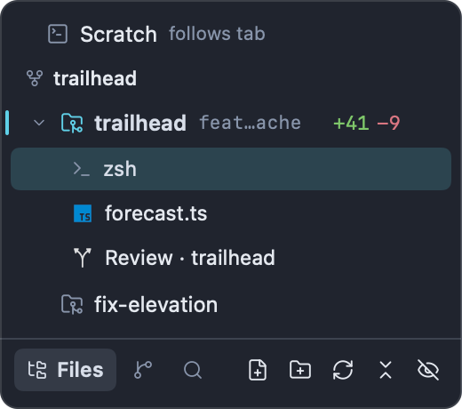
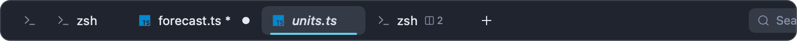
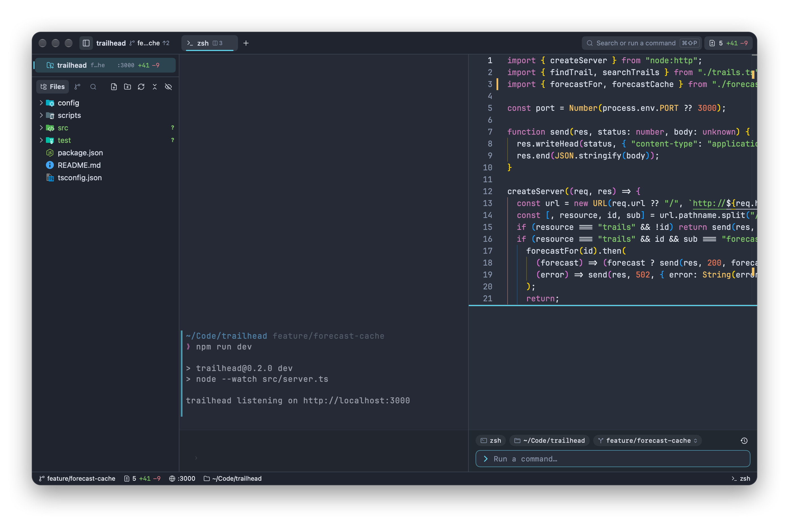
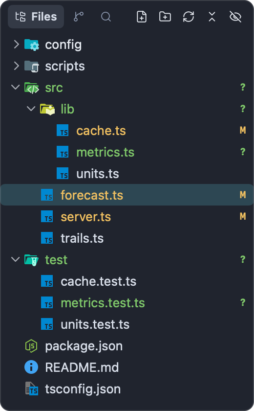
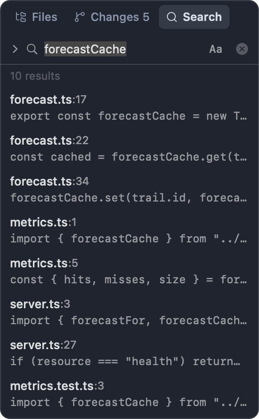
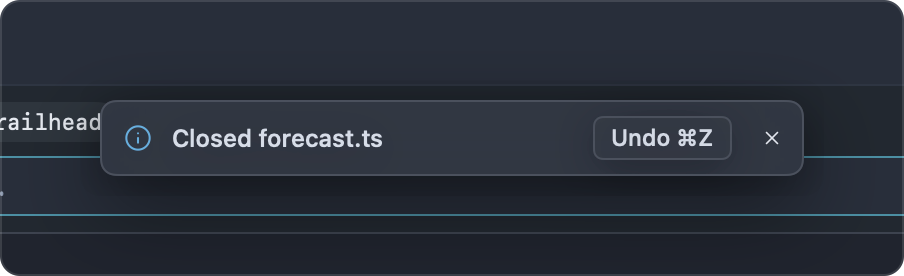
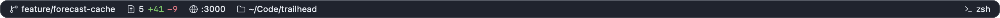

# Workspaces, tabs and panes

An Impulse window holds workspaces, each workspace holds tabs, and a tab can be split into panes. This page covers all three, plus the sidebar's Files, Changes and Search panels, closing and reopening tabs, session restore, multiple windows, the quick terminal and the status bar.

## How a window is organized

- A **workspace** is a folder you work in (or Scratch, for everything else). Each one has its own tabs, file tree and git state, and a row in the sidebar.
- The **tab strip** in the titlebar shows the active workspace's tabs (or the sidebar lists them, when [tabs are in the sidebar](#tabs-in-the-sidebar)). Switching workspaces swaps the whole set.
- A **tab** shows one surface (a terminal, an editor, Review, History, Settings…) or several side by side as **panes**.

## Workspaces

### Folder workspaces

Opening a folder makes it a workspace. [Getting started](getting-started.md#open-a-project) lists the ways to do that. In a folder workspace:

- The file tree stays on the folder, wherever its terminals `cd`.
- The titlebar, status bar and Changes panel follow the folder's repository.
- New terminal tabs start in the folder.
- Opening the same folder again switches to its workspace instead of opening a second copy.

Folders you open are remembered (the last 20) and offered in the palette's workspace list, so you can reopen them by name.

### The Scratch workspace

Scratch is for terminals that don't belong to a project. Every window starts in it. Its file tree and git state follow the active tab: a terminal's current folder, or the folder of the file you're editing. Its sidebar row says `follows tab` where a folder workspace shows its branch.

New terminals in Scratch start in your home folder, or in the folder set as **Scratch folder** (`scratch_directory`) in Settings ▸ General ▸ Workspaces.

When a window has nothing but its first, untouched terminal in Scratch, opening a folder replaces it. Once you've used that terminal (or renamed Scratch), Scratch stays beside your folders. Closing the last folder workspace brings Scratch back.

### Switching workspaces

- Click a workspace's row in the sidebar.
- Press ⌃⌘O (**File ▸ Switch Workspace…**), or click the workspace name in the titlebar, to pick one in the [command palette](command-palette.md#workspaces-w).
- Choose a tab that belongs to another workspace (from the palette's `t:` list, or from an expanded workspace in the sidebar).

Each workspace remembers the tab you last had selected and returns to it.

### The workspaces sidebar

The top of the sidebar lists the window's workspaces, one row each. The active one has an accent mark at its left edge and a bold name.

From left to right, a row shows:

| Part               | Meaning                                                                                                                                                                                        |
| ------------------ | ---------------------------------------------------------------------------------------------------------------------------------------------------------------------------------------------- |
| Chevron            | Shows or hides the workspace's tabs under the row. Appears on hover, and stays while the tabs are shown.                                                                                       |
| Icon               | A folder with a git mark for a repository, a plain folder otherwise, a terminal for Scratch. A progress ring replaces it while a program in one of the workspace's terminals reports progress. |
| Name               | The folder name, or the name you gave it.                                                                                                                                                      |
| Branch             | The repository's branch (or the commit, when detached). Hidden when it's the same as the name. Scratch shows `follows tab`.                                                                    |
| Port               | The first port a program in the workspace listens on, such as `:3000`; `:3000+` when there are more. Hover to list them all.                                                                   |
| Spinner            | Coding agents in the workspace are working.                                                                                                                                                    |
| Agent count        | A bot icon with a number: agents waiting for you. See [Agents](agents.md).                                                                                                                     |
| Line counts        | Lines added and removed in uncommitted changes, such as `+42 −7`.                                                                                                                              |
| Badge or tab count | A colored badge counts tabs that need your attention. Otherwise, a collapsed row with more than one tab shows how many tabs it has.                                                            |
| **+**              | A menu for making another workspace. Appears on hover.                                                                                                                                         |

Hover over a row for its folder, branch, number of changed files and number of tabs.

A tab needs attention when its terminal rang the bell, a program sent a notification, a long command finished in the background, or an agent is waiting for you. Selecting the tab or clicking into the terminal clears it. See [Terminal](terminal.md) and [Agents](agents.md).

### Worktrees of one repository

Workspaces that are worktrees of the same repository are grouped under a header with the repository's name, and their rows are indented. In the example above, `trailhead` (the main checkout) and `fix-elevation` (a [task worktree](tasks.md) at `~/Code/trailhead.worktrees/fix-elevation`) sit together under **trailhead**. The group appears where its first workspace is; a repository with only one open workspace gets no header.

### Showing a workspace's tabs

Click a row's chevron, or choose **Show Tabs** from its context menu, to list its tabs under it. Each tab row shows the tab's icon and title, with a dot when it needs attention or has unsaved changes. Click a tab row to go to that tab (and its workspace), or double-click it to keep a [preview tab](#preview-tabs). Hover over a tab row for its close button; Control-click it for the same menu as in the tab strip. While a workspace's tabs are listed, the selected tab is highlighted instead of the workspace row.

### The + menu and the context menu

The **+** on a row (shown on hover) offers:

- **New Task from trailhead…** (only for a repository): a new worktree workspace from this repository. See [Tasks](tasks.md).
- **Open Folder as Workspace…**

Control-click a row for its context menu:

| Item                          | What it does                                                                                                            |
| ----------------------------- | ----------------------------------------------------------------------------------------------------------------------- |
| **New Task…**                 | Start a task worktree from this workspace's repository (repositories only).                                             |
| **Move Changes to New Task…** | For a main checkout with uncommitted files: move them into a new task. See [Tasks](tasks.md#move-work-into-a-new-task). |
| **Open Folder as Workspace…** | Choose another folder to open.                                                                                          |
| **Rename…**                   | Give the workspace a name of its own.                                                                                   |
| **Reveal in Finder**          | Show the folder in Finder (not for Scratch).                                                                            |
| **Copy Path**                 | Copy the folder's path (not for Scratch).                                                                               |
| **Show Tabs** / **Hide Tabs** | List or hide the workspace's tabs under its row.                                                                        |
| **Move Up** / **Move Down**   | Move the workspace one row in the sidebar.                                                                              |
| **Finish Task…**              | For a task: land its work and archive it. See [Tasks](tasks.md#finish-a-task).                                          |
| **Archive Task…**             | For a worktree: archive it. See [Tasks](tasks.md).                                                                      |
| **Archive Merged Tasks…**     | Archive the repository's merged tasks together. See [Tasks](tasks.md#archive-merged-tasks).                             |
| **Close Workspace**           | Close the workspace and all its tabs.                                                                                   |

### Renaming a workspace

Choose **Rename…** from the row's context menu, or run **Rename Workspace…** from the palette for the active workspace. Type a name and click **Rename**. Leave the field empty to go back to the folder's name. The name is saved with your session.

### Closing a workspace

Choose **Close Workspace** from the row's context menu, or run **Close Workspace** from the palette for the active one. Impulse asks about unsaved files and running commands first, as it does when [closing a tab](#closing-tabs-and-undo). Then every tab in the workspace closes and Impulse shows the workspace you used before it.

A notice then says, for example, "Closed workspace trailhead". For ten seconds its **Undo ⌘Z** button, or ⌘Z, brings the workspace back with its tabs, in its old place in the sidebar; after that, ⇧⌘T (**File ▸ Reopen Closed Tab**) does the same while the workspace is the last thing you closed. See [Getting a tab back](#getting-a-tab-back).

Closing a workspace's last tab also closes the workspace, as long as the window has another one. The window's last workspace never goes away: closing its last tab gives you a fresh terminal.

### Reordering workspaces

New workspaces are added at the bottom of the list. To move one, choose **Move Up** or **Move Down** from its row's context menu (they're dimmed at the top and bottom of the list). A worktree in a repository group moves within its group; from the group's first or last row, the whole group moves past its neighbor. The order is saved with your session.

### Resizing the workspaces section

The workspaces section grows with its rows up to a fixed height, then scrolls. To give it a different height, drag the hairline under it; the cursor changes to a resize arrow and the line turns the accent color. The Files panel below always keeps at least 120 points. Double-click the hairline to go back to fitting the rows. A dragged height is saved with the window's session. While tabs are [listed in the sidebar](#tabs-in-the-sidebar), the section can't be dragged shorter than about five rows (or all of its rows, when it has fewer), so the active workspace's tabs stay in view.

## Tabs

### The tab strip

The tab strip in the titlebar shows the active workspace's tabs.

A tab shows:

- **An icon.** A terminal icon (drawn in a square while a program such as `vim` owns the terminal), the file's icon for an editor, an agent's status glyph while an agent runs in it, a progress ring while a program reports progress, or a colored dot when a program sets its own status.
- **A title.** Italic for a [preview tab](#preview-tabs). A file with unsaved changes has `*` after its name.
- **A pane count** when the tab is split, with a different icon while one pane is [zoomed](#zooming-a-pane).
- **On the right:** a close button while you hover, otherwise a dot when it needs attention (unless it's selected) or has unsaved changes.

The selected tab has an accent underline. When the tabs don't fit, the strip scrolls sideways and keeps the selected tab in view. The **+** after the last tab opens a new terminal tab.

Hover over a tab for its full title, its folder and its branch.

### Tabs in the sidebar

To list tabs down the side instead of across the titlebar, turn on **List tabs in the sidebar** (`sidebar_tabs`) in Settings ▸ General ▸ Sidebar. The titlebar then has no tab strip, and the active workspace's tabs are always listed under its row in the sidebar, as when you [show a workspace's tabs](#showing-a-workspaces-tabs), followed by a **New Tab** row. Other workspaces' tabs can still be shown with their chevrons. When you hide the sidebar (⌘B), the tab strip comes back to the titlebar until you show it again.

### Opening tabs

| To open                                | Do this                                                                                                                                      |
| -------------------------------------- | -------------------------------------------------------------------------------------------------------------------------------------------- |
| A terminal                             | ⌘T (**File ▸ New Tab**) or the **+** in the strip. It starts in the workspace's folder (Scratch: the Scratch folder).                        |
| An untitled file                       | ⌘N (**File ▸ New File**).                                                                                                                    |
| A file                                 | Click it in the [Files panel](#files-panel), use **File ▸ Open…** (⌘O), or find it in the [command palette](command-palette.md).             |
| Settings, Keyboard Shortcuts, Problems | ⌘, for Settings, ⌥⌘, for Keyboard Shortcuts, ⌃⌘M for Problems. Each opens as a tab, one per window; opening it again shows the existing tab. |
| Review and History                     | ⇧⌘G and ⇧⌘H. See [Review](review.md) and [History](history.md).                                                                              |

New tabs open right after the selected one and are selected. A file that's already open isn't opened twice: Impulse shows its tab.

### Switching tabs

- Click a tab.
- ⌘1 to ⌘9 select the first nine tabs of the active workspace (**Window ▸ Tab 1** to **Tab 9**).
- ⌃⇥ and ⌃⇧⇥ (**Window ▸ Show Next Tab** and **Show Previous Tab**) cycle through the active workspace's tabs.
- In the palette, `t:` lists every tab in the window, in every workspace. See [Command palette](command-palette.md#tabs-t).

### Preview tabs

A single click on a file in the Files panel shows it in a preview tab, with an italic title. The next single click on another file reuses that tab instead of opening a new one, so browsing doesn't leave a trail of tabs. A preview tab becomes a normal tab when you:

- double-click the file in the Files panel, or double-click the tab,
- edit the file,
- pin the tab or split it.

To turn preview tabs off, so every click opens a normal tab, turn off **Preview files from the file tree** (`editor_preview_tabs`) in Settings ▸ Editor ▸ Behavior.

### Pinning tabs

Choose **Pin Tab** from a tab's context menu. A pinned tab shrinks to its icon and has no close button. New tabs open after the pinned ones. Closing a pinned tab (with ⌘W or **Close Tab** in its menu) asks first; **Close** unpins and closes it. Choose **Unpin Tab** to make it a normal tab again. Pins are saved with your session.

### Reordering tabs

Drag a tab left or right in the strip; the other tabs move aside. Dragging a tab also selects it. Tabs stay in their workspace: you can't drag them to another workspace or window. Tabs listed in the sidebar can't be dragged.

### The tab context menu

Control-click a tab:

| Item                             | What it does                                                                                                     |
| -------------------------------- | ---------------------------------------------------------------------------------------------------------------- |
| **Pin Tab** / **Unpin Tab**      | See [Pinning tabs](#pinning-tabs).                                                                               |
| **Close Tab**                    | Close the whole tab, every pane in it.                                                                           |
| **Move into Current Tab, Right** | Move this tab's contents into the selected tab, as panes to the right. Only on tabs other than the selected one. |
| **Move into Current Tab, Below** | The same, below.                                                                                                 |
| **Even Out Panes**               | On the selected tab when it's split: make its panes equal sizes.                                                 |
| **Move Pane to New Tab**         | On the selected tab when it's split: move its focused pane into a tab of its own.                                |
| **New Tab**                      | Open a terminal tab.                                                                                             |

## Split panes

A tab can show several surfaces at once: terminals next to each other, an editor beside the terminal running your dev server, or a Review beside an agent. Any kind of surface can be a pane.

The focused pane has an accent line along its top edge and the other panes are dimmed. The input bar moves into whichever terminal pane has focus.

### Splitting

| Command         | Shortcut | Result                                                                  |
| --------------- | -------- | ----------------------------------------------------------------------- |
| **Split Right** | ⌘D       | A new terminal to the right of the focused pane, in that pane's folder. |
| **Split Down**  | ⇧⌘D      | A new terminal below the focused pane.                                  |

These are in **View ▸ Panes** and in the palette. Other ways to make panes:

- **Open to the Side** in a file's context menu in the Files panel, or ⌥-click the file, opens it in a pane to the right.
- **Move into Current Tab, Right** or **Below** in a tab's context menu joins that tab into the selected one.
- `impulse split right` or `impulse split down` in a terminal, optionally followed by a command to run. See [Command-line tool](cli.md).
- [Project actions](project-config.md) set to open `right` or `down`.

### Moving between panes

- Click anywhere in a pane to focus it.
- ⌥⌘← ⌥⌘→ ⌥⌘↑ ⌥⌘↓ (**Focus Pane Left**, **Focus Pane Right**, **Focus Pane Above**, **Focus Pane Below**) move to the neighboring pane. Impulse beeps when there's no pane in that direction.
- **Next Pane** and **Previous Pane** cycle through the panes in order. They have no shortcut until you give them one in [Keyboard Shortcuts](keyboard-shortcuts.md).

### Resizing panes

- Drag the line between two panes. Panes can't get smaller than 80 points.
- Double-click the line to even out the panes in the split it belongs to.
- ⌃⌘← ⌃⌘→ ⌃⌘↑ ⌃⌘↓ (**View ▸ Panes ▸ Grow Pane Left**, **Grow Pane Right**, **Grow Pane Up**, **Grow Pane Down**) grow the focused pane in steps.
- ⌃⌘= (**Even Out Panes**) makes every pane in the tab equal.

### Zooming a pane

⇧⌘↩ (**Zoom Pane**) fills the tab with the focused pane and hides the others; press it again to bring them back. While a pane is zoomed, the tab's pane count shows a maximize icon.

### Moving a pane to its own tab

**Move Pane to New Tab** (in **View ▸ Panes**, the palette, or the selected tab's context menu) takes the focused pane out of the split and opens it as a tab of its own.

### Closing panes

⌘W closes the focused pane of a split tab; when one pane is left, the tab becomes a plain tab again. **Close Tab** in the tab's context menu closes every pane at once. When the shell in a terminal exits (`exit` or ⌃D), its pane closes, or its tab when the tab isn't split.

Splits, their sizes and the focused pane are saved with your session.

## The sidebar

The sidebar (the left dock) has the workspaces at the top and, below them, the **Files**, **Changes** and **Search** panels.

### Showing, hiding and resizing

- ⌘B (**View ▸ Toggle Sidebar**), or the sidebar button at the left of the titlebar, shows and hides it.
- Drag its right edge to resize it (between 180 and 520 points). Double-click the edge to go back to the default width.
- Each window remembers whether its sidebar is shown and how wide it is; a new window starts the way the last closed window was.

### Switching panels

Click **Files**, **Changes** or **Search** in the header, or use their shortcuts:

| Panel   | Shortcut | Menu                       |
| ------- | -------- | -------------------------- |
| Files   | ⇧⌘E      | **View ▸ Show Files**      |
| Changes | ⌃⇧G      | **Git ▸ Show Changes**     |
| Search  | ⇧⌘F      | **View ▸ Find in Project** |

Each shortcut shows the sidebar if it's hidden, switches to the panel and gives it the keyboard. Pressed again while that panel has the keyboard, it sends you back to the selected tab. The Changes button shows the number of changed files, such as **Changes 3**. In a narrow sidebar the buttons drop their labels and show icons only.

### Files panel

The Files panel is the file tree of the active workspace's folder (in Scratch, the active tab's folder). Folders come first, then files, alphabetically. Files whose names start with a dot, such as `.env` or `.impulse/`, are hidden until you show them.

#### Opening files

| Action              | Result                                      |
| ------------------- | ------------------------------------------- |
| Click a file        | Shows it in a [preview tab](#preview-tabs). |
| Double-click a file | Opens it in a normal tab.                   |
| ⌥-click a file      | Opens it in a pane to the right.            |
| Click a folder      | Expands or collapses it.                    |

Images open in an image preview tab. Binary files and files that aren't UTF-8 text stay closed; a notice offers **Open in Default App**.

#### Keyboard

After ⇧⌘E the tree has the keyboard:

| Key | Action                                                             |
| --- | ------------------------------------------------------------------ |
| ↑ ↓ | Move the selection.                                                |
| →   | Expand a folder; on an expanded folder, move to its first item.    |
| ←   | Collapse a folder; otherwise move to the parent folder.            |
| ↩   | Open the selected file, or expand or collapse the selected folder. |

#### Header buttons

While the Files panel is showing, its header has:

| Button                                        | What it does                                                                                                         |
| --------------------------------------------- | -------------------------------------------------------------------------------------------------------------------- |
| **New File**                                  | Asks for a name and creates the file in the selected folder (or the selected file's folder, or the top of the tree). |
| **New Folder**                                | The same, for a folder.                                                                                              |
| **Refresh File Tree**                         | Reads the tree from disk again, keeping open folders open.                                                           |
| **Collapse All Folders**                      | Collapses every folder.                                                                                              |
| **Show Hidden Files** / **Hide Hidden Files** | Shows or hides dot files. The same as **Show hidden files** (`sidebar_show_hidden`) in Settings ▸ General ▸ Sidebar. |

#### Git status

In a repository, file names take the color of their git status, with a letter at the right:

| Letter | Status                |
| ------ | --------------------- |
| `M`    | Modified              |
| `A`    | Added (staged as new) |
| `?`    | Untracked             |
| `D`    | Deleted               |
| `R`    | Renamed               |
| `C`    | Conflicted            |

Files that git ignores, such as `node_modules` or an ignored `.env`, are shown dimmed. The file open in the selected editor tab is highlighted.

#### Context menu

Control-click an item:

| Item                            | Shown for     | What it does                                                                                                                                                                                            |
| ------------------------------- | ------------- | ------------------------------------------------------------------------------------------------------------------------------------------------------------------------------------------------------- |
| **New File…** / **New Folder…** | Folders       | Create an item inside the folder.                                                                                                                                                                       |
| **Open to the Side**            | Files         | Open in a pane to the right.                                                                                                                                                                            |
| **Mention in Agent**            | Files         | Send `@` and the file's path to the coding agent most likely meant. See [Agents](agents.md).                                                                                                            |
| **Show History**                | Both          | The file's or folder's commits in [History](history.md).                                                                                                                                                |
| **Reveal in Finder**            | Both          | Show it in Finder.                                                                                                                                                                                      |
| **Copy Path**                   | Both          | Copy the full path.                                                                                                                                                                                     |
| **Copy Relative Path**          | Both          | Copy the path relative to the top of the tree, such as `src/lib/cache.ts`.                                                                                                                              |
| **Open with Default App**       | Files         | Open in the app macOS uses for it.                                                                                                                                                                      |
| **Open Changes**                | Changed files | Open [Review](review.md) on the file's uncommitted changes.                                                                                                                                             |
| **Stage**                       | Changed files | Stage the file.                                                                                                                                                                                         |
| **Discard Changes…**            | Changed files | After you confirm, restore a tracked file to its last commit (staged and unstaged changes) or move an untracked file to the Trash; you can undo it right after. A newly added file is unstaged instead. |
| **Rename…**                     | Both          | Rename it in place.                                                                                                                                                                                     |
| **Move to Trash**               | Both          | Move it to the Trash; the notice that follows has **Undo**.                                                                                                                                             |

#### Drag and drop

- Drag files or folders onto a folder in the tree to move them there.
- Drag files from Finder onto a folder (or onto empty space for the top of the tree) to copy them in.

If an item with the same name is already there, Impulse asks; **Replace** moves the existing one to the Trash first.

### Changes panel

The Changes panel (⌃⇧G) is where you stage and commit. At the top are the branch (click it to switch) and the sync state with the upstream, with a menu of fetch, pull, push, tag and stash actions. Below are the Conflicts, Staged, Changes, Untracked and Stashes sections, and the commit message box at the bottom. The panel works from the keyboard as well. See [Git](git.md) for all of it.

### Search panel

The Search panel (⇧⌘F) searches the folder shown in the file tree. Type in **Search project…**; results appear as you type.

- It finds file names that contain the text, and lines that contain it, with each line's number. A file whose contents match is listed by its lines rather than by name.
- **Aa** turns on matching case.
- Click a result to open the file at that line.
- Dot files and folders and files git ignores are skipped. Files over 1 MB and binary files aren't searched for text.
- Results refresh when files in the project are created, deleted or renamed.
- Escape clears the field; a second Escape, or the close button, goes back to the Files panel.

The chevron at the left of the field shows a **Replace with…** field for replacing across files. See [Editor](editor.md) for project-wide replace.

To jump to a file by name instead, press ⌘P (**View ▸ Go to File…**), which opens the [command palette](command-palette.md#files-no-prefix) in file mode.

## Closing tabs and undo

| To close                                         | Do this                                                |
| ------------------------------------------------ | ------------------------------------------------------ |
| The focused pane, or the tab when it isn't split | ⌘W (**File ▸ Close Tab**)                              |
| A whole tab                                      | Its close button, or **Close Tab** in its context menu |
| A workspace                                      | **Close Workspace** in its row's context menu          |
| The window                                       | ⇧⌘W (**File ▸ Close Window**)                          |

Before closing, Impulse asks about:

- **Unsaved files.** Closing a tab asks about each one: **Save & Close**, **Don't Save** or **Cancel**. Closing a window shows each unsaved file in turn and asks **Save**, **Don't Save** or **Cancel**. Quitting first offers **Review Changes…**, **Cancel** or **Discard Changes**.
- **Running commands.** When a terminal is still running something, a sheet lists it and asks whether to close anyway.
- **Pinned tabs.** "This tab is pinned. Close anyway?"

To skip the question about running commands, turn off **Warn before closing running commands** (`confirm_close_warnings`) in Settings ▸ General ▸ Window. Unsaved files are always asked about.

Closing a terminal ends its shell and everything running in it.

### Getting a tab back

After a tab, pane or workspace closes, a notice at the bottom of the window says what closed and offers **Undo ⌘Z**.

- For ten seconds, ⌘Z (**Edit ▸ Undo**) or the notice's button reopens it. A notice's button always reopens what that notice names, even if you've closed something else since; ⌘Z starts with the most recent.
- After that, ⇧⌘T (**File ▸ Reopen Closed Tab**) reopens the most recently closed tab or pane. Press it again for the one before; each window remembers its last 20.

A reopened pane goes back into its old tab when that tab is still open. A tab goes back to its workspace while that workspace is open, even if you've closed and reopened it since; otherwise it opens in the active workspace. A file reopens at the line you were on. A terminal comes back in the same folder with a new shell; its earlier output is shown above the prompt when **Restore terminal scrollback** is on. Untitled files and the Settings, Keyboard Shortcuts and Problems tabs can't be reopened this way, and a file reopens as it is on disk, without edits you didn't save.

## Session restore

Impulse reopens everything at launch the way you left it. To start fresh instead, turn off **Restore previous session** (`restore_session`) in Settings ▸ General ▸ Startup.

What comes back:

- Every window, its size and position, and which window was in front.
- Each window's workspaces in their sidebar order (Scratch included), their names and whether their tabs were listed in the sidebar, and the active workspace.
- Tabs in order, pins, splits and pane sizes, and the selected tab and pane.
- Terminals in the folder they were in. With **Restore terminal scrollback** (`restore_scrollback`, on by default) their earlier output is shown again; the shells themselves are new.
- Coding agent sessions: when Claude Code or Codex was running in a terminal and its [hooks](agents.md) are installed, the restored terminal's input bar holds the command that resumes that session, such as `claude --resume …`. Press ↩ to run it, or clear it.
- Editors, at the line and column you were on, and image previews.
- Review and History tabs.
- The sidebar's visibility and width, and the height of the workspaces section.

What doesn't come back: untitled files, unsaved edits, the Settings, Keyboard Shortcuts and Problems tabs, and workspaces whose folders no longer exist. Restored folders don't ask about [workspace trust](getting-started.md#workspace-trust); untrusted ones show **Restricted** in the status bar.

The session is saved when you quit, whenever a window closes, and within 15 seconds of a workspace, tab, split or file opening or closing (so a crash doesn't lose them), in `~/Library/Application Support/impulse/session-state.json`, with terminal output in the `scrollback` folder beside it. Files you open from Finder while Impulse is starting open on top of the restored session.

## Multiple windows

⇧⌘N (**File ▸ New Window**) opens another window. Each window has its own workspaces, tabs, sidebar and session state, and starts in Scratch. The same folder can be open as a workspace in more than one window.

Windows share your settings, theme, trusted folders, command history and language servers. The `impulse` command in a terminal talks to the window that terminal is in. The Dock icon's badge counts the terminals that need attention across all windows.

Closing a window asks about its unsaved files and running commands. Closing the last window quits Impulse.

## Quick terminal

The quick terminal drops down from the top of the screen over any app, even one in full screen, on a global shortcut. Use it for a quick command without switching to Impulse's window.

To set it up:

1. Open Settings (⌘,) ▸ General ▸ Quick terminal.
2. Turn on **Quick terminal** (`quick_terminal_enabled`).
3. Set **Quick terminal shortcut** (`quick_terminal_shortcut`, default `` Ctrl+` ``). It must include Ctrl, Alt or Cmd, plus a letter, digit, punctuation key, Space, Tab or Return; for example `` Ctrl+` `` or `Alt+Space`.

Press the shortcut to show it and again to hide it; clicking anywhere else also hides it. It opens on the screen the mouse is on, across the top part of the screen, and starts in the front window's current folder (else your home folder). It is a plain terminal: no input bar, so you type at the shell's own prompt.

The shell keeps running while the quick terminal is hidden, so you come back to where you were. If you exit the shell, the next press starts a new one. **Toggle Quick Terminal** in the palette shows and hides it too, even without the shortcut turned on.

## Status bar

The status bar runs along the bottom of the window. Items appear only when they have something to show; most can be clicked.

Left side:

| Item           | Shows                                                                                                        | Click to                                                                     |
| -------------- | ------------------------------------------------------------------------------------------------------------ | ---------------------------------------------------------------------------- |
| **Restricted** | The active folder workspace isn't trusted.                                                                   | Trust it. See [Getting started](getting-started.md#workspace-trust).         |
| Branch         | The repository's branch.                                                                                     | Switch branches (⌃⌘B).                                                       |
| Changes        | Changed files and lines added and removed.                                                                   | Open [Review](review.md) (⇧⌘G).                                              |
| Problems       | Errors and warnings from language servers.                                                                   | Open the Problems tab (⌃⌘M). See [Editor](editor.md).                        |
| Ports          | Up to three ports that programs in the workspace's terminals listen on, such as `:3000`, then `+N` for more. | Open `http://localhost:<port>` in your browser. Hover `+N` to list the rest. |
| Folder         | The terminal's current folder (terminal tabs).                                                               |                                                                              |

Right side:

| Item                     | Shows                                                                | Click to                        |
| ------------------------ | -------------------------------------------------------------------- | ------------------------------- |
| **Update X.Y.Z**         | A newer Impulse release exists.                                      | Open the release page.          |
| `Ln 12, Col 4`           | The cursor position (editor tabs).                                   | Go to a line (⌘G).              |
| Indentation, encoding    | Such as `Spaces: 4` and `UTF-8` (editor tabs).                       |                                 |
| Language server progress | Work a language server reports, such as indexing, with a percentage. |                                 |
| Language                 | The file's language (editor tabs).                                   |                                 |
| **Preview**              | The file can be previewed (Markdown, SVG).                           | Show or hide the preview (⇧⌘M). |
| Shell                    | The terminal's shell (terminal tabs).                                |                                 |

## Related

- [Getting started](getting-started.md)
- [Command palette](command-palette.md)
- [Tasks](tasks.md)
- [Terminal](terminal.md)
- [Git](git.md)
- [Editor](editor.md)
- [Keyboard shortcuts](keyboard-shortcuts.md)
